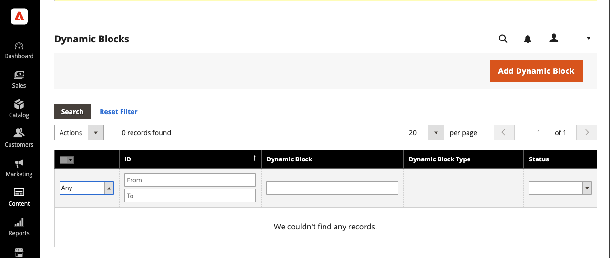

# Dynamische blokken

{{ee-feature}}

Creeer rijke, interactieve inhoud die door logica van [ prijsregels ](../merchandising-promotions/introduction.md#price-rules) en [ klantensegmenten ](../customers/customer-segments.md) wordt gedreven. Bestaande [ dynamische blokken ](../page-builder/dynamic-block.md) kunnen direct aan het [!DNL Page Builder] [ stadium ](../page-builder/workspace.md) worden toegevoegd. Voor een gedetailleerd, geleidelijke voorbeeld voor het gebruiken van dynamische blokken, zie [ Leerprogramma 2: Blokken ](../page-builder/2-blocks.md).

>[!NOTE]
>
>De optie _[!UICONTROL Banner]_in het [[!UICONTROL Content] menu ](content-menu.md) werd afgekeurd in 2.3.1 en in 2.4.0 verwijderd. De functionaliteit ervan wordt vervangen door Dynamische blokken.

![[!DNL Page Builder] - dynamisch blok met prijsregel en klantsegment ](../page-builder/assets/pb-tutorial2-dynamic-block-storefront.png){width="600" zoomable="yes"}

## Stap 1: Een dynamisch blok maken

1. Voor _Admin_ sidebar, ga **[!UICONTROL Content]** > _[!UICONTROL Elements]_>**[!UICONTROL Dynamic Blocks]**.

   {width="600" zoomable="yes"}

1. Klik in de rechterbovenhoek op **[!UICONTROL Add Dynamic Block]** .

   {width="600" zoomable="yes"}

1. Indien van toepassing, stelt u **[!UICONTROL Store View]** in op een specifieke opslagweergave waar het dynamische blok moet worden weergegeven.

1. Stel **[!UICONTROL Enable Dynamic Block]** in op `Yes` om het dynamische blok te activeren.

1. Voer een beschrijving in **[!UICONTROL Dynamic Block Name]** voor interne referentie.

1. Stel **[!UICONTROL Dynamic Block Type]** in op het gebied van de pagina waar u het dynamische blok wilt weergeven en klik op **[!UICONTROL Done]** .

   {width="500" zoomable="yes"}

1. Selecteer in de lijst **[!UICONTROL Customer Segment]** het selectievakje van elk segment dat u het dynamische blok wilt zien en klik op **[!UICONTROL Done]** om de instelling op te slaan.

   {width="500" zoomable="yes"}

   >[!NOTE]
   >
   >- Als er geen segment wordt gemaakt, is het dynamische blok voor iedereen zichtbaar.
   >- Als de klant niet tot een segment behoort en het dynamische blok voor alle segmenten wordt gecreeerd, wordt de inhoud van het dynamische blok nog getoond.
   >- Als alle klantensegmenten die aan een Dynamisch Blok worden toegewezen worden geschrapt, is zijn inhoud dan zichtbaar aan iedereen.

### Real-Time CDP-publiek gebruiken in dynamische blokken

Als u [ installeerde ](../customers/audience-activation.md#install-the-extension) en  de [!DNL Audience Activation] uitbreiding vormde, ziet u een sectie genoemd **[!UICONTROL Audiences]**.

{width="600" zoomable="yes"}

Schakel in de lijst **[!UICONTROL Real-Time CDP Audience]** het selectievakje in van elk publiek dat u het dynamische blok wilt zien en klik op **[!UICONTROL Done]** om de instelling op te slaan.

## Stap 2: De inhoud voltooien

Gebruik [!DNL Page Builder] [ werkruimte ](../page-builder/workspace.md) om de inhoud te voltooien.

![[!DNL Page Builder] - werkruimte voor dynamische blokken ](../page-builder/assets/pb-dynamic-block-workspace.png){width="600" zoomable="yes"}

## Stap 3: Een verwante aanbieding kiezen

1. De rol neer en breidt  **[!UICONTROL Related Promotions]** uit.

1. Klik op het soort promotie dat u wilt koppelen aan het dynamische blok:

   - **[!UICONTROL Add Cart Price Rules]** (zie [ de Regels van de Prijs van de Kar ](../merchandising-promotions/price-rules-cart.md))

   - **[!UICONTROL Add Catalog Price Rules]** (zie [ Regels van de Prijs van de Catalogus ](../merchandising-promotions/price-rules-catalog.md))

   >[!NOTE]
   >
   >Catalogusprijsregels worden niet ondersteund voor Real-Time CDP-gebruikers.

1. Schakel in de lijst met beschikbare regels het selectievakje in van elke regel die u wilt gebruiken en klik op **[!UICONTROL Add Selected]** .

1. Klik op **[!UICONTROL Save]** wanneer het dynamische blok is voltooid.

## Stap 4: Voeg het dynamische blok toe aan een pagina

1. Open de pagina waar u het dynamische blok wilt weergeven.

1. Gebruik het inhoudstype [[!UICONTROL Add Dynamic Block]](../page-builder/dynamic-block.md) om het dynamische blok aan het werkgebied toe te voegen.

## Beschrijving van veld en gereedschap

| Veld | Beschrijving |
|--- |--- |
| [!UICONTROL Store View] | Hiermee geeft u de winkelweergaven op waarin het dynamische blok beschikbaar moet zijn. |
| [!UICONTROL Enable Dynamic Block] | Hiermee activeert of deactiveert u het dynamische blok. Opties: Ja/Nee |
| [!UICONTROL Dynamic Block Name] | Een beschrijvende naam die het dynamische blok in Admin identificeert. |
| [!UICONTROL Dynamic Block Type] | Identificeert de plaats in de [ standaardpaginalay-out ](layout-updates.md) waar het dynamische blok wordt geplaatst. Opties:  **[!UICONTROL Content Area]**- Plaatst het dynamische blok in het belangrijkste [ inhoudsgebied ](layout-updates.md) van de pagina. **[!UICONTROL Footer]** - Plaatst het dynamische blok in de pagina [ footer ](page-setup.md#footer).  **[!UICONTROL Header]**- Plaatst het dynamische blok in de pagina [ kopbal ](page-setup.md#header). **[!UICONTROL Left Column]** - Plaatst het dynamische blok in [ linkerzijbalk ](page-layout.md#standard-page-layouts) van een twee-of drie-kolomlay-out.  **[!UICONTROL Right Column]**- Plaatst het dynamische blok in [ juiste sidebar ](page-layout.md#standard-page-layouts) van een twee- of driekolomlay-out. |
| Klantsegment | Associeert een klantensegment met het dynamische blok om te bepalen welke klanten het kunnen zien. |
| Real-Time CDP-publiek | Associeert het publiek van a [ Real-Time CDP ](../customers/audience-activation.md) met het dynamische blok om te bepalen welke klanten het kunnen zien. |

{style="table-layout:auto"}

### Inhoud

| Veld | Beschrijving |
|--- |--- |
| [!UICONTROL Layout] | Voeg rijen, kolommen of tabs toe aan het werkgebied. |
| [!UICONTROL Elements] | Voeg tekst, koppen, knoppen, scheidingslijnen en HTML-code toe aan een lay-outcontainer in het werkgebied. |
| [!UICONTROL Media] | Voeg afbeeldingen, video, banners, schuifregelaars en Google Maps toe aan een bestaande lay-outcontainer in het werkgebied. |
| [!UICONTROL Add Content] | Voeg bestaande blokken, dynamische blokken en producten toe aan het werkgebied. |

{style="table-layout:auto"}

### Verwante aanbiedingen

| Veld | Beschrijving |
|--- |--- |
| [!UICONTROL Related Cart Price Rule] | **[!UICONTROL Add Cart Price Rules]** - associeer een bestaande [ de prijsregel van de kar ](../merchandising-promotions/price-rules-cart.md) met het dynamische blok als bevordering. |
| [!UICONTROL Related Catalog Price Rule] | **[!UICONTROL Add Catalog Price Rules]** - associeer een bestaande [ regel van de catalogusprijs ](../merchandising-promotions/price-rules-catalog.md) met het dynamische blok als bevordering. |

{style="table-layout:auto"}
