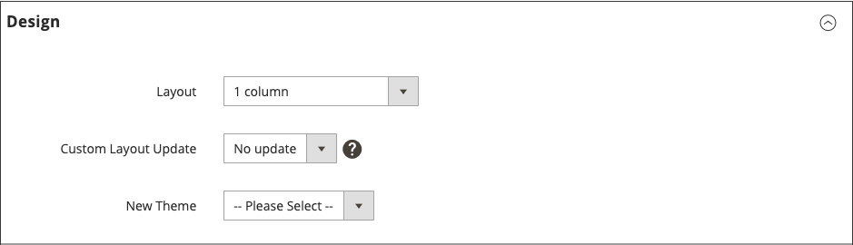

# Layout-updates

Alvorens u met de updates van de douanelay-out begint te werken, is het belangrijk om te begrijpen hoe de pagina&#39;s van uw opslag worden geconstrueerd, en het verschil tussen de termijnen *lay-out* en *lay-outupdate*. Layout verwijst naar de visuele en structurele samenstelling van de pagina. Layout bijwerken verwijst naar een specifieke set XML-instructies die de manier waarop de pagina wordt samengesteld kan overschrijven of aanpassen.

De XML-indeling van uw [!DNL Commerce] -winkel is een hiërarchische structuur van containers en blokken. Sommige elementen worden op elke pagina weergegeven en andere alleen op specifieke pagina&#39;s. Meer over lay-out, containers, en blokken leren, zie het [&#x200B; overzicht van Lay-outs &#x200B;](https://developer.adobe.com/commerce/frontend-core/guide/layouts/) in de _Voorste Gids van de Ontwikkelaar_.

Het [&#x200B; hulpmiddel van Widget &#x200B;](widgets.md) is een gemakkelijke manier om een bestaand [&#x200B; inhoudsblok &#x200B;](blocks.md) aan de standaardlay-out van een pagina toe te voegen. Voor geavanceerdere updates moet u de updatecode van de XML-indeling opslaan op de server en het bestand vervolgens verwijzen als een aangepaste update van de layout van de beheerder. Voor een overzicht van het proces, zie {de Updates van de Lay-out van 0} Gebruik [&#128279;](layout-updates.md#place-a-block-using-layout-updates).

In het volgende diagram zijn de namen die naar containers verwijzen zwart en de bloktypen, of blokklassenpaden, blauw.

{width="500" zoomable="yes"}

| Bloktype | Beschrijving |
|--- |--- |
| `page/html` | De naam van dit blok is `root` en het is een van de weinige basisblokken in de layout. U kunt ook uw eigen blok maken en dit `root` noemen. Dit is de standaardnaam voor blokken van dit type. Er kan slechts één blok van dit type per pagina zijn. |
| `page/html_head` | De bloknaam is `head` en is een onderliggend element van het hoofdblok. Er kan slechts één blok van dit type per pagina zijn en het mag niet worden verwijderd. |
| `page/html_notices` | De bloknaam is `global_notices` en is een onderliggend element van het hoofdblok. Als dit blok uit de lay-out wordt verwijderd, verschijnen de globale berichten niet op de pagina. Er kan slechts één blok van dit type per pagina zijn. |
| `page/html_header` | De bloknaam is `header` en is een onderliggend element van het hoofdblok. Dit blok komt overeen met de visuele koptekst boven aan de pagina en bevat verschillende standaardblokken. Er kan slechts één blok van dit type per pagina zijn en het mag niet worden verwijderd. |
| `page/html_wrapper` | Hoewel dit blok is opgenomen in de standaardlay-out, is het afgekeurd en is het alleen opgenomen om achterwaartse compatibiliteit te garanderen. Gebruik geen blokken van dit type. |
| `page/html_breadcrumbs` | De naam van dit blok is `breadcrumbs` en het is een onderliggend element van het koptekstblok. In dit blok worden broodkruimels voor de huidige pagina weergegeven. Er kan slechts één blok van dit type per pagina zijn. |
| `page/html_footer` | De bloknaam is `footer` en is een onderliggend element van het hoofdblok. Het voettekstblok komt overeen met de visuele voettekst onder aan de pagina en bevat verschillende standaardblokken. Er kan slechts één blok van dit type per pagina zijn en het mag niet worden verwijderd. |
| `page/template_links` | De standaardlay-out bevat twee blokken van dit type. Het blok `top.links` is een onderliggend element van het koptekstblok en komt overeen met het bovenste navigatiemenu. Het blok `footer_links` is een onderliggend element van het voettekstblok en komt overeen met het onderste navigatiemenu.   **_Nota:_**&#x200B;Het is mogelijk om de malplaatjeverbindingen te manipuleren, zoals aangetoond in de voorbeelden. |
| `page/switch` | Een standaardlay-out bevat twee blokken van dit type. Het `store_language` -blok is een onderliggend element van het headerblok en komt overeen met de bovenste taalswitch. Het `store_switcher` -blok is een onderliggend element van het voettekstblok en komt overeen met de onderste winkelschakeloptie. |
| kern/berichten | Een standaardlay-out bevat twee blokken van dit type. In het blok `global_messages` worden algemene berichten weergegeven. Het blok `messages` wordt gebruikt om alle andere berichten te tonen. Als u deze blokken verwijdert, ziet de klant geen berichten. |
| `core/text_list` | Dit type blok wordt in [!DNL Commerce] op grote schaal gebruikt als plaatsaanduiding voor het renderen van onderliggende blokken. |
| `core/profiler` | Er is slechts één instantie van dit type blok per pagina. Deze wordt gebruikt voor de interne [!DNL Commerce] profiler en mag niet voor andere doeleinden worden gebruikt. |

{style="table-layout:auto"}

## Een blok plaatsen met layoutupdates

[&#x200B; de updates van de Lay-out &#x200B;](layout-updates.md) maken het mogelijk om de lay-out van een pagina aan te passen. De updates van de lay-out bieden meer flexibiliteit dan a [&#x200B; widget &#x200B;](widgets.md) aan, maar vereisen toegang tot de server en een basiskennis van XML.

In de volgende stappen wordt getoond hoe u een lay-outupdate kunt gebruiken om een blok op een pagina te plaatsen. Voor specifieke voorbeelden en hulp met syntaxis, zie [&#x200B; Gemeenschappelijke taken van de lay-outaanpassing &#x200B;](https://developer.adobe.com/commerce/frontend-core/guide/layouts/) in de _Voorste Gids van de Ontwikkelaar_.

### Stap 1: Maak het blok

1. Creeer het [&#x200B; blok &#x200B;](block-add.md) dat u wilt plaatsen.

1. Neem nota van `block_id`, omdat het in de instructies van de lay-outupdate wordt gebruikt.

### Stap 2: De layout-update in XML samenstellen

1. Stel de lay-outinstructies in XML samen aan [&#x200B; Verwijzing een Blok van CMS &#x200B;](https://developer.adobe.com/commerce/frontend-core/guide/layouts/xml-manage/).

1. Sparen de [&#x200B; lay-outinstructies &#x200B;](https://developer.adobe.com/commerce/frontend-core/guide/layouts/xml-instructions/) op de server in de lay-outomslag waar de dossiers van XML voor het thema worden bewaard.

   Bijvoorbeeld:

   `<theme_dir>/<Namespace>_<Module>/layout`

   De greep voor de layout is de bestandsnaam die begint met `cms_page_view_selectable_` , gevolgd door de URL-sleutel van de CMS-pagina, de optie voor het bijwerken van de layout en het achtervoegsel van het bestand `xml` . In het volgende voorbeeld is `customer-service` de URL-sleutel van de pagina en is `ChatTool` de optie die u selecteert om de layout-update toe te passen op de pagina.

   `cms_page_view_selectable_`&lt;`customer-service`> `_`&lt; `ChatTool`> `.xml`

   | Element | Beschrijving |
   |--- |--- |
   | CMS-pagina-id | De URL-sleutel van de pagina met een slash (`/`) die door een onderstrepingsteken (`_`) wordt vervangen. |
   | Naam van update layout | De optie die voor _Update van de Lay-out van de Douane_ verschijnt. |

   {style="table-layout:auto"}

### Stap 3: Verwijs naar de layout-update van de pagina

1. Voor _Admin_ sidebar, ga **[!UICONTROL Content]** > _[!UICONTROL Elements]_>**[!UICONTROL Pages]**.

1. Zoek de pagina waar u het blok wilt plaatsen en open het in uitgeven wijze.

1. De rol neer en breidt  uit de **[!UICONTROL Design]** sectie.

1. Klik op het menu **[!UICONTROL Custom Layout Update]** om alle beschikbare lay-outupdates weer te geven die aan de pagina zijn gekoppeld.

   {width="400" zoomable="yes"}

1. Selecteer de layout-update die u op de pagina wilt toepassen.

### Stap 4: De cache opslaan en vernieuwen

1. Klik op **[!UICONTROL Save & Close]** als de bewerking is voltooid.

1. Klik in het bericht boven aan de werkruimte op **[!UICONTROL Cache Management]** en vernieuw alle ongeldige cache-items.
