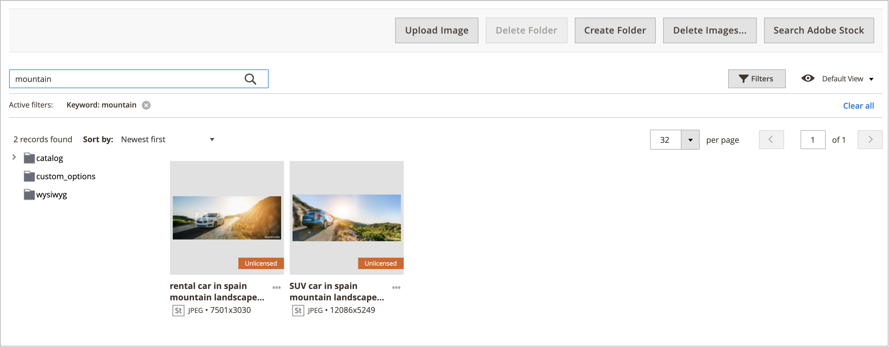

# Middelen in galerie beheren

De nieuwe [&#x200B; Galerie van Media &#x200B;](media-gallery.md) verstrekt hulpmiddelen om geuploade media dossiers, en activa te beheren die u door de integratie van Adobe Stock [&#128279;](adobe-stock.md) verwerft. Als u een Adobe Stock [&#x200B; beeldvoorproef &#x200B;](adobe-stock-save-preview.md) hebt bewaard, kunt u [&#x200B; vergunning &#x200B;](adobe-stock-license-image.md) het beeld in de nieuwe Galerij van Media ook verlenen.

## Middelen uploaden

1. Voor _Admin_ sidebar, ga **[!UICONTROL Content]** > _[!UICONTROL Media]_>**[!UICONTROL Media Gallery]**.

1. Klik op **[!UICONTROL Upload Image]**.

1. Selecteer het bestand dat u wilt uploaden.

   Het geselecteerde element wordt automatisch geüpload naar de geselecteerde map (of naar de opslagmap als er geen map is geselecteerd).

## Elementdetails weergeven

1. Voor _Admin_ sidebar, ga **[!UICONTROL Content]** > _[!UICONTROL Media]_>**[!UICONTROL Media Gallery]**.

1. Klik de drie punten onder de activa ({width="10" zoomable="no"}), dan klik **[!UICONTROL View Details]**.

   {width="600" zoomable="yes"}

   De elementdetails worden weergegeven in een deelvenster. Zij omvatten de informatie waar het actief wordt gebruikt:

   - **[!UICONTROL Categories]**
   - **[!UICONTROL Products]**
   - **[!UICONTROL Pages]**
   - **[!UICONTROL Blocks]**

   {width="600" zoomable="yes"}

   Klik op de koppelingen **[!UICONTROL Used In]** om de details weer te geven. In het raster in het volgende voorbeeld worden alle categorieën weergegeven waarin een specifiek element wordt gebruikt.

   {width="600" zoomable="yes"}

   Het is ook mogelijk om de activa van de _sectie van de Details van de Mening_ te schrappen.

## Een element bewerken

1. Voor _Admin_ sidebar, ga **[!UICONTROL Content]** > _[!UICONTROL Media]_>**[!UICONTROL Media Gallery]**.

1. Klik de drie punten onder de activa ({width="10" zoomable="no"}), dan klik **[!UICONTROL Edit]**.

   {width="600" zoomable="yes"} uit

1. Wijzig zo nodig een van de volgende waarden voor metagegevens:

   - **[!UICONTROL Title]**
   - **[!UICONTROL Description]**
   - **[!UICONTROL Tags/Keywords]**

   Deze gegevens worden opgeslagen in de database en in de metagegevens van het bestand zelf. XMP- en IPTC-indelingen worden momenteel ondersteund.

   U kunt de afbeelding downloaden met de bijgewerkte metagegevens.

## Een element gebruiken

Assets kan uitgebreid door Admin worden gebruikt, zoals [&#x200B; een pagina &#x200B;](page-add.md) toevoegen of uitgeven, [&#x200B; creeer of geef een categorie &#x200B;](../catalog/category-create.md) uit, of [&#x200B; neem beelden van de Redacteur van de Inhoud &#x200B;](editor-insert-image.md) op.

1. Open de nieuwe medialerie vanuit een gebied waarin u media-elementen kunt gebruiken.

1. Selecteer het element en klik op **[!UICONTROL Add Selected]** .

{{$include /help/_includes/image-optimization-animated-gif-note.md}}

## Elementen verwijderen

1. Voor _Admin_ sidebar, ga **[!UICONTROL Content]** > _[!UICONTROL Media]_>**[!UICONTROL Media Gallery]**.

1. Klik op **[!UICONTROL Delete Images...]** en schakel het selectievakje in voor elk element dat u wilt verwijderen.

1. Klik op **[!UICONTROL Delete Image]** in het bevestigingsdialoogvenster.

   {width="500" zoomable="yes"}

## Middelen zoeken

1. Voor _Admin_ sidebar, ga **[!UICONTROL Content]** > _[!UICONTROL Media]_>**[!UICONTROL Media Gallery]**.

1. Gebruik de invoer **[!UICONTROL Search by keywords]** om het beeldonderzoek door sleutelwoorden/markeringen uit te voeren.

   Het onderzoek in het volgende voorbeeld vindt activa die een specifieke markering (`mountain`) bevatten.

   {width="600" zoomable="yes"}

>[!NOTE]
>
>Leren hoe u beeldmarkeringen kunt bijwerken, zie _[activa](#edit-an-asset)_ sectie uitgeven.

## Elementen filteren

>[!NOTE]
>
>_Gebruikt in_ functionaliteit vereist dat [!UICONTROL Media Gallery Image Optimization] in de [&#x200B; configuratiemontages &#x200B;](media-gallery-image-optimization.md) wordt toegelaten.

1. Voor _Admin_ sidebar, ga **[!UICONTROL Content]** > _[!UICONTROL Media]_>**[!UICONTROL Media Gallery]**.

1. Klik op de tab **[!UICONTROL Filters]** .

   {width="600" zoomable="yes"}

1. Stel de filteropties in.

   U kunt de elementen filteren op basis van het gebruik door de entiteiten:

   - **[!UICONTROL Used in Categories]**
   - **[!UICONTROL Used in Products]**
   - **[!UICONTROL Used in Pages]**
   - **[!UICONTROL Used in Blocks]**

   U kunt de elementen ook filteren op **[!UICONTROL Store View]** , **[!UICONTROL License Status]** en **[!UICONTROL Content Status]** . Stel een datumbereik in voor **[!UICONTROL Uploaded Date]** en/of **[!UICONTROL Modification Date]** om elementen te filteren op basis van bestandsdatums.

1. Klik op **[!UICONTROL Apply Filters]** om de resultaten weer te geven.

   Het filtreren in het volgende voorbeeld vindt activa die in een specifieke categorie (`cars`) worden gebruikt en toegelaten.

   {width="600" zoomable="yes"}

## Afbeeldingsduplicaten zoeken

1. Klik op de tab **[!UICONTROL Filters]** en selecteer het selectievakje **[!UICONTROL Show duplicates]** .

1. Klik op **[!UICONTROL Apply Filters]** om de resultaten weer te geven.

<!-- Last updated from includes: 2024-01-30 15:43:39 -->
