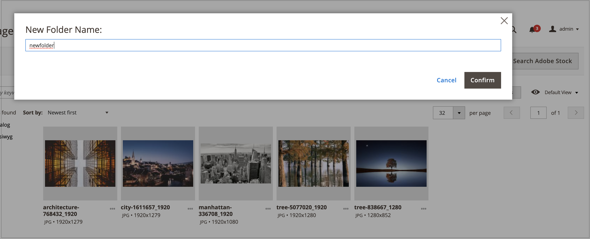

# Mapbeheer voor Media Gallery

De omslagen van het gebruik om beelden in de nieuwe [ Galerie van Media ](media-gallery.md) te organiseren. Naarmate het aantal media-elementen toeneemt, kunnen met mappen gemakkelijker bestaande elementen in uw mediagalerie worden gevonden en beheerd.

## Een map maken

>[!NOTE]
>
>U kunt alleen een map maken in de mappen `pub/media/wysywig` en `pub/media/catalog/category` .

1. Voor _Admin_ sidebar, ga **[!UICONTROL Content]** > _[!UICONTROL Media]_>**[!UICONTROL Media Gallery]**.

1. Klik op **[!UICONTROL Create Folder]**.

   Als u een submap wilt maken, selecteert u de bovenliggende map voordat u op **[!UICONTROL Create Folder]** klikt.

1. Voer de nieuwe mapnaam in en klik op **[!UICONTROL Confirm]** .

   {width="600" zoomable="yes"}

## Een map verwijderen

>[!WARNING]
>
>Als u een map verwijdert, worden alle afbeeldingen in die map verwijderd. U kunt alleen een map verwijderen uit de mappen `pub/media/wysywig` en `pub/media/catalog/category` .

1. Voor _Admin_ sidebar, ga **[!UICONTROL Content]** > _[!UICONTROL Media]_>**[!UICONTROL Media Gallery]**.

1. Selecteer de map die u wilt verwijderen.

   {width="600" zoomable="yes"}

1. Klik op **[!UICONTROL Delete Folder]**.

1. Klik op **[!UICONTROL OK]** om het verwijderen van mappen te bevestigen.
