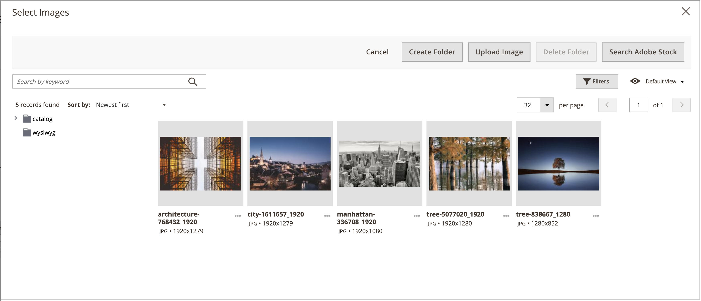

# De [!DNL Media Gallery]

Met Adobe Commerce of Magento Open Source 2.4, kunnen de handelaren nieuwe _verbeterde_ gebruiken [!DNL Media Gallery] om hun media dossiers op de server te organiseren en te beheren. Dit nieuwe [!DNL Media Gallery] bevat de zelfde functionaliteit zoals de bestaande media opslag, maar omvat een beter gebruikersinterface en een nauwere integratie met [ Adobe Stock ][adobe-stock].

{width="700" zoomable="yes"}

>[!NOTE]
>
>Productafbeeldingen die worden toegevoegd aan de [_[!UICONTROL Images and Videos]_productsectie ](../catalog/product-image.md#upload-an-image) , worden niet beheerd door de [!DNL Media Gallery] . Alleen afbeeldingen die worden gebruikt in de velden van de productsectie van_[!UICONTROL Content]_ , worden weergegeven en gefilterd in de nieuwe [!DNL Media Gallery] .

## De nieuwe functie inschakelen [!DNL Media Gallery]

1. Voor _Admin_ sidebar, ga **[!UICONTROL Stores]** > _[!UICONTROL Settings]_>**[!UICONTROL Configuration]**.

1. Vouw in het linkerdeelvenster **[!UICONTROL Advanced]** uit en kies **[!UICONTROL System]** .

1. Breid  **[!UICONTROL Media Gallery]** uit.

   ![ Geavanceerde configuratie - [!DNL Media Gallery]](./assets/system-media-gallery.png){width="600" zoomable="yes"}

1. Stel **[!UICONTROL Enable Old Media Gallery]** in op `No` .

1. Klik op **[!UICONTROL Save Config]**.

1. Klik op de koppeling **[!UICONTROL Cache Management]** in het systeembericht als daarom wordt gevraagd en vernieuw de ongeldige cache.

   In het [[!UICONTROL Content] menu ](/help/content-design/content-menu.md) wordt nu de nieuwe optie _[!UICONTROL Media Gallery]_weergegeven.

>[!NOTE]
>
>Volledige functionaliteit voor nieuwe [!DNL Media Gallery] vereist dat `media.gallery.synchronization` - en `media.content.synchronization` -gebruikers in de wachtrij worden gestart voor eerste synchronisatie. Zie [ berichtrijen ](https://experienceleague.adobe.com/docs/commerce-operations/configuration-guide/message-queues/manage-message-queues.html) beheren in de _Gids van de Configuratie_ voor meer details.

## Toegang krijgen tot de nieuwe [!DNL Media Gallery]

Nieuw [!DNL Media Gallery] is toegankelijk van het menu van de Inhoud of wanneer u [ een pagina ](/help/content-design/page-add.md) toevoegt of uitgeeft. U kunt tot het ook toegang hebben wanneer u [ creeert of een categorie ](/help/catalog/category-create.md) uitgeeft, of wanneer u [ beelden opneemt gebruikend de Redacteur van de Inhoud ](/help/content-design/editor-insert-image.md).

Toegang krijgen tot het nieuwe [!UICONTROL Media Gallery] via het menu [!UICONTROL Content] :

- Voor _Admin_ sidebar, ga **[!UICONTROL Content]** > _[!UICONTROL Media]_>**[!UICONTROL Media Gallery]**.

De nieuwe medialerie openen wanneer u een pagina toevoegt of bewerkt:

1. Voor _Admin_ sidebar, ga **[!UICONTROL Content]** > _[!UICONTROL Elements]_>**[!UICONTROL Pages]**.

1. Klik op **[!UICONTROL Add a New Page]**.

   Als u een bestaande pagina wilt bewerken, klikt u op de kolom _[!UICONTROL Action]_en kiest u **[!UICONTROL Edit]**.**[!UICONTROL Select]**

1. Breid  de **[!UICONTROL Content]** sectie uit en doe het volgende:

   - Als u [ toegelaten Bouwer van de Pagina ](../page-builder/setup.md) hebt, breid het **[!UICONTROL Media]** paneel uit en sleep **[!UICONTROL Image]** placeholder aan de doelcontainer. Klik vervolgens op **[!UICONTROL Select from Gallery]** .

     {width="600" zoomable="yes"}

   - Als u de [ toegelaten redacteur WYSIWYG ](/help/content-design/editor.md) hebt, klik **[!UICONTROL Show/Hide Editor]** en klik dan **[!UICONTROL Insert Image]**.

## [!DNL Media Gallery] demo

Bekijk deze video voor meer informatie over [!DNL Media Gallery] :

>[!VIDEO](https://video.tv.adobe.com/v/343785?quality=12)

[adobe-stock]: https://stock.adobe.com

