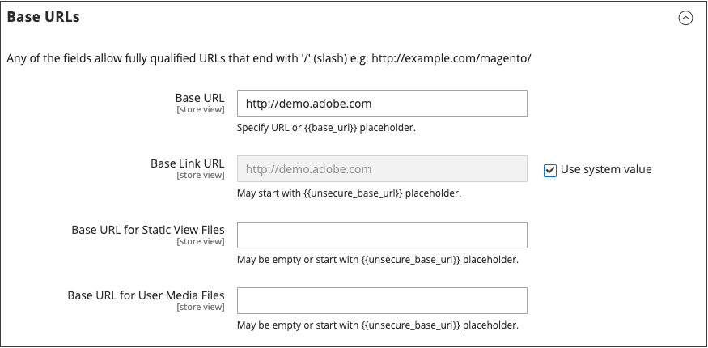

# Een netwerk voor inhoudslevering gebruiken

U kunt een CDN (Content Delivery Network) gebruiken om mediabestanden op te slaan. Adobe Commerce op cloud-infrastructuur bevat de snelste CDN (zie [Snel](https://experienceleague.adobe.com/docs/commerce-cloud-service/user-guide/cdn/fastly.html) in de _Handleiding voor handel in Cloud-infrastructuur_). Een instantie van de Handel die wordt geïnstalleerd _op locatie_ omvat geen integratie met om het even welke specifieke CDN, kunt u CDN van uw keus gebruiken.

Na het vormen van CDN, moet u de configuratie van Admin voltooien. De wijzigingen kunnen op globaal niveau of op het niveau van de website worden aangebracht. Wanneer een CDN voor media opslag wordt gebruikt, worden alle wegen aan media op de opslagpagina&#39;s van de Handel veranderd in de wegen CDN die in de configuratie worden gespecificeerd.

## CDN-workflow

1. **Browser vraagt media aan** - Een pagina uit de winkel wordt geopend in de browser van de klant en de browser vraagt om de media die in de HTML zijn opgegeven.
1. **Verzoek verzonden naar CDN; afbeeldingen gevonden en bewerkt** - De aanvraag wordt eerst naar de CDN verzonden. Als de CDN de afbeeldingen in opslag heeft, dienen de mediabestanden naar de browser van de klant.
1. **Media niet gevonden, verzoek verzonden naar [!DNL Commerce] webserver** - Als de CDN de mediabestanden niet heeft, wordt het verzoek verzonden naar de [!DNL Commerce] webserver. Als de mediabestanden in het bestandssysteem worden gevonden, stuurt de webserver ze naar de browser van de klant.

>[!IMPORTANT]
>
>Om veiligheidsredenen, wanneer een CDN als media opslag wordt gebruikt, kan JavaScript niet behoorlijk functioneren als CDN buiten uw subdomain wordt gevestigd.

## Een netwerk voor de levering van inhoud configureren

1. Op de _Beheerder_ zijbalk, ga naar **[!UICONTROL Stores]** > _[!UICONTROL Settings]_>**[!UICONTROL Configuration]**.

1. In het linkerdeelvenster onder _[!UICONTROL General]_, kiest u **[!UICONTROL Web]**.

1. In de linkerbovenhoek, plaats **[!UICONTROL Store View]** indien nodig.

1. Uitbreiden  de **[!UICONTROL Base URLs]** en voer de volgende handelingen uit:

   {width="600" zoomable="yes"}

   - Werk de **[!UICONTROL Base URL for Static View Files]** met de URL van de locatie op de CDN waar statische weergavebestanden worden opgeslagen.

   - Werk de **[!UICONTROL Base URL for User Media Files]** met de URL van de JavaScript-bestanden op de CDN.

     Beide velden kunnen leeg worden gelaten of beginnen met de tijdelijke aanduiding: `{{unsecure_base_url}}`

1. Uitbreiden  de **[!UICONTROL Base URLs (Secure)]** en voer de volgende handelingen uit:

   {width="600" zoomable="yes"}

   - Werk de **[!UICONTROL Secure Base URL for Static View Files]** met de URL van de locatie op de CDN waar statische weergavebestanden worden opgeslagen.

   - Werk de **[!UICONTROL Secure Base URL for User Media Files]** met de URL van de JavaScript-bestanden op de CDN.

     Beide velden kunnen leeg worden gelaten of beginnen met de tijdelijke aanduiding: `{{unsecure_base_url}}`

1. Klik op **[!UICONTROL Save Config]**.
