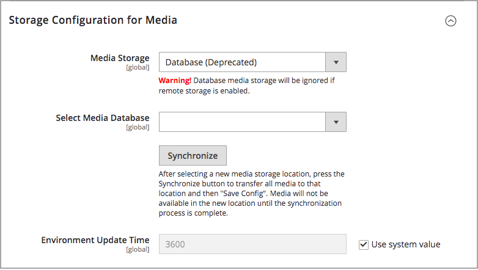

# Een mediadatabase gebruiken

>[!IMPORTANT]
>
>De opslagmethode voor databasemedia wordt vanaf Adobe Commerce en Magento Open Source 2.4.3 afgekeurd.

Standaard worden alle afbeeldingen, gecompileerde CSS-bestanden en gecompileerde JavaScript-bestanden van de instantie [!DNL Commerce] opgeslagen in het bestandssysteem op de webserver. U kunt ervoor kiezen deze bestanden op te slaan in een database op een databaseserver. Een voordeel van deze aanpak is de optie voor automatische synchronisatie en omgekeerde synchronisatie tussen het bestandssysteem van de webserver en de database. U kunt de standaarddatabase gebruiken om media op te slaan of te maken. Als u een nieuw gemaakte database wilt kunnen gebruiken als mediaopslag, moet u informatie over de database en de toegangsgegevens ervan toevoegen aan het `env.php` -bestand.

## Databaseworkflow

1. **Browser verzoekt media** - een pagina van de opslag opent in browser van de klant, en browser verzoekt de media die in HTML wordt gespecificeerd.

1. **het Systeem zoekt media in dossiersysteem** - het systeemonderzoeken naar de media in het dossiersysteem en indien gevonden, gaat het tot browser over.

1. **het Systeem bepaalt de plaats van media in gegevensbestand** - als de media niet in het dossiersysteem wordt gevonden, wordt een verzoek om de media verzonden naar het gegevensbestand dat in de configuratie wordt gespecificeerd.

1. **Systeem bepaalt de plaats van media in gegevensbestand** - een PHP manuscript brengt de dossiers van het gegevensbestand aan het dossiersysteem over, en verzonden naar browser van de klant. De browser request for media activeert het script als volgt:

   - Als de Webserver [&#x200B; herschrijft &#x200B;](../merchandising-promotions/url-rewrite.md) voor [!DNL Commerce] wordt toegelaten en door de server wordt gesteund, loopt het PHP manuscriptlooppas slechts wanneer de gevraagde media niet in het dossiersysteem wordt gevonden.
   - Als herschrijvingen van webservers zijn uitgeschakeld voor [!DNL Commerce] of niet worden ondersteund door de server, wordt het PHP-script toch uitgevoerd, zelfs als de vereiste media beschikbaar zijn in het bestandssysteem.

## Een database gebruiken voor mediaopslag

1. Voor _Admin_ sidebar, ga **[!UICONTROL Stores]** > _[!UICONTROL Settings]_>**[!UICONTROL Configuration]**.

1. Vouw in het linkerdeelvenster **[!UICONTROL Advanced]** uit en kies **[!UICONTROL System]** .

1. Stel in de linkerbovenhoek **[!UICONTROL Store View]** in op `Default Config` om de configuratie op algemeen niveau toe te passen.

1. Breid  de **[!UICONTROL Storage Configuration for Media]** sectie uit en doe het volgende:

   {width="600" zoomable="yes"}

   - Stel **[!UICONTROL Media Storage]** in op `Database` .

   - Plaats **[!UICONTROL Select Media Database]** aan het gegevensbestand u wilt gebruiken.

   - Klik op **[!UICONTROL Synchronize]** om de bestaande media over te brengen naar de nieuw geselecteerde database.

   - Voer de **[!UICONTROL Environment Update Time]** in seconden in.

1. Klik op **[!UICONTROL Save Config]** als de bewerking is voltooid.
