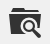

# Media-opslag

Met Media-opslag kunt u mediabestanden die op de server zijn opgeslagen, ordenen en toegang krijgen. De weg aan de plaats van de dossiers wordt bepaald door de [ basisURL ](../stores-purchase/store-urls.md) configuratie. Bestanden in mediaopslag zijn toegankelijk vanuit de editor wanneer u werkt aan pagina&#39;s en statische blokken. Meestal bevindt media-opslag zich in het bestandssysteem op dezelfde server als de programmabestanden van [!DNL Commerce] .

Alternatief, kunnen de media dossiers in a [ gegevensbestand ](media-storage-database.md), of op een afzonderlijke server of [ netwerk van de inhoudslevering ](media-storage-content-delivery-network.md) worden beheerd. Het voordeel van het gebruik van alternatieve opslag is dat hierdoor de vereiste inspanningen voor het synchroniseren van media tot een minimum worden beperkt. De prestaties van de synchronisatie worden vooral beïnvloed wanneer de veelvoudige instanties van het systeem op verschillende servers worden opgesteld die toegang tot de zelfde beelden, CSS dossiers, en andere media dossiers vereisen.

De redacteur kan worden gevormd om of statische of [ dynamische media URLs ](../catalog/catalog-urls.md#configure-catalog-media-url-format) voor catalogusinhoud in categorie of productbeschrijvingen te gebruiken.

![[!DNL Commerce] Media Storage ](./assets/media-storage.png){width="650" zoomable="yes"}

## Bestanden toevoegen aan de mediaopslag

De eerste twee stappen zijn hetzelfde als wanneer u een afbeelding invoegt.

1. Voor de [ redacteur ](editor.md) toolbar, klik het _beeld van het Tussenvoegsel_ pictogram.

   {width="700" zoomable="yes"}

   Met deze handeling wordt het dialoogvenster _[!UICONTROL Insert/edit image]_geopend.

1. Na _[!UICONTROL Source]_, klik het_ Onderzoek _pictogram ({width="10" zoomable="no"}).

1. Voer een van de volgende handelingen uit in de mappenstructuur aan de linkerkant:

   - Navigeer naar de map waarin u de geüploade afbeelding wilt opslaan.

   - Navigeer aan de plaats waar u een omslag wilt tot stand brengen en **klikken creeert Omslag**.

     Als u een map wilt toevoegen, voert u de mapnaam in en klikt u op **[!UICONTROL OK]** .

1. Om één of meerdere dossiers aan de Opslag van Media toe te voegen, kunt u of de dossiers van uw systeem uploaden of de [ Integratie van Adobe Stock ](adobe-stock.md) gebruiken:

   Als u bestanden vanaf uw systeem wilt uploaden, klikt u op **[!UICONTROL Choose Files]** en gaat u als volgt te werk:

   - Navigeer in de map van uw lokale computer naar de locatie van de afbeeldingen.

   - Selecteer elke afbeelding die u wilt uploaden.

   - Klik op **[!UICONTROL Open]**.

   Om activa van Adobe Stock te gebruiken die de [ integratie ](adobe-stock.md) gebruiken:

   - Klik op **[!UICONTROL Search Adobe Stock]**.

   - Voeg een voorproef of een vergunning gegeven beeld van Adobe Stock (zie [ Gebruikend de Beelden van Adobe Stock ](adobe-stock-manage.md)) toe.

De afbeeldingen worden geüpload naar de huidige map Media Storage op de server.

![[!DNL Commerce] Media Storage ](./assets/media-storage.png){width="650" zoomable="yes"}

## Een afbeelding invoegen uit media-opslag

Open de pagina of het blok dat u wilt bewerken. Gebruik vervolgens een van de volgende methoden om een afbeelding van mediaopslag in te voegen:

### Methode 1: WYSIWYG-modus

1. Voor de [ redacteur ](editor.md) toolbar, klik het _beeld van het Tussenvoegsel_ pictogram.

1. Na _[!UICONTROL Source]_, klik het_ Onderzoek _pictogram ({width="10" zoomable="no"}).

   {width="250" zoomable="yes"}

1. Navigeer in de mappenstructuur aan de linkerkant naar de map waarin de afbeelding is opgeslagen.

1. Selecteer de tegel van de afbeelding en klik op **[!UICONTROL Add Selected]** .

### Methode 2: HTML-modus

1. Plaats de cursor in de code waar de tag `` moet worden ingevoegd.

1. Klik op **[!UICONTROL Insert Image]**.

   {width="600" zoomable="yes"}
