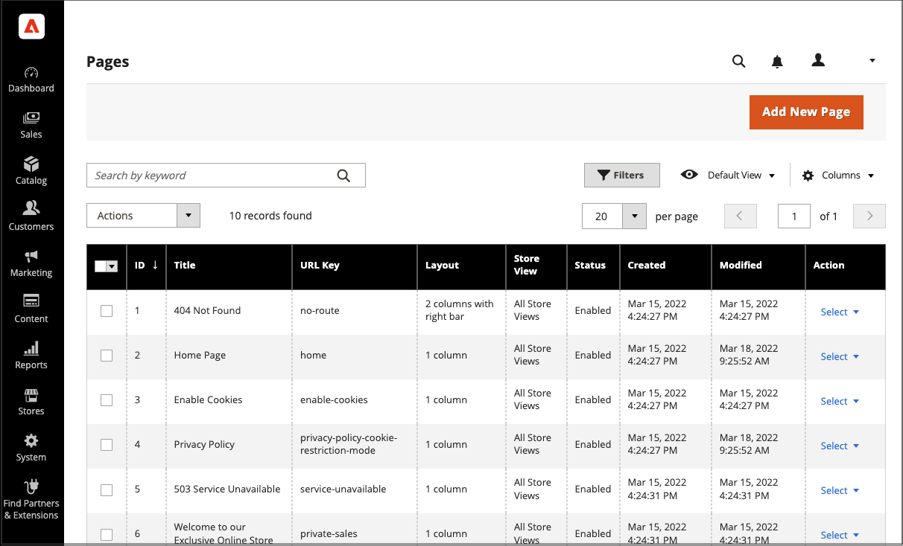

# Pagina&#39;s toevoegen en verwijderen

Het toevoegen van een inhoudspagina aan uw winkel is in wezen hetzelfde voor elk type pagina dat u wilt maken. U kunt tekst, afbeeldingen, blokken inhoud, variabelen en widgets opnemen. De meeste inhoudspagina&#39;s worden ontworpen voor lezing door onderzoeksmotoren eerst, en door mensen tweede. Houd rekening met de behoeften van elk van deze twee verschillende doelgroepen wanneer u de paginatitel, de URL en de metagegevens en de inhoud kiest. Wanneer de pagina is voltooid, kan deze worden toegevoegd aan de winkelnavigatie, gekoppeld aan andere pagina&#39;s, gekoppeld vanuit de voettekst van uw winkel of gebruikt als een nieuwe pagina [homepage](page-home-new.md).

{width="700" zoomable="yes"}

## Een pagina toevoegen

De volgende instructies lopen u door elke stap om een basispagina tot stand te brengen. Sommige geavanceerde functies worden overgeslagen, maar worden in andere onderwerpen behandeld.

### Stap 1: De pagina maken

1. Op de _Beheerder_ zijbalk, ga naar **[!UICONTROL Content]** > _[!UICONTROL Elements]_>**[!UICONTROL Pages]**.

1. Klik op **[!UICONTROL Add New Page]**.

   {width="600" zoomable="yes"}

1. Als u de pagina niet meteen wilt publiceren, stelt u **[!UICONTROL Enable Page]** tot `No`.

1. Voer de **[!UICONTROL Page Title]**.

   De paginatitel wordt weergegeven in het gedeelte [broodkruimel](../catalog/navigation-breadcrumb-trail.md) navigatie.

### Stap 2: De inhoud voltooien

Afhankelijk van uw [Configuratie van geavanceerde inhoudsgereedschappen](../configuration-reference/general/content-management.md), voegt u de pagina-inhoud toe.

#### De gereedschappen voor de pagina-inhoud gebruiken

1. Uitbreiden  **[!UICONTROL Content]**.

   {width="600" zoomable="yes"}

1. In de **[!UICONTROL Content Heading]** voert u de kop in die boven aan de pagina moet worden weergegeven.

   Indien ingeschakeld, wordt de [Page Builder](../page-builder/introduction.md) worden weergegeven onder Inhoudskop. Zie voor meer informatie [Werkruimte](../page-builder/workspace.md). Indien _Page Builder_ wordt niet toegelaten, opent de redacteur op wijze WYSIWYG met de toolbar bij de bovenkant.

1. Vul de inhoud in en maak de tekst zo nodig op.

#### De editor-werkbalk gebruiken

1. Uitbreiden  **[!UICONTROL Content]**.

   {width="600" zoomable="yes"}

1. In de **[!UICONTROL Content Heading]** voert u de kop in die boven aan de pagina moet worden weergegeven.

1. Vul de inhoud in en maak de tekst zo nodig op.

   U kunt [afbeeldingen](media-storage.md), [variabelen](../systems/variables-predefined.md), en [widgets](widgets.md) indien nodig. Zie voor meer informatie [De Editor gebruiken](editor.md).

### Stap 3: Voltooi de SEO-informatie

1. Uitbreiden  **[!UICONTROL Search Engine Optimization]**.

   {width="600" zoomable="yes"}

1. Accepteer de standaardinstelling of voer een andere waarde in **[!UICONTROL URL Key]** bestaat uit kleine letters, met afbreekstreepjes in plaats van spaties.

   De standaard-URL-sleutel is gemaakt bij het opslaan van de pagina en is gebaseerd op de inhoudskop.

1. Voer een **[!UICONTROL Meta Title]** voor de pagina.

   De meta-titel moet minder dan 70 tekens bevatten en wordt weergegeven in de titelbalk en het tabblad van de browser.

1. Geef uw keuze voor een hoge waarde op **[!UICONTROL Meta Keywords]** die zoekprogramma&#39;s kunnen gebruiken om de pagina te indexeren.

   Scheid meerdere woorden met een komma. Trefwoorden van meta worden genegeerd door sommige zoekmachines, maar worden gebruikt door anderen.

1. Voor **[!UICONTROL Meta Description]** Voer een korte beschrijving van de pagina in voor aanbiedingen met zoekresultaten.

   In het ideale geval moet de beschrijving 150-160 tekens lang zijn, met een maximum van 255.

1. Klik op **[!UICONTROL Save]**.

### Stap 4: Geef het bereik van de pagina op

1. Uitbreiden  **[!UICONTROL Page in Websites]**.

   {width="600" zoomable="yes"}

1. In de **[!UICONTROL Store View]** selecteert u elke weergave waarin de pagina beschikbaar moet zijn.

   Als de installatie meerdere websites heeft, selecteert u elke website en slaat u de weergave op waar de pagina beschikbaar moet zijn.

### Stap 5: De bovenliggende pagina identificeren (indien van toepassing)

{{ee-feature}}

1. Uitbreiden  **[!UICONTROL Hierarchy]**.

   {width="600" zoomable="yes"}

1. Als deze pagina een onderliggend item van een andere pagina is, schakelt u het selectievakje **[!UICONTROL Parent page]**.

### Stap 6: Voer ontwerpwijzigingen in (optioneel)

1. Als u de indeling van de pagina wilt wijzigen, vouwt u  **[!UICONTROL Design]**.

   {width="600" zoomable="yes"}

1. Als u de kolomlay-out van de pagina wilt wijzigen, stelt u **[!UICONTROL Layout]** op een van de volgende wijzen:

   - `Empty`
   - `1 column`
   - `2 columns with left bar`
   - `2 columns with right bar`
   - `3 columns`
   - `Page -- Full Width` (Vereist [Page Builder](../page-builder/introduction.md))
   - `Category -- Full Width` (Hiervoor is Page Builder vereist)
   - `Product -- Full Width` (Hiervoor is Page Builder vereist)

1. Als u een **[!UICONTROL Custom Layout Update]** kiest u de naam van het bestand in de lijst.

   Zie voor meer informatie [Layout-updates](layout-updates.md).

1. Als u het thema van de pagina wilt wijzigen, stelt u **[!UICONTROL New Theme]** op een van de volgende wijzen:

   - `Magento Black`
   - `Magento Luma`

1.  (Alleen Magento Open Source) Als u een ontwerpwijziging wilt plannen, vouwt u  **[!UICONTROL Custom Design Update]** en voer de volgende handelingen uit:

   {width="600" zoomable="yes"}

   - De kalender gebruiken () om de **[!UICONTROL From]** en **[!UICONTROL To]** data waarop de wijziging van kracht wordt.

   - Als u een ander thema op de pagina wilt toepassen, selecteert u de naam van de **[!UICONTROL New Theme]**.

   - Als u de kolomindeling van de pagina wilt wijzigen, kiest u de optie **[!UICONTROL Layout]** die u wilt toepassen.

### Stap 7: Een voorvertoning van de pagina weergeven

1. Klik op de knop **[!UICONTROL Save]** en kiest u **[!UICONTROL Save & Close]** om terug te keren naar het raster Pagina&#39;s.

1. De pagina in het raster zoeken en **[!UICONTROL View]** in de _[!UICONTROL Action]_kolom.

1. Klik op **[!UICONTROL Back]** in de linkerbovenhoek van het browservenster.

### Stap 8: De pagina publiceren

1. Selecteren **[!UICONTROL Edit]** in de _[!UICONTROL Action]_kolom van het raster.

1. Set **[!UICONTROL Enable Page]** tot `Yes`.

1. Klik op de knop **[!UICONTROL Save]** en kiest u **[!UICONTROL Save & Close]**.

## Een pagina dupliceren

Elke inhoudspagina kan als een sjabloon worden gebruikt en als een duplicaat worden opgeslagen. U kunt deze tijdbesparende techniek gebruiken om een consistent ontwerp te maken voor de pagina&#39;s met inhoud op de hele site. Op de gedupliceerde pagina blijft de paginatitel van het origineel behouden, maar de velden URL-sleutel en -status moeten worden bijgewerkt.

{width="600" zoomable="yes"}

1. Op de _Beheerder_ zijbalk, ga naar **[!UICONTROL Content]** > _[!UICONTROL Elements]_>**[!UICONTROL Pages]**.

1. Zoek in het raster de pagina die u wilt dupliceren en klik op **[!UICONTROL Edit]** in de _[!UICONTROL Action]_kolom.

1. Klik op de knop **[!UICONTROL Save]** en kiest u **[!UICONTROL Save & Duplicate]**.

1. Wanneer u de berichten ziet die de pagina is opgeslagen en gedupliceerd, klikt u **[!UICONTROL Back]** in de bovenste knopbalk om terug te keren naar het raster.

1. Zoek de gedupliceerde pagina in het raster en noteer het volgende:

   - De paginatitel is hetzelfde als het origineel.
   - Er wordt een unieke, maar tijdelijke URL-sleutel toegewezen.
   - De status van de pagina is `Disabled`.

1. De gedupliceerde pagina openen in _Bewerken_ en voer de volgende handelingen uit:

   - Stel de optie **[!UICONTROL Enable Page]** tot `Yes`.

   - Werk de **[!UICONTROL Page Title]**, indien nodig.

   - Uitbreiden  de **[!UICONTROL Search Engine Optimization]** en voer de unieke **[!UICONTROL URL Key]** die u wilt gebruiken voor de gedupliceerde pagina.

     {width="600" zoomable="yes"}

   - Werk de resterende pagina-inhoud naar wens bij.

1. Klik op de knop **[!UICONTROL Save]** en kiest u **[!UICONTROL Save & Close]**.

   De gedupliceerde pagina in het raster geeft uw wijzigingen weer.

## Menu Opslaan

| Opdracht | Beschrijving |
|--- |--- |
| [!UICONTROL Save] | Sla de huidige pagina op en ga verder met werken. |
| [!UICONTROL Save & New] | Sla de huidige pagina op, sluit deze en begin een nieuwe pagina. |
| [!UICONTROL Save & Duplicate] | Sla de huidige pagina op, sluit deze en open een nieuwe kopie. |
| [!UICONTROL Save & Close] | Sla de huidige pagina op, sluit deze en ga terug naar het raster Pagina&#39;s. |

{style="table-layout:auto"}

## Een pagina verwijderen

Er zijn twee manieren om een gemaakte pagina te verwijderen. U kunt het verwijderen uit de _[!UICONTROL Pages]_raster of van het_[!UICONTROL Edit]_ pagina.

### Methode 1: Een pagina verwijderen uit het raster Pagina&#39;s

1. Op de _Beheerder_ zijbalk, ga naar **[!UICONTROL Content]** > _[!UICONTROL Elements]_>**[!UICONTROL Pages]**.

1. Zoek de pagina&#39;s met behulp van filters boven het raster en schakel het selectievakje in voor een of meer pagina&#39;s die u wilt verwijderen.

1. In de linkerbovenhoek van de lijst stelt u **[!UICONTROL Actions]** tot `Delete`.

1. Klik op **[!UICONTROL OK]**.

### Methode 2: Een pagina verwijderen van de bewerkingspagina

1. Op de _Beheerder_ zijbalk, ga naar **[!UICONTROL Content]** > _[!UICONTROL Elements]_>**[!UICONTROL Pages]**.

1. De pagina zoeken die moet worden verwijderd.

1. In de _[!UICONTROL Actions]_kolom voor de pagina-entiteit klikt u op **[!UICONTROL Select]**en kiest u **[!UICONTROL Edit]**.

1. Klik op de knopbalk op **[!UICONTROL Delete Page]**.

1. Klik op **[!UICONTROL OK]**.
