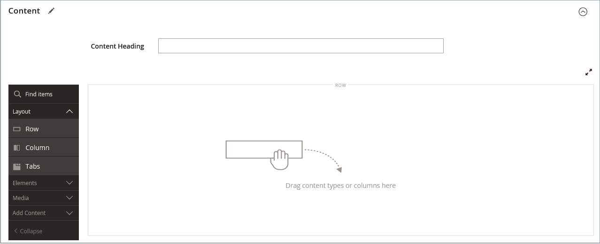

# Pagina&#39;s toevoegen en verwijderen

Het toevoegen van een inhoudspagina aan uw winkel is in wezen hetzelfde voor elk type pagina dat u wilt maken. U kunt tekst, afbeeldingen, blokken inhoud, variabelen en widgets opnemen. De meeste inhoudspagina&#39;s worden ontworpen voor lezing door onderzoeksmotoren eerst, en door mensen tweede. Houd rekening met de behoeften van elk van deze twee verschillende doelgroepen wanneer u de paginatitel, de URL en de metagegevens en de inhoud kiest. Wanneer uw pagina volledig is, kan het aan uw archiefnavigatie worden toegevoegd, met andere pagina&#39;s verbonden, die van footer van uw opslag worden verbonden, of als nieuwe [ homepage ](page-home-new.md) worden gebruikt.

{width="700" zoomable="yes"}

## Een pagina toevoegen

De volgende instructies lopen u door elke stap om een basispagina tot stand te brengen. Sommige geavanceerde functies worden overgeslagen, maar worden in andere onderwerpen behandeld.

### Stap 1: De pagina maken

1. Voor _Admin_ sidebar, ga **[!UICONTROL Content]** > _[!UICONTROL Elements]_>**[!UICONTROL Pages]**.

1. Klik op **[!UICONTROL Add New Page]**.

   {width="600" zoomable="yes"}

1. Als u de pagina niet meteen wilt publiceren, stelt u **[!UICONTROL Enable Page]** in op `No` .

1. Voer de **[!UICONTROL Page Title]** in.

   De paginatitel verschijnt in [ breadcrumb ](../catalog/navigation-breadcrumb-trail.md) navigatie.

### Stap 2: De inhoud voltooien

Afhankelijk van uw [ Geavanceerde configuratie van Hulpmiddelen van de Inhoud ](../configuration-reference/general/content-management.md), voeg de paginainhoud toe.

#### De gereedschappen voor de pagina-inhoud gebruiken

1. Breid  **[!UICONTROL Content]** uit.

   {width="600" zoomable="yes"}

1. Voer in het vak **[!UICONTROL Content Heading]** de kop in die u boven aan de pagina wilt weergeven.

   Indien toegelaten, verschijnen het [&#128279;](../page-builder/introduction.md) stadium en het paneel van de Bouwer van de Pagina 0&rbrace; &lbrace;onder de Kop van de Inhoud.  Voor meer informatie, zie [ Workspace ](../page-builder/workspace.md). Als _de Bouwer van de Pagina_ niet wordt toegelaten, opent de redacteur op de wijze van WYSIWYG met de toolbar bij de bovenkant.

1. Vul de inhoud in en maak de tekst zo nodig op.

#### De editor-werkbalk gebruiken

1. Breid  **[!UICONTROL Content]** uit.

   {width="600" zoomable="yes"}

1. Voer in het vak **[!UICONTROL Content Heading]** de kop in die u boven aan de pagina wilt weergeven.

1. Vul de inhoud in en maak de tekst zo nodig op.

   U kunt [ beelden ](media-storage.md) toevoegen, [ variabelen ](../systems/variables-predefined.md), en [ widgets ](widgets.md) zoals nodig. Voor meer informatie, zie [ Gebruikend de Redacteur ](editor.md).

### Stap 3: Voltooi de SEO-informatie

1. Breid  **[!UICONTROL Search Engine Optimization]** uit.

   {width="600" zoomable="yes"}

1. Accepteer de standaardinstelling of voer een andere **[!UICONTROL URL Key]** in die bestaat uit alle kleine letters, met afbreekstreepjes in plaats van spaties.

   De standaard-URL-sleutel is gemaakt bij het opslaan van de pagina en is gebaseerd op de inhoudskop.

1. Voer een **[!UICONTROL Meta Title]** in voor de pagina.

   De meta-titel moet minder dan 70 tekens bevatten en wordt weergegeven in de titelbalk en het tabblad van de browser.

1. Voer de hoge waarde in die zoekprogramma&#39;s kunnen gebruiken om de pagina te indexeren. **[!UICONTROL Meta Keywords]**

   Scheid meerdere woorden met een komma. Trefwoorden van meta worden genegeerd door sommige zoekmachines, maar worden gebruikt door anderen.

1. Voer bij **[!UICONTROL Meta Description]** een korte beschrijving van de pagina in voor aanbiedingen met zoekresultaten.

   In het ideale geval moet de beschrijving 150-160 tekens lang zijn, met een maximum van 255.

1. Klik op **[!UICONTROL Save]**.

### Stap 4: Geef het bereik van de pagina op

1. Breid  **[!UICONTROL Page in Websites]** uit.

   {width="600" zoomable="yes"}

1. Selecteer in de lijst **[!UICONTROL Store View]** elke weergave waar de pagina beschikbaar moet zijn.

   Als de installatie meerdere websites heeft, selecteert u elke website en slaat u de weergave op waar de pagina beschikbaar moet zijn.

### Stap 5: De bovenliggende pagina identificeren (indien van toepassing)

{{ee-feature}}

1. Breid  **[!UICONTROL Hierarchy]** uit.

   {width="600" zoomable="yes"}

1. Als deze pagina een onderliggend item van een andere pagina is, schakelt u het selectievakje van de **[!UICONTROL Parent page]** in.

### Stap 6: Voer ontwerpwijzigingen in (optioneel)

1. Om de lay-out van de pagina te veranderen, breid  **[!UICONTROL Design]** uit.

   {width="600" zoomable="yes"}

1. Als u de kolomlay-out van de pagina wilt wijzigen, stelt u **[!UICONTROL Layout]** in op een van de volgende opties:

   - `Empty`
   - `1 column`
   - `2 columns with left bar`
   - `2 columns with right bar`
   - `3 columns`
   - `Page -- Full Width` (vereist [ Bouwer van de Pagina ](../page-builder/introduction.md))
   - `Category -- Full Width` (hiervoor is Page Builder vereist)
   - `Product -- Full Width` (hiervoor is Page Builder vereist)

1. Als u een **[!UICONTROL Custom Layout Update]** wilt toepassen, kiest u de naam van het bestand in de lijst.

   Voor meer informatie, zie [ Updates van de Lay-out ](layout-updates.md).

1. Als u het thema van de pagina wilt wijzigen, stelt u **[!UICONTROL New Theme]** in op een van de volgende opties:

   - `Magento Black`
   - `Magento Luma`

1.  (Magento Open Source slechts) om een ontwerpverandering te plannen, breid  **[!UICONTROL Custom Design Update]** uit en doe het volgende:

   {width="600" zoomable="yes"}

   - Gebruik de kalender () om **[!UICONTROL From]** en **[!UICONTROL To]** data voor de verandering te kiezen om van kracht te worden.

   - Als u een ander thema op de pagina wilt toepassen, selecteert u de naam van de **[!UICONTROL New Theme]** .

   - Als u de kolomlay-out van de pagina wilt wijzigen, kiest u de **[!UICONTROL Layout]** die u wilt toepassen.

### Stap 7: Een voorvertoning van de pagina weergeven

1. Klik op de pijl **[!UICONTROL Save]** en kies **[!UICONTROL Save & Close]** om terug te keren naar het raster Pagina&#39;s.

1. Zoek de pagina in het raster en selecteer **[!UICONTROL View]** in de kolom _[!UICONTROL Action]_.

1. Als u wilt terugkeren naar het raster, klikt u op **[!UICONTROL Back]** in de linkerbovenhoek van het browservenster.

### Stap 8: De pagina publiceren

1. Selecteer **[!UICONTROL Edit]** in de kolom _[!UICONTROL Action]_&#x200B;van het raster.

1. Stel **[!UICONTROL Enable Page]** in op `Yes` .

1. Klik op de pijl **[!UICONTROL Save]** en kies **[!UICONTROL Save & Close]** .

## Een pagina dupliceren

Elke inhoudspagina kan als een sjabloon worden gebruikt en als een duplicaat worden opgeslagen. U kunt deze tijdbesparende techniek gebruiken om een consistent ontwerp te maken voor de pagina&#39;s met inhoud op de hele site. Op de gedupliceerde pagina blijft de paginatitel van het origineel behouden, maar de velden URL-sleutel en -status moeten worden bijgewerkt.

{width="600" zoomable="yes"}

1. Voor _Admin_ sidebar, ga **[!UICONTROL Content]** > _[!UICONTROL Elements]_>**[!UICONTROL Pages]**.

1. Zoek in het raster de pagina die u wilt dupliceren en klik op **[!UICONTROL Edit]** in de kolom _[!UICONTROL Action]_.

1. Klik op de pijl **[!UICONTROL Save]** en kies **[!UICONTROL Save & Duplicate]** .

1. Wanneer u de berichten ziet die de pagina is opgeslagen en gedupliceerd, klikt u op **[!UICONTROL Back]** in de bovenste knopbalk om terug te keren naar het raster.

1. Zoek de gedupliceerde pagina in het raster en noteer het volgende:

   - De paginatitel is hetzelfde als het origineel.
   - Er wordt een unieke, maar tijdelijke URL-sleutel toegewezen.
   - De status van de pagina is `Disabled` .

1. Open de dubbele pagina op _geef_ wijze uit en doe het volgende:

   - Als u de pagina direct wilt publiceren, stelt u **[!UICONTROL Enable Page]** in op `Yes` .

   - Werk de **[!UICONTROL Page Title]** zo nodig bij.

   - Breid  de **[!UICONTROL Search Engine Optimization]** sectie uit en ga unieke **[!UICONTROL URL Key]** in die u voor de dubbele pagina wilt gebruiken.

     {width="600" zoomable="yes"}

   - Werk de resterende pagina-inhoud naar wens bij.

1. Klik op de pijl **[!UICONTROL Save]** en kies **[!UICONTROL Save & Close]** .

   De gedupliceerde pagina in het raster geeft uw wijzigingen weer.

## Menu Opslaan

| Opdracht | Beschrijving |
|--- |--- |
| [!UICONTROL Save] | Sla de huidige pagina op en ga verder met werken. |
| [!UICONTROL Save & New] | Sla de huidige pagina op, sluit deze en begin een nieuwe pagina. |
| [!UICONTROL Save & Duplicate] | Sla de huidige pagina op, sluit deze en open een nieuwe kopie. |
| [!UICONTROL Save & Close] | Sla de huidige pagina op, sluit deze en ga terug naar het raster Pagina&#39;s. |

{style="table-layout:auto"}

## Een pagina verwijderen

Er zijn twee manieren om een gemaakte pagina te verwijderen. U kunt het verwijderen uit het raster _[!UICONTROL Pages]_&#x200B;of uit de pagina&#x200B;_[!UICONTROL Edit]_ .

### Methode 1: Een pagina verwijderen uit het raster Pagina&#39;s

1. Voor _Admin_ sidebar, ga **[!UICONTROL Content]** > _[!UICONTROL Elements]_>**[!UICONTROL Pages]**.

1. Zoek de pagina&#39;s met behulp van filters boven het raster en schakel het selectievakje in voor een of meer pagina&#39;s die u wilt verwijderen.

1. Stel **[!UICONTROL Actions]** in op `Delete` in de linkerbovenhoek van de lijst.

1. Klik op **[!UICONTROL OK]** om de handeling te bevestigen.

### Methode 2: Een pagina verwijderen van de bewerkingspagina

1. Voor _Admin_ sidebar, ga **[!UICONTROL Content]** > _[!UICONTROL Elements]_>**[!UICONTROL Pages]**.

1. De pagina zoeken die moet worden verwijderd.

1. Klik in de kolom _[!UICONTROL Actions]_&#x200B;voor de pagina-entiteit op **[!UICONTROL Select]**&#x200B;en kies **[!UICONTROL Edit]**.

1. Klik in de knopbalk op **[!UICONTROL Delete Page]** .

1. Klik op **[!UICONTROL OK]** om de handeling te bevestigen.
