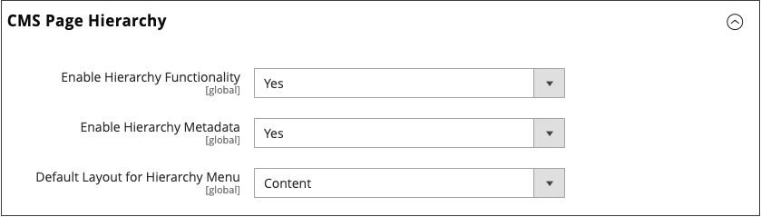

# Paginahiërarchie

{{ee-feature}}

Het hiërarchiestelsel van de archiefpagina geeft u de capaciteit om uw inhoudspagina&#39;s te organiseren en paginering, navigatie, en menu&#39;s toe te voegen. De pagina Privacybeleid in de voorbeeldgegevens is een voorbeeld van een pagina met een menu links. Als u regelmatig een grote hoeveelheid inhoud publiceert, kunt u een paginahiërarchie gebruiken om uw inhoud te organiseren zodat mensen gemakkelijk artikelen van belang kunnen vinden.

Het systeem van de paginahiërarchie gebruikt knopen om verwante stukken van inhoud te identificeren, en inhoudspagina&#39;s in ouder/kindverhoudingen te organiseren. Een bovenliggend knooppunt is een map die onderliggende knooppunten en pagina&#39;s kan bevatten. De relatieve positie van elk knooppunt en elke pagina in de hiërarchie wordt weergegeven als een _boom_ structuur. Een knooppunt kan andere knooppunten en inhoudspagina&#39;s bevatten en één inhoudspagina kan aan meerdere knooppunten en andere inhoudspagina&#39;s in een bovenliggend/onderliggend of buurrelatie worden gekoppeld.

{width="600" zoomable="yes"}

## Paginahiërarchie configureren

Met de configuratie-instellingen activeert u het systeem en de metagegevens van de paginahiërarchie en bepaalt u de standaardmenulay-out.

{width="600" zoomable="yes"}

1. Op de _Beheerder_ zijbalk, ga naar **[!UICONTROL Stores]** > _[!UICONTROL Settings]_>**[!UICONTROL Configuration]**.

1. In het linkerdeelvenster onder _[!UICONTROL General]_, kiest u **[!UICONTROL Content Management]**.

1. Uitbreiden  **[!UICONTROL CMS Page Hierarchy]**  en brengt de nodige wijzigingen aan.

1. Klik op **[!UICONTROL Save Config]**.

| Veld | Beschrijving |
|--- |--- |
| [!UICONTROL Enable Hierarchy Functionality] | Hiermee activeert u het gebruik van paginahiërarchie voor inhoudspagina&#39;s. Opties: `Yes` / `No` |
| [!UICONTROL Enable Hierarchy Metadata] | Als deze optie is ingeschakeld, kunt u metagegevens koppelen aan pagina&#39;s in de hiërarchie. Opties: `Yes` / `No` |
| [!UICONTROL Default Layout for Hierarchy Menu] | Bepaalt de standaardmenustijl. Opties: `Content` / `Left Column` / `Right Column` |

{style="table-layout:auto"}

## Een hiërarchieknooppunt toevoegen

In het volgende voorbeeld ziet u hoe u een knooppunt maakt met eenvoudige navigatie naar gerelateerde inhoudspagina&#39;s. Hoewel aan een knooppunt geen inhoudspagina is gekoppeld, heeft het knooppunt wel een URL-sleutel waarnaar elders in uw site kan worden verwezen.

U kunt bijvoorbeeld een knooppunt maken met de naam _Persberichten_ die naar individuele persberichten gaat . Vervolgens kunt u de koppeling opnemen in uw _Over ons_ pagina naar het knooppunt. Of u zou een knoop voor een inzameling van achterkwesties van uw nieuwsbrief kunnen tot stand brengen.

Als u een koppeling naar een knooppunt wilt maken, gebruikt u de [Widget](widgets.md) om een koppeling naar een CMS-hiërarchieknooppunt te maken en de widget in een inhoudsblok of pagina te plaatsen.

{width="600" zoomable="yes"}

### Stap 1: Een knooppunt maken

1. Op de _Beheerder_ zijbalk, ga naar **[!UICONTROL Content]** > _[!UICONTROL Elements]_>**[!UICONTROL Hierarchy]**.

   {width="600" zoomable="yes"}

1. Klik boven het raster op **[!UICONTROL Add Node...]**.

1. Onder _[!UICONTROL Page Properties]_, voert u een **[!UICONTROL Title]**voor het knooppunt en een geschikte **[!UICONTROL URL Key]**.

   De URL-sleutel biedt een uniek webadres voor het knooppunt. Het moet allemaal kleine letters zijn. Gebruik afbreekstreepjes om woorden te scheiden in plaats van spaties.

   {width="500" zoomable="yes"}

1. Klik op **[!UICONTROL Save]**.

   Het knooppunt wordt weergegeven als een map in de structuur links op de pagina.

### Stap 2: Pagina&#39;s toevoegen aan het knooppunt

1. Klik in de hiërarchiestructuur om het knooppunt te selecteren.

1. Klik op **[!UICONTROL Add Selected Pages(s) to Tree]**.

   U kunt omhoog scrollen om te zien dat elke geselecteerde pagina in de boom onder de knoopomslag verschijnt.

### Stap 3: De structuur definiëren

1. Indien nodig sleept u de pagina&#39;s naar de gewenste positie om de volgorde aan te geven waarin ze in het menu worden weergegeven.

   {width="500" zoomable="yes"}

1. Klik op het knooppunt boven in de hiërarchie.

   De _[!UICONTROL Page Properties]_wordt nu informatie over het knooppunt weergegeven.

1. Onder **[!UICONTROL Render Metadata in HTML Head]** Ga als volgt te werk:

   {width="400" zoomable="yes"}

   - Als u het knooppunt wilt identificeren als de bovenkant van de hiërarchie, stelt u **[!UICONTROL First]** tot `Yes`.

   - Om een pagineringscontrole te tonen, reeks **[!UICONTROL Next/Previous]** tot `Yes`.

   - Als u de pagina&#39;s in de hiërarchie wilt ordenen als een boek, stelt u **[!UICONTROL Enable Chapter/Section]** tot `Yes`.

     Als u niet de knoop als deel van het boek wilt omvatten, verlaat het gebrek `No`.

   - Om de knoop aan een specifiek deel van het boek toe te wijzen, reeks **[!UICONTROL Chapter/Section]** op een van de volgende wijzen:

      - `No` - Hiermee definieert u het knooppunt niet als hoofdstuk/sectie.
      - `Chapter` - Wijst het huidige knooppunt toe als een hoofdstuk.
      - `Section` - Wijst het huidige knooppunt toe als een sectie.
      - `Both` - Wijst het huidige knooppunt toe als hoofdstuk en sectie.

### Stap 4: Pagineringsbesturingselementen toevoegen

1. Onder _Pagineringsopties voor geneste pagina&#39;s_, set **[!UICONTROL Enable Pagination]** tot `Yes`.

1. Voor **[!UICONTROL Frame]**, ga het aantal paginakoppelingen in die u in de pagineringscontrole wilt omvatten.

   Als er meer pagina&#39;s in de hiërarchie zijn die in de pagineringscontrole kunnen worden omvat.

1. Voor **[!UICONTROL Frame Skip]** Voer het aantal pagina&#39;s in dat u vooruit (of terug) wilt overslaan voor de volgende set pagineringskoppelingen.

### Stap 5: Kies de menuindeling

Ga als volgt te werk als u het knooppunt in het menu wilt weergeven:

1. Onder _Opties menu Paginanavigatie_, set **[!UICONTROL Show in navigation menu]** tot `Yes`.

   Deze instelling bepaalt of een navigatiemenu wordt gegenereerd voor de paginahiërarchie.

   {width="300" zoomable="yes"}

1. Stel de **[!UICONTROL Menu Layout]**:

   - `Content` - De menulay-out bevindt zich in de inhoud.
   - `Use Default` - Gebruikt de menustijl die in [configuratie](../configuration-reference/general/content-management.md).
   - `Left Column` - Het menu wordt links van de inhoud weergegeven.
   - `Right Column` - Het menu wordt rechts van de inhoud weergegeven.

1. Als u wilt opgeven hoeveel details worden opgenomen in het menu, stelt u **[!UICONTROL Menu Detalization]** op een van de volgende wijzen:

   - `Only Children` - Alleen subpagina&#39;s worden in het menu opgenomen.
   - `Neighbours and Children` - Bevat subpagina&#39;s en andere pagina&#39;s die zich op hetzelfde niveau in de hiërarchie bevinden.

1. Voer de **[!UICONTROL Maximal Depth]** voor het maximumaantal niveaus dat moet worden opgenomen.

1. Kies een **[!UICONTROL List Type]**:

   - `Unordered` - De menuopties zijn niet genummerd en kunnen worden opgemaakt met of zonder opsommingstekens. Opties voor niet-geordend lijsttype: Standaard / Cirkel / Schijf / Vierkant
   - `Ordered` - De menuopties zijn genummerd en kunnen worden opgemaakt als numerieke, alfabetische of Romeinse cijfers in hoofdletters of kleine letters.

1. Set **[!UICONTROL List Style]** op een van de volgende wijzen:

   - `Circle`
   - `Disc`
   - `Square`

1. Als u ook wilt dat het knooppunt zichtbaar is in het navigatiemenu, schuift u naar _Opties hoofdnavigatiemenu_ en instellen **[!UICONTROL Show in Navigation menu]** tot `Yes`.

   {width="250" zoomable="yes"}

1. Klik op **[!UICONTROL Save]**.
