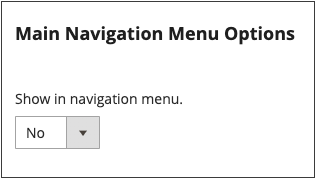

# Paginahiërarchie

{{ee-feature}}

Het hiërarchiestelsel van de archiefpagina geeft u de capaciteit om uw inhoudspagina&#39;s te organiseren en paginering, navigatie, en menu&#39;s toe te voegen. De pagina Privacybeleid in de voorbeeldgegevens is een voorbeeld van een pagina met een menu links. Als u regelmatig een grote hoeveelheid inhoud publiceert, kunt u een paginahiërarchie gebruiken om uw inhoud te organiseren zodat mensen gemakkelijk artikelen van belang kunnen vinden.

Het systeem van de paginahiërarchie gebruikt knopen om verwante stukken van inhoud te identificeren, en inhoudspagina&#39;s in ouder/kindverhoudingen te organiseren. Een bovenliggend knooppunt is een map die onderliggende knooppunten en pagina&#39;s kan bevatten. De relatieve positie van elke knoop en pagina in de hiërarchie wordt getoond als a _boom_ structuur. Een knooppunt kan andere knooppunten en inhoudspagina&#39;s bevatten en één inhoudspagina kan aan meerdere knooppunten en andere inhoudspagina&#39;s in een bovenliggend/onderliggend of buurrelatie worden gekoppeld.

{width="600" zoomable="yes"}

## Paginahiërarchie configureren

Met de configuratie-instellingen activeert u het systeem en de metagegevens van de paginahiërarchie en bepaalt u de standaardmenulay-out.

{width="600" zoomable="yes"}

1. Voor _Admin_ sidebar, ga **[!UICONTROL Stores]** > _[!UICONTROL Settings]_>**[!UICONTROL Configuration]**.

1. Kies in het linkerdeelvenster onder _[!UICONTROL General]_&#x200B;de optie **[!UICONTROL Content Management]**.

1. Breid  **[!UICONTROL CMS Page Hierarchy]** uit en breng om het even welke veranderingen aan die noodzakelijk zijn.

1. Klik op **[!UICONTROL Save Config]** als de bewerking is voltooid.

| Veld | Beschrijving |
|--- |--- |
| [!UICONTROL Enable Hierarchy Functionality] | Hiermee activeert u het gebruik van paginahiërarchie voor inhoudspagina&#39;s. Opties: `Yes` / `No` |
| [!UICONTROL Enable Hierarchy Metadata] | Als deze optie is ingeschakeld, kunt u metagegevens koppelen aan pagina&#39;s in de hiërarchie. Opties: `Yes` / `No` |
| [!UICONTROL Default Layout for Hierarchy Menu] | Bepaalt de standaardmenustijl. Opties: `Content` / `Left Column` / `Right Column` |

{style="table-layout:auto"}

## Een hiërarchieknooppunt toevoegen

In het volgende voorbeeld ziet u hoe u een knooppunt maakt met eenvoudige navigatie naar gerelateerde inhoudspagina&#39;s. Hoewel aan een knooppunt geen inhoudspagina is gekoppeld, heeft het knooppunt wel een URL-sleutel waarnaar elders in uw site kan worden verwezen.

Bijvoorbeeld, zou u een knoop kunnen tot stand brengen genoemd _Versies van de Pers_ die navigatie aan individuele persversies heeft. Dan, kunt u de verbinding op uw _Ongeveer pagina van ons_ aan de knoop omvatten. Of u zou een knoop voor een inzameling van achterkwesties van uw nieuwsbrief kunnen tot stand brengen.

Om met een knoop te verbinden, gebruik het [ Widget ](widgets.md) hulpmiddel om een verbinding van de Knoop van de Hiërarchie van CMS tot stand te brengen en widget in een inhoudsblok of een pagina te plaatsen.

{width="600" zoomable="yes"}

### Stap 1: Een knooppunt maken

1. Voor _Admin_ sidebar, ga **[!UICONTROL Content]** > _[!UICONTROL Elements]_>**[!UICONTROL Hierarchy]**.

   {width="600" zoomable="yes"}

1. Klik boven het raster op **[!UICONTROL Add Node...]** .

1. Voer onder _[!UICONTROL Page Properties]_&#x200B;een **[!UICONTROL Title]**&#x200B;voor het knooppunt en een geschikte **[!UICONTROL URL Key]**&#x200B;in.

   De URL-sleutel biedt een uniek webadres voor het knooppunt. Het moet allemaal kleine letters zijn. Gebruik afbreekstreepjes om woorden te scheiden in plaats van spaties.

   {width="500" zoomable="yes"}

1. Klik op **[!UICONTROL Save]**.

   Het knooppunt wordt weergegeven als een map in de structuur links op de pagina.

### Stap 2: Pagina&#39;s toevoegen aan het knooppunt

1. Klik in de hiërarchiestructuur om het knooppunt te selecteren.

1. Klik op **[!UICONTROL Add Selected Pages(s) to Tree]**.

   U kunt omhoog scrollen om te zien dat elke geselecteerde pagina in de boom onder de knoopomslag verschijnt.

### Stap 3: De structuur definiëren

1. Indien nodig sleept u de pagina&#39;s naar de gewenste positie om de volgorde aan te geven waarin ze in het menu worden weergegeven.

   {width="500" zoomable="yes"}

1. Klik op het knooppunt boven in de hiërarchie.

   In de sectie _[!UICONTROL Page Properties]_&#x200B;wordt nu informatie over het knooppunt weergegeven.

1. Voer onder **[!UICONTROL Render Metadata in HTML Head]** de volgende handelingen uit:

   {width="400" zoomable="yes"} terug

   - Stel **[!UICONTROL First]** in op `Yes` om het knooppunt als de bovenkant van de hiërarchie te identificeren.

   - Als u een pagineringsbesturingselement wilt weergeven, stelt u **[!UICONTROL Next/Previous]** in op `Yes` .

   - Als u de pagina&#39;s in de hiërarchie wilt ordenen als een boek, stelt u **[!UICONTROL Enable Chapter/Section]** in op `Yes` .

     Als u het knooppunt niet wilt opnemen in het boek, laat u de standaardwaarde `No` staan.

   - Als u het knooppunt wilt toewijzen aan een specifiek deel van het boek, stelt u **[!UICONTROL Chapter/Section]** in op een van de volgende opties:

      - `No` - Hiermee definieert u het knooppunt niet als hoofdstuk/sectie.
      - `Chapter` - Wijst het huidige knooppunt toe als een hoofdstuk.
      - `Section` - Wijst het huidige knooppunt toe als een sectie.
      - `Both` - Wijst het huidige knooppunt toe als hoofdstuk en sectie.

### Stap 4: Pagineringsbesturingselementen toevoegen

1. Onder _Opties van de Paginering voor Geneste Pagina&#39;s_, plaats **[!UICONTROL Enable Pagination]** aan `Yes`.

1. Voer bij **[!UICONTROL Frame]** het aantal paginakoppelingen in dat u in het pagineringsbesturingselement wilt opnemen.

   Als er meer pagina&#39;s in de hiërarchie zijn die in de pagineringscontrole kunnen worden omvat.

1. Voer bij **[!UICONTROL Frame Skip]** het aantal pagina&#39;s in dat u vooruit (of terug) wilt overslaan voor de volgende set pagineringskoppelingen.

### Stap 5: Kies de menuindeling

Ga als volgt te werk als u het knooppunt in het menu wilt weergeven:

1. Onder _Opties van het Menu van de Navigatie van de Pagina_, plaats **[!UICONTROL Show in navigation menu]** aan `Yes`.

   Deze instelling bepaalt of een navigatiemenu wordt gegenereerd voor de paginahiërarchie.

   {width="300" zoomable="yes"}

1. Als u de locatie van het menu ten opzichte van de inhoud wilt opgeven, stelt u de optie **[!UICONTROL Menu Layout]** in:

   - `Content` - De menulay-out bevindt zich in de inhoud.
   - `Use Default` - gebruikt de menustijl die in de [ configuratie ](../configuration-reference/general/content-management.md) wordt gespecificeerd.
   - `Left Column` - Het menu wordt links van de inhoud weergegeven.
   - `Right Column` - Het menu wordt rechts van de inhoud weergegeven.

1. Stel **[!UICONTROL Menu Detalization]** in op een van de volgende opties om op te geven hoeveel details worden opgenomen in het menu:

   - `Only Children` - Alleen subpagina&#39;s worden in het menu opgenomen.
   - `Neighbours and Children` - Bevat subpagina&#39;s en andere pagina&#39;s die zich op hetzelfde niveau in de hiërarchie bevinden.

1. Om de diepte van het menu te bepalen, ga **[!UICONTROL Maximal Depth]** voor het maximumaantal niveaus in om te omvatten.

1. Kies een **[!UICONTROL List Type]** als u het menu wilt opmaken:

   - `Unordered` - De menuopties zijn niet genummerd en kunnen worden opgemaakt met of zonder opsommingstekens. Opties voor niet-geordend lijsttype: Standaard / Cirkel / Schijf / Vierkant
   - `Ordered` - De menuopties zijn genummerd en kunnen worden opgemaakt als numerieke, alfabetische of Romeinse cijfers in hoofdletters of kleine letters.

1. Stel **[!UICONTROL List Style]** in op een van de volgende opties:

   - `Circle`
   - `Disc`
   - `Square`

1. Als u ook de knoop in het navigatiemenu zichtbaar wilt zijn, scrol aan _de Opties van het Menu van de Navigatie de Hoofd_ en plaats **[!UICONTROL Show in Navigation menu]** aan `Yes`.

   {width="250" zoomable="yes"}

1. Klik op **[!UICONTROL Save]**.
