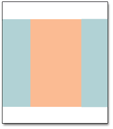

# Paginalay-outs

De indeling van elke pagina in uw winkel bestaat uit verschillende secties, of containers, die de kop-, voettekst- en inhoudsgebieden van de pagina definiëren. Afhankelijk van de indeling kan elke pagina een, twee, drie kolommen of meer bevatten. U kunt aan de lay-out als _vloerplan_ van de pagina denken, en een specifieke lay-out toewijzen die als gebrek voor CMS, product, en categoriepagina&#39;s moet worden gebruikt.

Voor de pagina, drijven de inhoudsblokken om de beschikbare ruimte te vullen, volgens de sectie van de [&#x200B; paginalay-out &#x200B;](layout-updates.md) waar zij worden toegewezen om te verschijnen. Als u de lay-out wijzigt van een lay-out met drie kolommen in een lay-out met twee kolommen, wordt de inhoud van het hoofdgebied uitgebreid om de beschikbare ruimte te vullen. U ziet ook dat blokkeringen die verband houden met de ongebruikte zijbalk lijken te verdwijnen. Als u echter de lay-out met drie kolommen herstelt, worden de blokken weer weergegeven. Deze dynamische benadering, of _vloeiende lay-out_, maakt het mogelijk om de paginalay-out te veranderen zonder het moeten de inhoud herwerken. Als u aan het werken met individuele pagina&#39;s van HTML wordt gebruikt, vereist deze modulaire, _bouwsteen_ benadering een verschillende manier van denken.

{width="700" zoomable="yes"}

## Standaardschermindelingen configureren

1. Voor _Admin_ sidebar, ga **[!UICONTROL Stores]** > _[!UICONTROL Settings]_>**[!UICONTROL Configuration]**.

1. Kies in het linkerdeelvenster onder _[!UICONTROL General]_&#x200B;de optie **[!UICONTROL Web]**.

1. Breid  de **[!UICONTROL Default Layouts]** sectie uit.

   {width="600" zoomable="yes"}

1. Kies de **[!UICONTROL Default Product Layout]** die u voor productpagina&#39;s wilt gebruiken.

   Deze instelling bepaalt de indeling die standaard wordt gebruikt voor productpagina&#39;s.

   - `No layout updates` - Layout-updates zijn niet beschikbaar voor productpagina&#39;s.
   - `Empty` - Gebruikt een lege lay-out voor productpagina&#39;s.
   - `1 column` - Gebruikt één kolomindeling voor productpagina&#39;s.
   - `2 columns with left bar` - Voor productpagina&#39;s gebruikt u een lay-out met twee kolommen en de zijbalk links.
   - `2 columns with right bar` - Voor productpagina&#39;s gebruikt u een lay-out met twee kolommen en de zijbalk rechts.
   - `3 columns` - Gebruikt een lay-out met drie kolommen en zijbalken links en rechts voor productpagina&#39;s.

   Wanneer [&#x200B; de Bouwer van de Pagina &#x200B;](../page-builder/introduction.md) wordt toegelaten, zijn er extra beschikbare volledige breedteopties. Vervolgens kunt u met de gereedschappen voor de pagina-inhoud de lay-out voor uw productpagina&#39;s ontwerpen.

   - `Page -- Full Width` - gebruikt de _Pagina - Volledige lay-out van de Breedte_ voor productpagina&#39;s.
   - `Category -- Full Width` - gebruikt de _Categorie - Volledige lay-out van de Breedte_ voor productpagina&#39;s.
   - `Product -- Full Width` - (Geadviseerd) gebruikt het _Product - Volledige lay-out van de Breedte_ voor productpagina&#39;s.

1. Kies de **[!UICONTROL Default Category Layout]** die u voor categoriepagina&#39;s wilt gebruiken.

   Deze instelling bepaalt de indeling die standaard wordt gebruikt voor categoriepagina&#39;s.

   - `No layout updates` - Layout-updates zijn niet beschikbaar voor categoriepagina&#39;s.
   - `Empty` - Hiermee gebruikt u een lege indeling voor categoriepagina&#39;s.
   - `1 column` - Gebruikt één kolomindeling voor categoriepagina&#39;s.
   - `2 columns with left bar` - Voor categoriepagina&#39;s gebruikt u een lay-out met twee kolommen en de zijbalk links.
   - `2 columns with right bar` - Gebruikt een lay-out met twee kolommen en de zijbalk rechts voor categoriepagina&#39;s.
   - `3 columns` - Gebruikt een lay-out met drie kolommen en zijbalken links en rechts voor categoriepagina&#39;s.

   Wanneer [&#x200B; de Bouwer van de Pagina &#x200B;](../page-builder/introduction.md) wordt toegelaten, zijn er extra beschikbare volledige breedteopties. Vervolgens kunt u de gereedschappen voor de inhoud van de Page Builder gebruiken om de lay-out voor uw categoriepagina&#39;s te ontwerpen.

   - `Page -- Full Width` - gebruikt de _Pagina - Volledige lay-out van de Breedte_ voor categoriepagina&#39;s.
   - `Category -- Full Width` - (Geadviseerd) gebruikt de _Categorie - Volledige lay-out van de Breedte_ voor categoriepagina&#39;s.
   - `Product -- Full Width` - gebruikt het _Product - Volledige lay-out van de Breedte_ voor categoriepagina&#39;s.

1. Kies de **[!UICONTROL Default Page Layout]** die u voor CMS-pagina&#39;s wilt gebruiken.

   Deze instelling bepaalt de indeling die standaard wordt gebruikt voor CMS-pagina&#39;s.

   - `No layout updates` - Layout-updates zijn niet beschikbaar voor CMS-pagina&#39;s.
   - `Empty` - Gebruikt een lege lay-out voor CMS-pagina&#39;s.
   - `1 column` - Gebruikt één kolomlay-out voor CMS-pagina&#39;s.
   - `2 columns with left bar` - Voor CMS-pagina&#39;s wordt een lay-out van twee kolommen gebruikt met de zijbalk links.
   - `2 columns with right bar` - Voor CMS-pagina&#39;s gebruikt u een lay-out met twee kolommen en de zijbalk rechts.
   - `3 columns` - Voor CMS-pagina&#39;s wordt een lay-out van drie kolommen met zijbalken links en rechts gebruikt.

   Wanneer [&#x200B; de Bouwer van de Pagina &#x200B;](../page-builder/introduction.md) wordt toegelaten, zijn er extra beschikbare volledige breedteopties. Vervolgens kunt u de gereedschappen voor pagina Builder-inhoud gebruiken om de lay-out voor uw CMS-pagina&#39;s te ontwerpen.

   - `Page -- Full Width` - (Geadviseerd) gebruikt de _Pagina - Volledige 2&rbrace; lay-out van de Breedte voor de pagina&#39;s van CMS._
   - `Category - Full Width` - gebruikt de _Categorie - Volledige lay-out van de Breedte_ voor de pagina&#39;s van CMS.
   - `Product - Full Width` - gebruikt het _Product - Volledige lay-out van de Breedte_ voor de pagina&#39;s van CMS.

1. Klik op **[!UICONTROL Save Config]** als de bewerking is voltooid.

## Standaardpagina-indelingen

### Eén kolom

{zoomable="yes"}

De lay-out _[!UICONTROL 1 Column]_&#x200B;kan worden gebruikt om een dramatische homepage met een groot beeld of brandpunt tot stand te brengen. Het is ook een goede keuze voor een openingspagina of een andere pagina met een combinatie van tekst, afbeeldingen en video.

### Twee kolommen met linkerbalk

{zoomable="yes"}

De indeling _[!UICONTROL 2 Columns with Left Bar]_&#x200B;wordt vaak gebruikt voor pagina&#39;s met navigatie aan de linkerkant, zoals een catalogus of pagina&#39;s met zoekresultaten met gelaagde navigatie. Het is ook een uitstekende keuze voor homepages die extra navigatie of blokken ondersteunende inhoud links nodig hebben.

### Twee kolommen met rechterbalk

{zoomable="yes"}

Met een _[!UICONTROL 2 Columns with Right Bar]_-lay-out is het hoofdinhoudsgebied groot genoeg voor een opvallende afbeelding of banner. Deze lay-out wordt ook vaak gebruikt voor productpagina&#39;s met aan de rechterkant blokken met ondersteunende inhoud.

### Drie kolommen

{zoomable="yes"}

De lay-out _[!UICONTROL 3 Column]_&#x200B;heeft een middenkolom die breed genoeg is voor de hoofdtekst van de pagina, met ruimte aan elke kant voor extra navigatie en blokken met ondersteunende inhoud.

### Leeg

{zoomable="yes"}

De lay-out _[!UICONTROL Empty]_&#x200B;kan worden gebruikt om aangepaste paginalay-outs te definiëren.
