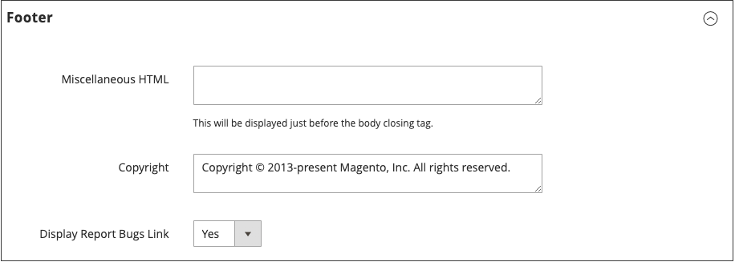

# Pagina-instelling

De hoofdsecties van de pagina worden gedeeltelijk bestuurd door een set standaard HTML-tags. Sommige van deze labels kunnen worden gebruikt om de lettertypen, kleur, grootte, achtergrondkleuren en afbeeldingen te selecteren die in elke sectie van de pagina worden gebruikt. Andere instellingen bepalen pagina-elementen, zoals het logo in de koptekst en de copyrightvermelding in de voettekst. Deze secties komen overeen met de onderliggende structuur van de pagina HTML en veel van de basiseigenschappen kunnen worden ingesteld via de beheerder.

- [HTML Head](#html-head)
- [Koptekst](#header)
- [Voettekst](#footer)

{width="700" zoomable="yes"}

## HTML Head

De instellingen in de sectie HTML Head komen overeen met de instellingen in de sectie `<head>` -tag van een HTML-pagina en kan worden geconfigureerd voor elke winkelweergave. Naast metagegevens voor de paginatitel, beschrijving en trefwoorden bevat de sectie een koppeling naar het favicon en diverse scripts. In deze sectie worden ook instructies voor robots van zoekprogramma&#39;s en de weergave van de mededeling van de opslagdemo geconfigureerd.

### De kop van de HTML configureren

1. Op de _Beheerder_ zijbalk, ga naar **[!UICONTROL Content]** > _[!UICONTROL Design]_>**[!UICONTROL Configuration]**.

1. Zoek de archiefmening die u wilt vormen en klikken **[!UICONTROL Edit]** in de _[!UICONTROL Action]_kolom.

1. Onder _Overige instellingen_, uitbreiden  de **[!UICONTROL HTML Head]** sectie.

   {width="500" zoomable="yes"}

1. Werk de [favicon](../getting-started/storefront-branding.md#add-a-favicon) indien nodig.

1. Pas de instellingen voor de paginatitel aan uw wensen aan:

   - **[!UICONTROL Default Page Title]**
   - **[!UICONTROL Page Title Prefix]**
   - **[!UICONTROL Page Title Suffix]**

   U kunt een achtervoegsel en/of voorvoegsel met de standaardtitel gebruiken om een titel van twee of drie delen te maken. U kunt een verticale balk of dubbele punt toevoegen als scheidingsteken tussen het voor- of achtervoegsel en de standaardtitel.

1. Voeg of wijzig meta- gegevens toe die de Optimalisering van de Motor van het Onderzoek (SEO) steunen en helpt klanten aan uw opslag van onderzoeksresultaten sturen:

   - **[!UICONTROL Default Meta Description]**
   - **[!UICONTROL Default Meta Keywords]**

1. Voer een **[!UICONTROL Scripts and Style Sheets]** indien nodig.

1. Schakel de [demo store notice](../getting-started/storefront-branding.md#set-the-store-demo-notice) indien nodig.

1. Klik op **[!UICONTROL Save Configuration]**.

### HTML Head-veldbeschrijvingen

| Veld | Toepassingsgebied | Beschrijving |
|--- |--- |--- |
| [!UICONTROL Favicon Icon] | Winkelweergave | Uploadt de kleine grafische afbeelding die wordt weergegeven in de adresbalk en het tabblad van de browser. Toegestane bestandstypen: ICO, PNG, APNG, GIF en JPG (JPEG). Niet alle browsers ondersteunen deze indelingen. |
| [!UICONTROL Default Page Title] | Winkelweergave | De titel die wordt weergegeven op de titelbalk van elke pagina wanneer deze wordt weergegeven in een browser. De standaardtitel wordt gebruikt voor alle pagina&#39;s, tenzij voor afzonderlijke pagina&#39;s een andere titel is opgegeven. |
| [!UICONTROL Page Title Prefix] | Winkelweergave | Een voorvoegsel kan vóór de titel worden toegevoegd om een titel met twee of drie delen te maken. Een verticale balk of dubbele punt kan als scheidingsteken aan het einde van het voorvoegsel worden gebruikt om het te onderscheiden van de tekst van de hoofdtitel. |
| [!UICONTROL Page Title Suffix] | Winkelweergave | U kunt na de titel een achtervoegsel toevoegen om een titel van twee of drie delen te maken. Een verticale balk of dubbele punt kan als scheidingsteken aan het einde van het voorvoegsel worden gebruikt om het te onderscheiden van de tekst van de hoofdtitel. |
| [!UICONTROL Default Meta Description] | Winkelweergave | De beschrijving bevat een overzicht van je site voor aanbiedingen met zoekprogramma&#39;s en mag niet langer zijn dan 160 tekens. |
| [!UICONTROL Default Meta Keywords] | Winkelweergave | Een reeks trefwoorden die uw winkel beschrijven, elk gescheiden door een komma. |
| [!UICONTROL Scripts and Style Sheets] | Winkelweergave | Bevat manuscripten die in de HTML vóór het sluiten moeten worden omvat `<head>` -tag. JavaScript van derden moet bijvoorbeeld vóór het dialoogvenster `<body>` -tag kan hier worden ingevoerd. |
| [!UICONTROL Display Demo Store Notice] | Winkelweergave | Controls the display of the demo store notice at the top of the page. Opties: `Yes` / `No` |

{style="table-layout:auto"}

## Koptekst

De configuratie van de Kopbal identificeert de weg aan uw archiefembleem en specificeert de lt tekst van het embleem en welkomstbericht.

{width="400" zoomable="yes"}

### De koptekst configureren

1. Op de _Beheerder_ zijbalk, ga naar **[!UICONTROL Content]** > _[!UICONTROL Design]_>**[!UICONTROL Configuration]**.

1. Zoek de archiefmening die u wilt vormen en klikken **[!UICONTROL Edit]** in de _[!UICONTROL Action]_kolom.

1. Onder _Overige instellingen_, uitbreiden  de **[!UICONTROL Header]** sectie.

1. Breng de gewenste wijzigingen aan in de winkelweergave:

   - [Logo](../getting-started/storefront-branding.md#upload-your-logo) instellingen
   - [Welkom](../getting-started/storefront-branding.md#change-the-welcome-message) instellingen

1. Klik op **[!UICONTROL Save Configuration]**.

### Beschrijvingen van koptekstvelden

| Veld | Toepassingsgebied | Beschrijving |
|--- |--- |--- |
| [!UICONTROL Logo Image] | Winkelweergave | Identificeert het pad naar het logo dat in de koptekst wordt weergegeven. Ondersteunde bestandstypen: PNG, GIF, JPG (JPEG) |
| [!UICONTROL Logo Attribute Width] | Winkelweergave | De breedte van de logoafbeelding in pixels. |
| [!UICONTROL Logo Attribute Height] | Winkelweergave | De hoogte van de logoafbeelding in pixels. |
| [!UICONTROL Welcome Text] | Winkelweergave | Het welkomstbericht wordt weergegeven in de koptekst van de pagina en bevat de naam van de klanten die zijn aangemeld. |
| [!UICONTROL Logo Image Alt] | Winkelweergave | De Alt-tekst die aan het logo is gekoppeld. |
| [!UICONTROL Translate Title] | Winkelweergave | Hiermee wordt bepaald of de `Page Title` of `Meta Title` moet worden vertaald. |

{style="table-layout:auto"}

## Voettekst

In het gedeelte Voettekstconfiguratie kunt u de [copyrightmelding](../getting-started/storefront-branding.md#change-the-copyright-notice) die onder aan de pagina wordt weergegeven, en voert diverse scripts in die moeten worden geplaatst vóór het sluiten `<body>` -tag.

{width="400" zoomable="yes"}

### De voettekst configureren

1. Op de _Beheerder_ zijbalk, ga naar **[!UICONTROL Content]** > _[!UICONTROL Design]_>**[!UICONTROL Configuration]**.

1. Zoek de archiefmening die u wilt vormen en klikken **[!UICONTROL Edit]** in de _[!UICONTROL Action]_kolom.

1. Onder _Overige instellingen_, uitbreiden  de **[!UICONTROL Footer]** sectie.

1. Breng desgewenst wijzigingen aan in de **[!UICONTROL Copyright]** en **[!UICONTROL Miscellaneous HTML]** instellingen.

1. Klik op **[!UICONTROL Save Configuration]**.

## Beschrijvingen van voettekstvelden

| Veld | Toepassingsgebied | Beschrijving |
|--- |--- |--- |
| [!UICONTROL Miscellaneous HTML] | Winkelweergave | Een invoervak waarin u diverse scripts naar de server kunt uploaden die vlak voor het sluiten moeten worden geplaatst `<body>` -tag. |
| [!UICONTROL Copyright] | Winkelweergave | De copyrightinstructie die onder aan elke pagina wordt weergegeven. Als u het copyrightsymbool wilt opnemen, gebruikt u de tekeneenheid HTML `\&copy;` zoals in het volgende: `\&copy; 2021 Commerce Demo Store. All Rights Reserved.` Vervang de copyrightkennisgeving voor het voorbeeld door uw eigen melding. |
| [!UICONTROL Display Report Bugs Link] | Winkelweergave | Hiermee wordt bepaald of de koppeling voor het foutopsporingsrapport (ondersteund voor bepaalde thema&#39;s) is in- of uitgeschakeld. |

{style="table-layout:auto"}
