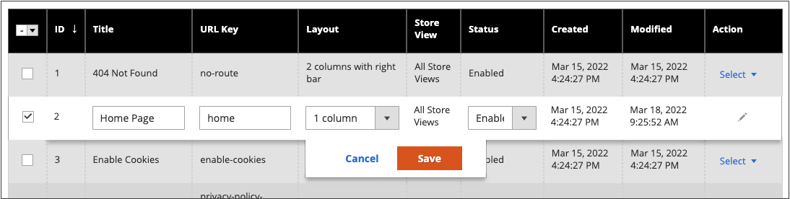
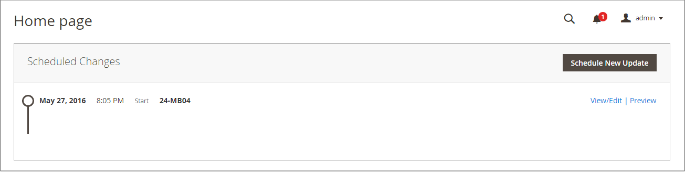

# Besturingselementen voor de werkruimte Pagina

De werkruimte van de pagina bevat gereedschappen waarmee u snel de pagina&#39;s kunt vinden die u nodig hebt, en opdrachten waarmee u routineonderhoud op afzonderlijke of meerdere pagina&#39;s kunt uitvoeren. U kunt pagina-eigenschappen ook snel bijwerken via het raster.

{width="700" zoomable="yes"}

## Pagina-eigenschappen snel bijwerken

1. Op de _Beheerder_ zijbalk, ga naar **[!UICONTROL Content]** > _[!UICONTROL Elements]_>**[!UICONTROL Pages]**.
1. Klik op een rij in het raster.

   {width="600" zoomable="yes"}

   Als u meerdere records wilt selecteren, schakelt u het selectievakje in van elke rij die u wilt bijwerken.

1. Werk een van de volgende eigenschappen bij:

   - **[!UICONTROL Title]**
   - **[!UICONTROL URL Key]**
   - **[!UICONTROL Status]**
   - **[!UICONTROL Layout]**

1. Klik op **[!UICONTROL Save]**.

## Besturingselementen werkruimte

| Besturing | Beschrijving |
|--- |--- |
| [!UICONTROL Add New Page] | Hiermee voegt u een pagina toe. |
| [!UICONTROL Search] | Hiermee wordt een cataloguszoekopdracht gestart op basis van de huidige filters. |
| [!UICONTROL Actions] | Hiermee geeft u alle handelingen weer die op geselecteerde items in de lijst kunnen worden toegepast. Als u een actie wilt toepassen op een pagina of op meerdere pagina&#39;s, schakelt u het selectievakje in de eerste kolom van elke record waarop de actie betrekking heeft. Opties: `Delete` / `Disable` / `Enable` / `Edit` |
| [!UICONTROL Select] | Met het besturingselement in de koptekst van de eerste kolom kunt u meerdere records selecteren als het doel van de handeling. Schakel het selectievakje in de eerste kolom van elke record die u wilt selecteren. Opties: `Select All` / `Deselect All` |
| [!UICONTROL Save Edits] | Past de huidige actie op geselecteerde verslagen toe. |
| [!UICONTROL Edit] | Opent de record in de bewerkingsmodus. U kunt hetzelfde doen door ergens op de rij te klikken. |

{style="table-layout:auto"}

## Kolommen

| Kolom | Beschrijving |
|--- |--- |
| [!UICONTROL Select] | Het selectievakje in de eerste kolom wordt gebruikt om meerdere records te selecteren. Opties: `Select All` / `Deselect All` |
| [!UICONTROL ID] | De id is een oplopend getal dat aan elke pagina wordt toegewezen. |
| [!UICONTROL Title] | De titel die boven aan de pagina wordt weergegeven. |
| [!UICONTROL URL Key] | De URL-sleutel is vergelijkbaar met een bestandsnaam en geeft de pagina in de URL aan. |
| [!UICONTROL Layout] | Hiermee bepaalt u of de pagina wordt weergegeven met zijbalken rechts of links van het hoofdinhoudsgebied. Opties: `1 column` / `2 columns with left bar` / `2 columns with right bar` / `3 columns` / `Empty` |
| [!UICONTROL Store View] | Wordt gebruikt om de pagina te koppelen aan een specifieke winkelweergave. |
| [!UICONTROL Status] | Geeft aan of de pagina online of offline is. Opties: `Enabled` / `Disabled` |
| [!UICONTROL Created] | De datum waarop de pagina is gemaakt. |
| [!UICONTROL Modified] | De datum waarop de pagina voor het laatst is gewijzigd. |
| [!UICONTROL Action] | De acties die op een individueel verslag kunnen worden toegepast omvatten: **[!UICONTROL Edit]**- Opent de pagina in de bewerkingsmodus. **[!UICONTROL Delete]** - Hiermee verwijdert u de pagina. **[!UICONTROL View]**- De pagina wordt weergegeven in de voorvertoningsmodus. |

{style="table-layout:auto"}

## Andere kolommen

| Kolom | Beschrijving |
|--- |--- |
| [!UICONTROL Custom design from/to] | Hiermee geeft u de begin- en einddatum op waarop het geselecteerde ontwerp wordt toegepast op de pagina.  (alleen Magento Open Source). |
| [!UICONTROL Custom Theme] | Hiermee past u een aangepast thema toe op de pagina |
| [!UICONTROL Custom Layout] | Bepaalt de aangepaste indeling van de pagina |
| [!UICONTROL Meta Title] | Meta-titel voor de pagina |
| [!UICONTROL Meta Keywords] | De metatrefwoorden voor de pagina |
| [!UICONTROL Meta Description] | De metabeschrijving van de pagina |

{style="table-layout:auto"}

## Pagina zoeken

Het vak Zoeken linksboven in het dialoogvenster _[!UICONTROL Pages]_U kunt een raster gebruiken om specifieke pagina&#39;s op trefwoord te zoeken. Voor een geavanceerdere zoekopdracht kunt u [filter](../getting-started/admin-grid-controls.md) de zoekopdracht met meerdere parameters.

### Zoeken op trefwoord

1. Voer een zoekterm in het zoekvak van de pagina in.

1. Klik op de knop Zoeken ().

   De resultaten omvatten alle pagina&#39;s die het sleutelwoord bevatten.

### De zoekresultaten filteren

1. Klik indien nodig op **[!UICONTROL Clear All]** om de vorige zoekcriteria te wissen.

1. Als u de selectie van zoekfilters wilt weergeven, klikt u op de knop **[!UICONTROL Filters]** !([Trechter](../assets/icon-filter-search.png)).

1. Voer zoveel filters in als nodig zijn om de pagina&#39;s te beschrijven die u wilt zoeken.

1. Klikken **[!UICONTROL Apply Filters]** om de resultaten weer te geven.

### Zoekfilters

| Filter | Beschrijving |
|--- |--- |
| [!UICONTROL ID] | Filter de zoekopdracht op pagina-record-id. |
| [!UICONTROL Title] | Filter de zoekopdracht op basis van de paginatitel. |
| [!UICONTROL URL Key] | Filter de zoekopdracht op URL-sleutel. |
| [!UICONTROL Created] | Filter de zoekopdracht op de datum waarop de pagina is gemaakt. |
| [!UICONTROL Modified] | Filter de zoekopdracht op basis van de datum waarop de pagina voor het laatst is gewijzigd. |
| [!UICONTROL Store View] | Filter de zoekopdracht op basis van de winkelweergave. Opties: `All available` / `Store Views` |
| [!UICONTROL Layout] | Filter de zoekopdracht op basis van de paginalay-out. Opties: `1 column` / `2 columns with left bar` / `2 columns with right bar` / `3 columns` / `Empty` |
| [!UICONTROL Status] | Filter de zoekopdracht op de paginatiestatus. Opties: `Disabled` / `Published` |
| [!UICONTROL Custom design from / to] | Filter de zoekopdracht op de begin- en einddatum waarop het geselecteerde ontwerp op de pagina wordt toegepast.  (alleen Magento Open Source). |
| [!UICONTROL Asset] | De zoekopdracht filteren op de elementen van de paginatitel |
| [!UICONTROL Custom Layout] | Filter de zoekopdracht op basis van een aangepaste indeling. Opties: `1 column` / `2 columns with left bar` / `2 columns with right bar` / `3 columns` / `Empty` / `Page -- Full Width` / `Category -- Full Width` / `Product -- Full Width` |
| [!UICONTROL Custom Theme] | Filter de zoekopdracht op basis van een aangepast thema. Standaardopties: `Magento Blank` / `Magento Luma` |
| [!UICONTROL Meta Keywords] | Filter de zoekopdracht op basis van de metatrefwoorden voor de pagina. |
| [!UICONTROL Meta Title] | Filter de zoekopdracht op basis van de metatitel voor de pagina. |
| [!UICONTROL Meta Description] | Filter de zoekopdracht op basis van de metabeschrijving voor de pagina. |

{style="table-layout:auto"}

### Zoeken in gereedschappen

| Gereedschap | Beschrijving |
|--- |--- |
| [!UICONTROL Apply Filters] | Hiermee past u alle filters toe op de zoekresultaten. |
| [!UICONTROL Cancel] | Annuleert de huidige zoekopdracht. |
| [!UICONTROL Clear All] | Wist alle zoekfilters. |

{style="table-layout:auto"}

## Paginahandelingen

U kunt pagina&#39;s bewerken, uitschakelen, inschakelen en verwijderen. Als u een actie op een afzonderlijke pagina wilt toepassen, schakelt u het selectievakje in de eerste kolom in. Als u alle pagina&#39;s wilt selecteren of deselecteren, gebruikt u het selectiekader boven aan de kolom.

{width="400" zoomable="yes"}

### Eén actie

Gebruik de _[!UICONTROL Action]_kolom helemaal rechts om een van de volgende handelingen toe te passen op de afzonderlijke pagina:

- [!UICONTROL Edit] - opent de pagina in de bewerkingsmodus
- [!UICONTROL Delete] - verwijdert de pagina (moet worden bevestigd)
- [!UICONTROL View] - Hiermee wordt een pagina rechtstreeks in de winkel geopend

{width="600" zoomable="yes"}

### Handelingen Massa

Pas een van de volgende handelingen op meerdere geselecteerde pagina&#39;s tegelijk toe met de opdracht _[!UICONTROL Action]_kiezer in de linkerbovenhoek:

- [!UICONTROL Delete] - verwijdert de pagina&#39;s (moet worden bevestigd)
- [!UICONTROL Disable] - schakelt de pagina&#39;s op de winkelvoorgrond uit
- [!UICONTROL Enable] - schakelt de pagina&#39;s op de winkel in
- [!UICONTROL Edit] - Hiermee worden kolommen in de bewerkingsmodus op het raster geopend (**[!UICONTROL Title]**, **[!UICONTROL URL Key]**, **[!UICONTROL Layout]**, en **[!UICONTROL Status]**)

## Layout paginalaster

De selectie van kolommen en hun volgorde in het raster kunnen naar wens worden gewijzigd. Als u de nieuwe kolomopstelling wilt behouden, kunt u deze opslaan als een weergave.

### De selectie van kolommen wijzigen

Klik in de rechterbovenhoek op de knop _Kolommen_ () en voer de volgende handelingen uit:

- Schakel het selectievakje in van de kolommen die u aan het raster wilt toevoegen.

- Schakel het selectievakje uit van elke kolom die u uit het raster wilt verwijderen.

### Een kolom verplaatsen

1. Klik op de kolomkop en houd de muisknop ingedrukt.

1. Sleep de kolom naar de nieuwe positie en laat deze los.

### Een weergave opslaan

1. Klik op de knop _Weergave_ () en klik vervolgens op **[!UICONTROL Save View As]**.

1. Voer een naam in voor de weergave.

1. Als u de weergave wilt opslaan, klikt u op de knop _Pijl_ ().

   De naam van de weergave wordt nu weergegeven als de huidige weergave.

### De weergave wijzigen

Klik op de knop _Weergave_ () en voer een van de volgende handelingen uit:

- Kies de weergave die u wilt gebruiken.

- Wijzig de naam van een weergave door op Bewerken te klikken () en wordt de naam bijgewerkt.

  {width="600" zoomable="yes"}

## Geplande wijzigingen

{{ee-feature}}

Paginawijzigingen kunnen volgens schema worden toegepast en worden gegroepeerd met andere inhoudswijzigingen. U kunt een campagne maken op basis van geplande wijzigingen op een pagina of de wijzigingen toepassen op een bestaande campagne. Zie voor meer informatie [Inhoud stapelen](content-staging.md).

>[!NOTE]
>
>De [!UICONTROL Custom Design Update] tab is verwijderd in  Adobe Commerce en kan niet rechtstreeks op de pagina worden gewijzigd. U moet een geplande update maken voor deze activeringen.

>[!NOTE]
>
>Alle geplande updates worden achtereenvolgens toegepast, wat betekent dat elke entiteit slechts één geplande update op één punt kan hebben. Elke geplande update wordt toegepast op alle winkelweergaven binnen de opgegeven tijdsperiode. Dientengevolge, kan een entiteit geen verschillende geplande update voor verschillende opslagmeningen tezelfdertijd hebben. Alle waarden van entiteitattributen binnen alle opslagmeningen, die niet door de huidige geplande update worden beïnvloed, worden genomen van de standaardwaarden, en niet van de vorige geplande update.

{width="600" zoomable="yes"}

>[!NOTE]
>
>Begindatum en Einddatum van campagne moeten worden gedefinieerd met de instelling **_default_** Tijdzone voor beheerders, die wordt omgezet vanuit de lokale tijdzone van elke website. Bekijk een voorbeeld van meerdere websites in verschillende tijdzones, maar u wilt een campagne starten op basis van een Amerikaanse tijdzone. In dit geval moet u een afzonderlijke update voor elke lokale tijdzone plannen, en reeks **[!UICONTROL Start Date]** en **[!UICONTROL End Date]** in omgezet van elke lokale tijdzone van de websitetijd in de standaardtijdzone van Admin.

Ook kunt u wijzigingen voor productupdates plannen en voorvertonen. Zie voor meer informatie [Een update plannen](content-staging-scheduled-update.md).
