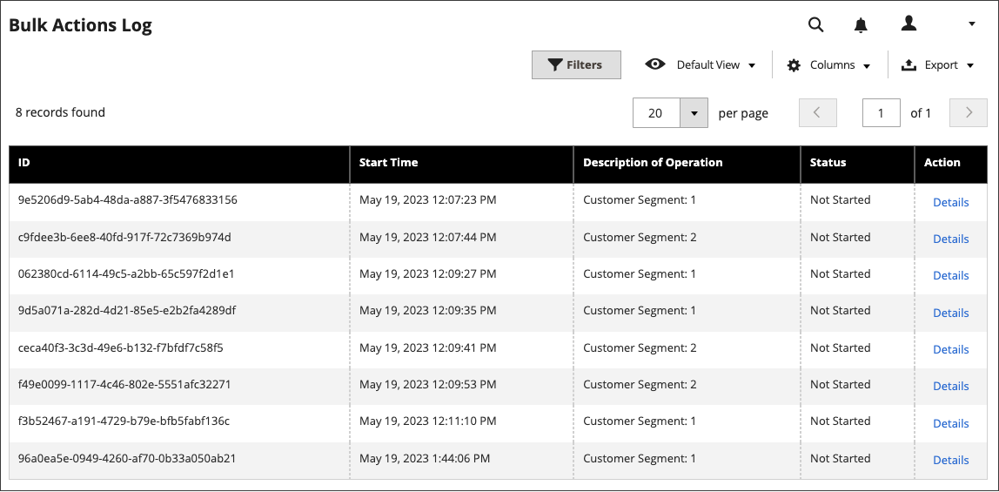

# Ontwerpwijzigingen plannen

Plan uw wijzigingen in het themaontwerp vooraf, zodat deze van kracht worden volgens uw bedrijfscycli en gebeurtenissen. U kunt geplande ontwerpwijzigingen gebruiken voor seizoenswijzigingen, promoties of alleen om variatie toe te voegen.

{width="700" zoomable="yes"}

## Een geplande ontwerpwijziging toevoegen

1. Voor _Admin_ sidebar, ga **[!UICONTROL Content]** > _[!UICONTROL Design]_>**[!UICONTROL Schedule]**.

1. Klik op **[!UICONTROL Add Design Change]**.

   {width="600" zoomable="yes"}

1. Stel **[!UICONTROL Store]** in op de winkelweergave waar u de wijzigingen wilt toepassen.

1. Stel **[!UICONTROL Custom Design]** in op het thema of de variatie van een te gebruiken thema.

1. Voor **[!UICONTROL Date From]** en **[!UICONTROL Date To]**, klik het _pictogram van de Kalender_ () om de begin en eindwaarden voor de periode te kiezen wanneer de verandering in feite is.

1. Klik op **[!UICONTROL Save]** als de bewerking is voltooid.

## Geplande ontwerpwijziging bewerken

1. Voor _Admin_ sidebar, ga **[!UICONTROL Content]** > _[!UICONTROL Design]_>**[!UICONTROL Schedule]**.

1. Selecteer het item dat u wilt bewerken.

1. Breng de gewenste wijzigingen aan.

1. Klik op **[!UICONTROL Save]** als de bewerking is voltooid.

## Geplande ontwerpwijziging verwijderen

1. Voor _Admin_ sidebar, ga **[!UICONTROL Content]** > _[!UICONTROL Design]_>**[!UICONTROL Schedule]**.

1. Selecteer het item dat u wilt verwijderen.

1. Klik op **[!UICONTROL Delete]** in de knopbalk boven aan de pagina.

1. Klik op **[!UICONTROL OK]** om de handeling te bevestigen.
