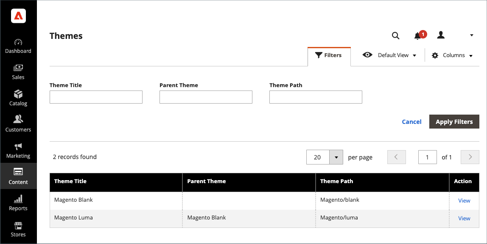
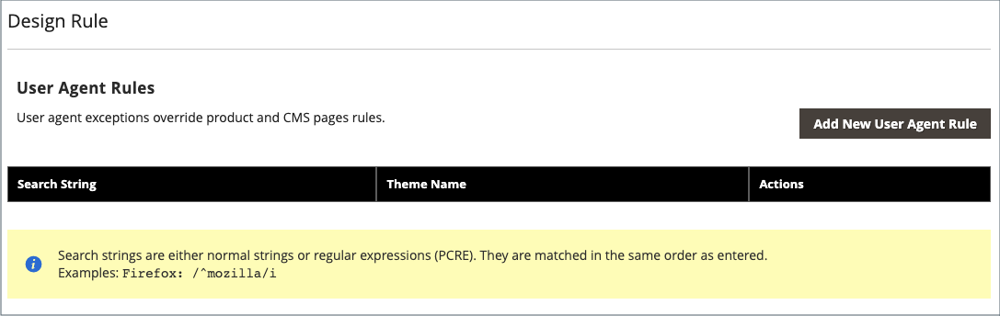

# Thema&#39;s

Een thema is een verzameling bestanden die de visuele presentatie van uw winkel bepaalt. Wanneer u voor het eerst installeert [!DNL Commerce], zijn de ontwerpelementen van de winkel gebaseerd op de _Standaard_ thema. Naast het oorspronkelijke standaardthema dat bij uw [!DNL Commerce] installatie, er zijn een grote verscheidenheid van beschikbare thema&#39;s die u kunt gebruiken _ongewijzigd_ of aanpassen aan uw wensen.

Met een responsief thema past u de paginalay-out aan de weergavepoort van het apparaat aan. Het voorbeeld _Luminantie_ thema heeft een flexibele, responsieve indeling die kan worden weergegeven op het bureaublad, het tablet of het mobiele apparaat.

[!DNL Commerce] tot de thema &#39; s behoren indelingsbestanden , sjabloonbestanden , vertaalbestanden en skins . Een skin is een verzameling ondersteunende CSS-, afbeeldings- en JavaScript-bestanden die samen de visuele presentatie en interacties maken die uw klanten ervaren wanneer ze uw winkel bezoeken. Thema&#39;s en skins kunnen worden gewijzigd en aangepast door een ontwikkelaar of ontwerper die het ontwerp van het thema Handel begrijpt en toegang heeft tot uw server. Zie voor meer informatie de [_Frontend Developer Guide_](https://developer.adobe.com/commerce/frontend-core/guide/themes/).

{width="600" zoomable="yes"}

## Het standaardthema

De `Magento Blank` met responsief thema wordt de display van uw winkel voor verschillende apparaten weergegeven en worden de beste werkwijzen voor computers, tabellen en mobiele apparaten geïntegreerd. Sommige thema&#39;s zijn alleen ontworpen voor gebruik met specifieke apparaten. Wanneer [!DNL Commerce] detecteert een specifieke browser-id, of gebruikersagent, die het thema gebruikt dat voor de specifieke browser is geconfigureerd. De zoektekenreeks kan ook PCRE (Perl-Compatible Regular Expressions) bevatten.

{width="700" zoomable="yes"}

### Het themaraster filteren

1. Op de _Beheerder_ zijbalk, ga naar **[!UICONTROL Content]** > _[!UICONTROL Design]_>**[!UICONTROL Themes]**.

1. Klik op **[!UICONTROL Filters]**.

1. Voer een ID-bereik, themanaam (of titel), mappad of bovenliggend thema in.

1. Klikken **[!UICONTROL Apply Filters]** om de lijst met thema&#39;s bij te werken.

## Huidige thema-instellingen weergeven

1. Op de _Beheerder_ zijbalk, ga naar **[!UICONTROL Content]** > _[!UICONTROL Design]_>**[!UICONTROL Themes]**.

1. Zoek in de lijst met geïnstalleerde thema&#39;s het thema dat u wilt onderzoeken en klik op de rij om de instellingen weer te geven.

1. Als u een voorbeeldpagina wilt weergeven, klikt u op de knop **[!UICONTROL Theme Preview Image]**.

{width="600" zoomable="yes"}

## Een standaardthema toepassen

1. Op de _Beheerder_ zijbalk, ga naar **[!UICONTROL Content]** > _[!UICONTROL Design]_>**[!UICONTROL Configuration]**.

1. Zoek de archiefmening die u wilt vormen en klikken **[!UICONTROL Edit]** in de _[!UICONTROL Action]_kolom.

1. Onder _[!UICONTROL Default Theme]_, set **[!UICONTROL Applied Theme]**aan die u voor de huidige mening wilt gebruiken.

   {width="600" zoomable="yes"}

1. Klik op **[!UICONTROL Save Configuration]**.

## Een gebruikersagentregel toevoegen

1. Op de _Beheerder_ zijbalk, ga naar **[!UICONTROL Content]** > _[!UICONTROL Design]_>**[!UICONTROL Configuration]**.

1. Onder _[!UICONTROL Design Rule]_, klikt u op **[!UICONTROL Add New User Agent Rule]**.

   {width="600" zoomable="yes"}

1. Voor **[!UICONTROL Search String]**, voert u de browser-id voor het specifieke apparaat in.

   Zoektekenreeksen komen overeen in de volgorde waarin ze worden ingevoerd. Voer bijvoorbeeld voor Firefox het volgende in:

   `/^mozilla/i`

1. Herhaal het proces om extra apparaten in te voeren.

1. Klik op **[!UICONTROL Save Configuration]**.
