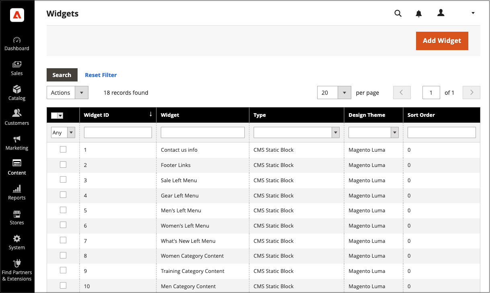

# Widgets maken en beheren

Widgets zijn herbruikbare componenten. U kunt eenvoudig widgets maken en bestaande widgets wijzigen om inhoud in uw winkel automatisch bij te werken. U kunt ook widgets verwijderen die niet meer in gebruik zijn.

{width="700" zoomable="yes"}

## Een widget maken

Het proces om een widget tot stand te brengen is bijna het zelfde voor elk [ widgettype ](widgets.md#widget-types). U kunt het eerste deel van de instructies volgen en vervolgens het laatste deel voor het specifieke type widget voltooien.

### Stap 1: Kies het type

1. Voor _Admin_ sidebar, ga **[!UICONTROL Content]** > _[!UICONTROL Elements]_>**[!UICONTROL Widgets]**.

1. Klik op **[!UICONTROL Add Widget]**.

1. In de sectie _[!UICONTROL Settings]_:

   - Stel **[!UICONTROL Type]** in op het widgettype dat u wilt maken.

   - Controleer of **[!UICONTROL Design Theme]** is ingesteld op het huidige thema.

     {width="600" zoomable="yes"}

1. Klik op **[!UICONTROL Continue]**.

### Stap 2: Eigenschappen en lay-out van storefront opgeven

1. In de sectie _[!UICONTROL Storefront Properties]_:

   - Voer bij **[!UICONTROL Widget Title]** een beschrijvende titel in voor de widget.

     Deze titel is alleen zichtbaar vanuit de beheerder.

   - Selecteer voor **[!UICONTROL Assign to Store Views]** de winkelweergaven waarin u de widget zichtbaar wilt maken.

     U kunt een specifieke opslagweergave selecteren, of `All Store Views` . Als u meerdere weergaven wilt selecteren, houdt u Ctrl (PC) of Command (Mac) ingedrukt en klikt u op elke optie.

   - (Optioneel) Voer bij **[!UICONTROL Sort Order]** een getal in om te bepalen in welke volgorde dit item bij anderen in hetzelfde gedeelte van de pagina wordt weergegeven. (`0` = first, `1` = second, `3` = third, enzovoort.)

     {width="600" zoomable="yes"}

1. Klik in de sectie _[!UICONTROL Layout Updates]_&#x200B;op **[!UICONTROL Add Layout Update]**.

1. Stel **[!UICONTROL Display On]** in op het paginatype waar het moet worden weergegeven.

1. Kies in de lijst **[!UICONTROL Container]** het gebied van de paginalay-out waar u de pagina wilt plaatsen.

   {width="600" zoomable="yes"}

1. Als de widget een koppeling is, stelt u **[!UICONTROL Template]** in op een van de volgende opties:

   - `Block Template` - Maakt de inhoud op, zodat deze als zelfstandige eenheid op de pagina kan worden geplaatst.
   - `Inline Template` - Maakt de inhoud zodanig op dat deze binnen andere inhoud kan worden geplaatst. Bijvoorbeeld een koppeling die zich in een alinea met tekst bevindt.

### Stap 3: Voltooi de widgetopties

De opties voor elk widgettype variëren enigszins, maar het proces is in wezen hetzelfde. In het volgende voorbeeld wordt de productlijst voor een specifieke categorie weergegeven, met pagineringsbesturingselementen.

1. Kies **[!UICONTROL Widget Options]** in het linkerdeelvenster.

1. Klik op **[!UICONTROL Select Block]**.

1. Voer een **[!UICONTROL Title]** in die boven de lijst wordt weergegeven, bijvoorbeeld `Featured Products` .

1. Stel voor pagineringsbesturingselementen **[!UICONTROL Display Page Control]** in op `Yes` en voer de volgende handelingen uit:

   - Voer de **[!UICONTROL Number of Products per Page]** in.

   - Voer het totaal **[!UICONTROL Number of Products to Display]** in.

   - Stel **[!UICONTROL Condition]** in op de productcategorie die u wilt weergeven.

     Het proces is het zelfde als het plaatsen van een voorwaarde voor a [ prijsregel ](../merchandising-promotions/price-rules-catalog.md).

### Stap 4: Het resultaat opslaan en controleren

1. Klik op **[!UICONTROL Save]** als de bewerking is voltooid.

1. Volg desgevraagd de instructies boven aan de werkruimte om de cache zo nodig bij te werken.

1. Ga terug naar uw winkel om te controleren of de widget correct werkt.

   Als u de widget naar een andere locatie wilt verplaatsen, kunt u de widget opnieuw openen en een andere pagina of blokverwijzing proberen.

## Demo voor maken van widget

Bekijk deze video voor meer informatie over het maken van widgets:

>[!VIDEO](https://video.tv.adobe.com/v/343786?quality=12&learn=on)

## Een widget bewerken

1. Voor _Admin_ sidebar, ga **[!UICONTROL Content]** > _[!UICONTROL Elements]_>**[!UICONTROL Widgets]**.

1. Zoek de widget met behulp van de filters boven het raster en klik op de naam van de widget.

1. Breng de gewenste wijzigingen aan.

   Controleer de stappen voor het maken van een widget voor informatie over de widgetopties.

1. Klik op **[!UICONTROL Save]** .

## Een widget verwijderen

1. Voor _Admin_ sidebar, ga **[!UICONTROL Content]** > _[!UICONTROL Elements]_>**[!UICONTROL Widgets]**.

1. Zoek de widgets met behulp van de filters boven het raster en schakel vervolgens het selectievakje in van de widgets die u wilt verwijderen.

1. Stel **[!UICONTROL Actions]** in op `Delete` in de linkerbovenhoek van de lijst.

1. Klik op **[!UICONTROL Submit]** als de bewerking is voltooid.

1. Klik op **[!UICONTROL OK]** om de handeling te bevestigen.
