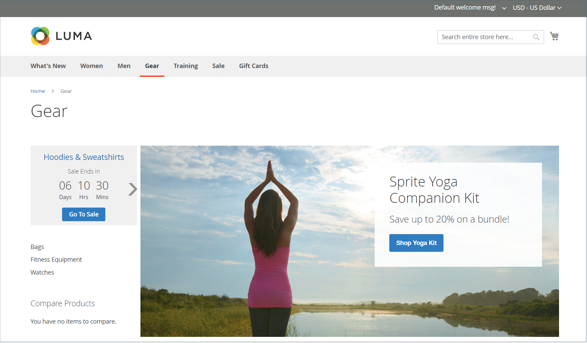
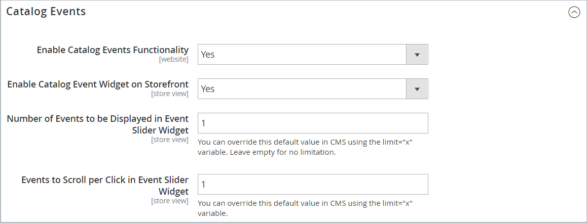

# Carrouselwidget voor catalogusgebeurtenissen

{{ee-feature}}

Een carrouselwidget voor catalogusgebeurtenissen geeft een schuifregelaar van aanstaande gebeurtenissen weer met een aftellerteken voor elke gebeurtenis. U kunt de pagina&#39;s en het gebied van de paginalay-out kiezen waar u de carrousel wilt verschijnen, en de breedte en het aantal gebeurtenissen bepalen die in één keer verschijnen. Het resultaat dat u krijgt, is afhankelijk van uw thema, waar het wordt geplaatst om op de pagina te verschijnen, en de opties die u kiest.

{width="700" zoomable="yes"}

## Stap 1: De carrouselwidget voor de catalogus inschakelen

Volg voordat u begint de [instructies](../merchandising-promotions/event-configure.md) om het _Catalogusgebeurtenis_ -widget zodat deze is ingeschakeld voor de winkel.

{width="500" zoomable="yes"}

## Stap 2: De widget maken

1. Op de _Beheerder_ zijbalk, ga naar **[!UICONTROL Content]** > _[!UICONTROL Elements]_>**[!UICONTROL Widgets]**.

1. Klik in de rechterbovenhoek op **[!UICONTROL Add Widget]**.

1. In de _[!UICONTROL Settings]_Ga als volgt te werk:

   - Set **[!UICONTROL Type]** tot `Catalog Events Carousel`.

   - Kies de optie **[!UICONTROL Design Theme]** die door de winkel wordt gebruikt.

1. Klik op **[!UICONTROL Continue]**.

   {width="500" zoomable="yes"}

1. In de _[!UICONTROL Storefront Properties]_Ga als volgt te werk:

   - Voor **[!UICONTROL Widget Title]**, voert u een beschrijvende titel in voor de widget.

     Deze titel is alleen zichtbaar vanaf het tabblad _Beheerder_.

   - Voor **[!UICONTROL Assign to Store Views]** selecteert u de winkelweergaven waarin u de widget zichtbaar wilt maken.

     U kunt een specifieke winkelweergave selecteren, of `All Store Views`. Als u meerdere weergaven wilt selecteren, houdt u Ctrl (PC) of Command (Mac) ingedrukt en klikt u op elke optie.

   - (Optioneel) Voor **[!UICONTROL Sort Order]** Voer een getal in om de volgorde te bepalen waarin dit item wordt weergegeven met andere items op hetzelfde deel van de pagina. (`0` = eerst, `1` = seconde, `3` = derde, enzovoort.)

     {width="600" zoomable="yes"}

## Stap 3: Kies de locatie

1. In de _Layout-updates_ sectie, klikken **[!UICONTROL Add Layout Update]**.

1. Set **[!UICONTROL Display On]** tot `Specified Page`.

1. Set **[!UICONTROL Page]** tot `CMS Home Page`.

1. Set **[!UICONTROL Container]** een van de volgende handelingen:

   - `Main Content Area`
   - `Sidebar Additional`
   - `Sidebar Main`

   >[!NOTE]
   >
   >De resultaten zijn afhankelijk van het thema en de pagina-indeling. U moet ook de _[!UICONTROL Catalog Events Carousel Default Template]_in de categorieconfiguratie.

1. Als u de gebeurtenissen carrousel op een andere plaats in de storefront wilt verschijnen, klik **[!UICONTROL Add Layout Update]** en herhaal deze stappen voor die locatie.

   {width="600" zoomable="yes"}

1. Klik op **[!UICONTROL Save and Continue Edit]**.

   Momenteel kunt u het bericht negeren om de cache te vernieuwen.

## Stap 4: Configureer de opties

1. Kies in het linkerdeelvenster de optie **[!UICONTROL Widget Options]**.

1. Voor **[!UICONTROL Frame Size]** Voer in de schuifregelaar het aantal gebeurtenissen in dat u tegelijkertijd wilt weergeven.

   Als u slechts één gebeurtenis tegelijk wilt weergeven, voert u `1`.

1. Voor **[!UICONTROL Scroll]**, voert u het aantal gebeurtenislijsten in dat u per klik wilt schuiven.

   Als u naar de volgende gebeurtenis wilt schuiven, voert u `1`.

1. Voer voor een aangepaste breedte het aantal pixels in voor **[!UICONTROL Block Custom Width]**.

   Op de volgende voorbeeldpagina is de aangepaste breedte ingesteld op 250 pixels.

   {width="400" zoomable="yes"}

1. Klik op **[!UICONTROL Save]**.

1. Wanneer ertoe aangezet om het geheime voorgeheugen te verfrissen, klik de verbinding in het bericht bij de bovenkant van de pagina en volg de instructies.
