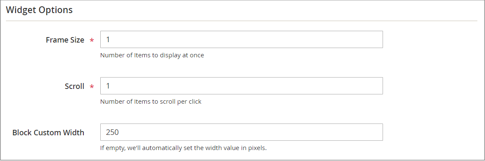

# Carrouselwidget voor catalogusgebeurtenissen

{{ee-feature}}

Een carrouselwidget voor catalogusgebeurtenissen geeft een schuifregelaar van aanstaande gebeurtenissen weer met een aftellerteken voor elke gebeurtenis. U kunt de pagina&#39;s en het gebied van de paginalay-out kiezen waar u de carrousel wilt verschijnen, en de breedte en het aantal gebeurtenissen bepalen die in één keer verschijnen. Het resultaat dat u krijgt, is afhankelijk van uw thema, waar het wordt geplaatst om op de pagina te verschijnen, en de opties die u kiest.

{width="700" zoomable="yes"}

## Stap 1: De carrouselwidget voor de catalogus inschakelen

Alvorens u begint, volg de [ instructies ](../merchandising-promotions/event-configure.md) om de _3&rbrace; widget van de Gebeurtenis van de Catalogus te vormen &lbrace;zodat het voor de storefront wordt toegelaten._

{width="500" zoomable="yes"}

## Stap 2: De widget maken

1. Voor _Admin_ sidebar, ga **[!UICONTROL Content]** > _[!UICONTROL Elements]_>**[!UICONTROL Widgets]**.

1. Klik in de rechterbovenhoek op **[!UICONTROL Add Widget]** .

1. Ga als volgt te werk in de sectie _[!UICONTROL Settings]_:

   - Stel **[!UICONTROL Type]** in op `Catalog Events Carousel` .

   - Kies de **[!UICONTROL Design Theme]** die door de winkel wordt gebruikt.

1. Klik op **[!UICONTROL Continue]**.

   {width="500" zoomable="yes"}

1. Ga als volgt te werk in de sectie _[!UICONTROL Storefront Properties]_:

   - Voer bij **[!UICONTROL Widget Title]** een beschrijvende titel in voor de widget.

     Deze titel is zichtbaar slechts van _Admin_.

   - Selecteer voor **[!UICONTROL Assign to Store Views]** de winkelweergaven waarin u de widget zichtbaar wilt maken.

     U kunt een specifieke opslagweergave selecteren, of `All Store Views` . Als u meerdere weergaven wilt selecteren, houdt u Ctrl (PC) of Command (Mac) ingedrukt en klikt u op elke optie.

   - (Optioneel) Voer bij **[!UICONTROL Sort Order]** een getal in om te bepalen in welke volgorde dit item bij anderen in hetzelfde gedeelte van de pagina wordt weergegeven. (`0` = first, `1` = second, `3` = third, enzovoort.)

     {width="600" zoomable="yes"}

## Stap 3: Kies de locatie

1. In de _sectie van de Updates van de Lay-out_, klik **[!UICONTROL Add Layout Update]**.

1. Stel **[!UICONTROL Display On]** in op `Specified Page` .

1. Stel **[!UICONTROL Page]** in op `CMS Home Page` .

1. Stel **[!UICONTROL Container]** een van de volgende opties in:

   - `Main Content Area`
   - `Sidebar Additional`
   - `Sidebar Main`

   >[!NOTE]
   >
   >De resultaten zijn afhankelijk van het thema en de pagina-indeling. U moet ook de _[!UICONTROL Catalog Events Carousel Default Template]_&#x200B;opgeven in de categorieconfiguratie.

1. Als u wilt dat de gebeurteniscarrousel op een andere locatie in de winkel wordt weergegeven, klikt u op **[!UICONTROL Add Layout Update]** en herhaalt u deze stappen voor die locatie.

   {width="600" zoomable="yes"}

1. Klik op **[!UICONTROL Save and Continue Edit]**.

   Momenteel kunt u het bericht negeren om de cache te vernieuwen.

## Stap 4: Configureer de opties

1. Kies **[!UICONTROL Widget Options]** in het linkerdeelvenster.

1. Voer bij **[!UICONTROL Frame Size]** het aantal gebeurtenissen in dat u tegelijkertijd in de schuifregelaar wilt weergeven.

   Voer `1` in als u slechts één gebeurtenis tegelijk wilt weergeven.

1. Voer bij **[!UICONTROL Scroll]** het aantal gebeurtenislijsten in dat u per klik wilt schuiven.

   Voer `1` in om naar de volgende gebeurtenis te schuiven.

1. Voer voor een aangepaste breedte het aantal pixels in voor **[!UICONTROL Block Custom Width]** .

   Op de volgende voorbeeldpagina is de aangepaste breedte ingesteld op 250 pixels.

   {width="400" zoomable="yes"}

1. Klik op **[!UICONTROL Save]** als de bewerking is voltooid.

1. Wanneer ertoe aangezet om het geheime voorgeheugen te verfrissen, klik de verbinding in het bericht bij de bovenkant van de pagina en volg de instructies.
