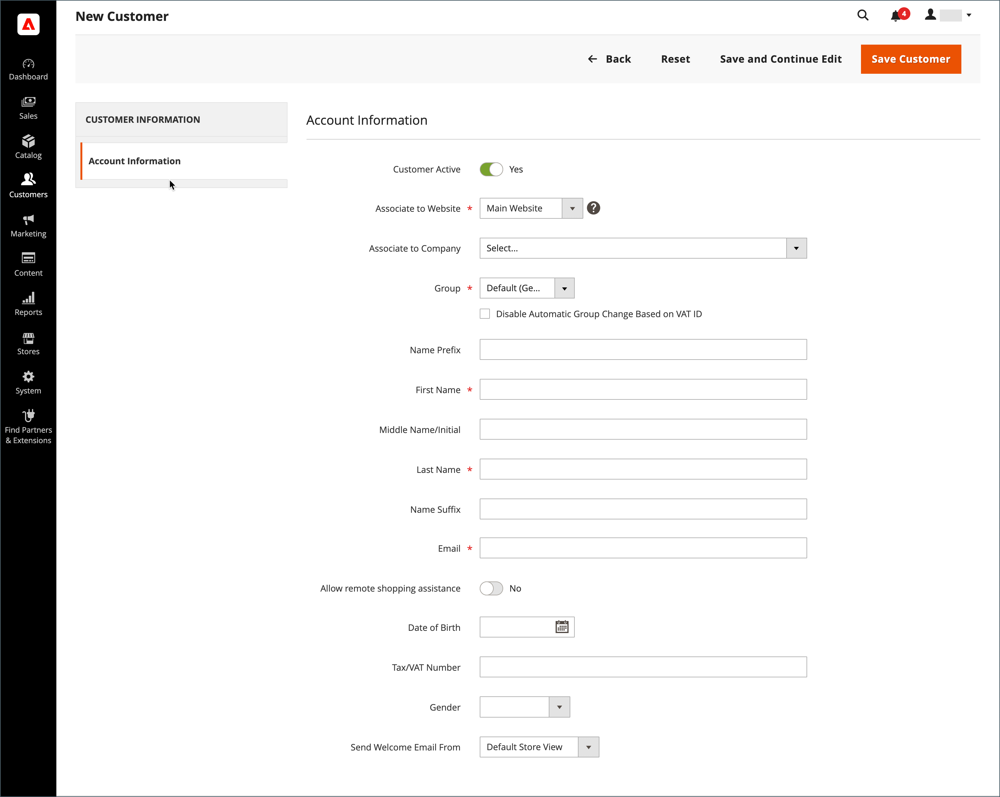
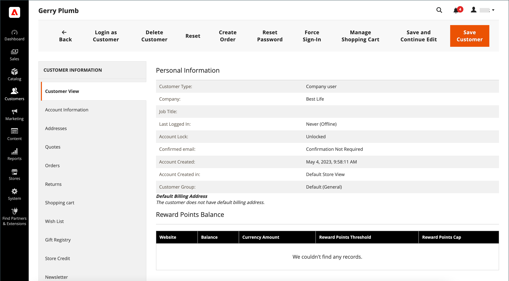
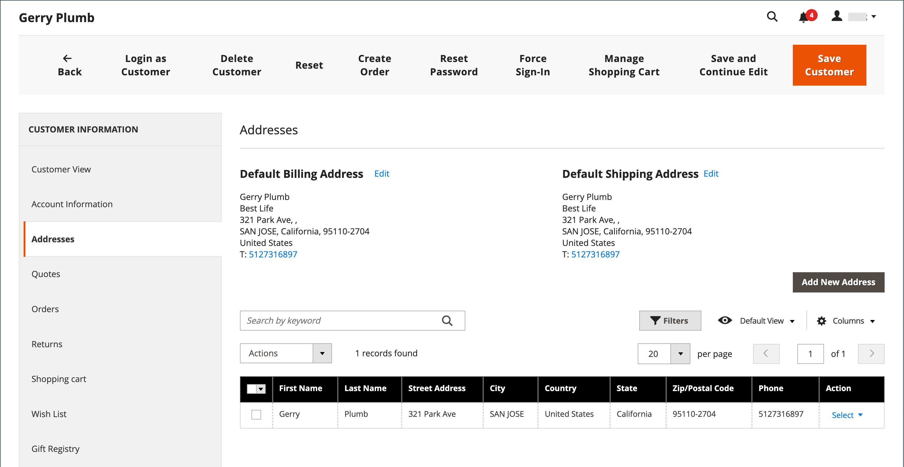

# Een individuele klantaccount maken

Bezoekers in je winkel kunnen een account openen om hun aankopen en activiteiten te beheren. Klanten maken gewoonlijk hun eigen accounts in uw winkel. U kunt echter ook direct vanuit de beheerfunctie klantenaccounts maken. Dit is handig om klanten via de telefoon te helpen.

De volgende instructies vertegenwoordigen de standaardconfiguratie van de klantenrekening. Als u de selectie en het gedrag van sommige velden in het formulier wilt wijzigen, raadpleegt u [Klantenaccounts configureren](../customers/customer-account-scope.md).

Als opslagbeheerder kunt u ook de opdracht [nieuwe accountopties](../customers/account-options-new.md) om een bevestigingsbericht naar nieuwe geregistreerde klanten te verzenden, wat helpt ervoor te zorgen dat geregistreerde accounts geldig zijn.

{{beta-updates}}

## Account maken van de winkel

Een winkelklant maakt een account op de winkel.

1. Klik in de winkel op **[!UICONTROL Create an Account]** in de rechterbovenhoek van de koptekst.

   {width="700" zoomable="yes"}

1. Onder **[!UICONTROL Personal Information]**, worden hun **[!UICONTROL First Name]** en **[!UICONTROL Last Name]**.

   {width="600" zoomable="yes"}

1. Als zij hun naam en e-mailadres aan de lijst met abonnees van nieuwsbrieven willen toevoegen, selecteert de klant de optie **[!UICONTROL Sign Up for Newsletter]** selectievakje.

   >[!INFO]
   >
   > Deze optie wordt ook weergegeven als de winkel geen nieuwsbrief publiceert.

1. Als u supportmedewerkers wilt opslaan in [zien wat ze zien](../customers/login-as-customer.md) en externe hulp te bieden, selecteert de klant de **[!UICONTROL Allow remote shopping assistance]** selectievakje.

1. Onder **[!UICONTROL Sign-in Information]**, worden hun **[!UICONTROL Email]** adres.

   >[!INFO]
   >
   > Dit e-mailadres wordt onderdeel van de aanmeldingsgegevens en kan niet aan een andere klantenaccount worden gekoppeld.

   {width="600" zoomable="yes"}

1. Voert een **[!UICONTROL Password]** die drie van de volgende soorten informatie bevat:

   - Kleine letters
   - Hoofdletters
   - Getallen
   - Speciale tekens

   Nadat ze op **[!UICONTROL Enter]** De sterkte van het wachtwoord wordt geëvalueerd en onder het veld weergegeven. Als het wachtwoord als _Zwak_ en probeer een andere totdat deze is beoordeeld als _Sterk_.

   {width="600" zoomable="yes"}

1. Vervolgens voert de klant het bestand opnieuw in op **[!UICONTROL Confirm Password]**.

1. Klik indien nodig op **[!UICONTROL Show Password]** om het ingevoerde wachtwoord weer te geven.

1. Na voltooiing klikt u op **Een account maken**.

De klant kan dan zijn e-mailadres en wachtwoord gebruiken aan [aanmelden](../customers/customer-sign-in.md) aan hun account en de adresgegevens invullen.

## Een account maken via de beheerder

Als handelaar, kunt u een klantenrekening van Admin tot stand brengen.

1. Op de _Beheerder_ zijbalk, ga naar **[!UICONTROL Customers]** > **[!UICONTROL All Customers]**.

1. Klik op **[!UICONTROL Add New Customer]**.

### Stap 1: De accountgegevens invullen

{width="700" zoomable="yes"}

1. In de **[!UICONTROL Account Information]** Ga als volgt te werk:

   - Voor een installatie met meerdere sites stelt u **[!UICONTROL Associate to Website]** op de website waarop de klantenaccount van toepassing is.
   - Indien van toepassing, de klant toewijzen aan een andere **[!UICONTROL Customer Group]**.
   - Als u [Validatie BTW-ID](../stores-purchase/vat.md) en wil **[!UICONTROL Disable Automatic Group Change Based on VAT ID]** schakelt u het selectievakje in.

1. Vul de vereiste velden in:

   - **[!UICONTROL First Name]**
   - **[!UICONTROL Last Name]**
   - **[!UICONTROL Email]**

1. Vul de optionele velden naar wens in:

   - **[!UICONTROL Name Prefix]**
   - **[!UICONTROL Middle Name/Initial]**
   - **[!UICONTROL Name Suffix]**
   - **[!UICONTROL Date of Birth]**
   - **[!UICONTROL Tax/VAT Number]**
   - **[!UICONTROL Gender]**

   >[!WARNING]
   >
   >In overeenstemming met de huidige beste praktijken op het gebied van beveiliging en privacy, dient u zich bewust te zijn van mogelijke juridische en veiligheidsrisico&#39;s die verbonden zijn aan de opslag van de volledige geboortedatum van de klant (maand, dag, jaar) met andere persoonlijke identificatoren. U wordt aangeraden de opslag van de volledige geboortedatum van de klant te beperken en u aan te raden het geboortejaar van de klant als alternatief te gebruiken.

1. Set **[!UICONTROL Send Welcome Email From]** in de winkelweergave van waaruit de _Welkom_ De e-mail moet worden verzonden.

   >[!INFO]
   >
   > Als de winkel weergaven heeft voor verschillende [talen](../stores-purchase/store-localize.md)Deze instelling bepaalt de taal van het welkomstbericht.

1. Klikken **[!UICONTROL Save and Continue Edit]** boven aan de pagina.

   >[!INFO]
   >
   >Nadat de klantenrekening wordt bewaard, verschijnt de volledige reeks opties in het linkerpaneel en in het menu bij de bovenkant van de pagina. De _[!UICONTROL Customer View]_wordt een overzicht van de account weergegeven.

   {width="600" zoomable="yes"}

### Stap 2: Voltooi de adresinformatie

1. Kies in het linkerdeelvenster de optie **[!UICONTROL Addresses]** en klik op **[!UICONTROL Add New Addresses]**.

1. Als hetzelfde adres wordt gebruikt voor facturering en verzending, schakelt u beide opties in of uit.

   - **[!UICONTROL Default Billing Address]**
   - **[!UICONTROL Default Shipping Address]**

   {width="600" zoomable="yes"}

1. Blader omlaag en vul de vereiste adresvelden in de tweede kolom in.

   - **[!UICONTROL Street Address]**
   - **[!UICONTROL City]**
   - **[!UICONTROL Country]**
   - **[!UICONTROL State/Province]**
   - **[!UICONTROL ZIP/Postal Code]**

1. Voer de **[!UICONTROL Phone Number]** voor dit adres.

1. Voer, indien van toepassing, de **[!UICONTROL VAT Number]** is gekoppeld aan de klant.

1. Als dit het enige adres is dat nodig is voor de account, klikt u op **[!UICONTROL Save]**.

   Anders klikt u op **[!UICONTROL Save and Continue Edit]** en herhaal de vorige stappen om extra adressen toe te voegen.

   Het nieuwe adres wordt weergegeven in het dialoogvenster [!UICONTROL Addresses] pagina met de geselecteerde _[!UICONTROL Default Billing]_en_[!UICONTROL Default Shipping]_ adressen boven de volledige lijst.

   {width="600" zoomable="yes"}

### Stap 3: Het wachtwoord opnieuw instellen

Aan accounts van klanten die zijn gemaakt met de beheerder worden aanvankelijk geen wachtwoorden toegewezen.

1. Zoek het nieuwe klantenaccount in het raster.

1. Klikken **[!UICONTROL Edit]** in de _[!UICONTROL Action]_kolom.

1. Klik in de menubalk boven aan de pagina op **[!UICONTROL Reset Password]**.

1. Deze melding wordt verzonden naar de rekeninghouder, met instructies voor het instellen van het wachtwoord.

## Knopbalk

Aanvullende knoppen worden beschikbaar wanneer het profiel voor de eerste keer wordt opgeslagen. Zie voor meer informatie [Een klantprofiel bijwerken](../customers/update-account.md).

| Knop | Beschrijving |
|--- |--- |
| **[!UICONTROL Back]** | Hiermee wordt de _[!UICONTROL Customers]_pagina zonder wijzigingen op te slaan. |
| **[!UICONTROL Delete Customer]** | Verwijdert de huidige klant. Voltooide bestellingen die aan de klant zijn gekoppeld, worden niet verwijderd. |
| **[!UICONTROL Reset]** | Hiermee herstelt u eventuele niet-opgeslagen wijzigingen in het klantformulier naar de vorige waarden. |
| **[!UICONTROL Create Order]** | Maakt een bestelling voor de klant. |
| **[!UICONTROL Reset Password]** | Verstuurt een [wachtwoord opnieuw instellen](../customers/password-reset.md) per e-mail een koppeling naar de klant maken. |
| **[!UICONTROL Force Sign-in]** | Hiermee worden de OAuth-toegangstokens ingetrokken die aan de klantenaccount zijn gekoppeld. Deze functie kan alleen worden gebruikt met klantenaccounts waaraan OAuth-tokens zijn toegewezen als onderdeel van een web-API [integratie](../systems/integrations.md). Zie voor meer informatie [Verificatie op basis van OAuth](https://developer.adobe.com/commerce/webapi/get-started/authentication/gs-authentication-oauth/) in de ontwikkelaarsdocumentatie. |
| **[!UICONTROL Manage Shopping Cart]** | Staat de beheerder toe om het winkelwagentje voor de klant te beheren. |
| **[!UICONTROL Save and Continue Edit]** | Hiermee slaat u wijzigingen op en houdt u het profiel van de klant open. |
| **[!UICONTROL Save Customer]** | Hiermee slaat u wijzigingen op en sluit u het klantprofiel. |

{style="table-layout:auto"}

## Veldomschrijvingen

### [!UICONTROL Account Information]

| Veld | Beschrijving |
|--- |--- |
| **[!UICONTROL Associate to Website]** | Identificeert de website die is gekoppeld aan de klantenaccount. |
| **[!UICONTROL Group]** | Identificeert de [klantengroep](../customers/customer-groups.md) waarbij de klant lid is. Selecteer, indien van toepassing, het selectievakje om automatische groepswijziging op basis van BTW uit te schakelen. |
| **[!UICONTROL Name Prefix]** | Indien gebruikt, het voorvoegsel dat aan de naam van de klant (zoals Mr., Mw., of Dr.) wordt geassocieerd. De voorvoegselwaarden worden bepaald door de [configuratie](../configuration-reference/customers/customer-configuration.md). Afhankelijk van de configuratie, zou de inputcontrole een tekstgebied of een lijst van opties kunnen zijn. |
| **[!UICONTROL First Name]** | De voornaam van de klant. |
| **[!UICONTROL Middle Name / Initial]** | De middelste naam of initiaal van de klant. Dit veld wordt alleen opgenomen als dit is opgegeven in het dialoogvenster [configuratie](../configuration-reference/customers/customer-configuration.md) onderwerp. |
| **[!UICONTROL Last Name]** | De achternaam van de klant. |
| **[!UICONTROL Name Suffix]** | Indien gebruikt, het achtervoegsel dat met de naam van de klant (zoals Jr., Sr., of III) wordt geassocieerd. De achtervoegselwaarden worden bepaald door de [configuratie](../configuration-reference/customers/customer-configuration.md). Afhankelijk van de configuratie kan het invoerbesturingselement een tekstveld of een vervolgkeuzelijst met opties zijn. |
| **[!UICONTROL Email]** | Het e-mailadres van de klant |
| **[!UICONTROL Date of Birth]** | De geboortedatum van de klant. De geboortedatum wordt vermeld indien gespecificeerd in de [configuratie](../configuration-reference/customers/customer-configuration.md) onderwerp.   In overeenstemming met de huidige beste praktijken op het gebied van beveiliging en privacy, dient u zich bewust te zijn van mogelijke juridische en veiligheidsrisico&#39;s die verbonden zijn aan de opslag van de volledige geboortedatum van de klant (maand, dag, jaar) met andere persoonlijke identificatoren. U wordt aangeraden de opslag van de volledige geboortedatum van de klant te beperken en u aan te raden het geboortejaar van de klant als alternatief te gebruiken. |
| **[!UICONTROL Tax / VAT Number]** | Het BTW-nummer of BTW-nummer van de klant, indien van toepassing. |
| **[!UICONTROL Gender]** | Identificeert het geslacht van de klant. Het geslacht wordt opgenomen indien gespecificeerd in de [configuratie](../configuration-reference/customers/customer-configuration.md). Opties: `Male` / `Female` / `Not Specified` |
| **[!UICONTROL Send Welcome Email From]** | Als u meerdere winkelweergaven hebt, geeft deze instelling de winkelweergave aan waaruit het welkomstbericht wordt verzonden. Als de opslagmeningen voor verschillende talen worden gebruikt, bepaalt dit het plaatsen de taal van welkome e-mail. |

### [!UICONTROL Addresses]

| Veld | Beschrijving |
|--- |--- |
| **[!UICONTROL New Addresses]** | Identificeert het type van nieuw adres. Opties: `Default Billing Address` / `Default Shipping Address` |
| **[!UICONTROL Add New Addresses]** | Toont een andere Nieuwe sectie van het Adres om het type van het adres te identificeren dat moet worden ingegaan. |
| **[!UICONTROL Company]** | De bedrijfsnaam, indien van toepassing voor dit adres. |
| **[!UICONTROL Street Address]** | Het adres van de klant. Een tweede regel van het adres van de straat is beschikbaar als gespecificeerd in [configuratie](../configuration-reference/customers/customer-configuration.md) onderwerp. |
| **[!UICONTROL City]** | De plaats waar het klantenadres wordt gevestigd. |
| **[!UICONTROL Country]** | Het land waar het klantenadres wordt gevestigd. |
| **[!UICONTROL State/Province]** | De staat of provincie waar het klantenadres wordt gevestigd. |
| **[!UICONTROL Zip/Postal Code]** | De postcode of postcode waar het klantenadres wordt gevestigd. |
| **[!UICONTROL Phone Number]** | Het telefoonnummer van de klant dat aan het adres is gekoppeld. |
| **[!UICONTROL VAT Number]** | Indien van toepassing, het btw-nummer dat op dit adres op de klant van toepassing is. |
