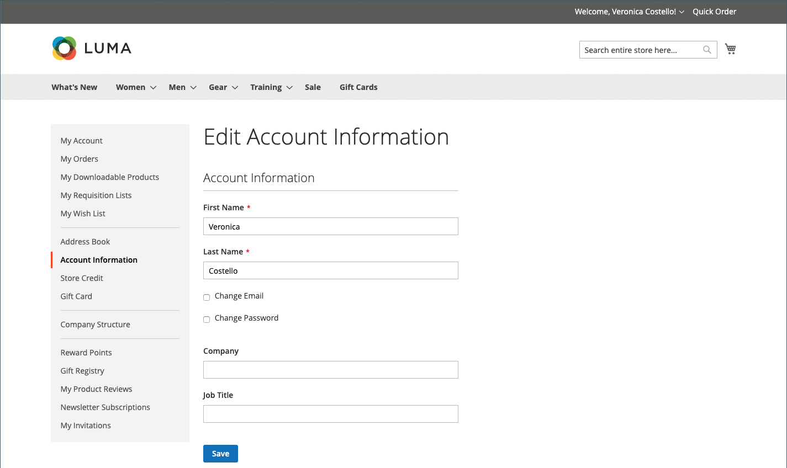

# Klantaccountgegevens

De basisgegevens van de klantenaccount bevatten uw naam en e-mailadres en wachtwoord. U kunt deze gegevens bijhouden via het dashboard voor de klantenaccount in de winkel.

{width="700" zoomable="yes"}

In de zijbalk van uw account kan de klant **[!UICONTROL Account Information]** kiezen en een van de volgende handelingen uitvoeren om de accountgegevens bij te werken.

## De naam van de accountnaam bijwerken

Om de naam voor de account bij te werken, wijzigt de klant de waarden in de velden **[!UICONTROL First Name]** en **[!UICONTROL Last Name]** .

>[!INFO]
>
>De extra gebieden verschijnen als deel van de naam als de [&#x200B; klantenconfiguratie &#x200B;](../configuration-reference/customers/customer-configuration.md) een prefix, midden aanvankelijke, en achtervoegsel omvat.

## E-mailadres wijzigen

1. De klant selecteert het selectievakje **[!UICONTROL Change Email]** .

1. Voer het nieuwe **[!UICONTROL Email]** -adres in.

1. Voer hun **[!UICONTROL Current Password]** in.

   {width="700" zoomable="yes"}

1. Klik op **[!UICONTROL Save]** .

## Wachtwoord wijzigen

1. De klant selecteert het selectievakje **[!UICONTROL Change Password]** .

1. Voer hun **[!UICONTROL Current Password]** in.

1. Voer hun **[!UICONTROL New Password]** in.

   >[!INFO]
   >
   >Het wachtwoord moet ten minste acht tekens lang zijn en kan bestaan uit een combinatie van hoofdletters en kleine letters, cijfers en symbolen. De sterkteaanduiding voor het wachtwoord helpt de klant het beste wachtwoord te kiezen.

   {width="700" zoomable="yes"}

1. Voer het nogmaals in om het te bevestigen.
