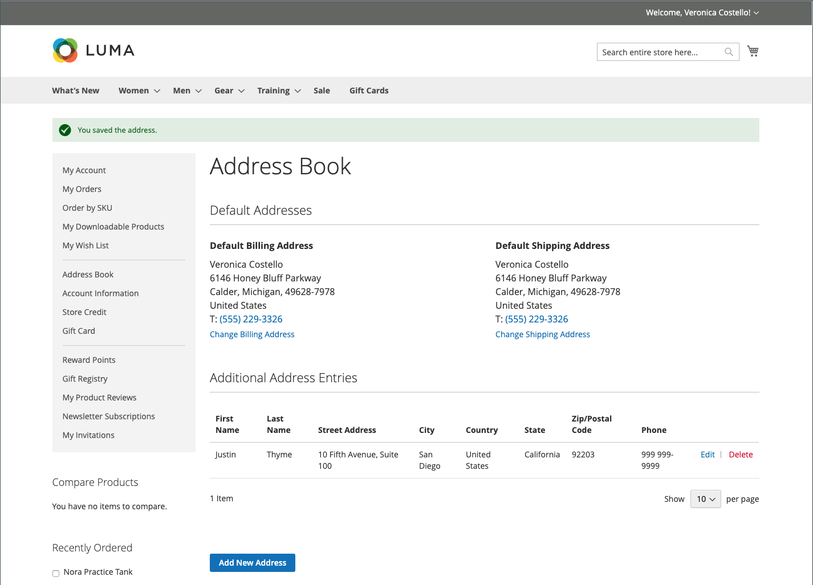

# Het adresboek van de klant

Klanten die hun adresboeken actueel houden, kunnen het afrekenen versnellen. Het adresboek bevat de standaardfacturerings- en verzendadressen van de klant en eventuele extra adressen die deze vaak gebruikt. Extra adresvermeldingen zijn eenvoudig toegankelijk en te onderhouden via het raster. Elk klantenadresboek kan meer dan 3.000 ingangen van het adresboek beheren zonder prestaties te beïnvloeden.

{width="700" zoomable="yes"}

## Een adres toevoegen

1. In de linkernavigatie van hun klantenrekening, kiest de klant **[!UICONTROL Address Book]**.

1. Voor de _[!UICONTROL Address Book]_&#x200B;pagina onder_ Extra Ingangen van het Adres _, klikt **[!UICONTROL Add New Address]**.

   {width="600" zoomable="yes"} toe

1. Hiermee wordt het nieuwe adresitem gedefinieerd.

1. Voltooit de contact en adresinformatie.

   >[!INFO]
   >
   >Standaard worden de voor- en achternamen van de klant in eerste instantie in het formulier weergegeven.

1. Selecteert volgende checkboxes om erop te wijzen hoe het adres moet worden gebruikt.

   Selecteert beide selectievakjes als hetzelfde adres wordt gebruikt voor facturering en verzending.

   * [!UICONTROL Use as my default billing address]
   * [!UICONTROL Use as my default shipping address]

1. Klik op **[!UICONTROL Save Address]** wanneer dit is voltooid.

   >[!INFO]
   >
   >Het nieuwe adres wordt vermeld onder [!UICONTROL Additional Address Entries].

   {width="700" zoomable="yes"}

## Een adres bewerken

1. In de linkernavigatie van hun klantenrekening, selecteert de klant **[!UICONTROL Address Book]**.

1. Zoekt de adresvermelding die moet worden bewerkt.

1. Klik op **[!UICONTROL Edit]** .

1. Hiermee brengt u de benodigde wijzigingen aan.

   >[!INFO]
   >
   >De klant kan dit adres als standaard **[!UICONTROL Shipping or Billing]** adres plaatsen door het _Gebruik als mijn standaard het factureren adres_ checkboxes te selecteren.

1. Wanneer de wijzigingen zijn voltooid, klikt u op **[!UICONTROL Save Address]** .

## Het standaardadres wijzigen

1. In de linkernavigatie van hun klantenrekening, selecteert de klant **[!UICONTROL Address Book]**.

1. Kies een van de bewerkingsmethoden:

   * Klik op **[!UICONTROL Change Billing/Shipping Address]** in de sectie _[!UICONTROL Default Addresses]_.

   * Klik op **[!UICONTROL Edit]** in het _[!UICONTROL Additional Address Entries]_-raster.

1. Hiermee brengt u de benodigde wijzigingen aan en klikt u op **[!UICONTROL Save Address]** .

## Een adres verwijderen

1. In de linkernavigatie van hun klantenrekening, selecteert de klant **[!UICONTROL Address Book]**.

1. Vindt de adresingang die moet worden geschrapt.

1. Klik op **[!UICONTROL Delete]** in het _[!UICONTROL Additional Address Entries]_-raster.

1. Klik op **[!UICONTROL OK]** om de handeling te bevestigen.

   >[!IMPORTANT]
   >
   >De standaardfacturerings- en verzendadressen kunnen niet worden verwijderd.
