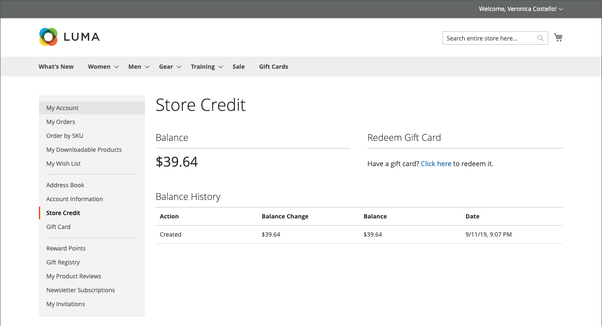
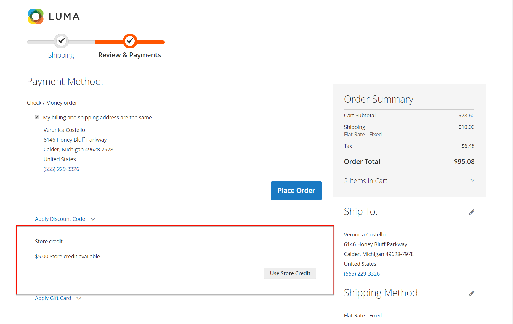

# Creditering opslaan op het dashboard voor de klantenaccount

{{ee-feature}}

Op de pagina _[!UICONTROL Store Credit]_van het dashboard voor de klantenaccount worden bedragen weergegeven van geretourneerde bedragen en terugbetalingen die op toekomstige aankopen kunnen worden toegepast. Klanten kunnen de waarde ook inwisselen van een cadeaukaart.

{width="700" zoomable="yes"}

## Winkelkrediet toepassen tijdens afhandeling

1. De klant bepaalt de hoeveelheid beschikbaar winkelkrediet.

   Tijdens de _Controle &amp; de stap van Betalingen_, verschijnt het beschikbare bedrag onder **[!UICONTROL Store Credit]**.

1. Om het bedrag op de orde toe te passen, klikt de klant **[!UICONTROL Use Store Credit]**.

   {width="600" zoomable="yes"}

1. Het ordertotaal wordt opnieuw berekend en het bedrag van het winkelkrediet dat wordt toegepast, wordt weergegeven in het overzicht van bestellingen.

   {width="600" zoomable="yes"}

1. Klik indien gereed op **[!UICONTROL Place Order]** .

## Creditsaldo en geschiedenis van winkel weergeven

Er zijn twee methoden voor het weergeven van de balans en de geschiedenis van crediteringen:

Methode 1: **van het dashboard van de klantenrekening**

1. Van de opslag, logt de klant aan rekening binnen.

1. Kies **[!UICONTROL Store Credit]** in het linkerdeelvenster.

Methode 2: **van de _Overzicht &amp; van Betalingen_ pagina**

1. De klant voegt een product toe aan het winkelwagentje.

1. Hiermee gaat u naar de afhandelingspagina.

1. Geeft de stap **[!UICONTROL Shipping]** door.

1. Als de opslagkredieten beschikbaar zijn, klikt de klant **Krediet van de Opslag van het Gebruik**.

1. Als de klant van mening verandert over het gebruik van het winkelkrediet, klikt u op **[!UICONTROL Remove]** in de sectie _[!UICONTROL Order Summary]_.
