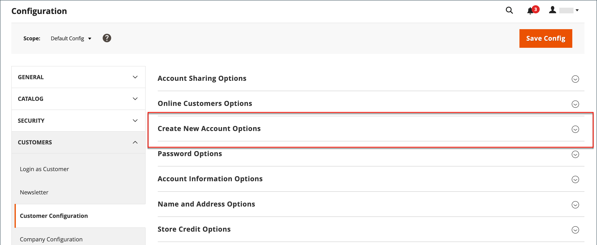

# Nieuwe opties voor klantenaccount

In de sectie _[!UICONTROL Create New Account Options]_&#x200B;van de configuratie worden de basisaccountopties gecombineerd met meer geavanceerde opties die betrekking hebben op de validatie van BTW-id&#39;s en aangepaste integratie. De volgende instructies hebben alleen betrekking op de meest gebruikte opties. Om over automatische taken van de klantengroep te leren, zie [ de Bevestiging van de BTW ](../stores-purchase/vat.md).

{width="600" zoomable="yes"}

## De basisopties voor klantenaccounts instellen

1. Voor _Admin_ sidebar, ga **[!UICONTROL Stores]** > _[!UICONTROL Settings]_>**[!UICONTROL Configuration]**.

1. Vouw in het linkerdeelvenster **[!UICONTROL Customers]** uit en kies **[!UICONTROL Customer Configuration]** .

1. Vouw de sectie **[!UICONTROL Create New Account Options]** uit:

   {width="600" zoomable="yes"}

1. Stel elk van de opties in op basis van de ervaring van de klant die u op uw winkel moet ondersteunen:

   - Stel **[!UICONTROL Default Group]** in op de klantengroep die wordt toegewezen aan nieuwe klanten wanneer een account wordt gemaakt.

   - Als u a _toegevoegde Belasting van de Waarde_ aantal hebt en het aan klanten zichtbaar wilt zijn, plaats **[!UICONTROL Show VAT Number on Storefront]** aan `Yes`.

   - Stel **[!UICONTROL Email is required field for Admin order creation]** in op `Yes` als u een e-mailbericht van een klant wilt vereisen tijdens het maken van een Admin-order.

   - Voer de **[!UICONTROL Default Email Domain]** in voor de winkel, bijvoorbeeld `mystore.com`

   - Stel **[!UICONTROL Default Welcome Email]** in op de sjabloon die wordt gebruikt voor het welkomstbericht dat naar nieuwe klanten wordt verzonden.

   - Stel **[!UICONTROL Require Emails Confirmation]** in op `Yes` als u wilt dat klanten hun verzoek om een account bij uw winkel te openen, bevestigen. Stel vervolgens **[!UICONTROL Confirmation Link Email]** in op de sjabloon die wordt gebruikt voor het bevestigingsbericht.

     >[!NOTE]
     >
     >Vanaf versie 2.4.7 moeten klanten hun e-mail en wachtwoord opnieuw invoeren om zich aan te melden bij hun account na e-mailbevestiging, ongeacht de browser.

   - Stel **[!UICONTROL Welcome Email]** in op de sjabloon die wordt gebruikt voor het welkomstbericht dat wordt verzonden nadat het account is bevestigd.

   - Stel **[!UICONTROL Default Welcome Email without Password]** in op de sjabloon die wordt gebruikt wanneer een klantenaccount wordt gemaakt die nog geen wachtwoord heeft. Er is bijvoorbeeld nog geen wachtwoord toegewezen aan een klantenaccount die is gemaakt met de beheerder.

   - Stel **[!UICONTROL Email Sender]** in op de contactpersoon van de winkel die wordt weergegeven als de afzender van het welkomstbericht.

   - Stel **[!UICONTROL Require Emails Confirmation]** in op `Yes` als u wilt dat klanten hun verzoek om een account bij uw winkel te openen, bevestigen. Stel vervolgens **[!UICONTROL Confirmation Link Email]** in op de sjabloon die wordt gebruikt voor het bevestigingsbericht.

   {width="600" zoomable="yes"}

   Voor gedetailleerde informatie over elk van de opties beschikbaar in deze reeks van configuratieoptie, zie _de Nieuwe Opties van de Rekening_ [ configuratieverwijzing ](../configuration-reference/customers/customer-configuration.md) creëren.

1. Klik op **[!UICONTROL Save Config]** als de bewerking is voltooid.
