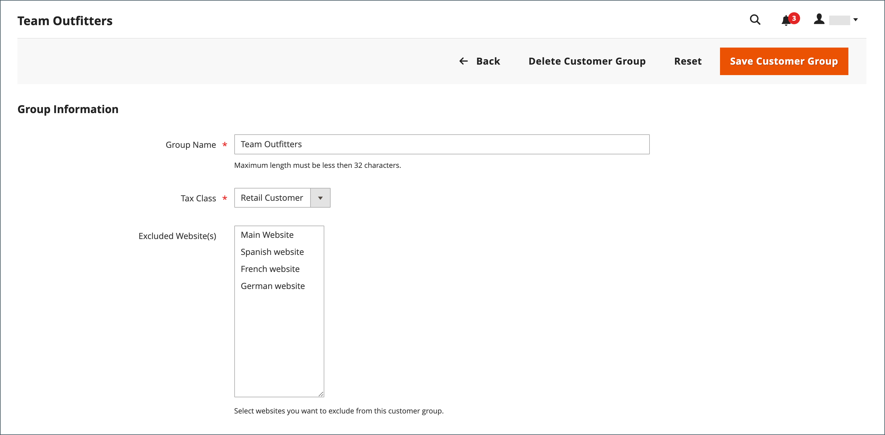
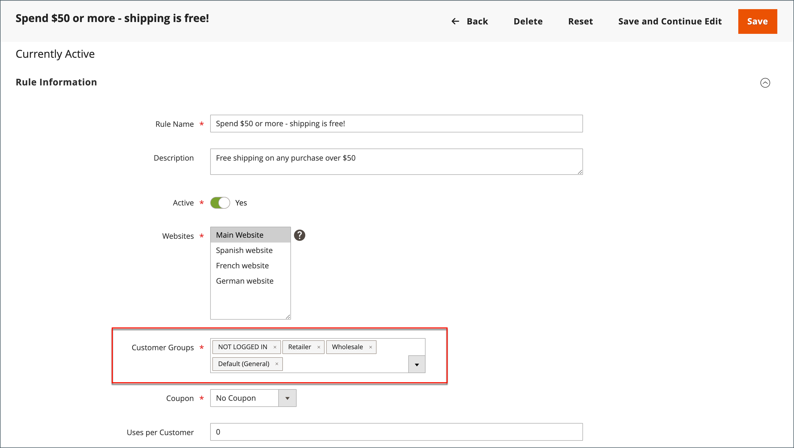

# Klantengroepen

Klantgroepen bepalen welke kortingen beschikbaar zijn en welke belastingklasse aan de groep is gekoppeld. De standaardklantengroepen zijn `General`, `Not Logged In`, en `Wholesale`.

{width="700" zoomable="yes"}

## Filteren op [!UICONTROL Customer Groups] list

1. Op de _Beheerder_ zijbalk, ga naar **[!UICONTROL Customers]** > **[!UICONTROL Customer Groups]**.

1. Klik op **[!UICONTROL Filters]**.

1. Voer criteria in voor het doorzoeken van groepen, waaronder een bereik met id&#39;s, groepen of belastingklassen.

   {width="600" zoomable="yes"}

1. Klik op **[!UICONTROL Apply Filters]**.

## Een klantengroep maken

>[!NOTE]
>
>Admin-gebruikers die geen toegang hebben tot alle websites (waaraan een rol is toegewezen met een &#39;Aangepast&#39; [!UICONTROL Role Scope]) kan geen klantgroepen maken, wijzigen of verwijderen.

1. Op de _Beheerder_ zijbalk, ga naar **[!UICONTROL Customers]** > **[!UICONTROL Customer Groups]**.

1. Klik op **[!UICONTROL Add New Customer Group]**.

1. Voor [!DNL **Group Name]**, voer een unieke naam in van minder dan 32 tekens om de groep te identificeren.

1. Selecteer de **[!UICONTROL Tax Class]** dat geldt voor de groep.

   {width="600" zoomable="yes"}

1. Selecteer de **[!UICONTROL Excluded Website(s)]** die u wilt uitsluiten van de groep.

   >[!IMPORTANT]
   >
   >Door websites uit te sluiten, kan de prijs van het product en de tijd voor het indexeren van catalogi afnemen, omdat uitgesloten websites niet worden geïndexeerd. Wanneer een klantengroep met een toegevoegde websiteuitsluiting wordt opgeslagen, worden de de productprijs, catalogusregel, en indexen van het catalogusonderzoek ongeldig gemaakt. Als u veel producten, websites en klantengroepen hebt, is het raadzaam het herindexeringsproces te pauzeren totdat u websites van de klantengroepen hebt uitgesloten.

   Er zijn standaard geen websites uitgesloten. Als u meerdere waarden wilt selecteren, houdt u de toets _Ctrl_ toets (PC) of de _Opdracht_ (Mac) en klik op elke optie.

1. Klik op **[!UICONTROL Save Customer Group]**.

## Een klantengroep bewerken

1. Op de _Beheerder_ zijbalk, ga naar **[!UICONTROL Customers]** > **[!UICONTROL Customer Groups]**.

1. Open de record in de bewerkingsmodus.

1. Breng de gewenste wijzigingen aan.

1. Klik op **[!UICONTROL Save Customer Group]**.

## Een klant toewijzen aan een andere groep

1. Op de _Beheerder_ zijbalk, ga naar **[!UICONTROL Customers]** > **[!UICONTROL All Customers]**.

1. Zoek de klant in de lijst en selecteer het selectievakje in de eerste kolom.

1. Stel de **Handelingen** controle op `Assign a Customer Group` en kiest u de groep in het menu.

   {width="600" zoomable="yes"}

1. Klik wanneer u wordt gevraagd om te bevestigen **OK**.

## Een groep klanten koppelen aan specifieke kortingen

1. Op de _Beheerder_ zijbalk, ga naar **[!UICONTROL Marketing]** > _Aanbiedingen_ > **[!UICONTROL Cart Price Rules]**.

1. Selecteer de regel van de kartprijs waar u een groep voor de toegepaste korting wilt associëren, of [een prijsregel maken](../merchandising-promotions/price-rules-catalog.md).

1. Selecteer de klantengroepen waarop de regel van toepassing is.

   {width="600" zoomable="yes"}

1. Klik op **[!UICONTROL Save]**.

>[!NOTE]
>
> U kunt de Geavanceerde prijzen ook gebruiken om productkortingen op klantengroepen toe te passen. Zie [Geavanceerde prijzen](../catalog/product-price-group.md).

## Een klantengroep verwijderen

1. Op de _Beheerder_ zijbalk, ga naar **[!UICONTROL Customers]** > **[!UICONTROL Customer Groups]**.

1. Open de record in de bewerkingsmodus.

1. Klik op de knopbalk op **[!UICONTROL Delete Customer Group]**.

1. Klik wanneer u wordt gevraagd om te bevestigen **OK**.

## Demo voor klantgroepen

Bekijk deze demo om te leren hoe u klantgroepen kunt maken:

>[!VIDEO](https://video.tv.adobe.com/v/343660/?quality=12)
