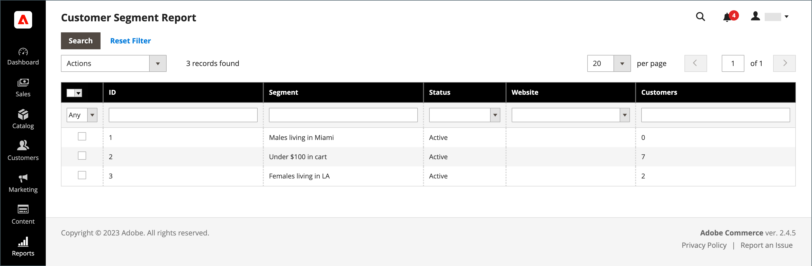

# Rapport voor klantsegment

{{ee-feature}}

Het rapport van het Segment van de Klant verstrekt informatie over het aantal klanten in elk segment.

{width="700" zoomable="yes"}

| Kolom | Beschrijving |
|--- |--- |
| **[!UICONTROL Select]** | Schakel het selectievakje in voor elk segment waarop een actie moet worden uitgevoerd of gebruik het selectiekader in de kolomkop. Opties: `Select All` / `Deselect All` / `Select Visible` / `Unselect Visible` |
| **[!UICONTROL ID]** | Een unieke numerieke id die aan elk segment is toegewezen |
| **[!UICONTROL Segment]** | Segmentnaam |
| **[!UICONTROL Status]** | Segmentstatus. Opties: `Active` / `Inactive` |
| **[!UICONTROL Website]** | Website waaraan het segment wordt toegewezen |
| **[!UICONTROL Customers]** | Aantal klanten die aan een segment worden toegewezen |

{style="table-layout:auto"}

U kunt naar een lijst met klanten in het segment gaan en de gegevens exporteren.

{width="600" zoomable="yes"}

Om ervoor te zorgen dat u over de meest recente gegevens beschikt, moeten de segmentgegevens worden vernieuwd. Als de segmentgegevens niet beschikbaar of verouderd zijn, klikt u op **[!UICONTROL Refresh Segment Data]** in de knopbalk om bij te werken.

1. Kies bij **[!UICONTROL Export to]** een exportindeling:

   * CSV - Een bestand met komma&#39;s als scheidingsteken dat normale tekstgegevens bevat.
   * Excel XML - Een op XML gebaseerde indeling voor spreadsheetgegevens.

1. Klik op **[!UICONTROL Export]**.

   | Kolom | Beschrijving |
   |--- |--- |
   | **[!UICONTROL ID]** | Een unieke numerieke id die aan elke gebruiker is toegewezen |
   | **[!UICONTROL Name]** | Naam klant |
   | **[!UICONTROL Email]** | Het e-mailadres van een geregistreerde klant |
   | **[!UICONTROL Group]** | De klantengroep waaraan de klant wordt toegewezen |
   | **[!UICONTROL Phone]** | Het telefoonnummer van de klant |
   | **[!UICONTROL ZIP]** | De postcode of postcode waar de klant zich bevindt |
   | **[!UICONTROL Country]** | Het land waar de klant zich bevindt |
   | **[!UICONTROL State/Province]** | De staat of provincie waar de klant zich bevindt |
   | **[!UICONTROL Customer Since]** | De datum en tijd waarop de klantenaccount is gemaakt |

   {style="table-layout:auto"}

1. Het gegenereerde bestand wordt automatisch opgeslagen op uw lokale computer.
