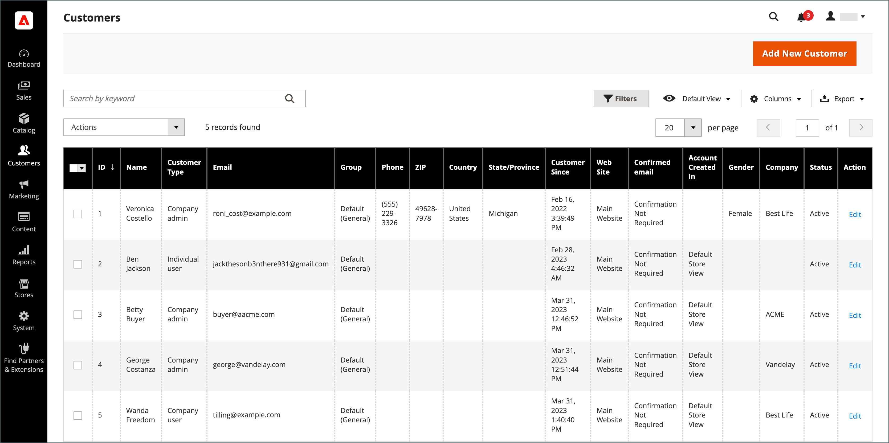

# Lijst met klanten

In het beheerderster worden in het raster [!UICONTROL Customers] alle klanten weergegeven die zich voor een account bij uw winkel hebben geregistreerd of die door de beheerder zijn toegevoegd. Gebruik de standaard [ netcontroles ](../getting-started/admin-grid-controls.md) om de lijst te filtreren en de kolomlay-out aan te passen. Meer leren, zie [ klantenrekeningen beheren ](../customers/manage-account.md).

{width="700" zoomable="yes"}

## Klantgegevens bijwerken

1. Voor _Admin_ sidebar, ga **[!UICONTROL Customers]** > **[!UICONTROL All Customers]**.

1. Vind het klantenverslag en klik [!UICONTROL **uitgeven**] in de _[!UICONTROL Action]_&#x200B;kolom.

1. Kies in het linkerdeelvenster de informatie die u wilt bewerken en breng de benodigde wijzigingen aan.

   >[!NOTE]
   >
   >Meer leren, zie [ de klantenrekeningen van de Update ](../customers/update-account.md).

1. Klik op **[!UICONTROL Save Customer]** als de bewerking is voltooid.

## Workspace-besturingselementen

| Besturing | Beschrijving |
| --- | --- |
| **[!UICONTROL Add New Customer]** | Maakt een klantenaccount. |
| **[!UICONTROL Search]** | Hiermee wordt een zoekopdracht naar klanten gestart op basis van de huidige filters. |
| **[!UICONTROL Filters]** | Bepaalt een reeks onderzoeksparameters die worden gebruikt om de verslagen te filtreren die in het [ net ](../getting-started/admin-grid-controls.md) verschijnen. |
| **[!UICONTROL Default View]** | Bepaalt de standaardkolom [ lay-out ](../getting-started/admin-grid-controls.md) van het net. |
| **[!UICONTROL Columns]** | Bepaalt de selectie van [ kolommen ](../getting-started/admin-grid-controls.md) en hun rekeningen in het net. De kolomlay-out kan als a _mening_ worden veranderd en worden bewaard. Standaard worden slechts enkele kolommen in het raster opgenomen. |
| **[!UICONTROL Export]** | Hiermee exporteert u de geselecteerde records als een CSV- of Excel XML-bestand. |

{style="table-layout:auto"}

## Kolommen

| Kolom | Beschrijving |
| --- | --- |
| **[!UICONTROL Select]** | Beheert de checkbox selections for the customer records for applying an action. U kunt ook het selectiekader in de kolomkop gebruiken om alles in of uit te schakelen. |
| **[!UICONTROL ID]** | Een unieke numerieke id die wordt toegewezen wanneer de klantenaccount wordt gemaakt. |
| **[!UICONTROL Name]** | De voornaam en achternaam van de klant. |
| **[!UICONTROL Email]** | Het e-mailadres van de klant |
| **[!UICONTROL Group]** | De klantengroep waaraan de klant wordt toegewezen. |
| **[!UICONTROL Phone]** | Het telefoonnummer van de klant. |
| **[!UICONTROL ZIP]** | De postcode of postcode van de klant. |
| **[!UICONTROL Country]** | Het land waar de klant zich bevindt. |
| **[!UICONTROL State/Province]** | De staat of provincie waar de klant zich bevindt. |
| **[!UICONTROL Customer Since]** | De datum en tijd waarop de klantenaccount is gemaakt. |
| **[!UICONTROL Web Site]** | De website in de opslaghiërarchie waaraan het klantenaccount is gekoppeld. |
| **[!UICONTROL Confirmed Email]** | Hiermee geeft u aan of een bevestigingsbericht vereist is. |
| **[!UICONTROL Account Created In]** | Geeft de winkelweergave aan waaruit de klantenaccount is gemaakt. |
| **[!UICONTROL Date of Birth]** | De geboortedatum van de klant.   **_Belangrijk:_**&#x200B;in overeenstemming met huidige veiligheid en privacy beste praktijken, ben zich bewust van om het even welke potentiële wettelijke en veiligheidsrisico&#39;s verbonden aan de opslag van de volledige geboortedatum van klanten (maand, dag, jaar) met andere persoonlijke herkenningstekens. U wordt aangeraden de opslag van de volledige geboortedatum van de klant te beperken en u aan te raden het geboortejaar van de klant als alternatief te gebruiken. |
| **[!UICONTROL Tax / VAT Number]** | Indien van toepassing, het belastingaantal of [ waarde-toegevoegde belasting ](../stores-purchase/vat.md) aantal dat aan de klant wordt toegewezen.    Dit gebied is niet het zelfde als het Aantal van de BTW. |
| **[!UICONTROL Gender]** | Het geslacht van de klant. |
| **[!UICONTROL Action]** | Bewerken - Opent het bedrijfsaccount in de bewerkingsmodus. |

{style="table-layout:auto"}

### Aanvullende kolommen

Deze kolommen zijn beschikbaar door de [ kolomlay-out ](../getting-started/admin-grid-controls.md) van het net te veranderen.

| Kolom | Beschrijving |
| --- | --- |
| **[!UICONTROL Company]** | De bedrijfsnaam van de klant. |
| **[!UICONTROL Street Address]** | Het adres van de klant. |
| **[!UICONTROL City]** | De plaats waar de klant zich bevindt. |
| **[!UICONTROL Fax]** | Het faxnummer van de klant, indien van toepassing. |
| **[!UICONTROL Billing Firstname]** | De voornaam in het factureringsadres van de klant. |
| **[!UICONTROL Billing Lastname]** | De achternaam in het factureringsadres van de klant. |
| **[!UICONTROL Billing Address]** | Het adres waar factureringsinformatie moet worden verzonden. |
| **[!UICONTROL Shipping Address]** | Het adres waar bestellingen moeten worden verzonden. |
| **[!UICONTROL VAT Number]** | Het BTW-nummer dat aan het adres van de klant is gekoppeld. Voor [ digitale goederen ](../stores-purchase/taxes.md) die in de EU worden verkocht, is de BTW gebaseerd op het factureringsadres van de klant.    Dit gebied is niet het zelfde als het BTW Aantal. |
| **[!UICONTROL Account Lock]** | Geeft de status van de account aan. Als veiligheidsmaatregel, kunnen de klantenrekeningen [ worden gesloten ](../customers/password-options.md) na teveel login pogingen. Waarden: `Locked` / `Unlocked` |

{style="table-layout:auto"}
