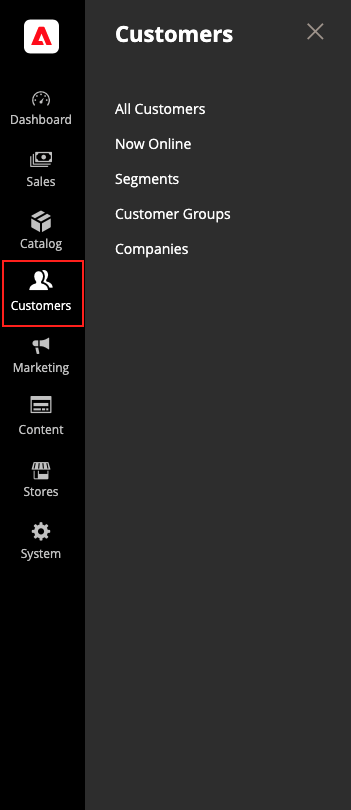

# Inleiding tot klantenbeheer

Het menu _[!UICONTROL Customers]_&#x200B;biedt toegang tot hulpprogramma&#39;s voor accountbeheer van klanten en geeft u de mogelijkheid om te zien wie online in uw winkel is.

>[!BEGINTABS]

>[!TAB  Adobe Commerce ]

[!BADGE &#x200B; slechts PaaS &#x200B;]{type=Informative url="https://experienceleague.adobe.com/nl/docs/commerce/user-guides/product-solutions" tooltip="Is alleen van toepassing op Adobe Commerce op Cloud-projecten (door Adobe beheerde PaaS-infrastructuur) en op projecten in het veld."}

{width="300" zoomable="yes"}

>[!TAB  Adobe Commerce as a Cloud Service ]

[!BADGE &#x200B; slechts SaaS &#x200B;]{type=Positive url="https://experienceleague.adobe.com/nl/docs/commerce/user-guides/product-solutions" tooltip="Alleen van toepassing op Adobe Commerce as a Cloud Service- en Adobe Commerce Optimizer-projecten (door Adobe beheerde SaaS-infrastructuur)."}

{width="300" zoomable="yes"}

>[!ENDTABS]

## Het menu [!UICONTROL Customers] weergeven

Voor _Admin_ sidebar, klik [!UICONTROL Customers] om de menuopties te tonen:

| Veld | Beschrijving |
|---|---|
| [!UICONTROL All Customers] | Maakt een lijst van alle [&#x200B; klanten &#x200B;](../customers/customers-all.md) die voor een rekening bij uw opslag hebben geregistreerd of door de beheerder zijn toegevoegd. |
| [!UICONTROL Now Online] | Maakt een lijst van alle klanten en bezoekers die momenteel [&#x200B; online &#x200B;](../customers/now-online.md) in uw opslag zijn. |
| [!UICONTROL Segments] | Maakt een lijst van de [&#x200B; klantensegmenten &#x200B;](../customers/customer-segments.md) die worden gebruikt om inhoud en bevorderingen aan specifieke klanten dynamisch te tonen die op diverse eigenschappen worden gebaseerd. |
| [!UICONTROL Customer Groups] | De [&#x200B; klantengroepen &#x200B;](../customers/customer-groups.md) bepalen welke kortingen aan kopers en de belastingklasse voor de aankoop beschikbaar zijn. |
| [!UICONTROL Companies] | (Vereist Adobe Commerce B2B) maakt een lijst van alle actieve [&#x200B; bedrijfrekeningen &#x200B;](../b2b/account-companies.md) en hangende verzoeken, ongeacht status die plaatsen, en verstrekt de hulpmiddelen worden gebruikt om [&#x200B; te creëren en &#x200B;](../b2b/account-company-manage.md) bedrijfrekeningen te beheren. |

{style="table-layout:auto"}
