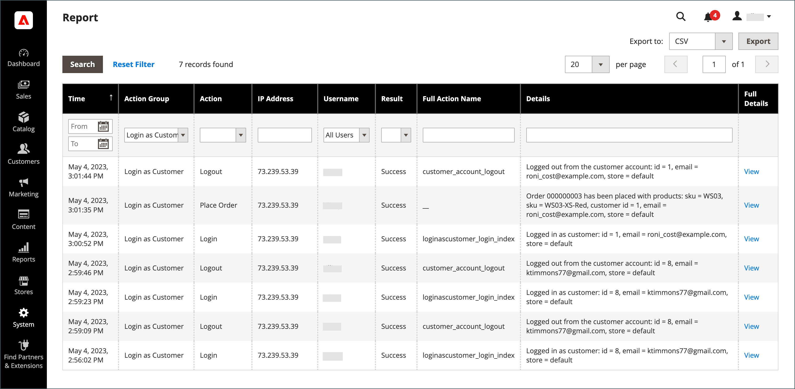

# Hulp bieden aan winkeliers

Klanten hebben soms hulp nodig bij hun bestelling. Winkelbeheerders kunnen _Aanmelden als klant_, waardoor ze kunnen zien wat de klant ziet en updates kunnen uitvoeren om hen te helpen.

Alle acties die tijdens het aanmelden als de klant worden uitgevoerd, worden toegepast op de account van de werkelijke klant.

Wanneer deze optie is ingeschakeld voor een _Beheerder_ gebruiker, de _[!UICONTROL Login as Customer]_wordt op meerdere pagina&#39;s weergegeven:

* [Bewerkingspagina van klant](../customers/update-account.md)
* [Weergavepagina Volgorde](../stores-purchase/order-processing.md)
* [Factuurweergave](../stores-purchase/invoices.md)
* [Pagina Verzendweergave](../stores-purchase/shipments.md)
* [Weergavepagina creditcard](../stores-purchase/credit-memo-create.md)

{width="600" zoomable="yes"}

## Aanmelden als klant inschakelen

Inschakelen _Aanmelden als klant_ vereist dat u de eigenschap in uw instantie van de Handel toelaat en dan toegang voor gebruikers Admin in de toestemmingen van de gebruikersrol toelaat.

### De functie inschakelen

1. Ga op de zijbalk Beheerder naar  **[!UICONTROL Stores]** > _[!UICONTROL Settings]_>**[!UICONTROL Configuration]**.

1. Vouw in het linkerdeelvenster uit **[!UICONTROL Customers]** en kiest u  **[!UICONTROL Login as Customer]**.

   {width="600" zoomable="yes"}

1. Set **[!UICONTROL Enable Login as Customer]** tot `Yes`.

1. _(Optioneel)_ Set **[!UICONTROL Disable Page Cache for Admin User]** tot `No` om de paginacache in te schakelen wanneer de Admin-gebruiker zich als klant aanmeldt.

   >[!WARNING]
   >
   > De paginacache uitschakelen (`Yes` - standaard) zorgt ervoor dat de gebruiker die zich aanmeldt als klant, nieuwe gegevens krijgt die niet in de cache zijn opgeslagen.

1. _(Optioneel)_ Set **[!UICONTROL Store View to Log in]** tot `Manual Selection` als u een installatie voor meerdere sites en/of meerdere winkels hebt en de Admin-gebruiker de winkelweergave moet selecteren wanneer hij of zij zich als klant aanmeldt.

1. Klik op **[!UICONTROL Save Config]**.

### Toegang voor Admin-gebruikers inschakelen

1. Op de _Beheerder_ zijbalk, ga naar **[!UICONTROL System]** > _Machtigingen_ > **[!UICONTROL User Roles]**.

1. Klik op de rol in de lijst.

1. In de [!UICONTROL _Rolinformatie_] linkerdeelvenster, klik op **[!UICONTROL Role Resources]**.

1. Wijzigen **[!UICONTROL Role Resources]** op de pagina naar `Custom`.

   >[!INFO]
   >
   > Als deze optie is geselecteerd, wordt de bronhiërarchie op de pagina weergegeven.

1. Naar de  **[!UICONTROL Customers]** het bovenliggende item en het **[!UICONTROL Login as Customer]** item eronder. Selecteer vervolgens de bronnen die u voor de rol wilt inschakelen:

   * **[!UICONTROL Allow Login as Customer]** - Hiermee kan de Admin-gebruiker de _Aanmelden als klant_ gebruiken.
   * **[!UICONTROL View Login as Customer Log]** - Hiermee kan de Admin-gebruiker de _Aanmelden als klant_ Logboek.

   {width="400" zoomable="yes"}

1. Klik op **[!UICONTROL Save Role]**.

## Aanmelden als klant van de beheerder

1. Op de _Beheerder_ zijbalk, ga naar **[!UICONTROL Customers]** > [!UICONTROL _Alle klanten_].

1. Open een gebruiker in de bewerkingsmodus.

1. In de **[!UICONTROL Customer Information]** in het deelvenster **[!UICONTROL Account Information]** sectie.

1. Stel de **[!UICONTROL Allow remote shopping assistance]** tot `Yes`.

   >[!INFO]
   >
   >De beheerder kan zich nu aanmelden als een gebruiker zonder hun toestemming van de winkel.

## Toestemming voor klantenaccount voor hulp bij externe winkelen

Om toegang tot uw account mogelijk te maken voor medewerkers van de opslagondersteuning van de beheerder, moet een klant de functie voor hun account inschakelen:

1. De klant gaat naar de **[!UICONTROL Account Information]** pagina.

1. Hiermee selecteert u de **[!UICONTROL Allow remote shopping assistance]** selectievakje.

1. De klant klikt **[!UICONTROL Save]**.

{width="700" zoomable="yes"}

>[!WARNING]
>
>Zonder deze toestemming kan een Admin-gebruiker zich niet aanmelden als deze klant.

## Aanmelden als klant gebruiken

>[!INFO]
>
>Te gebruiken _Aanmelden als klant_, zorg ervoor dat uw Admin wordt gevormd zoals vroeger beschreven.

_Aanmelden als klant_ staat u toe om de plaats te zien enkel zoals de klant doet, en staat u toe om andere acties voor de klant problemen op te lossen en te nemen. Als u een toegewezen gebruikersrol met de vereiste toestemmingen hebt:

1. U kunt op **[!UICONTROL Login as Customer]** op de pagina&#39;s die in de vorige sectie worden weergegeven.
1. De acties Aanmelden als klant zijn beschikbaar in het Actions Report.

>[!WARNING]
>
>Alle handelingen die zijn uitgevoerd tijdens het aanmelden [!UICONTROL _als klant_] (zoals producten toevoegen/verwijderen) worden toegepast op de bestelling van de werkelijke klant. In de winkel wordt een banner weergegeven wanneer u `logged in as customer_name` een herinnering aan de bijzondere staat te verstrekken.

## Aanmelden als aanmelden bij klant

{{ee-feature}}

Adobe Commerce biedt een logbestand voor de _Aanmelden als klant_ handelingen. Hierin worden alle sessies weergegeven waarbij een Admin-gebruiker de functie benadert. Ga naar de [Rapport Admin Actions](../systems/action-log-report.md).

U kunt de rapportinstelling filteren **[!UICONTROL Action Group]** tot `Login As Customer` boven aan de pagina en klikken op **[!UICONTROL Search]**.

{width="700" zoomable="yes"}
