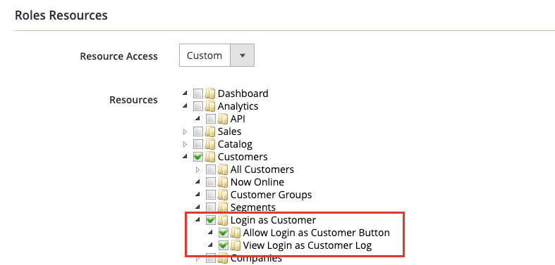

# Hulp bieden aan winkeliers

Klanten hebben soms hulp nodig bij hun bestelling. De beheerders van de opslag kunnen _Login als Klant_ gebruiken, die hen toestaat om te zien wat de klant ziet en updates maken om hen bij te staan.

Alle acties die tijdens het aanmelden als de klant worden uitgevoerd, worden toegepast op de account van de werkelijke klant.

Wanneer het voor een _Admin_ gebruiker wordt toegelaten, verschijnt de _[!UICONTROL Login as Customer]_&#x200B;knoop in veelvoudige pagina&#39;s:

* [Bewerkingspagina van klant](../customers/update-account.md)
* [Weergavepagina Volgorde](../stores-purchase/order-processing.md)
* [Factuurweergave](../stores-purchase/invoices.md)
* [Pagina Verzendweergave](../stores-purchase/shipments.md)
* [Weergavepagina creditcard](../stores-purchase/credit-memo-create.md)

{width="600" zoomable="yes"}

## Aanmelden als klant inschakelen

Het toelaten van _Login als Klant_ vereist dat u de eigenschap in uw instantie van Commerce toelaat en dan toegang voor Admin gebruikers in de toestemmingen van de gebruikersrol toelaat.

### De functie inschakelen

1. Ga op de zijbalk Beheerder naar **[!UICONTROL Stores]** > _[!UICONTROL Settings]_>**[!UICONTROL Configuration]**.

1. Vouw in het linkerdeelvenster **[!UICONTROL Customers]** uit en kies **[!UICONTROL Login as Customer]** .

   {width="600" zoomable="yes"}

1. Stel **[!UICONTROL Enable Login as Customer]** in op `Yes` .

1. _(Optioneel)_ Stel **[!UICONTROL Disable Page Cache for Admin User]** in op `No` om de paginacache in te schakelen wanneer de Admin-gebruiker zich aanmeldt als een klant.

   >[!WARNING]
   >
   > Als u de paginacache uitschakelt (`Yes` - standaard), zorgt u ervoor dat de gebruiker die zich aanmeldt als Klant, nieuwe gegevens krijgt die niet in de cache zijn opgeslagen.

1. _(Optioneel)_ Stel **[!UICONTROL Store View to Log in]** in op `Manual Selection` als u meerdere sites en/of meerdere winkels hebt ingesteld en de Admin-gebruiker de winkelweergave moet selecteren wanneer hij of zij zich aanmeldt als klant.

1. Klik op **[!UICONTROL Save Config]** als de bewerking is voltooid.

### Toegang voor Admin-gebruikers inschakelen

1. Op _Admin_ sidebar, ga **[!UICONTROL System]** > _Toestemmingen_ > **[!UICONTROL User Roles]**.

1. Klik op de rol in de lijst.

1. In het _linkerpaneel van de Informatie van de Rol 0&rbrace; &lbrace;, klik **[!UICONTROL Role Resources]**._

1. Wijzig **[!UICONTROL Role Resources]** op de pagina in `Custom` .

   >[!INFO]
   >
   > Als deze optie is geselecteerd, wordt de bronhiërarchie op de pagina weergegeven.

1. Blader naar het bovenliggende item **[!UICONTROL Customers]** en het onderliggende item **[!UICONTROL Login as Customer]** . Selecteer vervolgens de bronnen die u voor de rol wilt inschakelen:

   * **[!UICONTROL Allow Login as Customer]** - staat de gebruiker Admin toe om het _Login als eigenschap van de Klant_ te gebruiken.
   * **[!UICONTROL View Login as Customer Log]** - staat de gebruiker Admin toe om het _Login als Login van de Klant_ te zien.

   {width="400" zoomable="yes"}

1. Klik op **[!UICONTROL Save Role]**.

## Aanmelden als klant van de beheerder

1. Op _Admin_ sidebar, ga **[!UICONTROL Customers]** > [!UICONTROL _Alle Klanten_].

1. Open een gebruiker in de bewerkingsmodus.

1. Kies in het deelvenster **[!UICONTROL Customer Information]** de sectie **[!UICONTROL Account Information]** .

1. Stel de waarde **[!UICONTROL Allow remote shopping assistance]** in op `Yes` .

   >[!INFO]
   >
   >De beheerder kan zich nu aanmelden als een gebruiker zonder hun toestemming van de winkel.

## Toestemming voor klantenaccount voor hulp bij externe winkelen

Om toegang tot uw account mogelijk te maken voor medewerkers van de opslagondersteuning van de beheerder, moet een klant de functie voor hun account inschakelen:

1. De klant gaat naar de pagina **[!UICONTROL Account Information]** .

1. Selecteert het selectievakje **[!UICONTROL Allow remote shopping assistance]** .

1. De klant klikt op **[!UICONTROL Save]** .

{width="700" zoomable="yes"}

>[!WARNING]
>
>Zonder deze toestemming kan een Admin-gebruiker zich niet aanmelden als deze klant.

## Aanmelden als klant gebruiken

>[!INFO]
>
>Om _Login als Klant_ te gebruiken, zorg ervoor dat uw Admin zoals vroeger beschreven wordt gevormd.

_Login als Klant_ staat u toe om de plaats te zien enkel aangezien de klant doet, en staat u toe om andere acties voor de klant problemen op te lossen en te nemen. Als u een toegewezen gebruikersrol met de vereiste toestemmingen hebt:

1. U kunt op **[!UICONTROL Login as Customer]** klikken op de pagina&#39;s in de vorige sectie.
1. De acties Aanmelden als klant zijn beschikbaar in het Actions Report.

>[!WARNING]
>
>Om het even welke genomen acties terwijl het programma geopend [!UICONTROL _als Klant_] (zoals toevoegen/verwijderen producten) worden toegepast op de daadwerkelijke orde van de klant. In de winkel wordt een banner weergegeven wanneer u `logged in as customer_name` bent om een herinnering aan de speciale status te geven.

## Aanmelden als aanmelden bij klant

{{ee-feature}}

Adobe Commerce verstrekt het registreren voor het _Login als acties van de Klant_. Hierin worden alle sessies weergegeven waarbij een Admin-gebruiker de functie benadert. Om tot de geregistreerde acties toegang te hebben, ga naar het [ Rapport van Acties Admin ](../systems/action-log-report.md).

U kunt de rapportinstelling **[!UICONTROL Action Group]** naar `Login As Customer` boven aan de pagina filteren en op **[!UICONTROL Search]** klikken.

{width="700" zoomable="yes"}
