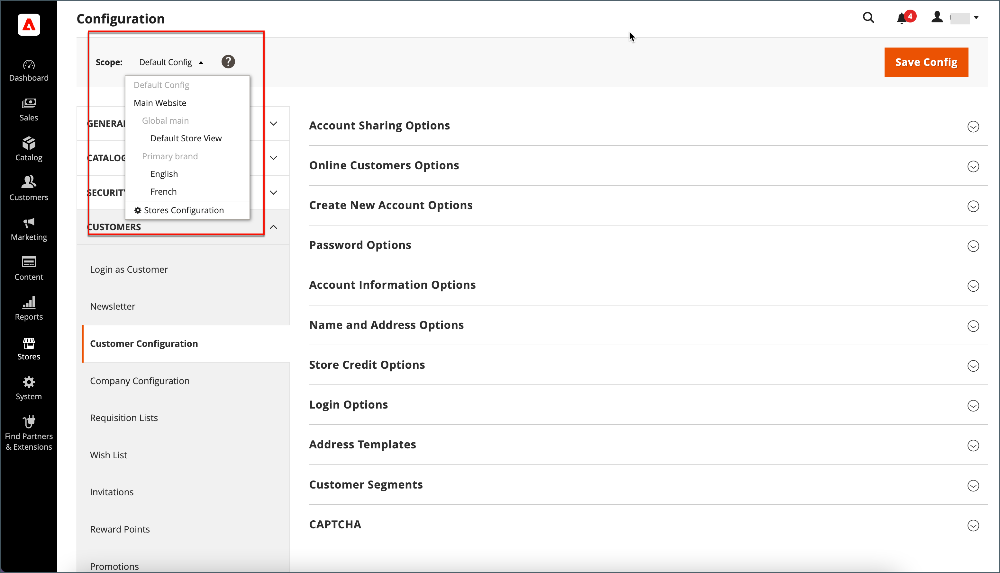

# Naam en adresopties van de klant

De _Naam- en adresopties_ bepalen welke velden worden opgenomen in de naam- en adresformulieren wanneer klanten een [account](../customers/account-create.md) met uw winkel.

{width="500" zoomable="yes"}

De stappen voor het configureren van de naam- en adresopties verschillen voor Adobe Commerce en Magento Open Source.

## Naam- en adresopties configureren voor Adobe Commerce

U kunt de naam- en adresopties configureren die aan klanten in de winkel worden voorgesteld wanneer zij hun account maken.

### Stap 1: Plaats het werkingsgebied van de configuratie

1. Op de _Beheerder_ zijbalk, ga naar **[!UICONTROL Stores]** > _[!UICONTROL Settings]_>**[!UICONTROL Configuration]**.

1. Vouw in het linkerdeelvenster uit **[!UICONTROL Customers]** en kiest u **[!UICONTROL Customer Configuration]**.

1. Vouw de sectie **[!UICONTROL Name and Address Options]** uit.

   >[!INFO]
   >
   >U ziet dat het bereik van de opties voor naam en adres van toepassing is op de `website` niveau.

1. Schuif omhoog naar de bovenkant van de pagina en stel het bereik van de configuratie in op een van de volgende opties:

   - `Default Config`
   - `Main Website` (of specifieke locatie voor installaties met meerdere vestigingen)

   >[!INFO]
   >
   >De _[!UICONTROL Name and Address Options]_wordt niet weergegeven wanneer het bereik is ingesteld op `Default Store View`.

   {width="700" zoomable="yes"}

### Stap 2: Vorm de naam en adresopties

1. Terugkeren naar de [!UICONTROL _Naam- en adresopties_] op de pagina Configuratie van de klant.

   >[!INFO]
   >
   > Als u het `Default config` bereik instellen, moet u de `Use Default` Schakel het selectievakje voor elk veld in voordat u de waarde wijzigt.

   {width="600" zoomable="yes"}

1. Voor **[!UICONTROL Prefix Dropdown Options]** Voer elk voorvoegsel in dat u in de lijst wilt weergeven, gescheiden door een puntkomma.

   >[!IMPORTANT]
   >
   >Plaats een puntkomma voor de eerste waarde om een lege waarde boven aan de lijst weer te geven.

1. Voor **[!UICONTROL Suffix Dropdown Options]** Voer elk achtervoegsel in dat u in de lijst wilt weergeven, gescheiden door een puntkomma.

1. Als u de volgende velden wilt opnemen in klantformulieren, stelt u de waarde van elk van deze velden in op `Optional` of `Required`, indien nodig.

   - **[!UICONTROL Show Telephone]**
   - **[!UICONTROL Show Company]**
   - **[!UICONTROL Show Fax]**

### Stap 3: Opslaan en vernieuwen

1. Klik op **[!UICONTROL Save Config]**.

1. Klik in het bericht boven aan de pagina op **[!UICONTROL Cache Management]** en [vernieuwen](../systems/cache-management.md) elke ongeldige cache.

## Naam- en adresopties configureren voor Magento Open Source

Configureer de naam- en adresopties die aan klanten in de winkel worden gepresenteerd wanneer ze hun account maken.

{width="500" zoomable="yes"}

### Stap 1: Plaats het werkingsgebied van de configuratie

1. Op de _Beheerder_ zijbalk, ga naar **[!UICONTROL Stores]** > _[!UICONTROL Settings]_>**[!UICONTROL Configuration]**.

1. Vouw in het linkerdeelvenster uit **[!UICONTROL Customers]** en kiest u **[!UICONTROL Customer Configuration]**.

1. Vouw de sectie **[!UICONTROL Name and Address Options]** uit.

   >[!IMPORTANT]
   >
   > U ziet dat het bereik van de opties voor naam en adres van toepassing is op de `website` niveau.

   {width="600" zoomable="yes"}

1. Blader naar de bovenkant van de pagina en stel het bereik van de configuratie in op een van de volgende opties:

   - `Default Config`
   - `Main Website` (of specifieke locatie voor installaties met meerdere vestigingen)

   >[!NOTE]
   >
   >De _Naam- en adresopties_ wordt niet weergegeven wanneer het bereik is ingesteld op `Default Store View`.

   {width="600" zoomable="yes"}

### Stap 2: Vorm de naam en adresopties

1. Terugkeren naar de [!UICONTROL _Naam- en adresopties_] op de pagina Configuratie van de klant.

   >[!INFO]
   >
   >Als u het `Default config` bereik instellen, moet u de `Use Default` Schakel het selectievakje voor elk veld in voordat u de waarde wijzigt.

1. Voor **Aantal lijnen in een Adres van de Straat** Voer een getal in tussen 1 en 4.

   >[!WARNING]
   >
   >Standaard is het adres van de straat drie regels.

1. Als u een voorvoegsel (zoals Mr of Mw.) wilt opnemen in de naam, stelt u **Voorvoegsel tonen** tot `Yes`.

   {width="600" zoomable="yes"}

   >[!INFO]
   >
   >Voor **Opties voor neerzetten voorvoegsel** Voer elk voorvoegsel in dat u in de lijst wilt weergeven, gescheiden door een puntkomma. U kunt een puntkomma vóór de eerste waarde plaatsen om een lege waarde boven aan de lijst weer te geven.

1. Als u een optioneel veld voor de middelste of oorspronkelijke naam van de klant wilt opnemen, stelt u **[!UICONTROL Show Middle Name (initial)]** tot `Yes`.

1. Een achtervoegsel opnemen (zoals Jr. of Sr.) na de naam van de klant **[!UICONTROL Show Suffix]** op een van de volgende wijzen:

   - `Optional`
   - `Required`

   >[!INFO]
   >
   >Voor **Opties achtervoegsel** Voer elk achtervoegsel in dat u in de lijst wilt weergeven, gescheiden door een puntkomma. U kunt een puntkomma vóór de eerste waarde plaatsen om een lege waarde boven aan de lijst weer te geven.

1. De geboortedatum opnemen, set **[!UICONTROL Show Date of Birth]** op een van de volgende wijzen:

   - `Optional`
   - `Required`

   >[!INFO]
   >
   >In overeenstemming met de huidige beste praktijken op het gebied van beveiliging en privacy, dient u zich bewust te zijn van mogelijke juridische en veiligheidsrisico&#39;s die verbonden zijn aan de opslag van de volledige geboortedatum van de klant (maand, dag, jaar) met andere persoonlijke identificatoren. U wordt aangeraden de opslag van de volledige geboortedatum van de klant te beperken en u aan te raden het geboortejaar van de klant als alternatief te gebruiken.

   Klanten kunnen het kalenderpictogram na het veld gebruiken om de geboortedatum in een pop-upkalender te kiezen.

   {width="600" zoomable="yes"}

1. Klanten toestaan hun belasting in te voeren of [BTW](../stores-purchase/vat.md) getal, set **[!UICONTROL Show Tax/VAT Number]** op een van de volgende wijzen:

   - `Optional`
   - `Required`

1. Als u een veld voor geslacht wilt opnemen in het formulier van de klant, stelt u **[!UICONTROL Show Gender]** op een van de volgende wijzen:

   - `Optional`
   - `Required`

   {width="600" zoomable="yes"}

1. Als u de volgende velden wilt opnemen in klantformulieren, stelt u de waarde van elk van deze velden in op `Optional` of `Required`, indien nodig.

   - **[!UICONTROL Show Telephone]**
   - **[!UICONTROL Show Company]**
   - **[!UICONTROL Show Fax]**

### Stap 3: Opslaan en vernieuwen

1. Klik op **[!UICONTROL Save Config]**.

1. Klik in het bericht boven aan de pagina op **[!UICONTROL Cache Management]** en [vernieuwen](../systems/cache-management.md) elke ongeldige cache.
