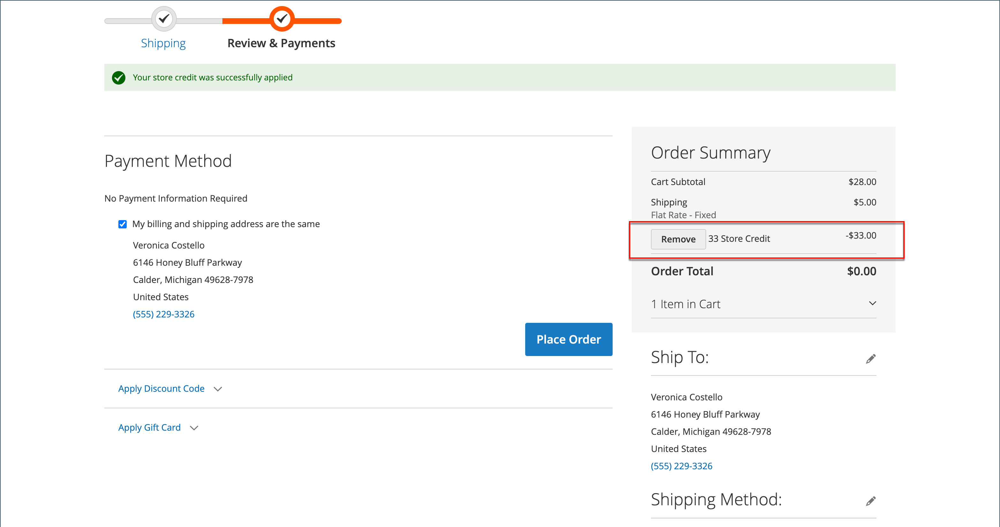

# Winkelkrediet toepassen

{{ee-feature}}

Winkelbeheerders kunnen het creditsaldo en de geschiedenis van de rekening van de klant bekijken, en ook opslagkrediet op een aankoop toepassen.

{width="600" zoomable="yes"}

## Het creditsaldo weergeven

1. Voor _Admin_ sidebar, ga **[!UICONTROL Customers]** > **[!UICONTROL All Customers]**.

1. Zoek de klant in het raster.

1. In de _kolom van de Actie_, klik **[!UICONTROL Edit]**.

1. Schuif _[!UICONTROL Customer View]_&#x200B;naar de pagina en bekijk de **[!UICONTROL Store Credit Balance]**&#x200B;onderaan.

{width="600" zoomable="yes"}

## Kredietbalans van winkel bijwerken

1. Op _Admin_ sidebar, ga **[!UICONTROL Customers]** > _Verrichtingen_ > **[!UICONTROL All Customers]**.

1. Zoek de klant in het raster.

1. In de _kolom van de Actie_, klik **[!UICONTROL Edit]**.

1. Kies **[!UICONTROL Store Credit]** in het linkerdeelvenster.

1. Kies de website (winkel) die u aan de balans wilt koppelen.

1. Voer bij **[!UICONTROL Update Balance]** de nieuwe waarde in.

1. Als u de klant op de hoogte wilt stellen van de balansupdate, schakelt u het selectievakje **[!UICONTROL Notify Customer by Email]** in en kiest u de winkelweergave in **[!UICONTROL Send Email Notification From the Following Store View]** .

1. Voer een **[!UICONTROL Comment]** in over de wijziging.

1. Klik op **[!UICONTROL Save and Continue Edit]** of **[!UICONTROL Save Customer]** als de updates zijn voltooid.

De bijgewerkte balans moet worden weergegeven in **[!UICONTROL Balance History]** .

## Pas een creditsaldo op een orde als opslagbeheerder toe

Als opslagbeheerder, kunt u diverse dingen namens een klant doen, met inbegrip van het voorleggen van orden. Wanneer u [&#x200B; een orde &#x200B;](../stores-purchase/customer-account-create-order.md) creeert, kunt u een saldo van het Krediet van de Opslag toepassen dat aan de klant toe te schrijven is. Het beschikbare saldo wordt getoond in de _Betaling &amp; Verzendinformatie_ sectie. Schakel het selectievakje **[!UICONTROL Use Store Credit]** in om de balans toe te passen of selecteer een deel van de balans als het totaal van de volgorde lager is.

{width="500" zoomable="yes"} toe

## Winkelkrediet toepassen tijdens afhandeling

Als er een creditsaldo voor de plaats is, kan de klant opslagkrediet op het ordesaldo toepassen alvorens de orde op de storefront te plaatsen.

1. De klant bekijkt de hoeveelheid beschikbaar winkelkrediet.

   Tijdens de _Controle &amp; de stap van Betalingen_, verschijnt het beschikbare bedrag onder _[!UICONTROL Store Credit]_.

1. Klik op **[!UICONTROL Use Store Credit]** om het bedrag op de volgorde toe te passen.

   >[!INFO]
   >
   >Het ordertotaal wordt opnieuw berekend en het bedrag van het opslagkrediet dat wordt toegepast, wordt weergegeven in de _[!UICONTROL Order Summary]_.

   {width="700" zoomable="yes"}

1. Klik indien gereed op **[!UICONTROL Place Order]** .
