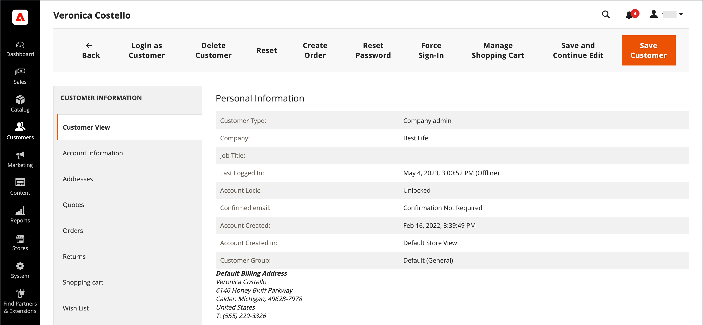

# Een klantprofiel bijwerken

Het linkerdeelvenster van het dialoogvenster _[!UICONTROL Customer Information]_Deze pagina bevat informatie over klantactiviteiten, adressen, orderstatistieken, recente bestellingen, winkelwageninhoud, productreeksen en abonnementen op nieuwsbrieven.

{width="700" zoomable="yes"}

## Een klantenaccount bewerken

Methode 1: **_Snel bewerken_**

1. Selecteer in de eerste kolom het selectievakje van de klantenaccount die u wilt bewerken.

1. Stel de **[!UICONTROL Actions]** kolom naar `Edit`.

   >[!INFO]
   >
   >De waarde van elke waarde die kan worden bijgewerkt, wordt in een tekstvak weergegeven. Alleen enkele waarden van de geselecteerde klantrecord kunnen worden bewerkt via het raster.

   {width="700" zoomable="yes"}

1. Werk indien nodig een van de volgende waarden bij:

   * **[!UICONTROL Email]**
   * **[!UICONTROL Web Site]**
   * **[!UICONTROL Tax/VAT Number]**
   * **[!UICONTROL Gender]**

1. Klik op **[!UICONTROL Save]**.

Methode 2: **_Volledig bewerken_**

1. Zoek in het raster het klantrecord dat u wilt bewerken.

1. In de _Handelingen_ kolom uiterst rechts, klik **[!UICONTROL Edit]**.

1. Breng de benodigde wijzigingen aan in de bedrijfsinformatie.

   >[!INFO]
   >
   >Zie voor meer informatie [Een klantprofiel bijwerken](../customers/update-account.md).

1. Klik op **[!UICONTROL Save Customer]**.

>[!INFO]
>
>Als u alle bewerkingen ongedaan wilt maken voordat u gaat opslaan, klikt u op **[!UICONTROL Reset]** in de bovenste knopbalk om alle wijzigingen in de laatst opgeslagen versie te retourneren.

## Klantgegevens

### [!UICONTROL Customer View]

De _Klantenweergave_ tabblad bevat informatie over de klant, waaronder **[!UICONTROL Personal Information]**, **[!UICONTROL Reward Points Balance]**, en **[!UICONTROL Store Credit Balance]**.

### [!UICONTROL Account Information]

De [Accountinformatie](../customers/account-dashboard-account-information.md) bevat gedetailleerde informatie over de klant, waar een Admin-gebruiker persoonlijke gegevens, e-mail, assistentie bij externe winkelen, geboortedatum kan bewerken en een klant aan een website of bedrijf kan koppelen.

### [!UICONTROL Addresses]

De [Adressen](../customers/account-dashboard-address-book.md) bevat de standaardfacturerings- en verzendadressen van de klant en eventuele extra adressen die deze vaak gebruikt.

### [!UICONTROL Orders]

De [Orders](../stores-purchase/orders.md) het net bevat een lijst van alle huidige klantenorden, kan de beheerder hun vooruitgang volgen.

### [!UICONTROL Returns]

{{ee-feature}}

De [Retourneert](../stores-purchase/returns.md) bevat de huidige geretourneerde klantaanvragen.

### [!UICONTROL Shopping cart]

De [winkelwagentje](../stores-purchase/cart.md) op het tabblad vindt u producten die zich momenteel in de winkelwagen bevinden, maar om welke reden de aankoop niet is voltooid.

### [!UICONTROL Wish List]

A [verlanglijst](../stores-purchase/wishlists.md) geeft een lijst weer van producten die een klant later naar het winkelwagentje kan overbrengen.

### [!UICONTROL Gift Registry]

{{ee-feature}}

De [Cadeauregister](../merchandising-promotions/gift-registry-storefront.md) in deze sectie worden de huidige cadeauregisters van de klant en de bijbehorende gebeurtenis weergegeven.

### [!UICONTROL Store Credit]

{{ee-feature}}

De [Winkelkrediet](../customers/store-credit.md) wordt een bedrag weergegeven dat naar een klantenaccount wordt teruggezet, kan de beheerder deze waarde beheren.

### [!UICONTROL Newsletter]

De [Nieuwsbrief](../merchandising-promotions/newsletters.md) worden alle e-mails weergegeven die naar de huidige klant zijn verzonden.

### [!UICONTROL Billing Agreements]

De [Factureringsovereenkomsten](../stores-purchase/paypal-billing-agreements.md) bevat alle factureringsovereenkomsten van PayPal tussen de winkel en de klant.

### [!UICONTROL Product Reviews]

De [Productbeoordelingen](../catalog/settings-advanced-product-reviews.md) worden alle revisies weergegeven die door deze klant zijn ingediend.

### [!UICONTROL Reward Points]

{{ee-feature}}

De [Punten omkeren](../merchandising-promotions/rewards-loyalty.md) wordt de huidige balans van de beloningspunten van de klant weergegeven. Een Admin-gebruiker kan deze waarde beheren.

## Knopbalk

| Knop | Beschrijving |
|----------|--------------|
| **[!UICONTROL Back]** | Hiermee gaat u terug naar de pagina Klanten zonder wijzigingen op te slaan. |
| **[!UICONTROL Login as Customer]** | Staat de capaciteit voor de handelaar toe om zich als klant aan te melden. |
| **[!UICONTROL Delete Customer]** | Hiermee verwijdert u de klantenaccount. |
| **[!UICONTROL Reset]** | Hiermee herstelt u eventuele niet-opgeslagen wijzigingen in het klantformulier naar de vorige waarden. |
| **[!UICONTROL Create Order]** | [Hiermee maakt u een volgorde](../stores-purchase/customer-account-create-order.md) die aan de klantenrekening wordt geassocieerd. |
| **[!UICONTROL Reset Password]** | Hiermee herstelt u het wachtwoord van de klant. |
| **[!UICONTROL Force Sign-In]** | Wist de tokens verbonden aan het wachtwoord van de klant en verleent de beheerder toegang tot de rekening. |
| **[!UICONTROL Manage Shopping Cart]** | Biedt toegang tot het winkelwagentje van een klant. |
| **[!UICONTROL Save and Continue Edit]** | Hiermee slaat u wijzigingen op en houdt u de klantenaccount geopend. |
| **[!UICONTROL Save Customer]** | Hiermee slaat u wijzigingen op en sluit u de klantenaccount. |

{style="table-layout:auto"}
