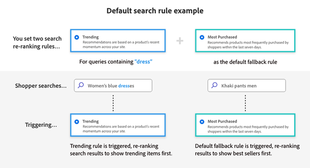

# Wat is Adobe Commerce?

Adobe Commerce is een zakelijke handelsoplossing die wereldwijd superieure e-commerce ervaringen biedt voor consumenten en B2B-kopers. Met duizenden klanten en miljarden aan jaarlijkse bruto-handelswaarde die via ons cloudplatform worden verwerkt, staat Adobe Commerce voorop bij het aansturen van de grootste en meest complexe ervaringen op het gebied van e-commerce ter wereld voor detailhandelaren, consumentenmerken, fabrikanten en groothandelaars wereldwijd.

## Ecommerce-teams staan voor unieke uitdagingen

De handelsteams moeten vandaag uitzonderlijke ervaringen voor hun klanten leveren. Een snelle, gemakkelijke, gepersonaliseerde handelservaring leidt tot verhoogde verkoop, diepere klantenverhoudingen en operationele efficiency voor uw zaken.

Helaas is het moeilijker dan ooit om uitzonderlijke commerciële ervaringen te creëren en te leveren.

- **de Technische schuld blokkeert de zaken** - complex, erfenis technische milieu&#39;s overspannen veelvoudige platforms en zijn uitdagend om te handhaven. [ 60% ](https://engage.adobe.com/DigComRptWBR-register.html) van de beroeps van de Handel zeggen zij worstelen om hun technologie te handhaven en te integreren.
- **de Teams worden verwacht om meer met minder** te doen - Vele e-handelsteams worden geconfronteerd met hoge groeiverwachtingen maar vaak worstelen om de klantenervaring wegens handprocessen, te technische oplossingen en beperkte gegevens opnieuw te bepalen. [ 56% ](https://engage.adobe.com/DigComRptWBR-register.html) van de beroeps van de Handel zeggen zij geen adequate financiering hebben.
- **de overbelasting van Gegevens** - de volumes van gegevens blijven in hoeveelheid stijgen maar vertalen niet in kwaliteitservaringen omdat het gegeven in diverse systemen wordt gevangen, makend het hard om de zaken te drijven en impliciete ervaringen tot stand te brengen. [ 60% ](https://engage.adobe.com/DigComRptWBR-register.html) van de beroeps van de elektronische handel zeggen dat zij niet de juiste gegevens in de juiste systemen hebben.
- **de consumenten verwachten meer** - het aantal kanalen en bedrijfsmodellen die de ondernemingen moeten steunen blijven vermenigvuldigen, die meer kosten en ingewikkeldheid toevoegt. [ 53% ](https://www.bloomreach.com/en/news/2020/bloomreach-releases-new-global-research-study) van consumenten zal niet opnieuw van het zelfde bedrijf kopen als zij een slechte ervaring hadden en [ 90% ](https://www.prweb.com/releases/study-90-of-b2b-buyers-will-turn-to-a-competitor-if-a-suppliers-digital-channel-doesn-t-meet-their-needs-811395853.html) van B2B kopers richt aan een concurrent als een leverancier niet digitaal aan hun behoeften kan voldoen.

## De visie van Adobe Commerce is gebaseerd op ervaringen

De visie van de Adobe is om een ervaren, data-gedreven, technologie-toegelaten handelsplatform te leveren.

- [ Ervaring-geleide ](#experience-led-commerce). Bij de Adobe zijn wij van mening dat groei voortkomt uit ervaringen. Daarom richten we ons op het aandrijven van de snelste e-commerce winkelcentra ter wereld en het machtigen van e-commerce teams tot de creatie van persoonlijke ervaringen op schaal.

- [ gegevens-aangedreven ](#data-powered-commerce). Adobe Commerce biedt naadloze gegevensuitwisseling in uw marketingtechnologiestack, zodat u uw eersteklas handelsgegevens aan het werk kunt zetten en de ervaringen op elk aanraakpunt en kanaal kunt aanpassen.

- [ technologie-toegelaten ](#tech-enabled-commerce). Adobe Commerce is een composable e-commerce platform dat wordt ontworpen om e-commerce eigenschappen sneller te lanceren, gemakkelijk gegevens tussen derdesystemen te delen, en de kosten van eigendom voor integratie en aanpassingen te drukken.

## Commerce met ervaring

Naarmate we verder gaan naar 2024, is het van cruciaal belang dat e-commercehoofden hun klanten krachtige en gepersonaliseerde ervaringen op het gebied van handel aanbieden.

### Snel bliksemschicht met Edge Delivery Services

Het onderzoek heeft aangetoond dat ongeveer [ 64% van kopers ](https://techreport.com/statistics/website-load-time-statistics-data) naar de plaats van een concurrent gaat om een gelijkaardig punt te kopen als hun Webervaring slecht is. Omgekeerd, voor elke 0.1 tweede verbetering in plaatssnelheid, kunnen de ondernemingen a [ 9.2% toename in gemiddelde ordewaarde ](https://techreport.com/statistics/website-load-time-statistics-data) verwachten.

[ Edge Delivery Services in Adobe Commerce ](https://experienceleague.adobe.com/developer/commerce/storefront/) is een reeks composable diensten die bedrijfswaarde drijft door uitzonderlijke ervaringen, in zowel inhoudsverwezenlijking als klantenervaringen te leveren. Het combineert op zaken-gebaseerde mogelijkheden, zoals op document-gebaseerde inhoud creatie en ingebouwde A/B het testen, met Adobe Commerce dropcomponenten voor kernhandelsfunctionaliteit. Dit alles wordt geleverd vanaf de rand voor bliksemsnelle winkelervaringen.

Deze nieuwe krachtige storefront is reeds met succes beproefd door verscheidene verkopers van Adobe Commerce, zoals [ Maidenform ](https://business.adobe.com/blog/perspectives/how-hanesbrands-and-adobe-built-one-of-the-fastest-ecommerce-websites-in-the-world), een bezit van HanesBrands. De resultaten spreken voor zich. De pagina&#39;s van Maidenform leveren constant de scores van de Lithouse van Google van [ 100 en de Kernwaarden van het Web ](https://treo.sh/sitespeed/www.maidenform.com) ver boven het de industriestandal.

 {width=&quot;50%&quot; align=center}
{zoomable="yes"}

>[!BEGINSHADEBOX]

Ontdek hoe HanesBrands en Adobe een geavanceerde geavanceerde geavanceerde architectuur met mogelijkheden voor gegevensdeling en personalisatie hebben ontwikkeld. [ e-Comm Masterclass: Hanesbrands creeert de snelste Storefront van de wereld ](https://business.adobe.com/summit/2024/sessions/ecomm-masterclass-hanesbrands-creates-the-worlds-f-s435.html)

>[!ENDSHADEBOX]

De kern van deze nieuwe, op ervaring gebaseerde winkel is een reeks beginselen die gericht zijn op het leveren van een composable handelservaring, met verbeterde conversie, kostenvermindering en verhoogde snelheid.

Conversie in Commerce houdt zowel verband met uw vermogen om uw klanten op externe locatie aan te sluiten op uw producten als met uw vermogen om hun ervaring op site op efficiënte maar doelgerichte wijze aan te passen. Edge Delivery Service in Commerce stuurt beide meeteenheden door principes in alle Core Web Vital te omarmen.

Dit betekent dat een snellere, ervaren-gedreven plaats hoger in onderzoeksmotoren wordt gerangschikt, die uw SEO kosten drukken, terwijl het drijven van uw organisch en sleutelwoordverkeer. Hierdoor neemt niet alleen het aantal bezoekers toe, maar ook worden uw klanten en producten naadloos met elkaar verbonden dan ooit tevoren, waardoor producten sneller kunnen worden opgespoord, geselecteerd en uitgecheckt.

U profiteert ook van lagere kosten voor het maken van inhoud, aangezien uw bedrijfsinhoud-eigenaars uw winkelervaring snel en eenvoudig kunnen verfijnen terwijl uw handelsleiders geïntegreerde Commerce-mogelijkheden leveren. Geen operationele wegversperringen meer van samenwerkende teams!

Dit alles wordt bereikt via een composable architectuur, die inhoudsbeheersysteem (CMS) en publicatiemogelijkheden samen met Adobe Commerce dropcomponenten brengt om een werkelijk flexibele Commerce-winkel te creëren. Adobe biedt een groot aantal essentiële functies voor de handel, zoals dropins, pagina&#39;s met productlijsten, productdetails en een nieuwe uitcheckdropin in één stap, waarmee u een naadloze uitcheckervaring kunt toevoegen aan de reizen van uw klanten op een plug-and-play manier. Klanten kunnen Edge Delivery Services gaan gebruiken voor belangrijke onderdelen van hun winkel, in combinatie met hun bestaande technologie, en vervolgens in de loop der tijd uitbreiden.

Het resultaat: Snelheid voor uw teams van de inhoudsverwezenlijking, snelheid in het leveren van die inhoud aan uw klanten, en snelheid in   hoe uw klanten digitaal met u in contact komen via uw nieuwe, op ervaring gebaseerde, uiterst krachtige winkel.

>[!TIP]
>
>Als u met de Dienst van Edge Delivery in Adobe Commerce wilt beginnen, kunt u zien hoe het allen samen komt [ hier.](https://experienceleague.adobe.com/developer/commerce/storefront/)

### Adobe Experience Manager Assets-integratie

Adobe brengt Adobe Experience Manager Assets samen met Adobe Commerce om uw ervaringen op het gebied van e-commerce kracht bij te zetten met onmerkbare, goedgekeurde bedrijfsmiddelen in bulk, met behulp van krachtige GenAI-mogelijkheden.

Zo kan een organisatie Experience Manager Assets-Cloud Servicen gebruiken als enige bron van waarheid voor het maken en beheren van bedrijfsmiddelen, en als een centrale DAM die Adobe Commerce in staat stelt nieuwe hoogten van schaalbaarheid van bedrijfsmiddelen te gebruiken.

Een nieuwe Regels Engine Service geeft elementen in Experience Manager Assets door aan overeenkomende producten in Adobe Commerce, op basis van SKU of andere belangrijke kenmerken, afhankelijk van uw Commerce-strategie. Updates worden automatisch gedeeld om ervoor te zorgen dat op uw site de nieuwste productelementen en assetvariaties zijn geïnstalleerd.

Pas uw klantenervaring aan en steun nieuwe productlanceringen, marktuitbreidingen, of seizoenscampagnes met verhoogde snelheid door miljoenen productactiva variaties te produceren gebruikend de diensten van GenAI in Experience Manager Assets.

### B2B Commerce

Adobe Commerce heeft jarenlang bedrijfskritieke B2B-functies voor e-commerce geleverd, waaronder bedrijfsrekeningen, goedkeuringsregels voor aankopen, prijsbeheer en klantenprijzenboeken. Dat is waarom B2B de leiders van de elektronische handel zoals [ Watsco ](https://business.adobe.com/content/dam/dx/us/en/resources/ebooks/building-better-experiences/building-better-experiences-and-bigger-profits.pdf), [ SealedAir ](https://business.adobe.com/customer-success-stories/sealed-air-case-study.html), [ ZonnegordelRentals ](https://business.adobe.com/customer-success-stories/sunbelt-rentals-case-study.html), [ Transcat ](https://business.adobe.com/customer-success-stories/transcat-case-study.html), [ FoodServiceDirect.com ](https://business.adobe.com/customer-success-stories/foodservicedirect-case-study.html), en [ Univar Oplossingen ](https://business.adobe.com/summit/2023/sessions/debunking-top-b2b-commerce-myths-s517.html) macht hun globale B2B2B e-commerce kanalen op Adobe Commerce.

Adobe is verheugd te kunnen delen dat nieuwe quoting - en bedrijfsbeheerfuncties later in 2024 beschikbaar zullen zijn .

De de beheerseigenschappen van het bedrijf staan ondernemingen toe om het even welke structuur van het kopersbedrijf te vormen die zij B2B2X, conglomeraten, of globale ondernemingen moeten steunen gebruikend de nieuwe ouder/kindrekeningsstructuren van Adobe. Kopers kunnen ook schakelen tussen meerdere onderliggende accounts voor gestroomlijnde aankopen.

Op basis van het krachtige, ingebouwde quoting-programma van Adobe Commerce kunnen B2B-verkopers sneller meer inkomsten vastleggen met nieuwe aanvraagprogramma&#39;s (RFQ), zoals conceptprijzen, dubbele aanhalingstekens, gesplitste aanhalingstekens, aanhalingstekensjablonen en toegang voor meerdere beheerders tot aanhalingstekens.

Beide mogelijkheden zijn compatibel met de native Adobe Commerce-opslagarchitectuur en implementaties zonder kop in de handel die gebruikmaken van GraphQL API&#39;s.

>[!TIP]
>Lees onze documentatie voor meer informatie over B2B Commerce-mogelijkheden:
>
>- [ Adobe Commerce B2B Gids van de Gebruiker ](https://experienceleague.adobe.com/en/docs/commerce-admin/b2b/guide-overview)
>- [ Adobe Commerce B2B de Gids van de Ontwikkelaar ](https://developer.adobe.com/commerce/webapi/rest/b2b/)

### Betalingsservices voor Adobe Commerce

[!BADGE  Beschikbaar nu ]{type=Informative tooltip="Nu beschikbaar"}

[ de Diensten van de Betaling voor Adobe Commerce ](https://business.adobe.com/products/magento/payment-services.html) is de dienst SaaS die betalingen vereenvoudigt en omzettingen en verkoopopbrengst verhoogt. In bedrijven als Toyota Noord-Amerika ondersteunt het een reeks betalingsmethoden en optionele mogelijkheden voor fraude en misbruik op meerdere markten. Op deze manier kunnen handelaren betalingen veilig beheren en gegevens bestellen in één beheerdervaring voor efficiëntieverbeteringen.

De meest recente release is gebaseerd op een reeks updates uit 2023 die Apple Pay toevoegden, een integratie met Signifyd for Fraude Protection, internationale ondersteuning voor het Verenigd Koninkrijk en Frankrijk, infrastructurele schaalvergroting voor ondernemingsvolume en transactierapportage. De nieuwe mogelijkheden breiden betalingsopties uit en maken het gemakkelijker om aan de slag te gaan, ongeacht welke winkeltechnologie wordt gebruikt.

>[!TIP]
>
>Leren hoe te om met de Diensten van de Betaling begonnen te worden, lees onze [ documentatie ](https://experienceleague.adobe.com/en/docs/commerce-merchant-services/payment-services/guide-overview).

#### Hoofdloze ondersteuning voor betalingsservices

[!BADGE  Beschikbaar nu ]{type=Informative tooltip="Nu beschikbaar"}

Betalingsservices zijn nu voorzien van GraphQL-ondersteuning, zodat verkopers betalingen kunnen accepteren en verwerken voor headless storefront-implementaties, zoals Adobe Experience Manager en andere aangepaste front-ends.

De Diensten van de betaling biedt ook recht voor u het tarief opties, met inbegrip van Uitwisseling++ voor meer concurrerende tarief van de betalingsverwerking en [ zelfbediening op het instappen ](https://experienceleague.adobe.com/en/docs/commerce-merchant-services/payment-services/get-started/production) aan de Basis van de Diensten van de Betaling die betalingsverwerkingsmogelijkheden aan bijna 200 regio&#39;s wereldwijd verstrekken.

>[!TIP]
>
>Leren hoe te om met de Diensten APIs van de Betaling begonnen te worden, lees onze [ documentatie ](https://developer.adobe.com/commerce/webapi/graphql/payment-services/).

#### Google Betalen voor betalingsservices

[!BADGE  Beschikbaar nu ]{type=Informative tooltip="Nu beschikbaar"}

Adobe Commerce steunt nu Google Pay, een belangrijke digitale portemonnee die [ 36 miljoen consumenten ](https://forecasts-na1.emarketer.com/591373e4aeb8830e3829e400/5efc402eac4d4d07841472f9?_gl=1*qmtm8x*_ga*OTEwMjg4NjExLjE3MDY2MzQ2MTk.*_ga_XXYLHB9SXG*MTcwNjk3NjkzNS44LjAuMTcwNjk3NjkzNS42MC4wLjA.*_gcl_au*MTkwNzgzOTY5OS4xNzA2NjM0NjE5LjQ3MzE4MjY5LjE3MDY3MTcyMjUuMTcwNjcxNzIyNQ..) wordt verwacht wereldwijd te bereiken. De toevoeging van Google Pay biedt ondersteuning voor populaire digitale portemonnees, waaronder Apple Pay en PayPal.

Deze digitale portemonnees bieden kopers de juiste betalingsmethode, waardoor ze meer vertrouwen krijgen in hun aankopen en hun aankopen aflopen.

>[!TIP]
>
>Leren hoe te om Google te vormen betaal, onze [ documentatie ](https://experienceleague.adobe.com/en/docs/commerce-merchant-services/payment-services/payments-checkout/payments-options#google-pay-button) lezen.

### Live zoeken, aangedreven door Adobe Sensei

[!BADGE  Beschikbaar nu ]{type=Informative tooltip="Nu beschikbaar"}

Bedrijven proberen elk deel van de koopreis te personaliseren, van het helpen van klanten de juiste producten vinden tot het leveren van gepersonaliseerde campagnes, aanbiedingen, en mededelingen over alle kanalen.

[ Levend Onderzoek, aangedreven door Adobe Sensei ](https://business.adobe.com/products/magento/live-search.html), helpt u personaliseren hoe de klanten precies vinden wat zij nodig hebben zodat kunt u uw omzettingspercentages verhogen. Live Search klanten verhogen de conversietarieven met gemiddeld 7% na het starten van Live Search, waarbij 15% van de klanten meer dan 40% van de conversietool ervaart.

De nieuwste release van Live Search van Adobe richt zich op het gebruiksgemak van deze functies en stelt u in staat de zoekervaring volledig aan te passen aan uw unieke behoeften. U kunt specifieke [ AI nu toepassen herrangschikkende regels ](https://experienceleague.adobe.com/en/docs/commerce-merchant-services/live-search/live-search-admin/rules/rules-add) voor uw hoogste volumeonderzoeken, dan die regels met een standaardreserveregel aanvullen om de lange staart van _alle andere vragen_ te behandelen.

Bijvoorbeeld, kan een handelaar een regel plaatsen dat om het even welke onderzoeksvraag die de uitdrukking &quot;jurk&quot;bevat door het _trending punten_ algoritme zou moeten worden gesorteerd. Die zelfde handelaar kan het _meeste gekochte_ algoritme voor alle andere onderzoeksvragen dan gebruiken. Met deze update kunnen merken hun topproducten voor elke zoekopdracht laten zien, waardoor gepersonaliseerde handel wordt vereenvoudigd.

 {align=center zoomable= &quot;ja&quot;

Adobe heeft ook nieuwe aanpassingsopties voor Live zoeken geïntroduceerd. Gebruikend Levende Widget van het Onderzoek [ PLP van het Onderzoek ](https://experienceleague.adobe.com/en/docs/commerce-merchant-services/live-search/live-search-storefront/plp-styling) en [ Popover Widget ](https://experienceleague.adobe.com/en/docs/commerce-merchant-services/live-search/live-search-storefront/storefront-popover), kunt u de Levende eigenschappen van het Onderzoek UI, met inbegrip van kleurenstalen, de opties van de de paginalay-out van de productdetails, toevoegen aan wortelknopen, prijsschuiven, en meer gebruikend de hulpmiddelen van de lage codeconfiguratie. Adobe verstrekt volledige flexibiliteit door een [ open codebewaarplaats ](https://experienceleague.adobe.com/en/docs/commerce-merchant-services/live-search/install), die als best-praktiserende verwijzingsimplementatie dient.

>[!TIP]
>
>Om te leren hoe te beginnen met Levend Onderzoek, onze [ documentatie en bijgewerkte installatiegids ](https://experienceleague.adobe.com/en/docs/commerce-merchant-services/live-search/overview) lezen

#### Gegevensbeheerdashboard

Adobe Commerce biedt een reeks uiterst krachtige SaaS-mogelijkheden (Software-as-a-Service) voor de ondersteuning van winkeliers en catalogusbeheer, waaronder Live Search, Product Recommendations en Catalog Service. In onze recentste versie, verstrekt de Adobe een nieuw [ Dashboard van het Beheer van Gegevens ](https://experienceleague.adobe.com/en/docs/commerce-admin/systems/data-transfer/data-dashboard) om volledige transparantie in te verstrekken hoe uw catalogus aan Levend Onderzoek, Product Recommendations, en de Dienst van de Catalogus synchroniseert.

Dit nieuwe dashboard is rechtstreeks toegankelijk via Adobe Commerce Admin ([!UICONTROL System] > [!UICONTROL Data Management Dashboard] ) en kunt u bevestigen dat alle catalogusupdates worden weerspiegeld in alle services.

## Commerce op gegevensbasis

### Integratie tussen Adobe Commerce en Adobe Experience Platform

[!BADGE  Beschikbaar Juni 2024 ]{type=Informative tooltip="Beschikbaar juni 2024"}

Vorig jaar, gaf Adobe Commerce [ Verbinding van Gegevens ](https://experienceleague.adobe.com/en/docs/commerce-merchant-services/data-connection/overview) vrij, die automatisch verzamelt, kaarten, en een waaier van de gegevens van Commerce met inbegrip van storefront klikt en de status van de achterkantoororde en de informatie van de ordegeschiedenis deelt. Vandaag, gebruiken de digitale handelsleiders de Verbinding van Gegevens om gegevenssilo&#39;s te breken, verenigde klantenprofielen en publiek tot stand te brengen, klantenreizen te personaliseren, en macht rijke analyses.

Dit jaar, zal de Adobe nog meer gegevens, met inbegrip van [ de klantenprofielen van Commerce ](https://experienceleague.adobe.com/en/docs/commerce-admin/customers/customer-accounts/manage/update-account), mobiel app gedrag, en douanekenmerken voor achterbureaugebeurtenissen delen om campagnes en ervaringen op schaal te personaliseren.

Bijvoorbeeld, zullen de klanten in real time Commerce klantenregistraties kunnen gebruiken om welkome e-mailcampagnes in [ Adobe Journey Optimizer ](https://experienceleague.adobe.com/en/docs/journey-optimizer/using/get-started/get-started) teweeg te brengen.

{align="center" zoomable="yes"}

#### E-mails met winkels in Adobe Journey Optimizer verlaten

Vertrouwd door honderden implementaties van Adobe Commerce naast andere oplossingen van Adobe Experience Cloud, lanceert de Adobe [ Playbooks van het Geval van het Gebruik ](https://experienceleague.adobe.com/en/docs/journey-optimizer/using/get-started/playbooks), die klaar-aan-gebruiksimplementatieactiva zijn die klanten toestaan om directe tijd-aan-waarde te ervaren.

Met het eerste Adobe Commerce-afspeelboek kunnen klanten eenvoudig verlaten winkelwagentcampagnes starten door hen door het proces voor gegevensinstelling te leiden. Zodra de verbinding, klanten kan snel campagnes lanceren, die hen tijd besparen en verkoop helpen optillen. Eén wereldwijde detailhandelaar behaalde 1,9x conversie-on-click, 1000 meer mensen per week opnieuw in dienst genomen, en een verhoging van de inkomsten uit dubbele cijfers door het lanceren van opruimingscampagnes met Adobe Commerce en Adobe Journey Optimizer.

Adobe voegt ook Commerce-specifieke dashboards in Adobe Experience Platform toe, zoals recensie, frequentie en monetiseringsrapporten, om marketers te helpen hun gegevens van Commerce analyseren en segmentatiestrategieën en mogelijkheden voor personalisatie identificeren.

{zoomable="yes"}

#### Verpersoonlijking activeren gebruikend publiek van Adobe In real time CDP

Vorig jaar, lanceerde Adobe Commerce ook [ Audience Activation ](https://experienceleague.adobe.com/en/docs/commerce-admin/customers/audience-activation), dat hefboomwerkingen verenigde klantenprofielen en publiek van Real-Time CDP om winkelreizen te personaliseren. Specifiek, [ Adobe Real-Time CDP ](https://experienceleague.adobe.com/en/docs/experience-platform/rtcdp/intro/rtcdp-intro/get-started) stitches Commerce gegevens met gegevens uit andere bronnen om gedetailleerde klantenprofielen en publiekssegmenten voor het richten van inhoud en promotieaanbiedingen in Adobe Commerce te bouwen.

De Adobe heeft deze [ Audience Activation ](https://experienceleague.adobe.com/en/docs/commerce-admin/customers/audience-activation) mogelijkheden uitgebreid om marketers en handelaren toe te staan om Soorten te gebruiken die in Real-Time CDP van de Adobe worden bepaald om meer aspecten van de Adobe Commerce te personaliseren die ervaring, met inbegrip van [ verwante productregels ](https://experienceleague.adobe.com/en/docs/commerce-admin/marketing/promotions/product-relationships/product-related-rules) voor upsell en dwars-verkoopt aanbevelingen naast [ bevorderingen ](https://experienceleague.adobe.com/en/docs/commerce-admin/marketing/promotions/cart-rules/price-rules-cart) en [ inhoudsblokken ](https://experienceleague.adobe.com/en/docs/commerce-admin/content-design/elements/dynamic-blocks/dynamic-blocks).

#### Handel bijhouden en aanpassen in systeemeigen mobiele apps

Adobe brengt ook hyperpersoonlijke ervaringen mee voor de handel in mobiele apps. Gebruikend [ Verbinding van Gegevens ](https://experienceleague.adobe.com/en/docs/commerce-merchant-services/data-connection/overview), kunt u mobiele toepassingsgebeurtenissen van Adobe Commerce naar andere toepassingen van Adobe Experience Cloud, met inbegrip van Adobe Real-Time CDP, Adobe Journey Optimizer, Customer Journey Analytics, Adobe Analytics, en Adobe Target verzenden. Gebruikend [ Audience Activation ](https://experienceleague.adobe.com/en/docs/commerce-admin/customers/audience-activation), kunt u de mobiele app ervaring - met inbegrip van dynamische inhoud, bevorderingen, en verwante productregels - personaliseren die op publiek binnen Adobe Real-Time CDP wordt gecreeerd en wordt geleid.

>[!TIP]
>
>- Leren hoe te om met de Verbinding van de Gegevens van Adobe Commerce te beginnen, onze [ documentatie ](https://experienceleague.adobe.com/en/docs/commerce-merchant-services/data-connection/overview) lezen.
>- Om uw verpersoonlijkingstraject te beginnen en over gemeenschappelijke het gebruiksgevallen van het verpersoonlijkingsgebruik te leren, herzie de [ verpersoonlijking bij schaaldocumentatie ](https://experienceleague.adobe.com/en/docs/commerce-admin/customers/customers-menu/personalize-scale).

Ontdek de digitale transformatietraject van Coca-Cola om gepersonaliseerde boodschappenbeleving op schaal te maken met Adobe Commerce Data Connection met Adobe Journey Optimizer en Real-time CDP. [ Coca-Cola: Het ontgrendelen van Gegevens om de consument-Centric Ervaringen van Commerce ](https://business.adobe.com/summit/2024/sessions/cocacola-unlocking-data-to-create-consumercentric-s434.html) te creëren.

## Commerce met technische mogelijkheden

### Vereenvoudigde composable ontwikkeling met App Builder

Adobe Commerce is een composable e-commerce platform dat wordt ontworpen om e-commerce eigenschappen sneller te lanceren, gemakkelijk gegevens tussen derdesystemen te delen, en de kosten van eigendom voor integratie en aanpassingen te drukken.

De traditionele composable toepassingen worden gebouwd gebruikend punt om integratie tussen de veelvoudige diensten te richten. Deze aanpak leidt tot een broze integratielaag met toenemende technische schulden. Adobe Commerce biedt ontwikkelaars uitgebreide extensiepunten en een uitbreidbaar platform voor het ordenen van API&#39;s, gebeurtenissen en gegevens die resulteren in een flexibele composable architectuur. Het Adobe Commerce-platform omvat:

- Uitgebreide [ API ](https://developer.adobe.com/commerce/webapi/) dekking en API orchestratie met [ API Net ](https://developer.adobe.com/graphql-mesh-gateway/)
- [ Webhooks ](https://developer.adobe.com/commerce/extensibility/webhooks/) om inheemse handelprocessen zoals toe te voegen aan kar en controle aan te passen
- Korrelige controle om Commerce [ Admin UI ](https://developer.adobe.com/commerce/extensibility/admin-ui-sdk/) voor douanetransacties uit te breiden
- Meer dan 700 [ gebeurtenissen ](https://experienceleague.adobe.com/en/docs/commerce-learn/tutorials/adobe-developer-app-builder/io-events/getting-started-io-events) om scalable gebeurtenis-gedreven integratie te bouwen

### De startuitrusting van de integratie &amp; pre-gebouwde integratie ERP

[!BADGE  Beschikbaar nu ]{type=Informative tooltip="Nu beschikbaar"}

Het integreren van een e-commerceplatform met uw ERP, OMS, of CRM is een opdracht-kritieke eis. Bedrijven kunnen tienduizenden dollars uitgeven aan het bouwen van deze integraties. Om de kosten te drukken om met achter-bureausystemen te integreren en de betrouwbaarheid van verbindingen in real time te verbeteren, biedt de Adobe een [ integratiestartkit ](https://developer.adobe.com/commerce/extensibility/starter-kit/create-integration/) voor Adobe Commerce aan.

De kit bevat referentie-integraties voor veelgebruikte handelsgegevens, waaronder orders, producten en klanten.  Het omvat ook instapkaartscripts en een gestandaardiseerde architectuur voor ontwikkelaars om op de volgende best practices voort te bouwen. De startkit zal naar verwachting de integratie-inspanningen met maximaal 50% verminderen. Deze referentie-integratie kan eenvoudig door ontwikkelaars worden aangepast om aan de behoeften van het bedrijf te voldoen, waardoor de tijd aan markt en de kosten van integratie worden verminderd.

In juni van 2024 zal de Adobe de eerste ERP integratieaccelerator vrijgeven die gebruikend deze integratiestartkit voor [ wordt gebouwd de Financiën &amp; Verrichtingen van de Dynamica van Microsoft van ](https://www.microsoft.com/en-us/dynamics-365/products/finance). Deze integratieversneller voor Microsoft ERP kan worden gebruikt voor het verwerken van bestellingen, het bijwerken van productgegevens en klantgegevens en het synchroniseren van voorraadniveaus van Microsoft Dynamics Finance &amp; Operations met Adobe Commerce. De Versneller van de Financiën &amp; van Verrichtingen van de Dynamica van Microsoft zal in de [ Commerce Marketplace ](https://commercemarketplace.adobe.com/) beschikbaar zijn.

### Adobe Commerce HIPAA-oplossing

Adobe heeft uitgebreide ervaring met het implementeren van HIPAA-Ready Services met klanten in de gezondheidszorg van elke omvang. Adobe stelt de norm voor een verantwoord gegevensbeheer voor consumenten, van betalers tot leveranciers en leveranciers van farmaceutische en medische producten. Deze expertise strekt zich nu uit tot de snel groeiende markt voor digitale handel in de gezondheidszorg met een HIPAA-klaar versie van het Adobe Commerce cloud platform.

De HIPAA-Ready-aanbieding is beschikbaar voor klanten van de cloud en de Managed Service van Adobe Commerce. Het omvat aanvullende controles op het gebied van veiligheid en privacy om de bescherming van elektronische persoonlijke gezondheidsinformatie (ePHI) te waarborgen, zodat organisaties op het gebied van gezondheidszorg en biowetenschappen gemakkelijker aan hun verplichtingen kunnen voldoen. De oplossing ondersteunt een aantal gebruiksgevallen, waaronder snelle en handige onlineverkoop van zorgdekking, recepten, voorgeschreven medische hulpmiddelen en medische benodigdheden. Adobe Commerce sluit zich nu aan bij de [ Adobe Experience Cloud voor de 1} reeks van de Gezondheid van oplossingen, die klanten toestaan om veilige en uitzonderlijke patiëntenervaringen te leveren terwijl het respecteren van de voorkeur van de consument.](https://business.adobe.com/solutions/industries/healthcare.html)

>[!TIP]
>
>Leer meer over HIPAA-bereidheid op Adobe Commerce, lees onze [ documentatie ](https://experienceleague.adobe.com/en/docs/commerce-admin/start/compliance/hipaa-ready-service).

### Core platform update voor Adobe Commerce

De recentste versie van [ Adobe Commerce ](https://experienceleague.adobe.com/en/docs/commerce-operations/release/notes/adobe-commerce/2-4-7) is nu beschikbaar en omvat

- 30% verbetering in de reactietijden van GraphQL API met de onlangs geïntroduceerde [ Server van de Toepassing van GraphQL ](https://experienceleague.adobe.com/en/docs/commerce-operations/performance-best-practices/concepts/application-server).

- Bulk [ de invoer ](https://developer.adobe.com/commerce/webapi/rest/modules/import/) tot 100k verslagen per minuut in formaat JSON.

- Ondersteuning voor maximaal 1 miljoen couponregels.

## Beta-kansen

Bezoek de [ pagina van de bètaversie ](https://experienceleague.adobe.com/en/docs/commerce-operations/release/beta) voor een samenvatting van bèta en vroege toegangsprogramma&#39;s, met inbegrip van IBM Sterling Order Management, de Verbinding van Gegevens aan Adobe Experience Platform, en achterkantoor ERP, CRM, en PIM integratiestarterkit gebruikend App Builder.

## Inhoud op aanvraag uit Adobe Summit

Gemiste Adobe Summit? De hele conferentie is nu op aanvraag!

Lees de [ volledige samenvatting ](https://experienceleague.adobe.com/en/docs/commerce-operations/events/summit/2024) over Adobe Commerce bij Adobe Summit met inbegrip van Adobe Commerce Roadmap, on-demand klantenpresentaties en meer!
