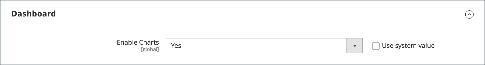

# Beheerdersdashboard

Het dashboard is gewoonlijk de eerste pagina die wanneer u login aan _Admin_ verschijnt en een overzicht in real time van verkoop en klantenactiviteit kan verstrekken. De gegevens van het dashboard verstrekken een momentopname van levenslange verkoop, gemiddelde ordehoeveelheid, recente orden, en onderzoekstermijnen. Het diagram toont voltooide orders en bedragen voor het geselecteerde datumbereik en kan worden gegenereerd op basis van dynamische gegevens, real-time gegevens of historische geaggregeerde gegevens. De tabbladen onderaan bieden snelle rapporten van uw best verkochte producten, de meeste bekeken producten, nieuwe klanten en klanten die het meest hebben aangeschaft.

Als u een aanzienlijke hoeveelheid gegevens hebt die moet worden verwerkt, kan het diagram worden uitgeschakeld om de prestaties te verbeteren. Het dashboard in het volgende voorbeeld wordt gevormd om gegevens in real time te gebruiken en toont voltooide orden tegen het uur voor de laatste 24 uren. De grafiek wordt bijgewerkt voor elke voltooide orde.

{zoomable="yes"}

[&#x200B; Geavanceerde Rapportering &#x200B;](business-intelligence.md#advanced-reporting) toont een gepersonaliseerd dashboard dat op uw product, orde, en klantengegevens wordt gebaseerd.

{zoomable="yes"}

## Het dashboard configureren

1. Voor _Admin_ sidebar, ga **[!UICONTROL Stores]** > _[!UICONTROL Settings]_>**[!UICONTROL Configuration]**&#x200B;en voltooi om het even welke volgende montages.

1. Klik op **[!UICONTROL Save Config]** wanneer de configuratie is voltooid.

1. Nadat u de wijzigingen hebt opgeslagen, klikt u op **[!UICONTROL Cache Management]** en vernieuwt u elke ongeldige cache.

### Grafieken inschakelen

Als u een grote hoeveelheid te verwerken gegevens hebt, kunt u de weergave van het diagram uitschakelen om de prestaties te verbeteren. Als deze optie niet is ingeschakeld, wordt het bericht &quot;Geen gegevens gevonden&quot; weergegeven in plaats van het diagram, hoewel de onderstaande overzichtstotalen nog steeds worden gegenereerd.

1. Kies **[!UICONTROL Admin]** onder **[!UICONTROL Advanced]** in het linkernavigatievenster.

1. Vouw indien nodig de sectie **[!UICONTROL Dashboard]** uit.

   {width="600"} toe

1. Als u de standaardwaarde wilt wijzigen, schakelt u het selectievakje **[!UICONTROL Use system value]** uit.

1. Plaats **laat Grafieken** aan `Yes` toe.

Voor meer informatie over de Admin configuratieopties, zie de [&#x200B; Gids van de Verwijzing van de Configuratie &#x200B;](../configuration-reference/advanced/admin.md).

### De startpagina wijzigen

Het dashboard is de standaard [&#x200B; startpagina &#x200B;](../configuration-reference/advanced/admin.md) voor Admin, hoewel u een verschillende startpagina kunt vormen.

1. Als u nog niet de beheerdersconfiguratieopties hebt geopend, kiest u **[!UICONTROL Admin]** onder _[!UICONTROL Advanced]_&#x200B;in het linkernavigatievenster.

1. Klik om de **Startup sectie van de Pagina** uit te breiden.

   {width="600"}

1. Wis **[!UICONTROL Use system value]** checkbox en kies de **Opstartpagina** die u wilt verschijnen wanneer u login aan Admin.

### De begindatums kiezen

1. In het linkernavigatievenster onder **[!UICONTROL General]**, kies **Rapporten**.

1. Vouw de sectie **[!UICONTROL Dashboard]** op de pagina uit.

1. Schakel de selectievakjes **[!UICONTROL Use system value]** voor de datuminstellingen uit en voer de volgende handelingen uit:

   - Plaats **jaar-aan-Datum begint** aan de **Maand** en **Dag**.

   - Plaats **Huidige Maand begint** aan de **Dag**.

   {width="600"}

Voor meer informatie over de [!UICONTROL Reports] configuratieopties, zie de [_Gids van de Verwijzing van de Configuratie_](../configuration-reference/general/reports.md).

### De gegevensbron configureren

Het dashboarddiagram kan in real time of door historische, samengevoegde gegevens te gebruiken worden geproduceerd. Als de prestaties van belang zijn, kunt u de prestaties versnellen door geaggregeerde gegevens te gebruiken.

1. In het linkernavigatievenster, klik om **Verkoop** uit te breiden en **Verkoop** te kiezen onderaan.

1. Vouw de sectie **[!UICONTROL Dashboard]** op de pagina uit.

   {width="600"}

1. Schakel het selectievakje **[!UICONTROL Use system value]** uit en stel **[!UICONTROL Use Aggregated Data]** in op een van de volgende opties:

   - Kies `Yes` voor historische, samengevoegde gegevens.
   - Kies `No` voor realtime-gegevens.

## Grafieksecties

| Sectie | Beschrijving |
|--- |--- |
| [!UICONTROL Orders] | Dit lusje toont een grafiek in real time van alle voltooide orden voor de huidige archiefmening en gespecificeerde tijdspanne. |
| [!UICONTROL Amounts] | Dit lusje toont een grafiek in real time van alle voltooide ordebedragen voor de huidige archiefmening en de gespecificeerde tijdspanne. |
| [!UICONTROL Time Range] | Bepaalt de gegevens die in de grafiek en samenvattingstotalen hieronder worden vertegenwoordigd. Opties: `Last 7 Days` / `Current Month` / `YTD` / `2YTD` |
| [!UICONTROL Summary Totals] | De totalen voor inkomsten, belastingen, verzendingen en hoeveelheden onder de grafiek zijn gebaseerd op de diagramgegevens en de instelling voor het huidige tijdbereik. |

{style="table-layout:auto"}

## Opnamegegevens

| Sectie | Beschrijving |
|--- |--- |
| [!UICONTROL Lifetime Sales] | De geaggregeerde totale verkoop tijdens de levensduur van de winkel. |
| [!UICONTROL Average Order] | Het gemiddelde orderbedrag tijdens de levensduur van de winkel. |
| [!UICONTROL Last Orders] | Een samenvatting van de laatste vijf geplaatste bestellingen. |
| [!UICONTROL Last Search Terms] | De laatste vijf zoektermen. |
| [!UICONTROL Top Search Terms] | De vijf meest gebruikte zoektermen. |

{style="table-layout:auto"}

## Tabbladen Rapport

| Sectie | Beschrijving |
|--- |--- |
| [!UICONTROL Bestsellers] | De vijf best verkochte producten gedurende de opgegeven periode. |
| [!UICONTROL Most Viewed Products] | De vijf producten werden het meest bekeken tijdens de opgegeven periode. |
| [!UICONTROL New Customers] | De meest recente vijf klanten die zich gedurende de opgegeven periode voor een account hebben geregistreerd. |
| [!UICONTROL Customers] | De laatste vijf klanten met een orde die verwerking tijdens de gespecificeerde tijdspanne voltooide. |

{style="table-layout:auto"}

## Dashboardknoppen

| Knop | Beschrijving |
|--- |--- |
| [!UICONTROL Reload Data] | Hiermee vernieuwt u de dashboardgegevens. |
| [!UICONTROL Go to Advanced Reporting] | Toont een gepersonaliseerd dashboard van dynamische grafieken en rapporten die op uw product, orde, en klantengegevens worden gebaseerd. Voor uitgebreidere analyse, zie [&#x200B; Geavanceerde Rapportering &#x200B;](business-intelligence.md#advanced-reporting). |

{style="table-layout:auto"}
