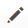

# Besturingselementen voor beheerraster

Op beheerpagina&#39;s die gegevens beheren, wordt een verzameling records in een raster weergegeven. U kunt de gegevens sorteren met de besturingselementen boven aan elke kolom. De huidige sorteervolgorde wordt aangegeven met een oplopende of aflopende pijl in de kolomkop. U kunt opgeven welke kolommen in het raster worden weergegeven en deze naar verschillende posities slepen. U kunt ook verschillende kolomregelingen opslaan als weergaven die u later kunt gebruiken. De **[!UICONTROL Action]** in de kolom worden bewerkingen weergegeven die op een afzonderlijke record kunnen worden toegepast. Bovendien kunt u de datum van de huidige weergave van de meeste rasters exporteren naar een [CSV](../systems/data-csv.md) of XML-bestand.

{width="700" zoomable="yes"}

## De lijst sorteren

1. Klik op een kolomkop.

   De pijl geeft de huidige volgorde aan als oplopend of aflopend.

1. Gebruik de pagineringsbesturingselementen om extra pagina&#39;s in de verzameling weer te geven.

   {width="300"}

## De lijst pagineren

1. Stel de **[!UICONTROL Pagination]** het aantal records dat u per pagina wilt weergeven.

1. Klikken **[!UICONTROL Next]** en **[!UICONTROL Previous]** om door de lijst te bladeren, of een specifieke **[!UICONTROL Page Number]**.

## De lijst filteren

1. Klik op **[!UICONTROL Filters]**.

1. Voer zoveel filters in als nodig zijn om de record te beschrijven die u wilt zoeken.

1. Klik op **[!UICONTROL Apply Filters]**.

   {width="700" zoomable="yes"}

## Gegevens exporteren

1. Selecteer de records die u wilt exporteren.

   >[!NOTE]
   >
   >Productgegevens kunnen niet uit het raster worden geëxporteerd. Zie voor meer informatie [Exporteren](../systems/data-export.md).

1. Op de _Exporteren_ () in de rechterbovenhoek kiest u een van de volgende bestandsindelingen:

   - `CSV`
   - `Excel XML`

   {width="700" zoomable="yes"}

1. Klik op **[!UICONTROL Export]**.

1. Zoek het gedownloade bestand met geëxporteerde gegevens op de locatie die door uw browser wordt gebruikt voor downloads.

## Rasterlay-out

De selectie van kolommen en hun volgorde in het raster kunnen naar wens worden gewijzigd en opgeslagen als een _weergave_. U kunt bepalen welke kenmerken in het raster worden weergegeven onder de afzonderlijke kenmerkconfiguratie. Veel kenmerken die in het productraster worden weergegeven, kunnen van invloed zijn op de laadtijd en prestaties van de beheerder.

{width="700" zoomable="yes"}

### De selectie van kolommen wijzigen

1. Klik in de rechterbovenhoek op de knop _Kolommen_ ().

1. Wijzig de kolomselecties:

   - Schakel het selectievakje in van de kolommen die u aan het raster wilt toevoegen.
   - Schakel het selectievakje uit van elke kolom die u uit het raster wilt verwijderen.
   - Klik op **[!UICONTROL Reset]**.

Schuif omlaag om alle beschikbare kolommen weer te geven.

### Een kolom verplaatsen

1. Klik op de kolomkop en houd de muisknop ingedrukt.

1. Sleep de kolom naar de nieuwe positie en laat deze los.

### Een rasterweergave opslaan

1. Klik op de knop _Weergave_ ().

1. Klik op **[!UICONTROL Save Current View]**.

1. Voer een **[!UICONTROL name]** voor de weergave.

1. Als u alle wijzigingen wilt opslaan, klikt u op de knop _Pijl_ ().

   De naam van de weergave wordt nu weergegeven als de huidige weergave.

### De rasterweergave wijzigen

1. Klik op de knop _Weergave_ ().

1. Voer een van de volgende handelingen uit:

   - Klik op de naam van de weergave als u een andere weergave wilt gebruiken.
   - Als u de naam van een weergave wilt wijzigen, klikt u op de knop _Bewerken_ () en werkt de naam bij.
   - Als u een weergave wilt verwijderen, klikt u op de knop _Bewerken_ () en klik vervolgens op de knop _Verwijderen_ ().
