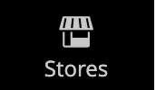

# De zijbalk Beheerder

sidebar op de linkerzijde is het belangrijkste menu voor de opslag _Admin_ en voor zowel Desktop als mobiele apparaten ontworpen. Het keuzemenu biedt toegang tot alle tools die u dagelijks gebruikt om uw winkel te beheren.

| Menupictogram | Koppeling | Beschrijving |
| --------- | ---- | ----------- |
|  | **[Admin Startpagina](../configuration-reference/advanced/admin.md)** | Hiermee geeft u de startpagina voor Admin weer. Dit is standaard het dashboard. |
|  | **[[!UICONTROL Dashboard]](admin-dashboard.md)** | Het dashboard biedt een snel overzicht van de verkoop- en klantactiviteiten in uw winkel. Dit is doorgaans de eerste pagina die wordt weergegeven wanneer u zich aanmeldt bij de beheerder. |
|  | **[[!UICONTROL Sales]](../stores-purchase/sales-menu.md)** | In het menu [!UICONTROL Sales] vindt u alles wat te maken heeft met het verwerken van bestellingen, facturen, verzendingen, creditnota&#39;s en transacties. |
|  | **[[!UICONTROL Catalog]](../catalog/catalog-menu.md)** | Het menu [!UICONTROL Catalog] wordt gebruikt om producten te maken en categorieën te definiëren. |
|  | **[[!UICONTROL Customers]](../customers/customers-introduction.md)** | In het menu [!UICONTROL Customers] kunt u klantenaccounts beheren en zien welke klanten momenteel online zijn. |
|  | **[[!UICONTROL Marketing]](../merchandising-promotions/marketing-menu.md)** | In het menu [!UICONTROL Marketing] stelt u de regels en coupons voor catalogusprijzen en winkelwagenprijzen in. Prijsregels activeren handelingen wanneer aan een aantal specifieke voorwaarden is voldaan. |
|  | **[[!UICONTROL Content]](../content-design/content-menu.md)** | In het menu [!UICONTROL Content] beheert u de inhoudselementen en het ontwerp van uw winkel. Leer hoe u pagina&#39;s, blokken en front-apps maakt en de presentatie van uw winkel beheert. |
|  | **[[!UICONTROL Reports]](reports-menu.md)** | [!BADGE &#x200B; slechts PaaS &#x200B;]{type=Informative url="https://experienceleague.adobe.com/nl/docs/commerce/user-guides/product-solutions" tooltip="Is alleen van toepassing op Adobe Commerce op Cloud-projecten (door Adobe beheerde PaaS-infrastructuur) en op projecten in het veld."} het [!UICONTROL Reports] menu verstrekt een brede selectie van rapporten die u insight in elk aspect van uw opslag, met inbegrip van verkoop, winkelwagentje, producten, klanten, markeringen, overzichten, onderzoekstermijnen, en 24/7 prestaties in real time controle en aanbevelingen van het [&#x200B; Plaats-brede Hulpmiddel van de Analyse &#x200B;](https://experienceleague.adobe.com/nl/docs/commerce-operations/tools/site-wide-analysis-tool/intro) geven. |
|  | **[[!UICONTROL Stores]](../stores-purchase/stores-menu.md)** | Het menu [!UICONTROL Stores] bevat hulpprogramma&#39;s waarmee u elk aspect van uw winkel kunt configureren en onderhouden, inclusief installatie-instellingen voor meerdere sites, belastingen, valuta, productkenmerken en klantgroepen. |
|  | **[[!UICONTROL System]](../systems/system-menu.md)** | Het menu [!UICONTROL System] bevat gereedschappen voor het beheer van systeembewerkingen, het installeren van extensies en het beheren van webservices voor integratie met andere toepassingen. |
|  | **[[!UICONTROL Find Partners & Extensions]](commerce-marketplace.md)** | [!BADGE &#x200B; slechts PaaS &#x200B;]{type=Informative url="https://experienceleague.adobe.com/nl/docs/commerce/user-guides/product-solutions" tooltip="Is alleen van toepassing op Adobe Commerce op Cloud-projecten (door Adobe beheerde PaaS-infrastructuur) en op projecten in het veld."} [!DNL Commerce Marketplace] is waar u de oplossingen van Adobe Commerce en van Magento Open Source voor uw opslag kunt vinden. |

{style="table-layout:auto"}
