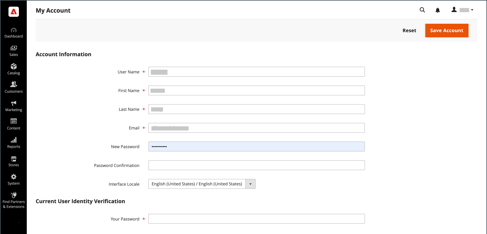

# Uw beheerdersaccount

Het primaire beheerdersaccount is oorspronkelijk ingesteld tijdens de installatie en bevat mogelijk initiële plaatsaanduidingsgegevens of voorbeeldgegevens. De aangewezen eigenaar van dit account kan de gebruikersnaam en het wachtwoord aanpassen en de voornaam, achternaam en het e-mailadres op elk gewenst moment bijwerken. Deze account, a _supergebruiker_ met alle rechten standaard worden meestal de Admin-gebruikersaccounts gemaakt die nodig zijn voor het bedrijf.

- Zie [Een gebruiker maken](../systems/permissions-users-all.md#create-a-user) voor informatie over het toevoegen of bewerken van gebruikers.

- Zie [Machtigingen](../systems/permissions.md) en [Gebruikersrollen](../systems/permissions-user-roles.md) voor informatie over Admin en gebruikersrollen.

{{ims-admin-note}}

## Aanmelden bij beheerder

De [!DNL Commerce] _Beheerder_ wordt beschermd door veelvoudige lagen van veiligheidsmaatregelen om onbevoegde toegang tot uw opslag, orde, en klantengegevens te verhinderen. De eerste keer dat u zich aanmeldt bij de _Beheerder_, moet u uw gebruikersnaam en wachtwoord invoeren en instellen [tweeledige verificatie](../systems/security-two-factor-authentication.md) (2FA).

Afhankelijk van de configuratie van uw winkel, kan er een [CAPTCHA](../systems/security-google-recaptcha.md) problemen oplossen, zoals het invoeren van een reeks toetsenbordtekens, het oplossen van een puzzel of het klikken van een reeks afbeeldingen met een gemeenschappelijk thema. Deze tests zijn ontworpen om je te identificeren als mens, in plaats van als een geautomatiseerde bot.

Voor extra veiligheid, kunt u bepalen welke delen van _Beheerder_ elke gebruiker heeft [machtiging](../systems/permissions.md) toegang te krijgen en tevens het aantal [aanmeldpogingen](../configuration-reference/advanced/admin.md). Standaard is het account na zes pogingen vergrendeld en moet de gebruiker een paar minuten wachten voordat hij het opnieuw probeert. [Vergrendelde accounts](../systems/permissions-users-all.md#locked-users) kan ook opnieuw worden ingesteld vanuit de _Beheerder_.

>[!NOTE]
>
>De eerste keer dat u zich aanmeldt bij de _Beheerder_, wordt u gevraagd _Gegevensverzameling van beheerdersgebruik toestaan_. Zie [Gegevensverzameling gebruiken](admin.md#usage-data-collection) voor meer informatie .

{width="400"}

### Stap 1: Opstelling tweefasenauthentificatie

Voordat u zich kunt aanmelden bij de _Beheerder_ van uw opslag, moet u een twee-factor authentificatieoplossing opstelling hebben en klaar om te gebruiken. Meer over het authentificatieproces leren dat door elke oplossing wordt gebruikt, zie [De verificatie met twee factoren gebruiken](../systems/security-two-factor-authentication-use.md). Standaard, [!DNL Commerce] supports [Google Authenticator][1].

Vraag uw [!DNL Commerce] systeembeheerder die de oplossingen 2FA voor de opslag worden gesteund. Voer vervolgens de installatie van de gewenste 2FA-oplossing uit volgens de instructies van de provider.

### Stap 2: Aanmelden bij de beheerder

1. Voer de _Beheerder_ URL die tijdens [!DNL Commerce] installatie.

   De standaardwaarde _Beheerder_ URL ziet er ongeveer zo uit `https://www.yourdomain.com/your-custom-admin-domain`.

   >[!NOTE]
   >
   >Hoewel deze documentatie gebruikt `admin` als basis-URL in de meeste voorbeelden, wordt aanbevolen een unieke en moeilijk te raden URL te kiezen [aangepaste URL](../stores-purchase/store-urls.md) voor de _Beheerder_ van uw winkel.

   U kunt een bladwijzer voor de pagina toevoegen of een sneltoets op uw bureaublad opslaan, zodat u deze gemakkelijk kunt openen.

1. Voer uw _Beheerder_ **[!UICONTROL Username]** en **[!UICONTROL Password]**.

1. (Optioneel) Als een CAPTCHA voor uw winkel is ingeschakeld, volgt u de aanwijzingen op het scherm om de uitdaging op te lossen.

   Zie voor meer informatie [CAPTCHA](../systems/security-captcha.md) en [reCAPTCHA](../systems/security-google-recaptcha.md).

1. Klik op **[!UICONTROL Sign in]**.

   Als het de eerste keer is dat u zich hebt aangemeld bij de _Beheerder_ van de account ontvangt u een e-mail met een koppeling naar configuratie-instructies.

### Stap 3: Voltooi de 2FA-configuratie

In het volgende voorbeeld wordt getoond hoe u uw _Beheerder_ account bij Google Authenticator.

1. Wanneer de QR-code wordt weergegeven, gebruikt u een van de volgende methoden om de code vast te leggen en Google Authenticator te koppelen aan uw _Beheerder_ account.

   {width="400"}

   - QR-code vastleggen met een smartphone

     Start Google Authenticator op uw smartphone. Tik op de knop _plusteken_ (+) in de rechterbovenhoek van de app. Tik vervolgens onder aan het scherm op **[!UICONTROL Scan Barcode]** en maak een foto van de QR-code.

   - QR-code vastleggen vanuit browser

     Als Google Authenticator als extensie in uw browser is geïnstalleerd, klikt u op de knop **Authenticator** op de werkbalk en leg de pagina vast.

   - Voer handmatig de QR-code in

     Kopieer de tekstreeks onder de QR-code. Start Google Authenticator met uw smartphone of browser en klik op het plusteken (+). Kies vervolgens **[!UICONTROL Manual Entry]**. Onder **[!UICONTROL Account]** voert u het e-mailadres in dat aan uw _Beheerder_ account en plak de tekenreeks QR-code in de **[!UICONTROL Key]** veld.

1. Aanmelden bij de _Beheerder_ met twee-factor authentificatie, ga de zes-cijfercode in die door de Authenticator van Google in wordt geproduceerd **[!UICONTROL Authenticator code]** en klik vervolgens op **[!UICONTROL Confirm]**.

   {width="400"}

## Wachtwoord opnieuw instellen

Hergebruik van de laatste vier wachtwoorden die aan de account zijn toegewezen, is niet toegestaan.

1. Voer de **[!UICONTROL Email Address]** die verband houdt met de _Beheerder_ account.

   {width="400"}

1. Klik op **[!UICONTROL Retrieve Password]**.

   Als een account aan het e-mailadres is gekoppeld, wordt een e-mail verzonden om uw wachtwoord opnieuw in te stellen.

   >[!NOTE]
   >
   >An _Beheerder_ Het wachtwoord moet uit minimaal zeven tekens bestaan en zowel letters als cijfers bevatten. Zie [Configureren _Beheerder_ Beveiliging](../systems/security-admin.md) voor informatie over wachtwoordopties.

## Afmelden bij de beheerder

1. Klik in de rechterbovenhoek op de knop _Account_ ().

1. Klik op **[!UICONTROL Sign Out]**.

   {width="700" zoomable="yes"}

De _[!UICONTROL Sign In]_op de pagina wordt een bericht weergegeven dat u bent afgemeld. Afmelden bij_ Beheerder _wanneer u de computer onbewaakt verlaat.

## Accountgegevens bewerken

1. Klik op de knop _Account_ ().

1. Klik op **[!UICONTROL Account Setting]**.

   {width="700" zoomable="yes"}

1. Breng de benodigde wijzigingen aan in uw accountgegevens.

   Als u uw aanmeldingsgegevens wijzigt, moet u ervoor zorgen dat u deze op een veilige locatie opslaat.

1. Voer het wachtwoord voor uw huidige account in.

1. Klik op **[!UICONTROL Save Account]**.

## Meerdere Admin-aanmeldingen toestaan

De beheerder biedt toegang om de functies voor bestellingen, klanten, producten, verzending en betalingen te beheren. De standaardconfiguratie wordt geplaatst om veelvoudige logins voor een Admin gebruikersrekening als veiligheids beste praktijken niet toe te staan. U kunt deze instelling echter wijzigen zodat Admin-gebruikers zich vanaf meerdere apparaten kunnen aanmelden voor uw zakelijke workflows.

1. Op de _Beheerder_ zijbalk, ga naar **[!UICONTROL Stores]** > _[!UICONTROL Settings]_>**[!UICONTROL Configuration]**.

1. Vouw in het navigatievenster aan de linkerkant de optie **[!UICONTROL Advanced]** en kiest u **[!UICONTROL Admin]**.

1. Uitbreiden  de **[!UICONTROL Security]** sectie.

1. Voor **Account delen beheren**, selecteert u `Yes`.

   {width="700" zoomable="yes"}

1. Klik op **[!UICONTROL Save Config]**.

## Aanmeldingsnamen van Admin-gebruikers instellen als hoofdlettergevoelig

1. Op de _Beheerder_ zijbalk, ga naar **[!UICONTROL Stores]** > _[!UICONTROL Settings]_>**[!UICONTROL Configuration]**.

1. Vouw in het navigatievenster aan de linkerkant de optie **[!UICONTROL Advanced]** en kiest u **[!UICONTROL Admin]**.

1. Uitbreiden  de **[!UICONTROL Security]** sectie.

1. Stel de **[!UICONTROL Login is Case Sensitive]** veld naar `Yes`.

1. Klik op **[!UICONTROL Save Config]**.

[1]: https://play.google.com/store/apps/details?id=com.google.android.apps.authenticator2&amp;hl=en_US
