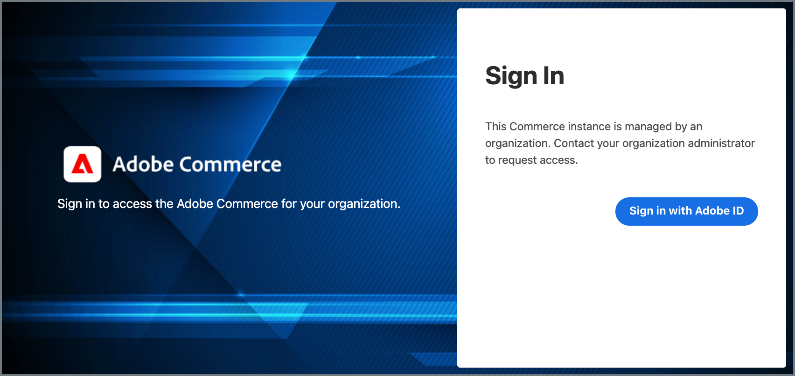

# De integratie van het Experience Cloud configureren met Commerce Admin

Ga aan de slag met de Experience Cloud-integratie met Commerce Admin door de Commerce-toepassing te configureren voor gebruik van de Commerce Admin Unified Experience en Commerce Events-extensies.


## Vereisten

- Adobe Commerce moet worden gevormd om [ authentificatie van Adobe te gebruiken IMS ](../getting-started/adobe-ims-config.md)
- De levering van de rekening en toestemmings-beheerders moeten een [ Adobe bedrijfsprofiel ](https://helpx.adobe.com/enterprise/kb/introducing-adobe-profiles.html#:~:text=Adobe%20profiles%20help%20you%20manage,under%20the%20same%20email%20address) met toegang tot de volgende middelen hebben om de integratie van het Experience Cloud te vormen:
   - [ Adobe Admin Console ](https://helpx.adobe.com/enterprise/admin-guide.html) - voeg en beheer de gebruikers en de ontwikkelaars van de Adobe rekeningen voor de organisatie toe
   - [ Adobe Developer Console ](https://developer.adobe.com/developer-console/docs/guides/getting-started/) - de ontwikkelaar of de toegang van de systeembeheerder om de projecten van App Builder tot stand te brengen en de verbindingsgeloofsbrieven en projectconfiguratie te produceren om de dienst van de Gebeurtenissen van de Adobe I/O te gebruiken
   - [ Commerce op het project van de wolkeninfrastructuur ](https://experienceleague.adobe.com/docs/commerce-cloud-service/start/onboarding.html#get-started-with-the-project-web-interface) - installeer vereiste modules en vorm de de toepassingsserver van Commerce gebruikend Adobe Commerce CLI
   - [ Commerce Admin ](https://experienceleague.adobe.com/docs/commerce-admin/start/guide-overview.html) - de opslagconfiguratie van de Update en beheert Commerce gebruikersrekeningen

## Overzicht van configuratie

Schakel de integratie in door de volgende taken uit te voeren:

1. [ controleer het milieu en de toepassingsconfiguratie van Commerce ](#check-the-commerce-environment-and-application-configuration).

1. [ laat de Commerce Admin Verenigde uitbreiding van de Ervaring ](#enable-the-commerce-admin-unified-experience-extension) toe.

1. [ de Gebeurtenissen van Adobe I/O van de opstelling voor Commerce ](#set-up-adobe-io-events).

1. [ Test de integratie ](#test-the-integration).

## De Commerce-omgeving en toepassingsconfiguratie controleren

Voordat u de integratie van het Experience Cloud configureert, controleert u of uw project en Commerce-toepassing aan de vereisten voldoen.

1. Wijzig op uw lokale werkstation de projectmap voor uw Commerce-project.

1. Bekijk de omgevingsvertakking voor de instantie die u met het Experience Cloud wilt integreren.

1. Controleer of Adobe IMS is ingeschakeld.

   - Gebruik [ de Toegang URL van SSH ](https://experienceleague.adobe.com/docs/commerce-cloud-service/user-guide/develop/secure-connections.html) voor het milieu om met de de toepassingsserver van Commerce te verbinden.

   - Gebruik vanuit de opdrachtregel de Adobe Commerce CLI om de status van de IMS-module te controleren.

     ```bash
     bin/magento admin:adobe-ims:status
     ```

   Als de module niet wordt toegelaten, [ laat het toe gebruikend de Organisatie en geloofsbrieven voor het IMS integratieproject ](../getting-started/adobe-ims-config.md#step-3-enable-the-adminadobeims-module).

1. Controleer of de Admin-gebruiker zich met Adobe ID kan aanmelden bij de Commerce Admin.

   - Ga naar de Commerce Admin URL.

   - Als u bent aangemeld, meldt u zich af.

   - Zorg ervoor dat de Admin-gebruiker opnieuw wordt omgeleid om zich aan te melden met behulp van zijn Adobe ID.

     {width="600" zoomable="yes"}

1. Van de folder van het wolkenproject op uw lokale werkstation, verifieer dat de Commerce Admin Verenigde uitbreiding van de Ervaring geïnstalleerd is.

   ```bash
   composer show *unified-experience*
   ```

   Als de extensie is geïnstalleerd, retourneert Composer de naam en beschrijving van de extensie.

   ```
   magento/module-unified-experience <version> Commerce module responsible for integration with Adobe Experience Cloud
   ```

   Als de extensie niet is geïnstalleerd, installeert u deze met Composer. Breng vervolgens de wijzigingen aan en implementeer de cloudomgeving opnieuw.

   ```
   composer require magento/module-unified-experience
   composer update
   ```

## Commerce Admin Unified Experience inschakelen

Schakel de Commerce Admin Unified Experience-extensie in en meld u vervolgens aan via het Experience Cloud.

>[!NOTE]
>
>Deze instructies tonen hoe een Commerce Cloud projectbeheerder de uitbreiding kan toelaten gebruikend Adobe Commerce CLI. De gebruikers van Admin van Commerce kunnen de uitbreiding ook toelaten door de [ montages van de de opslagconfiguratie van Commerce ](admin-unified-experience-integration-manage.md#from-the-commerce-admin) bij te werken.

1. Van de wortelfolder van uw het projectmilieu van de Wolk op uw lokale werkstation, gebruik het [ magento-wolk CLI hulpmiddel ](https://experienceleague.adobe.com/docs/commerce-cloud-service/user-guide/dev-tools/cloud-cli/cloud-cli-overview.html) aan login aan de de toepassingsserver van Commerce.

   ```bash
   magento-cloud ssh
   ```

1. De extensie `magento/module-unified-experience` inschakelen met de Adobe Commerce CLI:

   ```bash
   bin/magento config:set admin/unified_experience/enabled 1
   Admin Unified Experience integration is enabled
   ```

1. Wis de cache.

   ```bash
   bin/magento cache:clean
   ```

## Adobe I/O-gebeurtenissen instellen voor Commerce

Wanneer de integratie van het Experience Cloud wordt toegelaten, verzendt de dienst van de Gebeurtenissen van Adobe I/O Commerce gebeurtenisgegevens naar Experience Cloud om beheerdertoegang tot de projecten van Commerce te beheren. De de dienstopstelling vereist het toelaten van de Gebeurtenissen van de Adobe I/O voor de uitbreiding van Commerce (`magento/commerce-eventing`) en het vormen van de dienst van de Gebeurtenissen van de Adobe I/O in Admin.

### Commerce-gebeurtenissen inschakelen

Schakel de extensie Commerce Events (`magento/commerce-eventing`) in om aangepaste gebeurtenisgegevens van de Commerce-toepassing naar de service Adobe I/O Events te verzenden.

>[!NOTE]
>
>Voor Commerce 2.4.6 en hoger wordt de extensie Commerce Events standaard geïnstalleerd. Voor de projecten van Commerce met Commerce 2.4.5, gebruik eerst Composer om [ de uitbreiding ](https://developer.adobe.com/commerce/extensibility/events/installation/#install-adobe-io-modules-on-commerce) te installeren, dan het toe te laten.

1. Voeg vanuit uw lokale Commerce-projectontwikkelomgeving de volgende configuratie toe aan het `.magento.env.yaml` -bestand.

   ```yaml
   stage:
     global:
       ENABLE_EVENTING: true
     deploy:
       CRON_CONSUMERS_RUNNER:
         cron_run: true
         max_messages: 0
         consumers: []
   ```

1. Voeg de bijgewerkte `.magento.env.yaml file` toe aan de cloud-omgeving, wijs deze toe en implementeer deze.

>[!TIP]
>
>Voor details bij het vormen van en het beheren van omgevingsvariabelen die het `.magento.env.yaml` dossier gebruiken, zie [ milieu variabelen voor plaatsing ](https://experienceleague.adobe.com/docs/commerce-cloud-service/user-guide/configure/env/configure-env-yaml.html) vormen.

### De integratie met Commerce Events configureren

Configureer de integratie met Commerce Events door de volgende taken uit te voeren. Voor gedetailleerde instructies, zie {de Gebeurtenissen van 0} Adobe I/O voor de ontwikkelaarsdocumentatie van Commerce ](https://developer.adobe.com/commerce/extensibility/events/project-setup/).[

1. [ creeer een project van App Builder ](https://developer.adobe.com/commerce/extensibility/events/project-setup/) om gebeurtenisgegevens van de instantie van Commerce te ontvangen.

   U hebt geloofsbrieven en configuratiegegevens van het project van App Builder nodig om de integratie in Commerce Admin te vormen.

1. Configureer Adobe Commerce om Adobe I/O-gebeurtenissen te gebruiken.

   - [ werk de montages van de Configuratie van de Opslag voor de dienst van de Gebeurtenissen van Adobe I/O ](https://developer.adobe.com/commerce/extensibility/events/configure-commerce/#begin-configuring-events-on-commerce) bij.

   - [ vorm een gebeurtenisleverancier om de gebeurtenissen van Commerce ](https://developer.adobe.com/commerce/extensibility/events/configure-commerce/#create-an-event-provider-and-complete-the-commerce-configuration) te verzenden.

1. [ werk het project van App Builder bij om gebeurtenisgegevens van de instantie van Commerce ](https://developer.adobe.com/commerce/extensibility/events/configure-commerce/#subscribe-and-register-events) te ontvangen.

   Registreer of schrijf niet in voor gebeurtenissen van het Commerce-exemplaar. De gebeurtenisregistratie wordt naar het App Builder-project geduwd wanneer u de gebeurtenisprovider voor de Commerce-toepassing configureert.

   Nadat u de gebeurtenisprovider aan het App Builder-project hebt gekoppeld, meldt u zich aan de `observer.uex_commerce_instance_update` -gebeurtenis en slaat u de wijzigingen op.

1. Om de verbinding tot stand te brengen, verzend een gebeurtenis door de gebeurtenisleverancier aan de consument.

   - Van de bevellijn in de lokale folder van het wolkenproject, [ gebruik SSH om met de de toepassingsserver van Commerce ](https://experienceleague.adobe.com/docs/commerce-cloud-service/user-guide/develop/secure-connections.html#connect-to-a-remote-environment) te verbinden.

     ```bash
     magento-cloud ssh
     ```

   - Verzend gebeurtenisgegevens door de status van de Admin Verenigde uitbreiding van de Ervaring te controleren gebruikend Adobe Commerce CLI.

     ```bash
     bin/magento bin/magento admin:uex:status
     ```

### Integratie testen

Verifieer dat een Beheerder van Commerce zich bij Experience Cloud kan aanmelden om beschikbare projecten van Commerce te bekijken en tot Admin en Storefront voor elk project toegang te hebben.

1. [ Teken binnen aan Experience Cloud ](https://experiencecloud.adobe.com/library) gebruikend Adobe ID en de organisatie verbonden aan de instantie van Commerce.

   {width="600" zoomable="yes"}

1. U kunt beschikbare Commerce-projecten weergeven door **[!UICONTROL Commerce]** te selecteren.

   {width="600" zoomable="yes"}

1. Open Admin voor een instantie door **[!UICONTROL Open]** te selecteren.

   {width="600" zoomable="yes"}

1. Controleer of u de beheertaken naar behoren kunt uitvoeren.

   Workflows in de Commerce-beheerder moeten hetzelfde proces volgen. Als u werkschemaveranderingen of fouten na het toelaten van de Experience Cloud integratie ervaart, contacteer uw het systeembeheerder van Commerce of [ voorlegt een kaartje van de Steun van de Adobe ](https://experienceleague.adobe.com/docs/commerce-knowledge-base/kb/help-center-guide/magento-help-center-user-guide.html#submit-ticket).

Nadat u de integratie van het Experience Cloud vormt, verifieer dat de beheerderrekeningen correct zijn provisioned om tot de projecten van Commerce door Experience Cloud toegang te hebben. Zie [ Admin gebruikers beheren ](/help/getting-started/admin-unified-experience-integration-manage.md#manage-admin-user-accounts).
