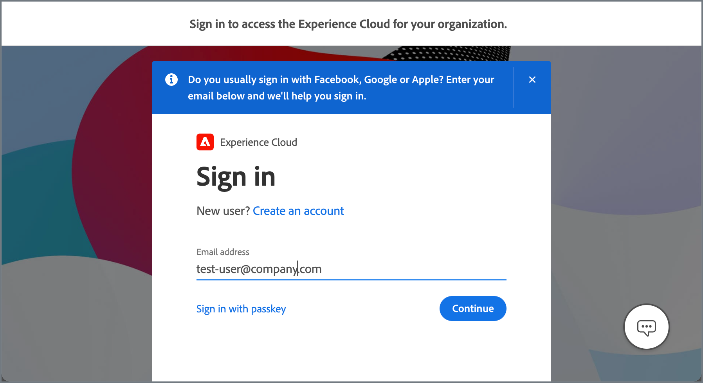

# Adobe Experience Cloud-integratie voor Commerce

<table style="border:1px solid red">
<tr><td> De exclusieve eigenschap slechts in Adobe Commerce (<a href="https://experienceleague.adobe.com/docs/commerce-admin/user-guides/home.html?lang=nl-NL#product-editions"> leert meer </a>)</td></tr>
</table>

Integreer Adobe Commerce-projecten met Experience Cloud door de beheerdersinterface Unified Experience-extensie in te schakelen. Als de integratie actief is, hebben beheerders toegang tot Commerce-projecten vanuit Adobe Experience Cloud.

{width="700" zoomable="yes"}

## Beschikbare Commerce-projecten weergeven

Beheerders kunnen Commerce-projecten bekijken waartoe ze toegang hebben door **[!UICONTROL Commerce]** te selecteren op de startpagina van Experience Cloud.

{width="700" zoomable="yes"}

Beheerders kunnen de opdrachten Admin en Storefront voor elk project openen vanuit de [!DNL Commerce Projects] -werkruimte en aanvullende informatie weergeven.

- **Momentopname van Commerce storefront homepage** - Momentopname van de storefront homepage. Als een project veelvoudige websites heeft, toont de momentopname de homepage voor de standaardplaats.

- **[naam van het Project ](https://experienceleague.adobe.com/docs/commerce-cloud-service/user-guide/architecture/pro-develop-deploy-workflow.html?lang=nl-NL)** - identificeert het milieu van het wolkenproject voor de instantie. De naam van het Project blijft aan de [ vertakkingsnaam van de it ](https://experienceleague.adobe.com/docs/commerce-cloud-service/user-guide/project/console-branches.html?lang=nl-NL) in het wolkenproject in gebreke. Verandering of werk de projectnaam in de [ Verenigde montages van de de opslagconfiguratie van de Ervaring ](admin-unified-experience-integration-manage.md#manage-the-integration-from-the-admin) bij.

- **[opslag URL](../stores-purchase/store-urls.md)** - toont de basis URL voor de standaardwebsite.

- **[het type van Milieu ](https://experienceleague.adobe.com/docs/commerce-cloud-service/user-guide/architecture/pro-develop-deploy-workflow.html?lang=nl-NL)** - de instanties van Commerce die aan een ontwikkeling of het opvoeren milieu worden opgesteld worden geïdentificeerd met a [!UICONTROL Development] of [!UICONTROL Staging] etiket. Instanties zonder label worden geïmplementeerd in een productieomgeving.

- **toegang van Admin van Commerce** - open Admin door **[!UICONTROL Open]** te klikken.

- **toegang van de Storefront** - open de storefront door **[!UICONTROL Open storefront]** van het optiemenu te selecteren.

- **Snelle toegang tot uitgezochte projecten** - selecteer **[!UICONTROL Add to Favorites]** van het optiemenu om een project aan [!UICONTROL Favorites] tabel toe te voegen.

## Verificatiestroom

Wanneer de integratie van Experience Cloud is ingeschakeld, gebruiken beheerders de volgende workflow om Commerce-projecten te verifiëren en te openen.

1. Meld u aan via de aanmeldingspagina van Experience Cloud.

   {width="600" zoomable="yes"}

   Beheerders moeten zich aanmelden bij Experience Cloud met het Adobe-bedrijfsprofiel voor de organisatie die is gekoppeld aan het Commerce-exemplaar. Zie [ de profielen van Adobe beheren ](https://helpx.adobe.com/nl/enterprise/using/manage-adobe-profiles.html).

1. Open op de startpagina van Experience Cloud de [!UICONTROL Commerce Projects workspace] door **[!UICONTROL Open]** te selecteren.

1. U kunt de beheerder van een project openen door **[!UICONTROL Open]** te selecteren.

1. Selecteer op de Adobe Commerce-pagina Aanmelden **[!UICONTROL Sign in with Adobe ID]** om de verificatie te voltooien en open Admin.

   {width="600" zoomable="yes"}

>[!NOTE]
>
>Zie [ de Integratie van Experience Cloud beheren ](admin-unified-experience-integration-manage.md) voor details op hoe het authentificatiewerkschema wordt beïnvloed wanneer de integratie van Experience Cloud wordt toegelaten of onbruikbaar gemaakt.

## Vereisten

- Adobe Commerce 2.4.5 of hoger
- Adobe Commerce over cloudinfrastructuur
- Adobe Commerce-extensies

   - Commerce Admin Unified Experience Extension (`magento/module-unified-experience`)

     Als de module niet beschikbaar is op de Commerce-instantie, kan deze worden geïnstalleerd met Composer.

   - [ de dienst van Adobe I/O Events ](https://developer.adobe.com/commerce/extensibility/events/) - vereist om gebeurtenisgegevens te verzenden om beheerdertoegang tot de projecten van Commerce van Experience Cloud te beheren.

     De integratie van Adobe I/O Events met Commerce wordt toegelaten door de uitbreiding van de Gebeurtenis van Commerce (`magento/commerce-eventing`) die met Adobe Commerce 2.4.4 en recentere versies beschikbaar is.

## Integratie inschakelen

Laat de integratie toe door de instructies te volgen om [ de Integratie van Experience Cloud met Commerce te vormen Admin ](admin-unified-experience-integration-configure.md).

>[!TIP]
>
>Als de integratie van Experience Cloud reeds op de instantie van Commerce wordt toegelaten, zie [ de Integratie van Experience Cloud ](admin-unified-experience-integration-manage.md) voor details over het veranderen van of het bijwerken van de configuratie, het beheren van beheerderstoegang, en het oplossen van problemen beheren.
