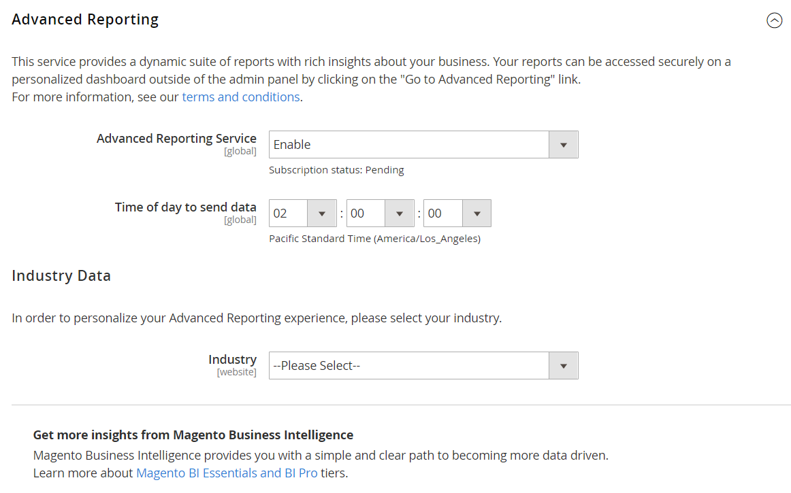

# [!DNL Commerce Intelligence] gereedschappen

Gebruik Commerce Intelligence-tools om de insight te winnen die wordt gebruikt om goede zakelijke beslissingen te nemen.

## [!DNL Commerce Intelligence] account

Wanneer u een [!DNL Commerce Intelligence] -account activeert via Adobe, hebt u toegang tot vijf dashboards met ongeveer 70 rapporten. Deze rapporten zijn ontworpen om inzicht te verschaffen in uw gegevens en vragen te beantwoorden zoals &quot;Hoe worden mijn bestellingen maandelijks gegroeid?&quot;, &quot;Wie zijn mijn meest loyale klanten?&quot;, en &quot;Werkt mijn couponstrategie?&quot; Voor gedetailleerde informatie over deze hulpmiddelreeks, zie de [ Gids van de Gebruiker van Commerce Intelligence ](https://experienceleague.adobe.com/docs/commerce-business-intelligence/mbi/guide-overview.html).

## [!DNL Advanced Reporting]

[!DNL Advanced Reporting] wordt geleverd bij Adobe Commerce en Magento Open Source. Deze functie biedt u toegang tot een reeks dynamische rapporten die op uw product, orde, en klantengegevens gebaseerd zijn, met een gepersonaliseerd dashboard dat aan uw bedrijfsbehoeften wordt aangepast. Hoewel [!DNL Advanced Reporting] [!DNL Commerce Intelligence] gebruikt voor analyses, hoeft u geen Commerce Intelligence-account te hebben om [!DNL Advanced Reporting] te gebruiken.

Voor technische informatie, zie het [[!DNL Advanced Reporting] ](https://developer.adobe.com/commerce/php/development/advanced-reporting/){:target="_blank"} onderwerp in de ontwikkelaardocumentatie.

>[!NOTE]
>
>Vanwege compatibiliteitsproblemen met [!DNL Adobe Commerce Intelligence] kan Commerce tijdelijk geen ondersteuning bieden voor Geavanceerde rapportage met AWS S3 Bucket als medium voor het brongegevensbestand in [!DNL Commerce Intelligence] .

{width="700"}

### Vereisten

* De website moet worden uitgevoerd op een openbare webserver.

* Het domein moet een geldig beveiligingscertificaat (SSL) hebben.

* [!DNL Commerce] moet zonder fout zijn geïnstalleerd of bijgewerkt.

* In de [!DNL Commerce] configuratie voor [ opslag URLs ](../stores-purchase/store-urls.md), moet het **[!UICONTROL Base URL (Secure)]** plaatsen voor de opslagmening aan veilige URL richten. Bijvoorbeeld: `https://yourdomain.com` .

* In de [!DNL Commerce] -configuratie voor opslag-URL&#39;s moeten **[!UICONTROL Use Secure URLs on Storefront]** en **[!UICONTROL Use Secure URLs in Admin]** zijn ingesteld op `Yes` .

* [[!DNL Commerce]  contab ](https://experienceleague.adobe.com/docs/commerce-operations/configuration-guide/cli/configure-cron-jobs.html) wordt gecreeerd en de bouwbanen lopen op de geïnstalleerde server.

>[!NOTE]
>
>[!DNL Advanced Reporting] kan slechts met [!DNL Commerce] installaties worden gebruikt die voortdurend één enkele [ basismunt ](../stores-purchase/currency-configuration.md) hebben gebruikt.


### Stap 1: Inschakelen [!DNL Advanced Reporting]

In de [!DNL Commerce] configuratie, [[!DNL Advanced Reporting]](../configuration-reference/general/advanced-reporting.md) wordt toegelaten door gebrek, en begint automatisch als de kruin [ ](../configuration-reference/advanced/system.md) wordt gevormd en loopt. Een poging om het abonnement te vestigen wordt begonnen aan het begin van elk uur over de volgende 24 uur tot succesvol. De status van het abonnement is in behandeling totdat het abonnement is ingesteld.

1. Voor _Admin_ sidebar, ga **[!UICONTROL Stores]** > _[!UICONTROL Settings]_>**[!UICONTROL Configuration]**.

1. Kies **[!UICONTROL General]** in het navigatievenster aan de linkerkant waar **[!UICONTROL Advanced Reporting]** wordt uitgevouwen en voer de volgende handelingen uit:

   * Controleer of **[!UICONTROL Advanced Reporting Service]** is ingesteld op `Enable` (de standaardinstelling).

   * Stel de **[!UICONTROL Time of day to send data]** in op het uur, de minuut en de seconde, volgens een 24-uurs klok, dat u wilt dat de service bijgewerkte gegevens van uw winkel ontvangt. Door gebrek, wordt het gegeven verzonden bij 2 :00 AM.

   * Kies onder **[!UICONTROL Industry Data]** de **[!UICONTROL Industry]** die het beste uw bedrijf beschrijft.

   {width="400"}

1. Klik op **[!UICONTROL Save Config]** als de bewerking is voltooid.

1. Klik wanneer daarom wordt gevraagd op **[[!UICONTROL Cache Management]](../systems/cache-management.md)** in het bericht boven aan de pagina en vernieuw eventuele ongeldige cache.

1. Wacht een nacht of tot na de tijd van de volgende geplande update. Controleer vervolgens de status van uw abonnement. Als de status nog _hangend_ is, zorg ervoor dat uw installatie aan alle vereisten voldoet.

### Stap 2: Toegang [!DNL Advanced Reporting]

1. Voer een van de volgende handelingen uit:

   * Voor _Admin_ sidebar, kies **[!UICONTROL Dashboard]**. Klik vervolgens op **[!UICONTROL Go to Advanced Reporting]** .
   * Voor _Admin_ sidebar, ga **[!UICONTROL Reports]** > _[!UICONTROL Business Intelligence]_>**[!UICONTROL Advanced Reporting]**.

   Het dashboard van [!DNL Advanced Reporting] verstrekt een snel overzicht van uw orden, klanten, en producten. Schuif omlaag om het volledige dashboard weer te geven.

1. Voor een betere weergave van de gegevens stelt u **[!UICONTROL Filters]** in de rechterbovenhoek in op de tijdsperiode en de opslagweergave die u in het rapport wilt opnemen. Voer vervolgens de volgende handelingen uit:

   * Houd de muisaanwijzer boven een gegevenspunt voor meer informatie.
   * Klik op elk tabblad om alle dashboardrapporten weer te geven.

   {width="600" zoomable="yes"}

## [!DNL Advanced Reporting] gegevensbronnen openen

Klik in de rechterbovenhoek van het dashboard Geavanceerde rapportage op **[!UICONTROL Additional Resources]** .

{width="600" zoomable="yes"}

## Problemen oplossen

Als je het bericht &quot;Pagina niet gevonden&quot; van 404 ontvangt, controleer dan of je winkel voldoet aan de vereisten voor [!DNL Advanced Reporting] . Volg vervolgens de instructies om te controleren of de integratie is geïnstalleerd.

### Controleren of de integratie actief is

1. Voor _Admin_ sidebar, ga **[!UICONTROL System]** > _[!UICONTROL Extensions]_>**[!UICONTROL Integration]**.

1. Controleer of de **[!UICONTROL Magento Analytics user]** -integratie in de lijst wordt weergegeven en of **[!UICONTROL Status]** is `Active` .

1. Klik op **[!UICONTROL Reauthorize]** en voer de volgende handelingen uit om de gebruiker opnieuw tot stand te brengen:

   {width="600"}

   * Klik wanneer u daarom wordt gevraagd op **[!UICONTROL Reauthorize]** om de toegang tot de API-bronnen goed te keuren.

     {width="600"}

   * Verifieer dat de lijst van de Tokens van de Integratie voor Uitbreidingen volledig is. Dan, klik **Gereed**.

     {width="600"}

1. Zoek het bericht dat aangeeft dat de integratie `Magento Analytics user` opnieuw is geautoriseerd.

1. Wacht een nacht of tot na het tijdstip van de volgende geplande update.

### Eén basisvaluta verifiëren

[!DNL Advanced Reporting] kan slechts met [!DNL Commerce] installaties worden gebruikt die slechts één enkele [ basismunt ](../stores-purchase/currency-configuration.md) sinds de tijd van installatie hebben gebruikt. Het resultaat is dat in de geschiedenis alle orders dezelfde basisvaluta gebruiken. [!DNL Advanced Reporting] werkt niet als u op enig moment uw basisvaluta hebt gewijzigd en bestellingen in uw geschiedenis hebt uitgevoerd die met verschillende basisvaluta&#39;s zijn verwerkt.

Om te bepalen of uw opslag veelvoudige basisvaluta&#39;s heeft, kunt u uw [!DNL Commerce] gegevensbestand van de bevellijn vragen gebruikend het volgende voorbeeld MySQL. Mogelijk moet u de tabelnamen aanpassen aan de gegevensstructuur:

```sql
select distinct base_currency_code from sales_order;
```

### Gegevensafwijking

Als u merkt dat het bijschrift `Data last updated...` de datum van gisteren en niet die van vandaag toont, zou er een vertraging van tot een dag in de Geavanceerde updates van de Rapportering kunnen zijn. Deze vertraging is te wijten aan een groter dan verwachte wachtrijgrootte.

## Dashboardrapporten

**[!UICONTROL Orders]**

| Veld | Beschrijving |
|--- |--- |
| [!UICONTROL Revenue] | Toont alle opbrengst die door de archiefmening tijdens de bepaalde tijdspanne wordt ontvangen. |
| [!UICONTROL Orders] | Toont alle orden die door de archiefmening tijdens de bepaalde tijdspanne worden geplaatst. |
| [!UICONTROL AOV] | Toont de gemiddelde die ordewaarde door de archiefmening tijdens de bepaalde tijdspanne wordt geplaatst. |
| [!UICONTROL Refunds] | Toont alle terugbetalingen die door de archiefmening tijdens de bepaalde tijdspanne worden verwerkt. |
| [!UICONTROL Tax Collected] | Toont alle belasting die door de archiefmening tijdens de bepaalde tijdspanne wordt verzameld. |
| [!UICONTROL Shipping Collected] | Hiermee worden alle verzendkosten weergegeven die tijdens de opgegeven periode via de winkelweergave zijn geïnd. |
| [!UICONTROL Orders by Status] | Toont het aantal orden door status, voor de archiefmening tijdens de bepaalde tijdspanne. |
| [!UICONTROL Orders by Status] | Hiermee geeft u een overzicht van het aantal bestellingen per status. |
| [!UICONTROL Coupon Usage] | Hiermee geeft u alle couponcodes en het aantal gebruikers voor elke code weer, die gedurende de gedefinieerde periode via de winkelweergave zijn afgelost. |
| [!UICONTROL Orders and Revenue by Billing Region] | Vermeldt het aantal orders en de opbrengst per gebied voor de archiefmening tijdens de bepaalde tijdspanne. |
| [!UICONTROL Tax Collected by Billing Region] | Hier wordt het bedrag aan belasting weergegeven dat per regio is geïnd voor de winkelweergave tijdens de gedefinieerde tijdsperiode. |
| [!UICONTROL Shipping Fees Collected by Shipping Region] | Hier worden de verzendkosten weergegeven die per regio zijn geïnd voor de winkelweergave tijdens de gedefinieerde periode. |

{style="table-layout:auto"}

**[!UICONTROL Customers]**

| Veld | Beschrijving |
|--- |--- |
| [!UICONTROL Unique Customers] | Toont het aantal unieke klantenrekeningen verbonden aan de archiefmening tijdens de bepaalde tijdspanne. |
| [!UICONTROL New Registered Accounts] | Toont het aantal nieuwe die klantenrekeningen bij de archiefmening tijdens de bepaalde tijdspanne worden geregistreerd. |
| [!UICONTROL Top Coupon Users] | Hiermee geeft u de hoogste gebruikers van de coupon weer op basis van de klant-id en het aantal orders met coupons voor de winkelweergave tijdens de gedefinieerde periode. |
| [!UICONTROL Customer KPI Table] | Vermeldt het aantal bestellingen, de omzet en de gemiddelde orderwaarde per klant-id voor de winkelweergave tijdens de gedefinieerde periode. |

{style="table-layout:auto"}

**[!UICONTROL Products]**

| Veld | Beschrijving |
|--- |--- |
| [!UICONTROL Quantity of Products Sold] | Hier wordt het aantal producten weergegeven dat tijdens de gedefinieerde periode via de winkelweergave is verkocht. |
| [!UICONTROL Products Added to Wishlists] | Hiermee geeft u alle producten weer die tijdens de gedefinieerde tijdsperiode aan verlanglijsten zijn toegevoegd via de winkelweergave. |
| [!UICONTROL Best Selling Products by Quantity] | Hier worden de best verkochte producten en de hoeveelheid weergegeven die tijdens de gedefinieerde periode via de winkelweergave zijn verkocht. |
| [!UICONTROL Best Selling Products by Revenue] | Hier worden de best verkochte producten en inkomsten weergegeven die worden gegenereerd door de verkoop van het product via de winkelweergave tijdens de gedefinieerde periode. |

{style="table-layout:auto"}
