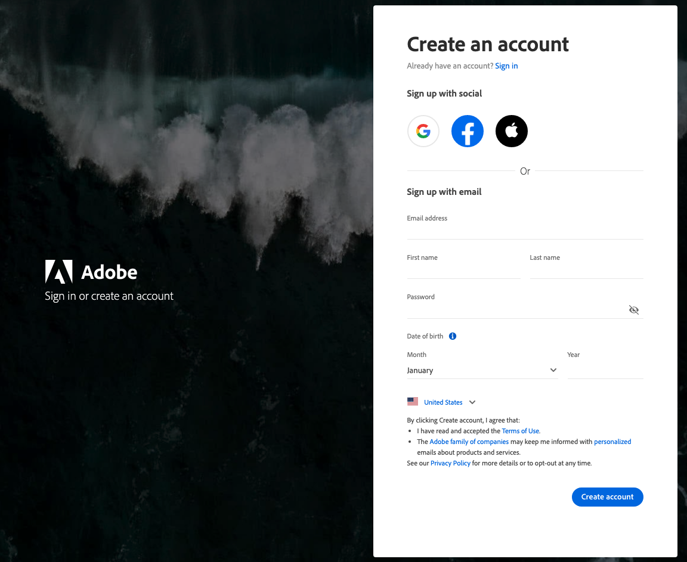
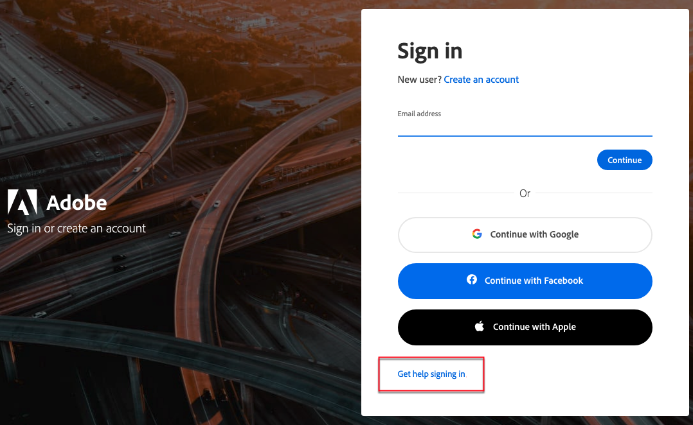

# Toegang tot uw [!DNL Commerce] -account

U kunt uw account openen vanaf de [!DNL Commerce] -website. Vanuit het dashboard van uw [!DNL Commerce] -account kunt u informatie vinden die betrekking heeft op de producten en services die u hebt aangeschaft, maar ook op uw contact- en factureringsgegevens. Sommige informatie is alleen zichtbaar voor eigenaars van licenties.

U kunt uw account openen vanaf de [!DNL Commerce] -website. Op het accountdashboard worden de aangeschafte producten, services en contact- of factureringsgegevens weergegeven. Sommige informatie is alleen zichtbaar voor eigenaars van licenties.

![ Uw [!DNL Commerce] rekening ](./assets/home-acct.png){width="700"}

De aanmelding voor uw [!DNL Commerce] -account staat los van de aanmelding voor Admin-beheer van uw winkel. U zult normaal verschillende geloofsbrieven voor elk gebruiken, en de toegang tot elk systeem wordt geleid onafhankelijk.

Nochtans, zal een gebruiker die hun login aan de Bedrijfs Adobe Commerce en Adobe producten wil stroomlijnen hun Adobe ID aan login aan store Admin kunnen vormen: [ vormt de Integratie van Admin van Commerce met Adobe ID ](https://experienceleague.adobe.com/nl/docs/commerce-admin/start/admin/ims/adobe-ims-config)

Uw aanmeldingsgegevens voor Commerce en Admin-opslag zijn gescheiden, met verschillende referenties en onafhankelijk beheerde toegang. U kunt de toegang echter stroomlijnen door uw Adobe ID te configureren voor aanmelding bij de winkel Admin. Zie [ de Integratie van Commerce Admin met Adobe ID ] in de *Gids van de Integratie IMS voor Commerce* vormen.

>[!NOTE]
>
>Nadat u uw rekening creeert, wordt het geadviseerd dat u de Authentificatie van twee factoren (TFA) gebruikt om uw rekening [ te beveiligen ](commerce-account-secure.md).

## Aanmelden bij uw [!DNL Commerce] -account

Een Adobe ID is vereist voor toegang tot een Commerce-account. Als u al een Commerce-account hebt maar geen Adobe ID, kunt u er een maken tijdens het aanmeldingsproces.

>[!WARNING]
>
>Gebruik het e-mailadres dat is gekoppeld aan de bestaande MAGEID van je Commerce-account om de Adobe ID te maken. Als u een ander, gloednieuw e-mailadres gebruikt, maakt u een nieuwe MAGEID.

1. Ga naar de [[!DNL Commerce]  plaats ](https://account.magento.com/customer/account/login/).

1. Klik op **[!UICONTROL Sign in with Adobe ID]**.

   {width="700"}

1. Voer uw e-mailadres in en klik op **[!UICONTROL Continue]** .

   >[!TIP]
   >
   >Als u een e-mailadres hebt gebruikt dat is gekoppeld aan een bestaande MAGEID van een Commerce-account, wordt dit door het aanmeldingsproces automatisch gekoppeld aan uw Adobe ID.

## Een [!DNL Commerce] -account maken

Iedereen kan een gratis [!DNL Commerce] account maken. Het e-mailadres dat u gebruikt, kan slechts aan één Commerce-account worden gekoppeld.

>[!NOTE]
>
>Gebruik een Adobe ID om een Commerce-account te maken en te openen.
>- Als u geen Commerce-account hebt, kunt u er een maken tijdens het aanmeldingsproces.
>- Als u reeds een rekening van Commerce hebt maar u hebt geen Adobe ID, zie [ login aan een rekening van Commerce ](#log-in-to-your-dnl-commerce-account).

1. Ga naar de [[!DNL Commerce]  plaats ](https://account.magento.com/customer/account/login/).

1. Klik op **[!UICONTROL Sign in with Adobe ID]**.

1. Als u geen Adobe ID hebt, klikt u op **[!UICONTROL Create an account]** . Anders gaat u verder met stap 7.

   {width="700"}

1. Vul het aanmeldingsformulier in.

   {width="700"}

1. Klik op **[!UICONTROL Create account]**.

1. Voer de verificatiecode in die naar uw e-mailadres is verzonden.

   {width="700"} in

1. Ga terug naar https://account.magento.com/ nadat uw Adobe ID is gemaakt en geverifieerd. Er wordt een MAGE-ID gegenereerd en automatisch gekoppeld aan uw Adobe ID.

## Wachtwoord opnieuw instellen

1. Ga naar de [[!DNL Commerce]  plaats ](https://account.magento.com/customer/account/login/).

1. Klik op **[!UICONTROL Sign in with Adobe ID]**.

1. Klik op **[!UICONTROL Get help signing in]**.

   {width="700"}

1. Klik op **[!UICONTROL Reset your password]**.

   {width="700"}

1. Voer uw e-mailadres in.

1. Klik op **[!UICONTROL Continue]**.
