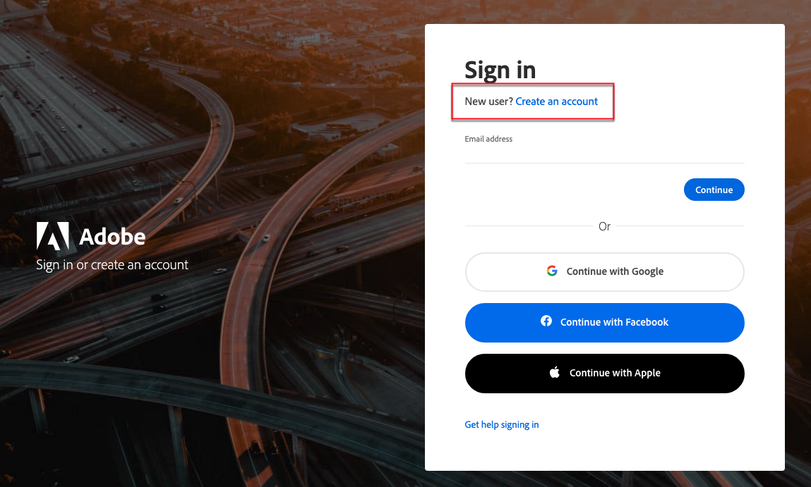

# Toegang tot uw [!DNL Commerce] -account

Een [!DNL Commerce] -account is uw centrale toegangspunt voor het beheer van Adobe Commerce-services voor Adobe Commerce-projecten die worden geïmplementeerd op cloudinfrastructuur of op locatie. Vanuit het accountdashboard kunt u abonnementen weergeven, de API-sleutels voor Commerce Services beheren, historische factureringsgegevens controleren en samenwerken met andere gebruikers in uw organisatie.

Als u uw eerste kaartje [&#x200B; moet voorleggen of uw verhouding van Adobe Commerce - eerder dan het werken binnen een specifieke storefront - begin door tot uw &#x200B;](https://experienceleague.adobe.com/nl/docs/commerce-knowledge-base/kb/help-center-guide/magento-help-center-user-guide#support-case) rekening te leiden of toegang te hebben.[!DNL Commerce]

U kunt uw [!DNL Commerce] -account openen via de [!DNL Commerce] -website. Van het rekeningsdashboard, kunt u informatie met betrekking tot de producten en de diensten bekijken u hebt gekocht en [&#x200B; Gedeelde Toegang &#x200B;](https://experienceleague.adobe.com/nl/docs/support-resources/adobe-support-tools-guide/adobe-commerce-support/adobe-commerce-help-center-user-guide#provide-shared-access) aan andere gebruikers verstrekken. Bepaalde informatie, zoals de API-sleutels voor Commerce Services, is alleen zichtbaar voor eigenaars van licenties.

>[!NOTE]
>
>In de sectie **[!UICONTROL Billing History]** op de [!DNL Commerce] -accountpagina worden alleen facturen weergegeven die zijn gemaakt voordat het factureringssysteem wordt bijgewerkt.
>
>Als er geen nieuwere facturen worden vermeld, zijn deze naar het nieuwe systeem overgebracht en zijn ze niet vanaf deze pagina toegankelijk.

![&#x200B; Uw [!DNL Commerce] rekening &#x200B;](./assets/home-acct.png){width="700"}

De aanmelding voor uw [!DNL Commerce] -account staat los van de aanmelding voor Admin-beheer van uw winkel. U zult normaal verschillende geloofsbrieven voor elk gebruiken, en de toegang tot elk systeem wordt geleid onafhankelijk.

Nochtans, kan een gebruiker die hun login aan de Bedrijfs Adobe Commerce en Adobe producten wil stroomlijnen hun Adobe ID vormen om aan login aan de opslag Admin te vormen: [&#x200B; vormt de Integratie van Commerce Admin met Adobe ID &#x200B;](https://experienceleague.adobe.com/nl/docs/commerce-admin/start/admin/ims/adobe-ims-config) in de *Gids van de Integratie IMS voor Commerce*.

>[!NOTE]
>
>Nadat u uw rekening creeert, wordt het geadviseerd dat u de Authentificatie van twee factoren (TFA) gebruikt om uw rekening [&#x200B; te beveiligen &#x200B;](commerce-account-secure.md).

## Aanmelden bij uw [!DNL Commerce] -account

Een Adobe ID is vereist voor toegang tot uw [!DNL Commerce] -account. Als u een bestaande [!DNL Commerce] -account hebt, maar zich sinds augustus 2022 niet hebt aangemeld, moet u een Adobe ID maken tijdens het aanmeldingsproces. U moet deze stap voltooien voordat u zich kunt aanmelden bij uw account.

>[!WARNING]
>
>Als u niet de organisatie van Commerce kunt vinden wanneer het voorleggen van een Adobe Commerce [&#x200B; steungeval &#x200B;](https://experienceleague.adobe.com/nl/docs/support-resources/adobe-support-tools-guide/adobe-commerce-support/adobe-commerce-help-center-user-guide#support-case), betekent het gewoonlijk één van het volgende: De Eigenaar van de Rekening heeft geen Adobe ID gecreeerd, of Adobe ID bestaat maar niet met de rekening van Commerce verbonden.

1. Ga naar de [[!DNL Commerce] &#x200B;](https://account.magento.com/customer/account/login/) -site.

1. Klik op **[!UICONTROL Sign in with Adobe ID]**.

   {width="700"}

1. Voer uw e-mailadres in en klik op **[!UICONTROL Continue]** .

   >[!TIP]
   >
   >Als u een e-mailadres hebt gebruikt dat is gekoppeld aan een bestaande MAGEID van een Commerce-account, wordt dit door het aanmeldingsproces automatisch gekoppeld aan uw Adobe ID.

## Een [!DNL Commerce] -account maken

Iedereen kan een gratis [!DNL Commerce] account maken. Het e-mailadres dat u gebruikt, kan slechts aan één Commerce-account worden gekoppeld.

>[!NOTE]
>
>Gebruik een Adobe ID om een Commerce-account te maken en te openen.
>- Als u geen Commerce-account hebt, kunt u er een maken tijdens het aanmeldingsproces.
>- Als u reeds een rekening van Commerce hebt maar u hebt geen Adobe ID, zie [&#x200B; login aan een rekening van Commerce &#x200B;](#log-in-to-your-dnl-commerce-account).

1. Ga naar de [[!DNL Commerce]  plaats &#x200B;](https://account.magento.com/customer/account/login/).

1. Klik op **[!UICONTROL Sign in with Adobe ID]**.

1. Als u geen Adobe ID hebt, klikt u op **[!UICONTROL Create an account]** . Anders gaat u verder met stap 7.

   {width="700"}

1. Vul het aanmeldingsformulier in.

   {width="700"}

1. Klik op **[!UICONTROL Create account]**.

1. Voer de verificatiecode in die naar uw e-mailadres is verzonden.

   {width="700"} in

1. Ga terug naar https://account.magento.com/ nadat uw Adobe ID is gemaakt en geverifieerd. Er wordt een MAGE-ID gegenereerd en automatisch gekoppeld aan uw Adobe ID.

## Wachtwoord opnieuw instellen

1. Ga naar de [[!DNL Commerce]  plaats &#x200B;](https://account.magento.com/customer/account/login/).

1. Klik op **[!UICONTROL Sign in with Adobe ID]**.

1. Klik op **[!UICONTROL Get help signing in]**.

   {width="700"}

1. Klik op **[!UICONTROL Reset your password]**.

   {width="700"}

1. Voer uw e-mailadres in.

1. Klik op **[!UICONTROL Continue]**.

## Gedeelde toegang tot uw Commerce-account bieden

De gedeelde Toegang staat u toe om vertrouwde op gebruikers-zoals collega&#39;s, partners, of beheerder-toestemming te verlenen om uw verhouding van Adobe Commerce namens u te beheren zonder uw persoonlijke login te gebruiken. Dit omvat ook het openen en volgen van ondersteuningsgevallen door anderen.

Zie [&#x200B; een Commerce rekening &#x200B;](https://experienceleague.adobe.com/nl/docs/commerce-admin/start/commerce-account/commerce-account-share?lang=en) sectie van Adobe Commerce delen Begonnen Gids voor gedetailleerde stappen bij vestiging een gedeelde rekening.

Voor gedetailleerde instructies bij het voorleggen van een de steungeval van Commerce, zie de [&#x200B; gebruikersgids van het Centrum van de Hulp van Adobe Commerce &#x200B;](https://experienceleague.adobe.com/nl/docs/support-resources/adobe-support-tools-guide/adobe-commerce-support/adobe-commerce-help-center-user-guide#support-case).

## Overzicht

| Scenario | Wat gebeurt er? | Wat moet u doen met Adobe ID | Wat moet je doen voor MAGE ID / Commerce account | Resultaat |
| --- | --- | --- | --- | --- |
| Nieuw in Adobe en Commerce | Geen Adobe ID, geen MAGE-ID | Een Adobe ID maken wanneer hierom wordt gevraagd tijdens het aanmelden bij https://account.magento.com | Meld u opnieuw aan bij https://account.magento.com nadat Adobe ID is gemaakt | Er wordt een Commerce-account gemaakt en een MAGE-id gegenereerd en gekoppeld aan de Adobe ID |
| Heeft Adobe ID, maar nog geen MAGE-ID | Gebruikt alleen andere Adobe-producten | Aanmelden bij Adobe ID op https://account.magento.com | Als u zich voor het eerst aanmeldt, worden het Commerce-account en de MAGE-id gemaakt | MAGE-id wordt automatisch gemaakt en gekoppeld |
| Verouderde Commerce-klant met oude MAGE-ID | Heeft een historische MAGE-ID, maar geen Adobe ID | Een Adobe ID maken op https://account.adobe.com met dezelfde e-mail als de bestaande MAGE-id | Meld u aan bij https://account.magento.com met &quot;Aanmelden met Adobe ID&quot; | Bestaande MAGE-id is gekoppeld aan de nieuwe Adobe ID |
| Adobe ID- en MAGE-id bestaan maar zijn niet gekoppeld | E-mails voor Adobe ID en Commerce verschillen | De Adobe ID-e-mail uitlijnen zodat deze overeenkomt met de e-mail voor de Commerce-account (of andersom, afhankelijk van het eigendom) | Meld u aan via &quot;Aanmelden met Adobe ID&quot; op https://account.magento.com nadat de e-mailberichten overeenkomen | Adobe ID wordt de aanmeldingsnaam; de MAGE-id blijft de machtigings-id |
| Heeft Adobe ID maar geen MAGE-ID | Nooit aangemeld bij https://account.magento.com | De bestaande Adobe ID gebruiken | Aanmelden bij https://account.magento.com voor het eerst | Met deze eerste aanmelding wordt een MAGE-id gegenereerd en gekoppeld |
| Gebruikt alleen aanmelding voor cloudproject (accounts.magento.cloud) | Kan cloudproject openen, maar geen klassiek Commerce-account | Doorgaan met Adobe ID for cloud-project | Meld u ook aan bij https://account.magento.com met dezelfde Adobe ID als u Marketplace/licenties nodig hebt | Er wordt een klassieke Commerce-account (met MAGE-id) gemaakt en gekoppeld |

Als een gebruiker van mening is dat hij of zij Commerce-rechten moet hebben maar geen MAGE-id ziet, is de volgende standaardstap het aanmelden via https://account.magento.com zodat een Commerce-account en MAGE-id kunnen worden gemaakt of correct kunnen worden gekoppeld.
