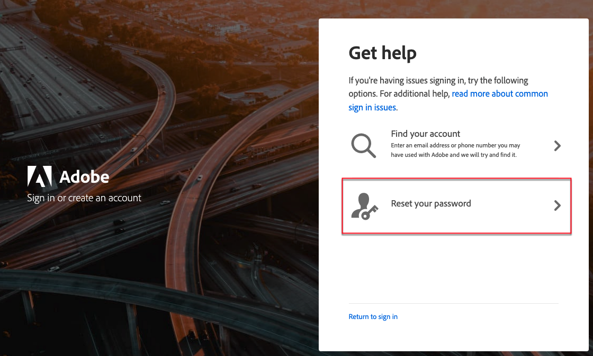

# Toegang tot uw [!DNL Commerce] -account

Uw [!DNL Commerce] -account heeft een aparte aanmelding van uw winkel Admin. U kunt dit account openen via de [!DNL Commerce] -website of via uw winkel Admin. Vanuit het dashboard van uw [!DNL Commerce] -account kunt u informatie vinden die betrekking heeft op de producten en services die u hebt aangeschaft, maar ook op uw contact- en factureringsgegevens. Sommige informatie is alleen zichtbaar voor eigenaars van licenties.

![ Uw [!DNL Commerce] rekening ](./assets/home-acct.png){width="700"}

>[!NOTE]
>
>Nadat u uw rekening creeert, wordt het geadviseerd dat u de Authentificatie van twee factoren (TFA) gebruikt om uw rekening [ te beveiligen ](commerce-account-secure.md).

## Aanmelden bij uw [!DNL Commerce] -account

Een Adobe ID is vereist voor toegang tot een Commerce-account. Als u al een Commerce-account hebt maar geen Adobe ID, kunt u er een maken tijdens het aanmeldingsproces.

>[!WARNING]
>
>Gebruik het e-mailadres dat is gekoppeld aan de MAGEID van je bestaande Commerce-account. Als u een ander e-mailadres gebruikt, wordt een MAGEID gemaakt.

1. Ga naar de [[!DNL Commerce]  plaats ](https://account.magento.com/customer/account/login/).

1. Klik op **[!UICONTROL Sign in with Adobe ID]**.

   {width="700"}

1. Voer uw e-mailadres in en klik op **[!UICONTROL Continue]** .

   >[!TIP]
   >
   >Als u een e-mailadres hebt gebruikt dat is gekoppeld aan een bestaande MAGEID van een Commerce-account, wordt dit door het aanmeldingsproces automatisch gekoppeld aan uw Adobe ID.

## Een [!DNL Commerce] -account maken

Iedereen kan een gratis [!DNL Commerce] account maken. Het e-mailadres dat u gebruikt om een Commerce-account te maken, kan aan slechts één account worden gekoppeld.

>[!NOTE]
>
>Gebruik een Adobe ID om een Commerce-account te maken en te openen. Als u geen Adobe ID hebt, kunt u er een maken tijdens het maken van een account. Als u reeds een rekening van Commerce hebt maar u hebt geen Adobe ID, zie [ login aan een rekening van Commerce ](#log-in-to-your-dnl-commerce-account).

1. Ga naar de [[!DNL Commerce]  plaats ](https://account.magento.com/customer/account/login/).

1. Klik op **[!UICONTROL Sign in with Adobe ID]**.

1. Klik op **[!UICONTROL Create an account]**.

   {width="700"}

1. Vul het aanmeldingsformulier in.

   {width="700"}

1. Klik op **[!UICONTROL Create account]**.

1. Voer de verificatiecode in die naar uw e-mailadres is verzonden.

   {width="700"} in

## Wachtwoord opnieuw instellen

1. Ga naar de [[!DNL Commerce]  plaats ](https://account.magento.com/customer/account/login/).

1. Klik op **[!UICONTROL Sign in with Adobe ID]**.

1. Klik op **[!UICONTROL Get help signing in]**.

   {width="700"}

1. Klik op **[!UICONTROL Reset your password]**.

   {width="700"}

1. Voer uw e-mailadres in.

1. Klik op **[!UICONTROL Continue]**.
