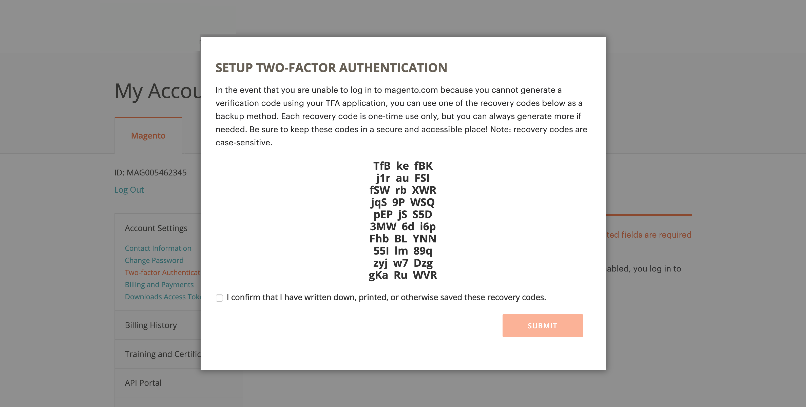
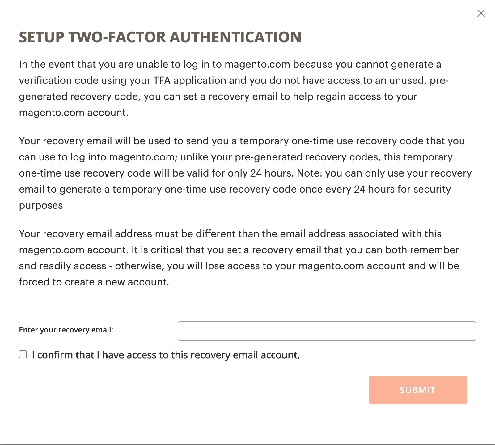

# Uw [!DNL Commerce] -account beveiligen

Twaalfakanaalverificatie (TFA of 2FA) is een extra beveiligingslaag om uw [!DNL Commerce] -account beter te beschermen tegen ongeoorloofde toegang. Om het login proces te voltooien, vereist TFA a _tweede factor_ naast de standaardgebruikersbenaming en wachtwoordgeloofsbrieven. Deze tweede factor heeft de vorm van tijdelijke verificatiecodes die continu worden gegenereerd door een TFA-toepassing die op uw mobiele apparaat is geïnstalleerd en die aan uw [!DNL Commerce] -account is gekoppeld.

Als TFA is ingeschakeld, is uw account veiliger. Een onbevoegde gebruiker kan niet login tenzij zij zowel uw gebruikersbenaming als wachtwoordgeloofsbrieven (eerste factor) en een geldige controlecode van de toepassing van TFA op uw persoonlijk apparaat (tweede factor) hebben.

>[!NOTE]
>
>De twee-factor authentificatie die _Admin_ van uw opslag beschermt heeft een afzonderlijke opstelling. Meer leren, zie [ two-Factor Authentificatie ](../systems/security-two-factor-authentication.md).

## Voordat u begint

Om TFA te gebruiken, moet u een toepassing van TFA hebben die op uw persoonlijk apparaat (zoals uw smartphone, tablet, computer) wordt geïnstalleerd. Er zijn er veel beschikbaar, maar een aantal populaire en gratis opties zijn:

- Google Authenticator (iOS, Android™, BlackBerry®)

- Autorisatie (iOS, Android™)

- Microsoft® Authenticator (iOS, Android™, Windows Phone)

## Twee-factor verificatie inschakelen

1. Login aan uw [[!DNL Commerce]  rekening ][1] {:target= &quot;_blank&quot;}.

1. Selecteer **[!UICONTROL Account Settings]** in het linkernavigatievenster en selecteer vervolgens **[!UICONTROL Two-factor Authentication]** .

   {width="600" zoomable="yes"} toe

1. Selecteer **[!UICONTROL Enable]** om met het proces van de twee-factor authentificatie te beginnen.

1. Voer de **[!UICONTROL Verification Code]** in die naar uw e-mail is verzonden en selecteer **[!UICONTROL Verify Code]** om door te gaan.

   {width="400"} in

1. Open de twee-factor verificatietoepassing die u hebt gedownload en op uw persoonlijke apparaat hebt geïnstalleerd.

1. Voeg in het [!UICONTROL SETUP TWO-FACTOR AUTHENTICATION] -formulier Adobe Commerce toe aan uw TFA-toepassing met **[!UICONTROL Setup Code]** .

   {width="400"}

   U kunt de code toevoegen door de QR-code te scannen met de TFA-toepassing of door deze handmatig in te voeren. Met deze code wordt uw TFA-toepassing gecombineerd met uw [!DNL Commerce] -account en kunnen de machtigingen voor het genereren van de TFA-app verificatiecodes genereren voor beveiligde toegang tot de account.

1. Voltooi de installatie.

   - Voer in het [!UICONTROL SETUP TWO FACTOR-AUTHENTICATION] -formulier de verificatiecode in vanuit uw tweefasenverificatietoepassing.

   - Selecteer **[!UICONTROL Verify Code]** .

   >[!NOTE]
   >
   >Voor veiligheid, verlopen de verificatiecodes in uw toepassing van TFA onophoudelijk en regenereren. **_altijd_** gebruik de code die momenteel wordt getoond.

1. Sla de **[!UICONTROL Recovery Codes]** -presentatie op een veilige en toegankelijke plaats op.

   {width="400"}

   Als u geen verificatiecode kunt opgeven wanneer u zich aanmeldt bij uw [!DNL Commerce] -account, moet u een herstelcode gebruiken om de toegang tot uw account te herstellen.

   Elke terugwinningscode kan slechts één keer worden gebruikt, maar u kunt [&#128279;](#generate-new-recovery-codes) nieuwe degenen  produceren. Herstelcodes zijn hoofdlettergevoelig.

1. Schakel het selectievakje voor bevestiging in en selecteer **[!UICONTROL Submit]** om door te gaan.

1. Voer een **[!UICONTROL Recovery Email]** in om ervoor te zorgen dat u toegang tot uw account kunt herstellen.

   Dit e-mailadres is nodig als u geen verificatiecode kunt genereren vanuit uw tweefasenverificatietoepassing en u geen toegang hebt tot een ongebruikte vooraf gegenereerde herstelcode.

   Eenmaal in de 24 uur kunt u een tijdelijke herstelcode genereren en verzenden naar het door u opgegeven e-mailadres voor herstel. Gebruik deze code om de toegang tot uw account te herstellen.

   >[!IMPORTANT]
   >
   >Toegang tot uw e-mailaccount voor herstel behouden. Anders kunt u geen tijdelijke herstelcodes gebruiken die naar dat account zijn verzonden.

   {width="400"}

1. Schakel het selectievakje voor bevestiging in en selecteer **[!UICONTROL Submit]** om het instellingsproces voor verificatie met twee factoren te voltooien.

   - Er wordt een melding verzonden naar het e-mailadres dat is gekoppeld aan uw [!DNL Commerce] -account om te bevestigen dat u tweefasige verificatie hebt ingeschakeld.

   - Er wordt een melding verzonden naar uw e-mailaccount voor herstel om de configuratie te bevestigen.

>[!TIP]
>
>Als u uw persoonlijk apparaat verliest of nieuwe krijgt, kunt u [ uw twee-factor authentificatie app ](#change-your-two-factor-authentication-application) veranderen en nieuwe terugwinningscodes produceren.

## Aanmelden met een verificatiecode

1. Ga naar [!DNL Commerce] [ rekeningslogin ][1] {:target= &quot;_blank&quot;}.

1. Voer uw gebruikersnaam en wachtwoord in en selecteer vervolgens **[!UICONTROL Login]** .

1. Voer de **[!UICONTROL Verification Code]** in die wordt weergegeven in uw tweefasenverificatietoepassing wanneer hierom wordt gevraagd.

   {width="600"} in

1. Selecteer **[!UICONTROL Submit]** om het aanmeldingsproces te voltooien.

## Aanmelden met een herstelcode

1. Ga naar [!DNL Commerce] [ rekeningslogin ][1] {:target= &quot;_blank&quot;}.

1. Voer uw gebruikersnaam en wachtwoord in en selecteer vervolgens **[!UICONTROL Login]** .

1. Selecteer **[!UICONTROL Use recovery code]** om de vraag naar de verificatiecode te omzeilen.

1. Voer een ongebruikt **[!UICONTROL Recovery Code]** in wanneer hierom wordt gevraagd.

   {width="600"} in

1. Selecteer **[!UICONTROL Submit]** om het aanmeldingsproces te voltooien.

## Meld u aan met uw e-mail voor herstel

1. Login aan uw [[!DNL Commerce]  rekening ][1] {:target= &quot;_blank&quot;}.

1. Voer uw gebruikersnaam en wachtwoord in en selecteer vervolgens **[!UICONTROL Login]** .

1. Selecteer **[!UICONTROL Use recovery code]** om de vraag naar de verificatiecode te omzeilen.

1. Selecteer de koppeling **[!UICONTROL recovery email]** als u een tijdelijke herstelcode via e-mail wilt ontvangen.

   {width="600"}

1. Open uw e-mailaccount voor herstel om de tijdelijke code op te halen en voer de code in de desbetreffende velden in.

1. Selecteer **[!UICONTROL Submit]** om het aanmeldingsproces te voltooien.

Na het gebruiken van een tijdelijke terugwinningscode om tot uw rekening toegang te hebben, [ produceer nieuwe terugwinningscodes ](#generate-new-recovery-codes) en bewaar hen om verdere kwesties van de rekeningstoegang te verhinderen.

## Uw herstelcodes weergeven

1. Ga naar [!DNL Commerce] [ rekeningslogin ][1] {:target= &quot;_blank&quot;}.

1. Voer uw gebruikersnaam en wachtwoord in en selecteer vervolgens **[!UICONTROL Login]** .

1. Voltooi het aanmeldingsproces met een van de twee verificatiemethoden die eerder zijn beschreven.

1. Selecteer **[!UICONTROL Account Settings]** in het linkernavigatievenster en selecteer vervolgens **[!UICONTROL Two-factor Authentication]** .

   {width="600" zoomable="yes"}

1. Om uw pre-geproduceerde terugwinningscodes te bekijken, selecteer **Codes van de Terugwinning van de Mening**.

1. Voer de **[!UICONTROL Verification Code]** in die naar uw e-mail is verzonden en selecteer **[!UICONTROL Verify Code]** om door te gaan.

   {width="400"} in

1. Sparen de **Codes van de Terugwinning** die in een veilige en toegankelijke plaats worden voorgesteld.

   Als u geen verificatiecode kunt opgeven om u aan te melden bij uw [!DNL Commerce] -account, kunt u alleen met een herstelcode toegang krijgen tot uw account.

   Elke terugwinningscode is slechts eenmalig gebruik, maar u kunt [&#128279;](#generate-new-recovery-codes) nieuwe degenen altijd produceren . Herstelcodes zijn hoofdlettergevoelig.

   {width="400"}

1. Schakel het selectievakje voor bevestiging in en selecteer **[!UICONTROL Submit]** om het dialoogvenster te sluiten.

## Nieuwe herstelcodes genereren

1. Ga naar [!DNL Commerce] [ rekeningslogin ][1] {:target= &quot;_blank&quot;}.

1. Voer uw gebruikersnaam en wachtwoord in en selecteer vervolgens **[!UICONTROL Login]** .

1. Voltooi het aanmeldingsproces met een van de twee verificatiemethoden die eerder zijn beschreven.

1. Selecteer **[!UICONTROL Account Settings]** in het linkernavigatievenster en selecteer vervolgens **[!UICONTROL Two-factor Authentication]** .

1. Om nieuwe pre-geproduceerde Codes van de Terugwinning te produceren, uitgezochte **produceert Nieuwe Codes van de Terugwinning**.

1. Voer de **[!UICONTROL Verification Code]** in die naar uw e-mail is verzonden en selecteer **[!UICONTROL Verify Code]** om door te gaan.

1. Sparen de **Codes van de Terugwinning** die in een veilige en toegankelijke plaats worden voorgesteld.

   Als u geen verificatiecode kunt opgeven wanneer u zich aanmeldt bij uw [!DNL Commerce] -account, kunt u alleen via een herstelcode toegang krijgen tot uw account.

   Alle eerder gegenereerde herstelcodes zijn nu ongeldig en moeten worden genegeerd (alleen de huidige set gegenereerde herstelcodes is functioneel). Herstelcodes zijn hoofdlettergevoelig.

1. Schakel het selectievakje voor bevestiging in en selecteer **[!UICONTROL Submit]** om het dialoogvenster te sluiten.

## Herstele-mail wijzigen

1. Ga naar [!DNL Commerce] [ rekeningslogin ][1] {:target= &quot;_blank&quot;}.

1. Voer uw gebruikersnaam en wachtwoord in en selecteer vervolgens **[!UICONTROL Login]** .

1. Voltooi het aanmeldingsproces met een van de twee verificatiemethoden die eerder zijn beschreven.

1. Selecteer **[!UICONTROL Account Settings]** in het linkernavigatievenster en selecteer vervolgens **[!UICONTROL Two-factor Authentication]** .

1. Selecteer **E-mail van de Terugwinning van de Verandering** om terugwinning e-mail op dossier voor uw rekening te veranderen.

1. Voer de **[!UICONTROL Verification Code]** in die naar uw e-mail is verzonden en selecteer **[!UICONTROL Verify Code]** om door te gaan.

1. Helpen ervoor zorgen dat u toegang tot uw rekening kunt terugkrijgen, ga a **E-mail van de Terugwinning** in.

   Dit e-mailadres is nodig als u geen verificatiecode kunt genereren vanuit uw tweefasenverificatietoepassing en u geen toegang hebt tot een ongebruikte vooraf gegenereerde herstelcode.

   Eenmaal in de 24 uur kunt u een tijdelijke herstelcode genereren en verzenden naar het door u opgegeven e-mailadres voor herstel. U kunt deze code gebruiken om de toegang tot uw account te herstellen.

   >[!IMPORTANT]
   >
   >Toegang tot uw e-mailaccount voor herstel behouden. Anders kunt u geen tijdelijke herstelcodes gebruiken die naar dat account zijn verzonden.

1. Schakel het selectievakje voor bevestiging in en selecteer **[!UICONTROL Submit]** om het dialoogvenster te sluiten.

   Het systeem stuurt een e-mailbericht naar de herstelmail die u hebt opgegeven om te bevestigen dat het specifieke e-mailadres in het bestand staat als uw e-mailbericht voor het ontvangen van tijdelijke herstelcodes.

## Wijzig de toepassing voor verificatie met twee factoren

1. Ga naar [!DNL Commerce] [ rekeningslogin ][1] {:target= &quot;_blank&quot;}.

1. Voer uw gebruikersnaam en wachtwoord in en selecteer vervolgens **[!UICONTROL Login]** .

1. Voltooi het aanmeldingsproces met een van de twee verificatiemethoden die eerder zijn beschreven.

1. Selecteer **[!UICONTROL Account Settings]** in het linkernavigatievenster en selecteer vervolgens **[!UICONTROL Two-factor Authentication]** .

1. Selecteer **de Toepassing van TFA van de Verandering** om een verschillende toepassing van TFA met uw rekening te gebruiken magento.com.

1. Voer de **[!UICONTROL Verification Code]** in die naar uw e-mail is verzonden en selecteer **[!UICONTROL Verify Code]** om door te gaan.

1. Open de toepassing voor verificatie met twee factoren op uw persoonlijke apparaat.

1. Ga de **Code van de Opstelling** in uw toepassing van de twee-factor authentificatie in.

   U kunt de code toevoegen door de QR-code te scannen met de TFA-toepassing of de code handmatig in te voeren. Deze code parseert uw toepassing van TFA met uw [!DNL Commerce] rekening en laat de toestemmingen voor de app van TFA toe om verificatiecodes voor veilige rekeningstoegang te produceren.

   >[!NOTE]
   >
   >Voor veiligheid, verlopen de verificatiecodes in uw toepassing van TFA onophoudelijk en regenereren. **_altijd_** gebruik de code die momenteel wordt getoond.

1. Wanneer uw TFA-toepassing nu is gekoppeld aan uw [!DNL Commerce] -account, voert u de **[!UICONTROL Verification Code]** weergegeven in uw TFA-toepassing in en selecteert u **[!UICONTROL Verify Code]** om door te gaan.

1. Sparen de **Codes van de Terugwinning** die in een veilige en toegankelijke plaats worden voorgesteld.

   Als u geen verificatiecode kunt opgeven wanneer u zich aanmeldt bij uw [!DNL Commerce] -account, kunt u de toegang tot uw account alleen herstellen met behulp van een herstelcode.

   Elke terugwinningscode is slechts eenmalig gebruik, maar u kunt [&#128279;](#generate-new-recovery-codes) nieuwe degenen altijd produceren . Herstelcodes zijn hoofdlettergevoelig. Herstelcodes zijn hoofdlettergevoelig.

1. Schakel het selectievakje in om te bevestigen en selecteer **[!UICONTROL Submit]** om door te gaan.

1. Helpen ervoor zorgen dat u toegang tot uw rekening kunt terugkrijgen, ga a **E-mail van de Terugwinning** in.

   Dit e-mailadres is nodig als u geen verificatiecode kunt genereren vanuit uw tweefasenverificatietoepassing en u geen toegang hebt tot een ongebruikte vooraf gegenereerde herstelcode.

   Eenmaal in de 24 uur kunt u een tijdelijke herstelcode genereren en verzenden naar het door u opgegeven e-mailadres voor herstel. Gebruik deze code om de toegang tot uw account te herstellen.

   >[!IMPORTANT]
   >
   >Toegang tot uw e-mailaccount voor herstel behouden. Anders kunt u geen tijdelijke herstelcodes gebruiken die naar dat account zijn verzonden.

1. Schakel het selectievakje voor bevestiging in en selecteer **[!UICONTROL Submit]** om het instellingsproces voor verificatie met twee factoren te voltooien.

   Er wordt een e-mailbericht verzonden naar de herstele-mail die u hebt opgegeven om te bevestigen dat het e-mailadres in het bestand staat als uw e-mail voor herstel voor het ontvangen van een tijdelijke herstelcode.

## Twee-factor verificatie uitschakelen

>[!IMPORTANT]
>
>Als voor uw beveiligingsbeleid meervoudige verificatie van Adobe Commerce-accounts vereist is, kunt u tweefasenverificatie niet uitschakelen.

1. Ga naar [!DNL Commerce] [ rekeningslogin ][1] {:target= &quot;_blank&quot;}.

1. Voer uw gebruikersnaam en wachtwoord in en selecteer vervolgens **[!UICONTROL Login]** .

1. Voltooi het aanmeldingsproces met een van de twee verificatiemethoden die eerder zijn beschreven.

1. Selecteer **[!UICONTROL Account Settings]** in het linkernavigatievenster en selecteer **[!UICONTROL Two-factor Authentication]** eronder.

1. Selecteer **[!UICONTROL Disable]** om het TFA-deactiveringsproces te starten.

1. Voer de **[!UICONTROL Verification Code]** in die naar uw e-mail is verzonden en selecteer **[!UICONTROL Verify Code]** om door te gaan.

1. Schakel het selectievakje voor bevestiging in en selecteer **[!UICONTROL Submit]** om de deactivering voor tweefasenverificatie te voltooien.

   Het systeem verzendt een e-mailbevestiging die aangeeft dat TFA is uitgeschakeld op uw [!DNL Commerce] -account.

   {width="400"} onbruikbaar

[1]: https://account.magento.com/customer/account/login
