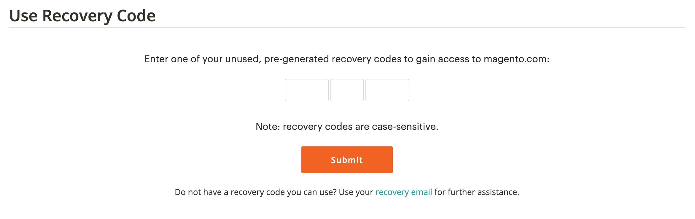
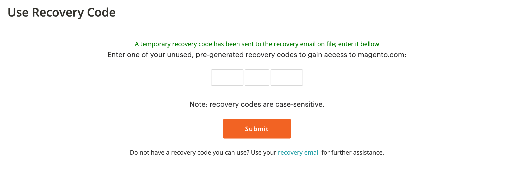

# Beveilig uw [!DNL Commerce] account

De Authentificatie van twee factoren (TFA of 2FA) is een toegevoegde laag van veiligheid om uw beter te beschermen [!DNL Commerce] account van onbevoegde toegang. Om het login proces te voltooien, vereist TFA een _tweede factor_ naast de standaardgebruikersnaam en -wachtwoord. Deze tweede factor heeft de vorm van tijdelijke verificatiecodes die voortdurend worden gegenereerd door een TFA-toepassing die op uw mobiele apparaat is geïnstalleerd en die aan uw [!DNL Commerce] account.

Als TFA is ingeschakeld, is uw account veiliger. Een onbevoegde gebruiker kan niet login tenzij zij zowel uw gebruikersbenaming als wachtwoordgeloofsbrieven (eerste factor) en een geldige controlecode van de toepassing van TFA op uw persoonlijk apparaat (tweede factor) hebben.

>[!NOTE]
>
>De twee-factor authentificatie die beschermt _Beheerder_ van uw winkel een aparte installatie heeft. Zie voor meer informatie [Verificatie met twee factoren](../systems/security-two-factor-authentication.md).

## Voordat u begint

Om TFA te gebruiken, moet u een toepassing van TFA hebben die op uw persoonlijk apparaat (zoals uw smartphone, tablet, computer) wordt geïnstalleerd. Er zijn er veel beschikbaar, maar een aantal populaire en gratis opties zijn:

- Google Authenticator (iOS, Android™, BlackBerry®)

- Autorisatie (iOS, Android™)

- Microsoft® Authenticator (iOS, Android™, Windows Phone)

## Twee-factor verificatie inschakelen

1. Aanmelden bij uw [[!DNL Commerce] account][1]{:target=&quot;_blank&quot;}.

1. Selecteer in het linkernavigatievenster de optie **[!UICONTROL Account Settings]** en selecteer vervolgens **[!UICONTROL Two-factor Authentication]**.

   {width="600" zoomable="yes"}

1. Selecteren **[!UICONTROL Enable]** om met het twee-factor proces van de authentificatieopstelling te beginnen.

1. Voer de **[!UICONTROL Verification Code]** verzonden naar uw e-mail en selecteer **[!UICONTROL Verify Code]** om door te gaan.

   {width="400"}

1. Open de twee-factor verificatietoepassing die u hebt gedownload en op uw persoonlijke apparaat hebt geïnstalleerd.

1. Op de [!UICONTROL SETUP TWO-FACTOR AUTHENTICATION] formulier gebruiken **[!UICONTROL Setup Code]** om Adobe Commerce toe te voegen aan uw TFA-toepassing.

   {width="400"}

   U kunt de code toevoegen door de QR-code te scannen met de TFA-toepassing of door deze handmatig in te voeren. Deze code paren uw toepassing van TFA met uw [!DNL Commerce] -account en stelt de machtigingen in voor het genereren van de TFA-app voor het genereren van verificatiecodes voor beveiligde toegang tot accounts.

1. Voltooi de installatie.

   - Op de [!UICONTROL SETUP TWO FACTOR-AUTHENTICATION] Voer de verificatiecode in vanuit uw tweefasenverificatietoepassing.

   - Selecteren **[!UICONTROL Verify Code]**.

   >[!NOTE]
   >
   >Voor veiligheid, verlopen de verificatiecodes in uw toepassing van TFA onophoudelijk en regenereren. **_Altijd_** de code gebruiken die momenteel wordt weergegeven.

1. Sla de **[!UICONTROL Recovery Codes]** op een veilige en toegankelijke plaats worden aangeboden.

   {width="400"}

   Als u geen verificatiecode kunt opgeven wanneer u zich aanmeldt bij uw [!DNL Commerce] -account, moet u een herstelcode gebruiken om toegang tot uw account te herstellen.

   Elke herstelcode kan slechts één keer worden gebruikt, maar u kunt [genereren](#generate-new-recovery-codes) nieuwe. Herstelcodes zijn hoofdlettergevoelig.

1. Schakel het selectievakje voor bevestiging in en selecteer **[!UICONTROL Submit]** om door te gaan.

1. Als u toegang tot uw account wilt herstellen, voert u een **[!UICONTROL Recovery Email]**.

   Dit e-mailadres is nodig als u geen verificatiecode kunt genereren vanuit uw tweefasenverificatietoepassing en u geen toegang hebt tot een ongebruikte vooraf gegenereerde herstelcode.

   Eenmaal in de 24 uur kunt u een tijdelijke herstelcode genereren en verzenden naar het door u opgegeven e-mailadres voor herstel. Gebruik deze code om de toegang tot uw account te herstellen.

   >[!IMPORTANT]
   >
   >Toegang tot uw e-mailaccount voor herstel behouden. Anders kunt u geen tijdelijke herstelcodes gebruiken die naar dat account zijn verzonden.

   {width="400"}

1. Schakel het selectievakje voor bevestiging in en selecteer **[!UICONTROL Submit]** om het twee-factor proces van de authentificatieopstelling te voltooien.

   - Er wordt een melding verzonden naar het e-mailadres dat is gekoppeld aan uw [!DNL Commerce] account om te bevestigen dat u tweeledige verificatie hebt ingeschakeld.

   - Er wordt een melding verzonden naar uw e-mailaccount voor herstel om de configuratie te bevestigen.

>[!TIP]
>
>Als u uw persoonlijke apparaat verliest of een nieuw apparaat krijgt, kunt u [verander uw bifactorauthentificatie app](#change-your-two-factor-authentication-application) en nieuwe herstelcodes genereren.

## Aanmelden met een verificatiecode

1. Ga naar de [!DNL Commerce] [accountaanmelding][1]{:target=&quot;_blank&quot;}.

1. Voer uw gebruikersnaam en wachtwoord in en selecteer vervolgens **[!UICONTROL Login]**.

1. Voer de **[!UICONTROL Verification Code]** weergegeven in de toepassing voor verificatie met twee factoren wanneer hierom wordt gevraagd.

   {width="600"}

1. Selecteren **[!UICONTROL Submit]** om het aanmeldingsproces te voltooien.

## Aanmelden met een herstelcode

1. Ga naar de [!DNL Commerce] [accountaanmelding][1]{:target=&quot;_blank&quot;}.

1. Voer uw gebruikersnaam en wachtwoord in en selecteer vervolgens **[!UICONTROL Login]**.

1. Selecteren **[!UICONTROL Use recovery code]** om de vraag naar de verificatiecode te omzeilen.

1. Voer een ongebruikte waarde in **[!UICONTROL Recovery Code]** wanneer hierom wordt gevraagd.

   {width="600"}

1. Selecteren **[!UICONTROL Submit]** om het aanmeldingsproces te voltooien.

## Meld u aan met uw e-mail voor herstel

1. Aanmelden bij uw [[!DNL Commerce] account][1]{:target=&quot;_blank&quot;}.

1. Voer uw gebruikersnaam en wachtwoord in en selecteer vervolgens **[!UICONTROL Login]**.

1. Selecteren **[!UICONTROL Use recovery code]** om de vraag naar de verificatiecode te omzeilen.

1. Als u een tijdelijke herstelcode via e-mail wilt ontvangen, selecteert u de optie **[!UICONTROL recovery email]** koppeling.

   {width="600"}

1. Open uw e-mailaccount voor herstel om de tijdelijke code op te halen en voer de code in de desbetreffende velden in.

1. Selecteren **[!UICONTROL Submit]** om het aanmeldingsproces te voltooien.

Nadat u een tijdelijke herstelcode hebt gebruikt om toegang te krijgen tot uw account, [nieuwe herstelcodes genereren](#generate-new-recovery-codes) en sla deze op om verdere problemen met de toegang tot uw account te voorkomen.

## Uw herstelcodes weergeven

1. Ga naar de [!DNL Commerce] [accountaanmelding][1]{:target=&quot;_blank&quot;}.

1. Voer uw gebruikersnaam en wachtwoord in en selecteer vervolgens **[!UICONTROL Login]**.

1. Voltooi het aanmeldingsproces met een van de twee verificatiemethoden die eerder zijn beschreven.

1. Selecteer in het linkernavigatievenster de optie **[!UICONTROL Account Settings]** en selecteer vervolgens **[!UICONTROL Two-factor Authentication]**.

   {width="600" zoomable="yes"}

1. Als u uw vooraf gegenereerde herstelcodes wilt weergeven, selecteert u **Herstelcodes weergeven**.

1. Voer de **[!UICONTROL Verification Code]** verzonden naar uw e-mail en selecteer **[!UICONTROL Verify Code]** om door te gaan.

   {width="400"}

1. Sla de **Herstelcodes** op een veilige en toegankelijke plaats worden aangeboden.

   Als u geen verificatiecode kunt opgeven voor aanmelding bij uw [!DNL Commerce] -account, is het gebruik van een herstelcode de enige manier om toegang tot uw account te krijgen.

   Elke herstelcode is slechts eenmalig, maar u kunt dit altijd doen [genereren](#generate-new-recovery-codes) nieuwe. Herstelcodes zijn hoofdlettergevoelig.

   {width="400"}

1. Schakel het selectievakje voor bevestiging in en selecteer **[!UICONTROL Submit]** het dialoogvenster sluiten.

## Nieuwe herstelcodes genereren

1. Ga naar de [!DNL Commerce] [accountaanmelding][1]{:target=&quot;_blank&quot;}.

1. Voer uw gebruikersnaam en wachtwoord in en selecteer vervolgens **[!UICONTROL Login]**.

1. Voltooi het aanmeldingsproces met een van de twee verificatiemethoden die eerder zijn beschreven.

1. Selecteer in het linkernavigatievenster de optie **[!UICONTROL Account Settings]** en selecteer vervolgens **[!UICONTROL Two-factor Authentication]**.

1. Als u nieuwe vooraf gegenereerde herstelcodes wilt genereren, selecteert u **Nieuwe herstelcodes genereren**.

1. Voer de **[!UICONTROL Verification Code]** verzonden naar uw e-mail en selecteer **[!UICONTROL Verify Code]** om door te gaan.

1. Sla de **Herstelcodes** op een veilige en toegankelijke plaats worden aangeboden.

   Als u geen verificatiecode kunt opgeven wanneer u zich aanmeldt bij uw [!DNL Commerce] -account, is het gebruik van een herstelcode de enige manier om toegang tot uw account te krijgen.

   Alle eerder gegenereerde herstelcodes zijn nu ongeldig en moeten worden genegeerd (alleen de huidige set gegenereerde herstelcodes is functioneel). Herstelcodes zijn hoofdlettergevoelig.

1. Schakel het selectievakje voor bevestiging in en selecteer **[!UICONTROL Submit]** het dialoogvenster sluiten.

## Herstele-mail wijzigen

1. Ga naar de [!DNL Commerce] [accountaanmelding][1]{:target=&quot;_blank&quot;}.

1. Voer uw gebruikersnaam en wachtwoord in en selecteer vervolgens **[!UICONTROL Login]**.

1. Voltooi het aanmeldingsproces met een van de twee verificatiemethoden die eerder zijn beschreven.

1. Selecteer in het linkernavigatievenster de optie **[!UICONTROL Account Settings]** en selecteer vervolgens **[!UICONTROL Two-factor Authentication]**.

1. Selecteren **Herstele-mail wijzigen** om de e-mail over herstel in het bestand voor uw account te wijzigen.

1. Voer de **[!UICONTROL Verification Code]** verzonden naar uw e-mail en selecteer **[!UICONTROL Verify Code]** om door te gaan.

1. Als u er zeker van wilt zijn dat u toegang tot uw account kunt krijgen, voert u een **Herstele-mail**.

   Dit e-mailadres is nodig als u geen verificatiecode kunt genereren vanuit uw tweefasenverificatietoepassing en u geen toegang hebt tot een ongebruikte vooraf gegenereerde herstelcode.

   Eenmaal in de 24 uur kunt u een tijdelijke herstelcode genereren en verzenden naar het door u opgegeven e-mailadres voor herstel. U kunt deze code gebruiken om de toegang tot uw account te herstellen.

   >[!IMPORTANT]
   >
   >Toegang tot uw e-mailaccount voor herstel behouden. Anders kunt u geen tijdelijke herstelcodes gebruiken die naar dat account zijn verzonden.

1. Schakel het selectievakje voor bevestiging in en selecteer **[!UICONTROL Submit]** het dialoogvenster sluiten.

   Het systeem stuurt een e-mailbericht naar de herstelmail die u hebt opgegeven om te bevestigen dat het specifieke e-mailadres in het bestand staat als uw e-mailbericht voor het ontvangen van tijdelijke herstelcodes.

## Wijzig de toepassing voor verificatie met twee factoren

1. Ga naar de [!DNL Commerce] [accountaanmelding][1]{:target=&quot;_blank&quot;}.

1. Voer uw gebruikersnaam en wachtwoord in en selecteer vervolgens **[!UICONTROL Login]**.

1. Voltooi het aanmeldingsproces met een van de twee verificatiemethoden die eerder zijn beschreven.

1. Selecteer in het linkernavigatievenster de optie **[!UICONTROL Account Settings]** en selecteer vervolgens **[!UICONTROL Two-factor Authentication]**.

1. Selecteren **TFA-toepassing wijzigen** om een verschillende toepassing van TFA met uw magento.com rekening te gebruiken.

1. Voer de **[!UICONTROL Verification Code]** verzonden naar uw e-mail en selecteer **[!UICONTROL Verify Code]** om door te gaan.

1. Open de toepassing voor verificatie met twee factoren op uw persoonlijke apparaat.

1. Voer de **Instellingscode** in uw tweefelige verificatietoepassing.

   U kunt de code toevoegen door de QR-code te scannen met de TFA-toepassing of de code handmatig in te voeren. Deze code paren uw toepassing van TFA met uw [!DNL Commerce] -account en stelt de machtigingen voor de TFA-app in staat verificatiecodes te genereren voor beveiligde toegang tot uw account.

   >[!NOTE]
   >
   >Voor veiligheid, verlopen de verificatiecodes in uw toepassing van TFA onophoudelijk en regenereren. **_Altijd_** de code gebruiken die momenteel wordt weergegeven.

1. Met uw TFA-toepassing wordt nu de combinatie met uw [!DNL Commerce] -account, voer de **[!UICONTROL Verification Code]** weergegeven in uw TFA-toepassing en selecteer **[!UICONTROL Verify Code]** om door te gaan.

1. Sla de **Herstelcodes** op een veilige en toegankelijke plaats worden aangeboden.

   Als u geen verificatiecode kunt opgeven wanneer u zich aanmeldt bij uw [!DNL Commerce] -account, is het gebruik van een herstelcode de enige manier om toegang tot een account te herstellen.

   Elke herstelcode is slechts eenmalig, maar u kunt dit altijd doen [genereren](#generate-new-recovery-codes) nieuwe. Herstelcodes zijn hoofdlettergevoelig. Herstelcodes zijn hoofdlettergevoelig.

1. Schakel het selectievakje in ter bevestiging en selecteer **[!UICONTROL Submit]** om door te gaan.

1. Als u er zeker van wilt zijn dat u toegang tot uw account kunt krijgen, voert u een **Herstele-mail**.

   Dit e-mailadres is nodig als u geen verificatiecode kunt genereren vanuit uw tweefasenverificatietoepassing en u geen toegang hebt tot een ongebruikte vooraf gegenereerde herstelcode.

   Eenmaal in de 24 uur kunt u een tijdelijke herstelcode genereren en verzenden naar het door u opgegeven e-mailadres voor herstel. Gebruik deze code om de toegang tot uw account te herstellen.

   >[!IMPORTANT]
   >
   >Toegang tot uw e-mailaccount voor herstel behouden. Anders kunt u geen tijdelijke herstelcodes gebruiken die naar dat account zijn verzonden.

1. Schakel het selectievakje voor bevestiging in en selecteer **[!UICONTROL Submit]** om het twee-factor proces van de authentificatieopstelling te voltooien.

   Er wordt een e-mailbericht verzonden naar de herstele-mail die u hebt opgegeven om te bevestigen dat het e-mailadres in het bestand staat als uw e-mail voor herstel voor het ontvangen van een tijdelijke herstelcode.

## Twee-factor verificatie uitschakelen

>[!IMPORTANT]
>
>Als voor uw beveiligingsbeleid meervoudige verificatie van Adobe Commerce-accounts vereist is, kunt u tweefasenverificatie niet uitschakelen.

1. Ga naar de [!DNL Commerce] [accountaanmelding][1]{:target=&quot;_blank&quot;}.

1. Voer uw gebruikersnaam en wachtwoord in en selecteer vervolgens **[!UICONTROL Login]**.

1. Voltooi het aanmeldingsproces met een van de twee verificatiemethoden die eerder zijn beschreven.

1. Selecteer in het linkernavigatievenster de optie **[!UICONTROL Account Settings]** en selecteert u **[!UICONTROL Two-factor Authentication]** onder.

1. Selecteren **[!UICONTROL Disable]** om het TFA-deactiveringsproces te starten.

1. Voer de **[!UICONTROL Verification Code]** verzonden naar uw e-mail en selecteer **[!UICONTROL Verify Code]** om door te gaan.

1. Schakel het selectievakje voor bevestiging in en selecteer **[!UICONTROL Submit]** om de deactivering voor tweefasenauthentificatie te voltooien.

   Het systeem verzendt een e-mailbevestiging erop wijst dat TFA op uw is onbruikbaar gemaakt [!DNL Commerce] account.

   {width="400"}

[1]: https://account.magento.com/customer/account/login
