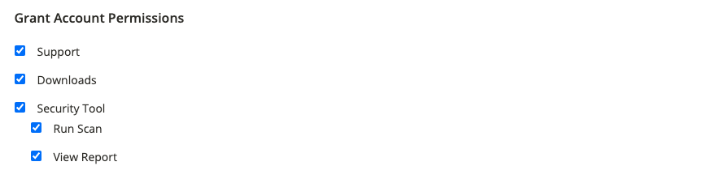
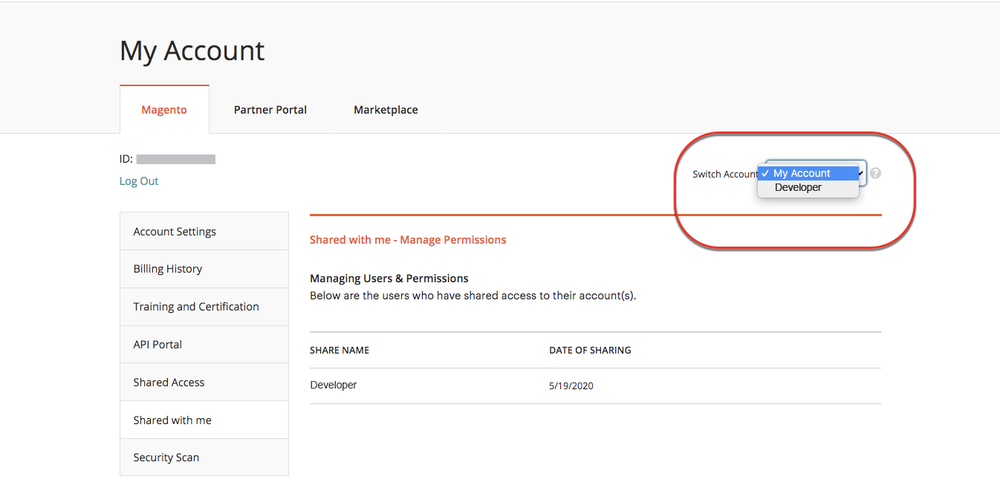

# Delen a [!DNL Commerce] account

Uw [!DNL Commerce] -account bevat informatie die u ter beschikking kunt stellen van vertrouwde werknemers en serviceproviders die u helpen uw site te beheren. Als primaire rekeninghouder hebt u de bevoegdheid om beperkte toegang te verlenen tot andere [!DNL Commerce] rekeninghouders. De gedeelde toegang kan worden ingetrokken, maar kan niet van één gebruiker aan een andere worden overgebracht.

De [!DNL Commerce] Het ondersteuningsteam heeft geen toegang tot de account en kan geen gedeelde toegang voor u instellen. Alleen de primaire rekeninghouder met de juiste machtigingen kan gedeelde toegang instellen. Wanneer uw account wordt gedeeld, blijven alle gevoelige gegevens, zoals uw factureringsgeschiedenis of creditcardgegevens, beveiligd en worden deze op geen enkel moment gedeeld met andere gebruikers.

>[!NOTE]
>
>Alle acties die worden ondernomen door gebruikers met gedeelde toegang vallen uitsluitend onder de verantwoordelijkheid van de primaire rekeninghouder. Adobe is niet verantwoordelijk voor handelingen die worden uitgevoerd door gebruikers die gedeelde toegang tot uw account hebben.

{width="600" zoomable="yes"}

## Een gedeelde account instellen

1. Voordat u begint, moet u de volgende informatie ophalen uit het dialoogvenster [!DNL Commerce] de **nieuwe, gedeelde toegangskaart**:

   - De gebruiker moet zich al hebben geregistreerd voor een account op account.adobe.com en zijn aangemeld via account.magento.com.
   - De `Account ID` die in de linkerbovenhoek van het dialoogvenster _[!UICONTROL Magento]_vlak boven de **Afmelden**koppeling.
   - De `Email` adres dat aan de rekening wordt geassocieerd.

1. Aanmelden bij uw [[!DNL Commerce] account](commerce-account-create.md).

1. Klik in het linkernavigatievenster op **[!UICONTROL Shared Access]**.

1. Klik op **[!UICONTROL Add New User]**.

   {width="600" zoomable="yes"}

1. Onder [!UICONTROL _New User Information]_, doe het volgende:

   - Voer de **[!UICONTROL Account ID]** van de nieuwe gebruiker [!DNL Commerce] account.
   - Voer de **[!UICONTROL Email]** adres dat aan het adres van de nieuwe gebruiker wordt geassocieerd [!DNL Commerce] account.

   {width="600"}

1. Onder _[!UICONTROL Shared Information]_Ga als volgt te werk:

   - Als u de gedeelde account wilt identificeren, voert u een **[!UICONTROL Share Name]**. Deze naam is bedoeld voor interne referentie en is alleen zichtbaar voor u en de persoon met wie u uw account deelt. (Voer geen naam in voor delen die begint met `CLOUD SHARED ACCESS FROM MAG XYX`.)
   - Als u uw persoonlijke contactgegevens met de nieuwe gebruiker wilt delen, gaat **[!UICONTROL Your Email]** en **[!UICONTROL Your Phone]**.

1. Onder _[!UICONTROL Grant Account Permissions]_, schakelt u het selectievakje van elk [!DNL Commerce] product en service die u wilt delen.

   {width="600"}

1. Klik op **[!UICONTROL Create Shared Access]**.

   De nieuwe gebruikersgegevens worden weergegeven in het dialoogvenster _[!UICONTROL Manage Permissions]_op de pagina Gedeelde toegang en er wordt een e-mailuitnodiging met instructies voor toegang tot de gedeelde account verzonden naar de nieuwe gebruiker.

   {width="600" zoomable="yes"}

## Een gedeelde account openen

De volgende instructies worden geschreven vanuit het perspectief van een gedeelde gebruiker die een uitnodiging ontvangt voor een gedeelde account.

1. Wanneer u een uitnodiging voor een gedeelde account ontvangt, volgt u de instructies in de e-mail om u aan te melden [!DNL Commerce] account.

   Het linkernavigatievenster van uw account heeft een nieuwe _[!UICONTROL Shared with me]_tab. De_[!UICONTROL Switch Accounts]_ besturingselement in de rechterbovenhoek bevat opties voor `My Account` en de naam van de gedeelde account.

   {width="600" zoomable="yes"}

1. Als u toegang wilt krijgen tot de gedeelde account, stelt u **[!UICONTROL Switch Accounts]** op de naam van de gedeelde account.

   {width="600" zoomable="yes"}

   De gedeelde account geeft een welkomstbericht en contactgegevens weer. Het linkernavigatievenster bevat alleen de items die u mag gebruiken.

1. Als u de gedeelde account wilt koppelen aan het Help Center, klikt u op **[!UICONTROL Support]** in het linkernavigatievenster van de gedeelde account.

   {width="600" zoomable="yes"}

   U kunt de [Adobe Commerce Help Center](https://experienceleague.adobe.com/docs/commerce-knowledge-base/kb/overview.html) van de gedeelde rekening aan onderzoek naar artikelen en het oplossen van problemeninformatie, vind flarden voor bekende kwesties, en creeer steunkaartjes.

   >[!NOTE]
   >
   >Nadat de gebruiker gedeelde toegang heeft ontvangen, moet hij of zij zich aanmelden bij hun [[!DNL Commerce] account](https://account.magento.com/customer/account/login), navigeer naar _Gedeelde toegang_ en klik op de knop **[!UICONTROL Support]** tab. Deze handeling is alleen voor de eerste keer vereist om ervoor te zorgen dat de [Adobe Commerce Support Knowledge Base](https://experienceleague.adobe.com/docs/commerce-knowledge-base/kb/overview.html) is behoorlijk gevormd door `SSO` vraag.

1. Als je wilt terugkeren naar je eigen account, klik je op **Vorige** in uw browser controles en reeks **[!UICONTROL Switch Accounts]** tot `My Account`.

## Gedeelde toegang intrekken

1. Meld u aan bij je Commerce-account.

1. Klik in het linkernavigatievenster op **[!UICONTROL Shared Access]**.

1. De account zoeken die moet worden ingetrokken onder _[!UICONTROL Managing Users & Permissions]_en klik op **[!UICONTROL Delete]**.

   >[!NOTE]
   >
   > Indien  **[!UICONTROL Delete]** niet wordt weergegeven, controleert u of de **[!UICONTROL Share Name]** begint met `Cloud Shared Access from MAG XYZ` - doorgaans, [deze rekeningen](https://experienceleague.adobe.com/docs/commerce-knowledge-base/kb/help-center-guide/magento-help-center-user-guide.html?lang=en#remove-cloud-shared-access-users) kan niet worden verwijderd.

1. Klik wanneer u wordt gevraagd om te bevestigen **[!UICONTROL Delete User]**.

>[!NOTE]
>
>U kunt gebruikers met de naam Delen van _Gedeelde toegang tot cloud van MAG[XYZ]_ in deze interface. Raadpleeg voor meer informatie [Hoe te om gebruikers te schrappen die gedeelde toegang via een project van de Wolk werden verleend?](https://experienceleague.adobe.com/docs/commerce-knowledge-base/kb/help-center-guide/magento-help-center-user-guide.html?lang=en#remove-cloud-shared-access-users).
