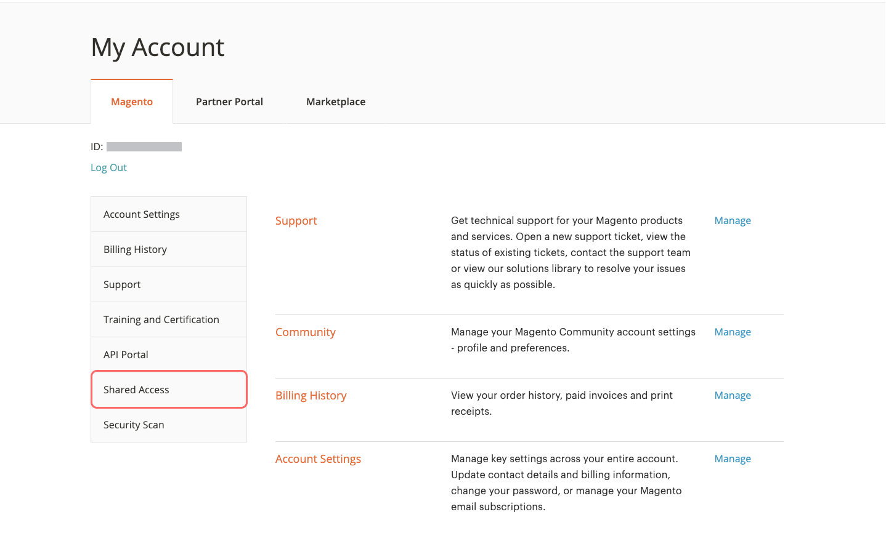

# Een [!DNL Commerce] -account delen

Uw [!DNL Commerce] -account bevat informatie die u beschikbaar kunt maken voor vertrouwde werknemers en serviceproviders die u helpen uw site te beheren. Als primaire rekeninghouder hebt u de bevoegdheid om beperkte toegang te verlenen aan andere [!DNL Commerce] -rekeninghouders. De gedeelde toegang kan worden ingetrokken, maar kan niet van één gebruiker aan een andere worden overgebracht.

Het ondersteuningsteam van [!DNL Commerce] heeft geen toegang tot het account en kan geen gedeelde toegang voor u instellen. Alleen de primaire rekeninghouder met de juiste machtigingen kan gedeelde toegang instellen. Wanneer u toegang tot accounts deelt, blijven alle gevoelige gegevens, zoals uw factureringsgeschiedenis of creditcardgegevens, beveiligd en zijn deze nooit beschikbaar voor andere gebruikers.

>[!NOTE]
>
>Alle acties die worden ondernomen door gebruikers met gedeelde toegang vallen uitsluitend onder de verantwoordelijkheid van de primaire rekeninghouder. Adobe is niet verantwoordelijk voor acties die worden uitgevoerd door gebruikers die gedeelde toegang tot uw account hebben.

{width="600" zoomable="yes"}

## Een gedeelde account instellen

1. Alvorens u begint, krijg de volgende informatie van de [!DNL Commerce] rekening van **nieuwe gedeelde toegangsonderneming**:

   - De gebruiker moet zich al hebben geregistreerd voor een account op account.adobe.com en zijn aangemeld via account.magento.com. Zie [ een rekening van Commerce ](https://experienceleague.adobe.com/en/docs/commerce-admin/start/commerce-account/commerce-account-create#create-a-commerce-account) voor meer details creëren.
   - `MAGE ID/Account ID (MAG00XXXXXXX)` wordt getoond in de upper-left hoek van het _[!UICONTROL Magento]_lusje, enkel boven de **Logout**verbinding.
   - Het `Email` -adres dat aan het account is gekoppeld.

1. Login aan uw [[!DNL Commerce]  rekening ](commerce-account-create.md).

1. Klik in het navigatievenster aan de linkerkant op **[!UICONTROL Shared Access]** .

1. Klik op **[!UICONTROL Add New User]**.

   {width="600" zoomable="yes"} toe

1. Voer onder [!UICONTROL _New User Information]_ de volgende handelingen uit:

   - Voer de **[!UICONTROL Account ID]** in vanuit de [!DNL Commerce] -account van de nieuwe gebruiker.
   - Voer het **[!UICONTROL Email]** -adres in dat is gekoppeld aan de [!DNL Commerce] -account van de nieuwe gebruiker.

   {width="600"}

1. Voer onder _[!UICONTROL Shared Information]_de volgende handelingen uit:

   - Voer een **[!UICONTROL Share Name]** in om de gedeelde account te identificeren. Deze naam is bedoeld voor interne referentie en is alleen zichtbaar voor u en de persoon met wie u uw account deelt.

     U kunt het beste de naam van uw organisatie als [!UICONTROL Share Name] gebruiken. Gebruik geen naam die begint met `CLOUD SHARED ACCESS FROM MAG XYX` .
   - Voer **[!UICONTROL Your Email]** en **[!UICONTROL Your Phone]** in als u uw persoonlijke contactgegevens met de nieuwe gebruiker wilt delen.

1. Selecteer onder _[!UICONTROL Grant Account Permissions]_het selectievakje van elk [!DNL Commerce] -product en elke  -service die u wilt delen.

   {width="600"}

1. Klik op **[!UICONTROL Create Shared Access]**.

   De nieuwe gebruikersgegevens worden weergegeven in de sectie _[!UICONTROL Manage Permissions]_van de pagina Gedeelde toegang en er wordt een e-mailuitnodiging met instructies voor toegang tot de gedeelde account verzonden naar de nieuwe gebruiker.

   {width="600" zoomable="yes"}

>[!NOTE]
>
>Het is niet nodig om toegang te delen tot _[!UICONTROL Security Tool]_- Elke gebruiker met een MAGE-id kan het hulpprogramma Beveiligingsscan met een eigen account instellen. Zij hebben enkel de noodzakelijke voorrechten nodig om veranderingen in de plaats aan te brengen en eigendom van het domein te verifiëren gebruikend één van de [ vereiste methodes ](https://experienceleague.adobe.com/en/docs/commerce-admin/systems/security/security-scan)).

## Een gedeelde account openen

De volgende instructies worden geschreven vanuit het perspectief van een gedeelde gebruiker die een uitnodiging ontvangt voor een gedeelde account.

1. Wanneer u een uitnodiging voor een gedeelde account ontvangt, volgt u de instructies in de e-mail om u aan te melden bij uw eigen [!DNL Commerce] -account.

   Het linkernavigatievenster van uw account heeft een nieuwe tab _[!UICONTROL Shared with me]_. Het besturingselement_[!UICONTROL Switch Accounts]_ in de rechterbovenhoek bevat opties voor `My Account` en de naam van de gedeelde account.

   {width="600" zoomable="yes"}

   >[!NOTE]
   >
   >   Als u niet de _[!UICONTROL Switch Accounts]_controle ziet, contacteer de primaire rekeninghouder en bevestig dat zij uw correcte [ rekeningsinformatie ](#set-up-a-shared-account) zijn ingegaan.

1. Als u toegang wilt krijgen tot de gedeelde account, stelt u **[!UICONTROL Switch Accounts]** in op de naam van de gedeelde account.

   {width="600" zoomable="yes"}

   De gedeelde account geeft een welkomstbericht en contactgegevens weer. Het linkernavigatievenster bevat alleen de items die u mag gebruiken.

1. Als u de gedeelde account wilt verbinden met het Help Center, klikt u op **[!UICONTROL Support]** in het navigatievenster aan de linkerkant van de gedeelde account.

   {width="600" zoomable="yes"}

   U kunt het [ Centrum van de Hulp van Adobe Commerce ](https://experienceleague.adobe.com/en/docs/commerce-knowledge-base/kb/overview) van de gedeelde rekening gebruiken om naar artikelen en het oplossen van problemeninformatie te zoeken, flarden voor bekende kwesties te vinden, en steunkaartjes tot stand te brengen.

   >[!NOTE]
   >
   >Na het ontvangen van gedeelde toegang, moet de gebruiker login aan hun [[!DNL Commerce]  rekening ](https://account.magento.com/customer/account/login), aan _Gedeelde Toegang_ navigeren, en het **[!UICONTROL Support]** lusje klikken. Deze actie wordt vereist de eerste keer slechts om ervoor te zorgen dat de [ Kennisbank van de Steun van Adobe Commerce ](https://experienceleague.adobe.com/en/docs/commerce-knowledge-base/kb/overview) behoorlijk door de `SSO` vraag wordt gevormd.

1. Om op uw eigen rekening terug te keren, klik **terug** in uw browser controles en reeks **[!UICONTROL Switch Accounts]** aan `My Account`.

## Gedeelde toegang intrekken

1. Meld u aan bij uw Commerce-account.

1. Klik in het navigatievenster aan de linkerkant op **[!UICONTROL Shared Access]** .

1. Zoek het account dat onder _[!UICONTROL Managing Users & Permissions]_moet worden ingetrokken en klik op **[!UICONTROL Delete]**.

   >[!NOTE]
   >
   > Als **[!UICONTROL Delete]** niet wordt weergegeven, controleert u of de **[!UICONTROL Share Name]** begint met `Cloud Shared Access from MAG XYZ` . U kunt geen rekeningen met dat [ het noemen patroon ](https://experienceleague.adobe.com/en/docs/commerce-knowledge-base/kb/help-center-guide/magento-help-center-user-guide#remove-cloud-shared-access-users) schrappen.
   > 
   > Als dat het geval is, vraagt u de accounteigenaar om de account Gedeelde toegang te wijzigen en de accountmachtigingen te wissen. Na die update heeft de gebruiker geen toegang meer tot accountbronnen.
   >
   > Bovendien zorg ervoor dat de gebruikers uit het project worden verwijderd zodat zij geen e-mailberichten meer ontvangen: [ de Voormalige teamleden ontvangen de e-mails van het de wolkenbericht van Adobe Commerce ](https://experienceleague.adobe.com/en/docs/commerce-knowledge-base/kb/troubleshooting/miscellaneous/former-teammembers-receive-cloud-notification-emails)

1. Klik op **[!UICONTROL Delete User]** wanneer u wordt gevraagd om te bevestigen.

>[!NOTE]
>
>U kunt geen gebruikers met de Naam van het Aandeel van _Wolk schrappen Gedeelde Toegang van MAG [ XYZ]_ in deze interface. Zie [ hoe te gebruikers schrappen die gedeelde toegang via een project van de Wolk werden verleend?](https://experienceleague.adobe.com/en/docs/commerce-knowledge-base/kb/troubleshooting/miscellaneous/shared-access-troubleshooting).

## Verwante lezing

[ het oplossen van problemen van de Gedeelde Toegang ](https://experienceleague.adobe.com/en/docs/commerce-knowledge-base/kb/troubleshooting/miscellaneous/shared-access-troubleshooting)
