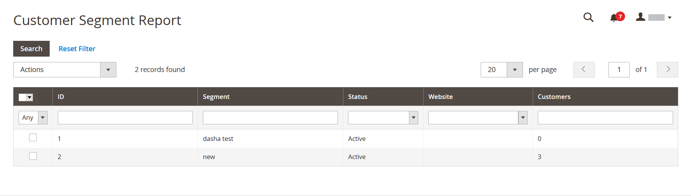

# Klantrapporten

Klantrapporten bieden insight toegang tot de activiteiten van de klant gedurende een bepaalde periode of een bepaald datumbereik.

## [!UICONTROL Order Total Report]

[!UICONTROL Order Total Report] toont klantenorden voor een gespecificeerd tijdinterval of datumwaaier. Het rapport bevat het aantal orders per klant, het gemiddelde orderbedrag en het totale bedrag.

Voor _Admin_ sidebar, ga **[!UICONTROL Reports]** > _[!UICONTROL Customers]_>**[!UICONTROL Order Total]**.

{width="600"}

### Workspace-besturingselementen

| Besturing | Beschrijving |
|--- |--- |
| [!UICONTROL From / To] | Hiermee definieert u een zoekopdracht naar de bestellingen op basis van de begin- en einddatum. |
| [!UICONTROL Show By] | Hiermee definieert u de granulariteit van de splitsing van de orderrecord. Opties: `Month` / `Day` / `Year` |
| [!UICONTROL Refresh] | Hiermee wordt het raster bijgewerkt naar de opgegeven filters. |
| [!UICONTROL Export] | Hiermee exporteert u de geselecteerde records als een CSV- of Excel XML-bestand. |
| [!UICONTROL Scope] | Gebruikt om de plaats of de opslag te plaatsen waarvoor het rapport wordt geproduceerd. |

{style="table-layout:auto"}

### Kolombeschrijvingen

| Kolom | Beschrijving |
|--- |--- |
| [!UICONTROL Interval] | Het totale interval van de volgorde, met `Month` / `Day` / `Year` . |
| [!UICONTROL Customer] | De naam van de klant die de bestellingen heeft geplaatst. |
| [!UICONTROL Orders] | Het aantal orden voor het gespecificeerde interval. |
| [!UICONTROL Average] | Gemiddeld orderbedrag. Dit bedrag wordt altijd berekend voor productprijzen **exclusief belasting** zelfs als de catalogusproductprijzen, orde subtotaal en orde totaal belasting omvatten. Het in het verslag vermelde bedrag is dus anders dan het bedrag dat in de ordergegevens is vermeld in gevallen waarin de totalen van de orders ook belasting bevatten. |
| [!UICONTROL Total] | De som van alle orders voor de periode. Dit bedrag wordt altijd berekend voor productprijzen **exclusief belasting** zelfs als de catalogusproductprijzen, orde subtotaal en orde totaal belasting omvatten. Als gevolg hiervan verschilt het in het rapport vermelde totaal van het bedrag dat in de ordergegevens wordt vermeld in gevallen waarin de totalen van de orders ook belasting bevatten. |

{style="table-layout:auto"}

## [!UICONTROL Order Count Report]

In [!UICONTROL Order Count Report] wordt het aantal bestellingen per klant voor een opgegeven tijdinterval of datumbereik weergegeven. Het rapport bevat het aantal orders per klant, het gemiddelde orderbedrag en het totale bedrag.

Voor _Admin_ sidebar, ga **[!UICONTROL Reports]** > _[!UICONTROL Customers]_>**[!UICONTROL Order Count]**.

{width="600"}

### Workspace-besturingselementen

| Besturing | Beschrijving |
|--- |--- |
| [!UICONTROL From / To] | Hiermee definieert u een zoekopdracht naar de bestellingen op basis van de begin- en einddatum. |
| [!UICONTROL Show By] | Hiermee definieert u de granulariteit van de splitsing van de orderrecord. Opties: `Month` / `Day` / `Year` |
| [!UICONTROL Refresh] | Hiermee wordt het raster bijgewerkt naar de opgegeven filters. |
| [!UICONTROL Export] | Hiermee exporteert u de geselecteerde records als een CSV- of Excel XML-bestand. |
| [!UICONTROL Scope] | Gebruikt om de plaats of de opslag te plaatsen waarvoor het rapport wordt geproduceerd. |

{style="table-layout:auto"}

### Kolombeschrijvingen

| Kolom | Beschrijving |
|--- |--- |
| [!UICONTROL Interval] | Het ordertelinterval, met `Month` / `Day` / `Year` . |
| [!UICONTROL Customer] | De klant die de bestelling heeft geplaatst. |
| [!UICONTROL Orders] | Het aantal orden voor het gespecificeerde interval. |
| [!UICONTROL Average] | Gemiddeld orderbedrag. Dit bedrag wordt altijd berekend voor productprijzen **exclusief belasting** zelfs als de catalogusproductprijzen, orde subtotaal en orde totaal belasting omvatten. Het in het verslag vermelde bedrag is dus anders dan het bedrag dat in de ordergegevens is vermeld in gevallen waarin de totalen van de orders ook belasting bevatten. |
| [!UICONTROL Total] | De som van alle orders voor de periode. Dit bedrag wordt altijd berekend voor productprijzen **exclusief belasting** zelfs als de catalogusproductprijzen, orde subtotaal en orde totaal belasting omvatten. Als gevolg hiervan is het totaal in het rapport anders dan het bedrag in de orderdetails in gevallen waarin de ordertotalen getallen omvatten. |

{style="table-layout:auto"}

## [!UICONTROL New Accounts Report]

[!UICONTROL New Accounts Report] toont het aantal nieuwe klantenrekeningen die tijdens een gespecificeerd tijdinterval of datumwaaier worden geopend.

Voor _Admin_ sidebar, ga **[!UICONTROL Reports]** > _[!UICONTROL Customers]_>**[!UICONTROL New]**.

{width="600"}

### Workspace-besturingselementen

| Besturing | Beschrijving |
|--- |--- |
| [!UICONTROL From / To] | Hiermee definieert u een zoekopdracht naar de nieuwe accounts op basis van de begin- en einddatum. |
| [!UICONTROL Show By] | Hiermee definieert u de granulariteit van de splitsing van de orderrecord. Opties: Maand / Dag / Jaar |
| [!UICONTROL Refresh] | Hiermee wordt het raster bijgewerkt naar de opgegeven filters. |
| [!UICONTROL Export] | Hiermee exporteert u de geselecteerde records als een CSV- of Excel XML-bestand. |
| [!UICONTROL Scope] | Gebruikt om de plaats of de opslag te plaatsen waarvoor het rapport wordt geproduceerd. |

{style="table-layout:auto"}

### Kolombeschrijvingen

| Kolom | Beschrijving |
|--- |--- |
| [!UICONTROL Interval] | Nieuw interval voor het maken van accounts, op maand/dag/jaar. |
| [!UICONTROL New Accounts] | Het aantal nieuwe rekeningen die in een bepaald interval worden gecreeerd. |

{style="table-layout:auto"}

## [!UICONTROL Customer Wish List Report]

[!BADGE &#x200B; slechts PaaS &#x200B;]{type=Informative url="https://experienceleague.adobe.com/nl/docs/commerce/user-guides/product-solutions" tooltip="Is alleen van toepassing op Adobe Commerce op Cloud-projecten (door Adobe beheerde PaaS-infrastructuur) en op projecten in het veld."}

 (slechts Adobe Commerce)

[!UICONTROL Customer Wish List Report] verstrekt informatie over klanten wenst lijsten.

Voor _Admin_ sidebar, ga **[!UICONTROL Reports]** > _[!UICONTROL Customers]_>**[!UICONTROL Wish Lists]**.

{width="600"}

### Workspace-besturingselementen

| Besturing | Beschrijving |
|--- |--- |
| [!UICONTROL Scope] | Gebruikt om de plaats of de opslag te plaatsen waarvoor het rapport wordt geproduceerd. |
| [!UICONTROL Search] | Hiermee wordt een zoekopdracht gestart met de opgegeven parameters. |
| [!UICONTROL Reset Filter] | Hiermee wordt een reset van alle zoekparameters gestart. |
| [!UICONTROL Per Page] | Hiermee stelt u het aantal records in dat op één pagina wordt weergegeven. |
| [!UICONTROL Export] | Hiermee exporteert u de geselecteerde records als een CSV- of Excel XML-bestand. |
| [!UICONTROL From / To] | Wordt gebruikt om een zoekopdracht naar de verlanglijsten te definiëren op basis van de begin- en einddatum. |
| [!UICONTROL Wishlist] | Hiermee wordt een zoekopdracht voor een wensenlijst gestart op naam. |
| [!UICONTROL Status] | De status van de verlanglijst. Opties: `Private` / `Public` |
| [!UICONTROL Comment] | Hiermee wordt een zoekopdracht gestart op tekst in de opmerkingen in de wensenlijst. |

{style="table-layout:auto"}

### Kolombeschrijvingen

| Kolom | Beschrijving |
|--- |--- |
| [!UICONTROL Added] | De datum waarop de verlanglijst is gemaakt. |
| [!UICONTROL Customer] | Voornaam en achternaam van de klant die de verlanglijst heeft gemaakt. |
| [!UICONTROL Wishlist] | Naam van de verlanglijst. |
| [!UICONTROL Status] | De status van de verlanglijst. Opties: `Private` / `Public` |
| [!UICONTROL Product] | Naam van het product dat aan de verlanglijst wordt toegevoegd. |
| [!UICONTROL SKU] | SKU van het product toegevoegd aan de verlanglijst. |
| [!UICONTROL Comment] | De opmerkingstekst die is ingevoerd toen de verlanglijst werd gemaakt. |

{style="table-layout:auto"}

## [!UICONTROL Customer Segment Report]

 (slechts Adobe Commerce)

[!UICONTROL Customer Segment Report] verstrekt informatie over het aantal klanten in elk segment.

Voor _Admin_ sidebar, ga **[!UICONTROL Reports]** > _[!UICONTROL Customers]_>**[!UICONTROL Segments]**.

{width="600"}

### Workspace-besturingselementen

| Besturing | Beschrijving |
|--- |--- |
| [!UICONTROL Search] | Hiermee wordt een zoekopdracht gestart met de opgegeven parameters. |
| [!UICONTROL Reset Filter] | Hiermee wordt een reset van alle zoekparameters gestart. |
| [!UICONTROL Action] | Hiermee wordt de weergave van segmenten op parameters gestart. Opties: `Action` / `View Combined Report` |
| [!UICONTROL Per Page] | Hiermee stelt u het aantal records in dat op één pagina wordt weergegeven. |

{style="table-layout:auto"}

### Kolombeschrijvingen

| Kolom | Beschrijving |
|--- |--- |
| [!UICONTROL ID] | Een unieke numerieke id die aan elk segment wordt toegewezen. |
| [!UICONTROL Segment] | Segmentnaam. |
| [!UICONTROL Status] | Segmentstatus. Opties: `Active` / `Inactive` |
| [!UICONTROL Website] | Website waaraan het segment wordt toegewezen. |
| [!UICONTROL Customers] | Aantal klanten die aan het segment worden toegewezen. |

{style="table-layout:auto"}
